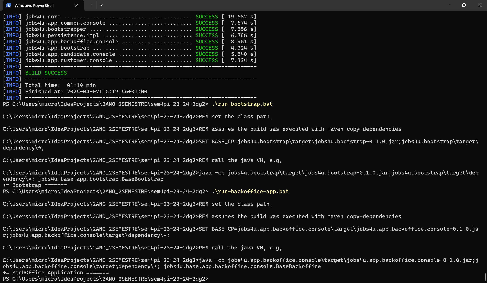

# 1220841 - Rita Barbosa - Sprint A - Self Assessment

**This section is mandatory for students of LAPR4**

## Engineering Process

| Level            | Description                                                                                                                                                                                                                                                                                                                     |
|------------------|---------------------------------------------------------------------------------------------------------------------------------------------------------------------------------------------------------------------------------------------------------------------------------------------------------------------------------|
| 0 - Unacceptable | Did not use                                                                                                                                                                                                                                                                                                                     |
| 1 – Attempt	     | The engineering process is very incipient, with almost no evidence of technical documentation or many errors.                                                                                                                                                                                                                   |
| 2 – Many Defects | 	There is already a significant set of engineering artefacts, but the engineering process has evidence of significant errors (e.g. incorrect order of activities, lack of justification when moving between activities/phases of the process) or significant flaws in good practices and techniques that students should apply. |
| 3 – Some Defects | 	There is evidence of a globally correct engineering process, although there may be small flaws in documentation or some activities with errors or missing (e.g. lack of testing) as well as small flaws in the application of good practices and techniques. There may be some inconsistency between code and design.          |
| 4 – Correct      | 	The engineering process is correct. Code and design are completely aligned. Failures in the application of good practices and techniques are almost meaningless.                                                                                                                                                               |
| 5 - Exceptional  | 	The engineering process is correct (order of activities). Code and design are completely aligned. Very good justification of the process followed/applied. Application of good practices and techniques is exemplary.                                                                                                          |

**Selected Level:** 4

**Justification and Evidences:**

The engineering process was executed to the best of its ability given the nature of
these user stories. Despite the necessity of creating the management tool beforehand to enable referencing the
corresponding issue in commit messages, analysis, design, and other essential steps were conducted in
accordance with the engineering process ([us_g002](../../../us_g002/readme.md)).

Nevertheless, for user story G006, the engineering process was fully adhered to, as evidenced by
its [readme.md](../../../us_g006/readme.md) and the
commits displayed in the image:

In conclusion, the implementation of both user stories (G002 and G006) aligns with the planned objectives, as evident
from an analysis of their respective readme
files ([us_g006](../../../us_g006/readme.md)/[us_g002](../../../us_g002/readme.md)).

## Issues and Version Control

| Level              | Description                                                                                                                                                                        |
|--------------------|------------------------------------------------------------------------------------------------------------------------------------------------------------------------------------|
| 0 –  Unacceptable	 | Did not use                                                                                                                                                                        |
| 1 – Attempt	       | Very sparse use of the repository.                                                                                                                                                 |
| 2 – Many Defects   | 	Basic use of the repository: messages of little significance and without any connection to issues/tasks.                                                                          |
| 3 – Some Defects	  | Basic use of the repository: mostly significant messages but with little connection to issues/tasks. They use a task/issue management board, but with errors.                      |
| 4 – Correct	       | Frequent use of the repository: messages that are mostly significant but sometimes fail to connect to issues/tasks. Use task/issue management boards correctly.                    |
| 5 - Exceptional    | 	Frequent use of the repository: mostly significant messages and (virtually) no failures in connection to issues/tasks. They use task/issue management boards in an exemplary way. |

**Selected Level:** 3

**Justification and Evidences:**

The majority of commit messages adhere to the established template by the team (present
in the management
tool [readme](https://github.com/orgs/Departamento-de-Engenharia-Informatica/projects/184/views/2?pane=info)).
However, some initial commits were not written according to it, as evidenced in:

[Commits that I've submitted.](https://github.com/Departamento-de-Engenharia-Informatica/sem4pi-23-24-2dg2/commits/main/?author=RitaBarbosa-1220841)

In terms of frequency, they were executed moderately.Aditionally, The management tool was correctly used for all of my
issues.

## Team Work

| Level              | Description                                                                                                                                                                                                                                            |
|--------------------|--------------------------------------------------------------------------------------------------------------------------------------------------------------------------------------------------------------------------------------------------------|
| 0 –  Unacceptable	 | There is no evidence of any type of teamwork process.                                                                                                                                                                                                  |
| 1 – Attempt	       | There is little evidence of teamwork.                                                                                                                                                                                                                  |
| 2 – Many Defects   | 	There is some evidence of work with coordination between teams.                                                                                                                                                                                       |
| 3 – Some Defects	  | There is evidence of a team decision-making process in which students actively participate, although some minor problems may exist, such as the discovery of dependencies only at the end of the process.                                              |
| 4 – Correct	       | There is evidence of a team decision-making process in which students actively participate and which results in the assignment of tasks in a clear and timely manner.                                                                                  |
| 5 - Exceptional    | 	There is evidence of a team decision-making process in which students actively participate and which results in the assignment of tasks in a clear and timely manner. There is evidence of group tasks such as integration and deployment activities. |

**Selected Level:** 5

**Justification and Evidences:**

The team used GitHub Management Tool to officially divide tasks and timely plan the whole software development process
as seen in: [Management Tool](https://github.com/orgs/Departamento-de-Engenharia-Informatica/projects/184/views/2)).

## Deployment

| Level             | Description                                                                                                                                                                                                                                                                                   |
|-------------------|-----------------------------------------------------------------------------------------------------------------------------------------------------------------------------------------------------------------------------------------------------------------------------------------------|
| 0 –  Unacceptable | 	The group is unable to demonstrate the system developed outside the IDE.                                                                                                                                                                                                                     |
| 1 – Attempt	      | The system runs outside the IDE, on the local machine without any type of virtualization. The group was able to demonstrate the system but with many failures (e.g. need to restart parts of the system). The demo is based on the version marked in the repository and obtained from Moodle. |
| 2 – Many Defects  | 	The system runs outside the IDE, on the local machine without any type of virtualization. The group managed to demonstrate the application albeit with some minor glitches during the demonstration. The correct version was used (marked in the repository and sent to Moodle).             |
| 3 – Some Defects  | 	The system runs outside the IDE, in a single local virtual environment (machine or container). The group was able to demonstrate the system without any execution failures during the demonstration. The correct version was used.                                                           |
| 4 – Correct	      | The system runs outside the IDE, distributed across two or more local virtual environments (machines or containers). The group was able to demonstrate the system without any execution failures during the demonstration. The correct version was used.                                      |
| 5 - Exceptional   | 	The system runs outside the IDE, distributed across two or more remote virtual environments (machines or containers) (e.g. in the cloud). The group was able to demonstrate the system without any execution failures during the demonstration. The correct version was used.                |

**Selected Level:** 4

**Justification and Evidences:**

The program can operate independently of the IDE, functioning effectively across different environments. For instance,
it has been tested and proven compatible with both Windows and Linux platforms.

* Linux
  

* Windows
  

Aditionally, as seen above the system doesn't have any system execution failures.

## Integration

| Level              | Description                                                                                                                                                   |
|--------------------|---------------------------------------------------------------------------------------------------------------------------------------------------------------|
| 0 –  Unacceptable	 | There is no integration.                                                                                                                                      |
| 1 – Attempt	       |                                                                                                                                                               |
| 2 – Many Defects   | 	There is some integration, but it is very rudimentary (for example, they define and test a grammar in the IDE but this is not integrated into the solution). |
| 3 – Some Defects	  | There is integration between most components/functionality, presenting some inconsistencies and/or unnecessary coupling.                                      |
| 4 – Correct	       | There is integration between most components/functionalities without any type of incoherence and/or unnecessary coupling.                                     |
| 5 - Exceptional	   | The previous item is true and this integration is perfectly documented.                                                                                       |

**Selected Level:** 5

**Justification and Evidences:**

The CI Server is integral to all the present functionalities, guarantying the quality of the code.
If something is wrong with the code, the commit will not go through.

The documentation is complete and very explicit about all aspects of the functionality - available on the **readme**
file.

## Req. Satisfaction

| Level              | Description                                                                                                                                                                                                                                                                                        |
|--------------------|----------------------------------------------------------------------------------------------------------------------------------------------------------------------------------------------------------------------------------------------------------------------------------------------------|
| 0 –  Unacceptable	 | No solution was developed for the requirements.                                                                                                                                                                                                                                                    | 
| 1 – Attempt	       | Most of the requirements were not minimally fulfilled due to interpretation flaws that were not adequately justified.                                                                                                                                                                              |
| 2 – Many Defects 	 | Most of the requirements were minimally met, although there were some flaws in interpretation that were not correctly justified and reveal insufficient knowledge of the problem domain. They do not have evidence of defining acceptance criteria for each user story/functionality.              |
| 3 – Some Defects	  | All requirements were met almost in full and any options related to the interpretation/analysis of the problem are correctly justified. Incomplete definition of acceptance criteria. Some acceptance criteria reflected in tests.                                                                 |
| 4 – Correct	       | All requirements have been met in full, and any options related to the interpretation/analysis of the problem are correctly justified and are evidence of your understanding of the problem domain. Very complete definition of acceptance criteria. Most criteria are reflected in tests.         |
| 5 - Exceptional	   | The above is true and alternatives are also discussed that are supported by a rich understanding of the problem domain. These alternatives may be related to the problem domain or the high-level architecture of the solution. Exemplary acceptance criteria and excellent connection to testing. |

**Selected Level:** 4

**Justification and Evidences:**

All the requirements outlined in the user stories were fulfilled, as evidenced by the contents of the
respective readme files ([us_g006](../../../us_g006/readme.md)/[us_g002](../../../us_g002/readme.md)).