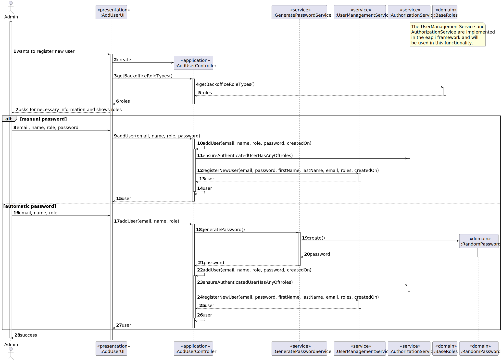
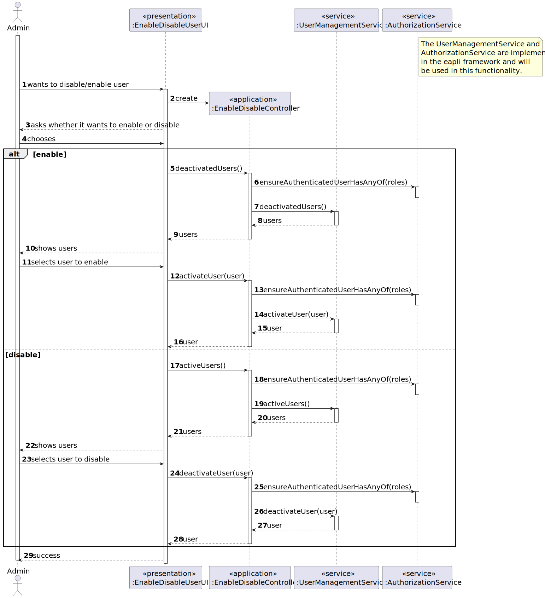
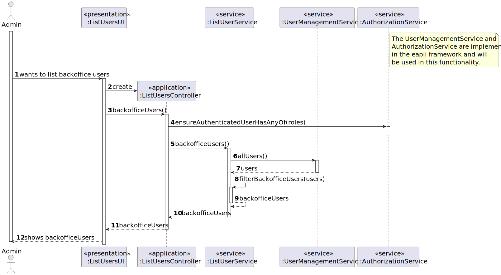
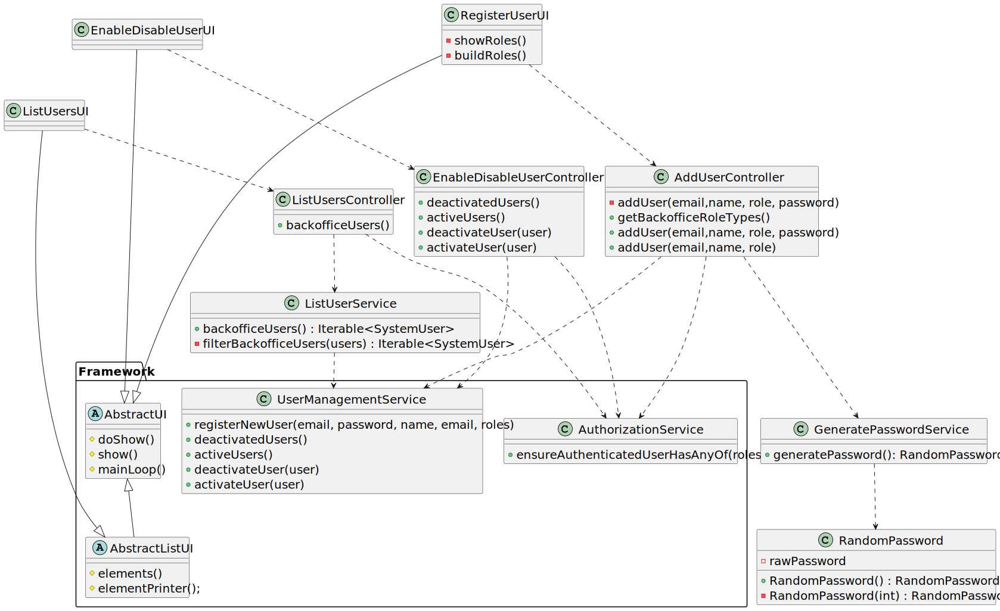

# US 1000

## 1. Context

This is the first time this user story is being requested.

## 2. Requirements

> **US 1000** As {Administrator}, I want to be able to register, disable/enable, and list users of the backoffice.

**Acceptance Criteria:**

- **1000.1.** The user must have an email and password.

- **1000.2.** The password must have a minimum of 8 characters, including both upper and lowercase letters, digits, and
  at
  least one non-alphanumeric character.

- **1000.3.** After deactivated, a user must not have access to application until further alteration.

**Dependencies/References:**

This functionality has a dependency on [_US G007_](../us_g007) that pertains to the authentication and authorization for
all users and functionalities.

_Reference 1000.1:_ Alternatively, this can be achieved by a bootstrap process.

**Client Clarifications:**

> **Question:** When creating a user in the system, it the name defined by the user or is it the person's first and last
> name?
> As for the password, is it defined by the user or generated by the system?
>
> **Answer:** It is possible to manually enter passwords, but the same
> mechanism of automatic password generation described previously can be used. Concerning the name, it won't be used
> in the authentication process since the preferred user identifier is the email.

> **Question:** What is the user's enable/disable status?
>
> **Answer:** It pertains to the deactivation of the user's access to the system.

> **Question:** What are the business policies concerning password restrictions and email?
>
> **Answer:** The email can be any valid type of email. As for the password, it must meet the following criteria: a
> minimum of 8 characters, include both upper and lowercase letters, digits, and at least one non-alphanumeric
> character.

> **Question:** Can a user be enabled/disabled multiple times?
>
> **Answer:** Yes.

> **Question:** What is the needed information for registration of the backoffice users?
>
> **Answer:** For the users, the email (used to identify users in the system) and name are necessary.

> **Question:** Regarding user registration, should all users be considered "enable" by default, or should there be an
> option to "enable/disable" users during the registration process?
>
> **Answer:** In the context of US1000, it must be possible to activate and deactivate users. I assume they must be
> active by default.

## 3. Analysis

This functionality centers around three main points: registration, enable/disable, and listing. In essence, this user
story comprises three functionalities.

Concerning user registration, a valid email is necessary, while the inclusion of a password is optional. Thus, the
Administrator should be given the option to either insert the password manually or allow it to be generated
automatically.

Furthermore, the client has established strict criteria for password composition. Consequently, if any of these criteria
are not met, the password must be rejected. In terms of the automation process, the system must only generate passwords
that adhere to these requirements.

The enable and disable status of the user determines their access to the application. If they are disabled, the login
process will fail, even if they are a valid user. Upon registration, all users will be enabled by default.

## 4. Design

As recommended, we used the base project and eapli framework as an initial support. Taking this into account, basic
functionalities, like registering, listing, disabling, etc users, were already available. Despite this, some
modifications will
need to be done, such as:

* Password management, where we will have tobe able to generate a password that follows the client requirements.
* Enabling users, we will need to develop a way to enable users that were disabled

### 4.1. Realization

#### Register User



#### Disable/Enable Users



#### List Users



### 4.2. Class Diagram



### 4.3. Applied Patterns

While many functionalities were pre-existing in the base project and EAPLI framework, our investigation of the code
uncovered several patterns, including:

* **Builder**
* **Visitor**
* **Service**
* **Repository**

The only pattern we directly applied was:

* **Service**

This pattern was specifically implemented for tasks such as password creation, which is a recurring process across
various use cases. Additionally, it was employed in the listing of backoffice users, named
`ListUserService`.

### 4.4. Tests

Since we leveraged the base project and EAPLI framework for initial support, the tests to validate acceptance criteria
1000.1 and 1000.3 are already integrated into the framework.
However, for acceptance criterion 1000.2, we have developed a password generator, enabling us to conduct tests.
Subsequently, in all the following tests, we will generate password instances to ensure compliance with the client's
specified criteria.

#### RandomPasswordTests

**Test 1:** Verifies that it is not possible to have a password without eight characters.

**Refers to Acceptance Criteria:** 1000.2

````
@Test
public void ensurePasswordHasEightCharacters() {
...
}
````

**Test 2:** Verifies that it is not possible to have a password without lower letters.

**Refers to Acceptance Criteria:** 1000.2

````
@Test
public void ensurePasswordHasLowerLetters() {
...
}
````

**Test 3:** Verifies that it is not possible to have a password without upper letters.

**Refers to Acceptance Criteria:** 1000.2

````
@Test
public void ensurePasswordHasUpperLetters() {
...
}
````

**Test 4:** Verifies that it is not possible to have a password without digits.

**Refers to Acceptance Criteria:** 1000.2

````
@Test
public void ensurePasswordHasDigits() {
...
}
````

**Test 5:** Verifies that it is not possible to have a password without alphanumeric characters.

**Refers to Acceptance Criteria:** 1000.2

````
@Test
public void ensurePasswordHasNonAlphanumeric() {
...
}
````

## 5. Implementation

### AddUserController

```
private SystemUser addUser(final String email, final String password, final String firstName,
                           final String lastName,
                           final Set<Role> roles, final Calendar createdOn) {
    authz.ensureAuthenticatedUserHasAnyOf(BaseRoles.ADMIN, BaseRoles.ADMIN);

    return userSvc.registerNewUser(email, password, firstName, lastName, email, roles,
            createdOn);
}

```

### EnableDisableUserController

```
public Iterable<SystemUser> activeUsers() {
    authz.ensureAuthenticatedUserHasAnyOf(BaseRoles.ADMIN);

    return userSvc.activeUsers();
}
public Iterable<SystemUser> deactivatedUsers() {
    authz.ensureAuthenticatedUserHasAnyOf(BaseRoles.ADMIN);

    return userSvc.deactivatedUsers();
}

public void deactivateUser(final SystemUser user) {
    authz.ensureAuthenticatedUserHasAnyOf(BaseRoles.ADMIN);

    userSvc.deactivateUser(user);
}
public void activateUser(final SystemUser user) {
    authz.ensureAuthenticatedUserHasAnyOf(BaseRoles.ADMIN);

    userSvc.activateUser(user);
}
```

### ListUsersController

```
public Iterable<SystemUser> backofficeUsers() {
    authz.ensureAuthenticatedUserHasAnyOf(BaseRoles.ADMIN);

    return listSvc.backofficeUsers();
}
```

### ListUsersService

```
public Iterable<SystemUser> backofficeUsers() {
    return filterBackofficeUsers(userSvc.allUsers());


}


private Iterable<SystemUser> filterBackofficeUsers(Iterable<SystemUser> systemUsers) {
    List<SystemUser> backofficeUsers = new ArrayList<>();

    for (SystemUser user : systemUsers) {
        if (user.hasAny(BaseRoles.CUSTOMER_MANAGER, BaseRoles.OPERATOR, BaseRoles.LANGUAGE_ENGINEER)) {
            backofficeUsers.add(user);
        }
    }
    return backofficeUsers;
}
```

## 6. Integration/Demonstration

To demonstrate this feature, it's necessary to run the script named `run-backoffice-app`. Then, log in and proceed to navigate to
the `Users` menu. Within this menu, three options will be available, each representing a component of this
functionality. Access to this menu is limited to users with Admin permissions.