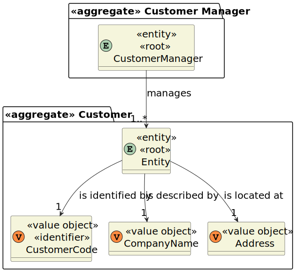
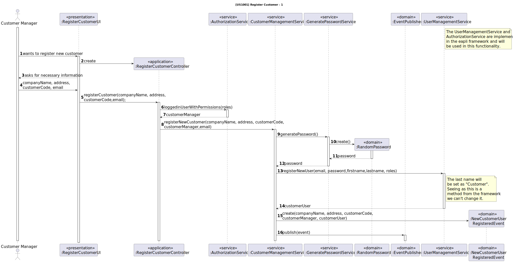
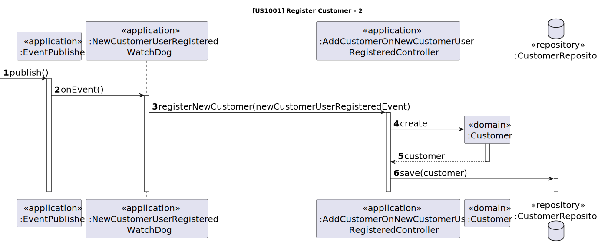
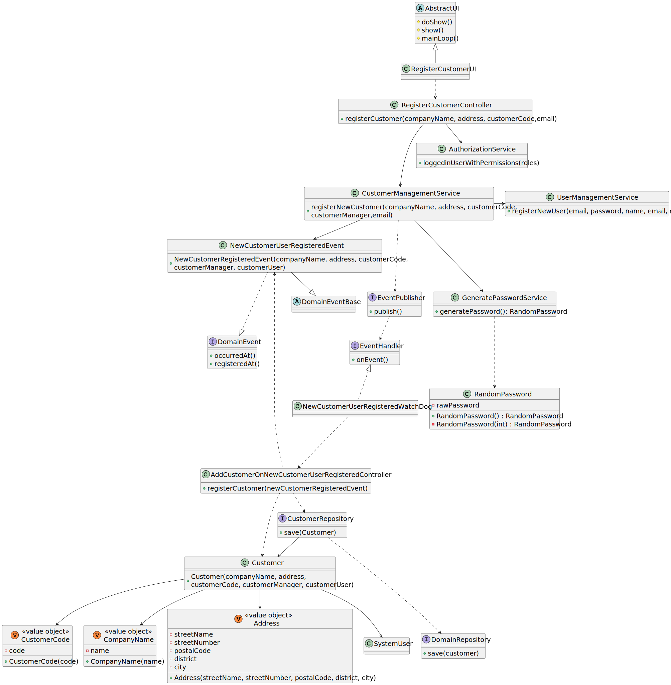

# US 1001

## 1. Context

This is the first time this user story is being requested.

## 2. Requirements

**US 1001** As {Customer Manager}, I want to register a customer and that the system automatically creates a user for
that customer

**Acceptance Criteria:**

- **1001.1.** Each customer must have associated their company name, an address and a customer code.

- **1001.2.** The customer code must be unique and have a maximum of 10 characters, having at least one character.

- **1001.3.** The user must have associated the following information: email, name and phone number.
- **1001.4.** The password must have a minimum of 8 characters, including both upper and lowercase letters, digits, and
  at least one non-alphanumeric character.

**Dependencies/References:**

This functionality has a dependency on [_US G007_](../us_g007) that pertains to the authentication and authorization for
all users and functionalities.
Moreover, it is linked to [_US 2000a_](../sb_us_2000a) in the sense that the information required for user registration
is identical, as clarified by the client.

_Reference 1001.1:_ Alternatively, this can be achieved by a bootstrap process.

**Client Clarifications:**

> **Question:** When creating a user in the system, it the name defined by the user or is it the person's first and last
> name?
> As for the password, is it defined by the user or generated by the system?
>
> **Answer:** It is possible to manually enter passwords, but the same
> mechanism of automatic password generation described previously can be used. Concerning the name, it won't be used
> in the authentication process since the preferred user identifier is the email.

## 3. Analysis

As the main objective is to register a customer, the required input for the Customer Manager consists of:

* Company Name
* Customer Code
* Address

After successfully submitting this information, the system should proceed with customer registration and automatically
generate a user. The necessary details for this user creation include:

* Name
* Email
* Phone Number

Considering that customer users should possess the same information as candidate users.

**Domain Model:**



## 4. Design

### 4.1. Realization




### 4.2. Class Diagram



### 4.3. Applied Patterns

* **Observer**
* **Repository**
* **Service**

> **Repository Pattern**
> * CustomerRepository
> * UserRepository
>
> **Justifications**
>
>The repositories were employed to persist users and customers, as well as to reconstruct objects from the
> persistence.


> **Service Pattern**
> * UserManagementService
> * AuthorizationService
> * CustomerManagementService
> * GeneratePasswordService
>
>
> **Justifications**
>
> The UserManagementService and AuthorizationService, pre-existing services within the Eapli.Framework were used here
> to register users and retrieve the logged-in user with Admin or Customer Manager roles.
> Furthermore, the UserManagementService was used to register client users, particularly those categorized as
> customer users.
> The primary function of the CustomerManagementService is to register a system user and subsequently publish the event,
despite its initial purpose being customer registration.
> The mentioned services were developed because the functionalities they offer will be utilized across multiple use
> cases. The CustomerManagementService will also serve for various other functionalities, such as listing, among others.

> **Observer**
> * EventPublisher
> * NewCustomerUserRegisteredEvent
> * NewCustomerUserRegisteredWatchDog
> * AddCustomerOnNewCustomerUserRegisteredController
>
> **Justifications**
>
> All the mentioned objects are components of the applied observer pattern. This pattern was implemented to ensure
> that when a new customer user is registered, a customer is automatically registered as well. Following this procedure, upon the
> registration of a customer user, a NewCustomerUserRegisteredEvent instance is generated, and the EventPublisher is utilized
> to notify the WatchDog (Observer).
>
> In this case, an instance of NewCustomerUserRegisteredEvent is used to inform the specific WatchDog,
> which then invokes the AddCustomerOnNewCustomerUserRegisteredController for the registration of the Customer.
>
> Finally, this responsibility pattern was implemented within the service, as we required registration of customers in
> the bootstrap. To maintain consistency in the creation process, we used the EventPublisher within the service to
> ensure that both the customer and its user were created, thus preserving the system's valid state.

### 4.4. Tests

The tests for the acceptance criteria 1001.3 are within the eapli.framework, since we use SystemUser for the user
registration.

#### CustomerTests

**Test 1:** Verifies that it is not possible to create an customer without a name.

**Refers to Acceptance Criteria:** 1001.1

````
@Test
public void ensureMustHaveName() {
...
}
````

**Test 2:** Verifies that it is not possible to create an customer without a code.

**Refers to Acceptance Criteria:** 1001.1

````
@Test
public void ensureMustHaveCode() {
...
}
````

**Test 3:** Verifies that it is not possible to create an customer without an address.

**Refers to Acceptance Criteria:** 1001.1

````
@Test
public void ensureMustHaveAddress() {
...
}
````

#### CustomerCodeTests

**Test 1:** Verifies that it is not possible to create an customer code with more than 10 characters.

**Refers to Acceptance Criteria:** 1001.2

````
@Test(expected = IllegalArgumentException.class)
public void ensureDoesntHaveMoreThanTenCharacters() {
...
}
````

**Test 2:** Verifies that it is not possible to create a null customer code.

**Refers to Acceptance Criteria:** 1001.2

````
@Test
public void ensureMustNotBeNull() {
...
}
````

**Test 3:** Verifies that it is not possible to create an empty customer code.

**Refers to Acceptance Criteria:** 1001.2

````
@Test
public void ensureMustNotBeEmpty() {
...
}
````

#### RandomPasswordTests

**Test 1:** Verifies that it is not possible to have a password without eight characters.

**Refers to Acceptance Criteria:** 1001.4

````
@Test
public void ensurePasswordHasEightCharacters() {
...
}
````

**Test 2:** Verifies that it is not possible to have a password without lower letters.

**Refers to Acceptance Criteria:** 1001.4

````
@Test
public void ensurePasswordHasLowerLetters() {
...
}
````

**Test 3:** Verifies that it is not possible to have a password without upper letters.

**Refers to Acceptance Criteria:** 1001.4

````
@Test
public void ensurePasswordHasUpperLetters() {
...
}
````

**Test 4:** Verifies that it is not possible to have a password without digits.

**Refers to Acceptance Criteria:** 1001.4

````
@Test
public void ensurePasswordHasDigits() {
...
}
````

**Test 5:** Verifies that it is not possible to have a password without alphanumeric characters.

**Refers to Acceptance Criteria:** 1001.4

````
@Test
public void ensurePasswordHasNonAlphanumeric() {
...
}
````

## 5. Implementation

### RegisterCustomerController

```
public boolean registerNewCustomer(String companyName, String address, String customerCode, String email) {
    Optional<SystemUser> customerManager = authz.loggedinUserWithPermissions(BaseRoles.ADMIN, BaseRoles.CUSTOMER_MANAGER);
    
    if(customerManager.isPresent()){
        custSvc.registerNewCustomer(companyName, address, customerCode, customerManager.get(), email);
        return true;
    }
    return false;
}
```

### CustomerManagementService

```
public void registerNewCustomer(String companyName, String address, String customerCode,
                                SystemUser customerManager, String email) {
    String password = passSvc.generatePassword();
    final Set<Role> roles = new HashSet<>();
    roles.add(BaseRoles.CUSTOMER_USER);

    SystemUser customerUser = userSvc.registerNewUser(email, password, companyName, "Customer", email, roles);

    final DomainEvent event = new NewCustomerUserRegisteredEvent(new CompanyName(companyName),
            new Address(address), new CustomerCode(customerCode), customerManager, customerUser);
    dispatcher.publish(event);
}
```

### NewCustomerUserRegisteredWatchDog

```
@Override
public void onEvent(final DomainEvent domainevent) {
    assert domainevent instanceof NewCustomerUserRegisteredEvent;

    final NewCustomerUserRegisteredEvent event = (NewCustomerUserRegisteredEvent) domainevent;

    final AddCustomerOnNewCustomerUserRegisteredController
            controller = new AddCustomerOnNewCustomerUserRegisteredController();
    controller.registerNewCustomer(event);
}
```

### AddCustomerOnNewCustomerUserRegisteredController

```
public void registerNewCustomer(NewCustomerUserRegisteredEvent event) {
    customerRepository.save(new Customer(event.companyName(), event.address(),
            event.customerCode(), event.customerManager(), event.customerUser()));
}
```

## 6. Integration/Demonstration

To activate this feature, you'll need to run the script named `run-backoffice-app` and log in with Customer Manager
permissions. Then, navigate to the "Customers" menu and select option 1 - `Register a Customer` - to access this
feature.