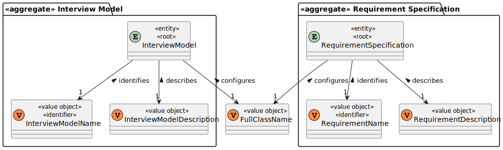

# US 1008

## 1. Context

It is the first time in this project that this US is worked on.

## 2. Requirements

**US 1008:** As Language Engineer, I want to deploy and configure a plugin (i.e., Job Requirement Specification or Interview Model) to be used by the system.

### Acceptance Criteria:

- **1008.1.** Requirement Specifications and Interview Models The support for this functionality must follow specific technical requirements, specified in LPROG. The ANTLR tool should be used (https://www.antlr.org/).

### Client Clarifications:

>**(Partially Related) Question:** Who informs the Customer manager of the type of interview/questions?
>
>**Answer:** This can be obtained by the Customer manager in dialogue with the Customer. After that, with the help of the Language engineer, support for the interview is created.

>**Question:** How does Language Engineer create the interview model and job requirements? Is it text? Or does he select questions for the interview and requirements for the job opening? And this is when you are creating an interview or a job opening or do you stop in the middle of doing that and then continue?
>
>**Answer:** The language engineer, with information provided by the customer manager (which he obtained from the customer), will develop a jar in Java corresponding to the module/plugin. For this development you will have to use grammar/language development techniques such as antlr. This code will be in a jar that the language engineer then “installs/registers” in the application (US1008, for example, associating a name to the jar in a configuration file – “5 anos experiencia java”, “req-model-5-years-java .jar”). The application with this information dynamically loads this jar. The grammar used in the jar will reflect the structure of the questions to be used in this model and their evaluation. These activities must be done before US1008 can be done. This work is done “outside” the system, simply by registering the model (when ready) in US1008. US 1009 and US1011 allow you to select models to use (from those that have been duly registered in the system).

### Dependencies/References:

#### Dependency with US 1009:
> This user story is dependent on US 1008 as it will use the Requirements Specification created by this US.

#### Dependency with US 1011:
> This user story is dependent on US 1008 as it will use the Interview Model created by this US.

## 3. Analysis

### Domain Model Excerpt Related



## 4. Design

For the implementation of this US it was envisioned that the plugins, that are made outside of the program thanks to the Language Engineer, are to be stored in the directory **"./Plugins"**. We'll use the **PluginJarFile** value object to hold information of the plugins inside the repository to be then persisted, that way we have information on each of the existing plugins that can then be chosen and sued by the Customer Manager in later user stories.

#### New Persistence Layer Classes:
- RecruitmentSpecificationRepository
- InterviewModelRepository

#### New Domain Layer Classes:
- InterviewModel
- InterviewModelName
- InterviewModelDescription
- RequirementSpecification
- RequirementName
- RequirementDescription
- FullClassName

*FullClassName, InterviewModelName and InterviewModelDescription are value objects belonging to the InterviewModel entity.*
*FullClassName, RequirementDescription and RequirementName are value objects belonging to the RequirementSpecification entity.*

#### New Application Layer Classes:
- RegisterPluginController

#### New Presentation Layer Classes:
- RegisterPluginUI

### 4.1. Realization

#### Sequence Diagram To Register Interview Plugins


#### Sequence Diagram To Register Requirement Plugins


### 4.2. Class Diagram


### 4.3. Applied Patterns

This section is focused on the patterns used for this US:

#### Repository Pattern

For the envisioned structure and usage of this functionality, the usage of a serializable repository is essential for the Interview Model and Requirement Specification to access the data needed for this functionality.

#### Service Pattern

To create a layer of abstraction between the Domain layer and the Application layer, the usage of a specific service was deemed necessary for this user story.

### 4.4. Tests

*Include here the main tests used to validate the functionality. Focus on how they relate to the acceptance criteria.*

**Test 1:** Ensures the method sameAs() in InterviewModel class is working accurately.
````
    @Test
    void ensureSameAsWorksAsExpected() {
        String description1 = "Back-End Developer With Experience in Java";
        String name1 = "Back-End Developer";
        String fullClassName1 = "Plugins/Interviews/Back_End_Dev/Back_End_Dev_Interview_Plugin.jar";
        InterviewModel interviewModel1 = new InterviewModel(name1, description1, fullClassName1);

        String description2 = "Front-End Developer With Experience in HTML";
        String name2 = "Front-End Developer";
        String fullClassName2 = "Plugins/Interviews/Front_End_Dev/Front_End_Dev_Interview_Plugin.jar";
        InterviewModel interviewModel2 = new InterviewModel(name2, description2, fullClassName2);

        InterviewModel interviewModel3 = new InterviewModel(name2, description2, fullClassName2);

        // Assert that the sameAs() method checks that two different interview models are different
        assertFalse(interviewModel1.sameAs(interviewModel2));

        // Assert that the sameAs() method checks that the same interview model is checked as being the same
        assertTrue(interviewModel1.sameAs(interviewModel1));

        // Assert that the sameAs() method checks that two different interview objects with the same value objects are considered the same
        assertTrue(interviewModel2.sameAs(interviewModel3));
    }
````

**Test 2:** Ensures a new interview model has a name.
````
    @Test
    void ensureItHasAnInterviewModelName() {
        assertThrows(IllegalArgumentException.class, () -> new InterviewModel(null, description, fullClassName));
    }
````

**Test 3:** Ensures a new interview model has a description.
````
    @Test
    void ensureItHasAnInterviewModelDescription() {
        assertThrows(IllegalArgumentException.class, () -> new InterviewModel(name, null, fullClassName));
    }
````

**Test 4:** Ensures a new interview model has a full class name.
````
    @Test
    void ensureItHasAPluginJarFile() {
        assertThrows(IllegalArgumentException.class, () -> new InterviewModel(name, description, null));
    }

````

**Test 5:** Ensures the method sameAs() in RequirementSpecification class is working accurately.
````
@Test
void ensureSameAsWorksAsExpected() {
String description1 = "Back-End Developer With Experience in Java";
String name1 = "Back-End Developer";
String fullClassName1 = "Plugins/Requirements/Back_End_Dev/Back_End_Dev_Requirement_Plugin.jar";
RequirementSpecification requirementSpecification1 = new RequirementSpecification(name1, description1, fullClassName1);

        String description2 = "Front-End Developer With Experience in HTML";
        String name2 = "Front-End Developer";
        String fullClassName2 = "Plugins/Requirements/Front_End_Dev/Front_End_Dev_Requirement_Plugin.jar";
        RequirementSpecification requirementSpecification2 = new RequirementSpecification(name2, description2, fullClassName2);

        RequirementSpecification requirementSpecification3 = new RequirementSpecification(name2, description2, fullClassName2);

        // Assert that the sameAs() method checks that two different interview models are different
        assertFalse(requirementSpecification1.sameAs(requirementSpecification2));

        // Assert that the sameAs() method checks that the same interview model is checked as being the same
        assertTrue(requirementSpecification1.sameAs(requirementSpecification1));

        // Assert that the sameAs() method checks that two different interview objects with the same value objects are considered the same
        assertTrue(requirementSpecification2.sameAs(requirementSpecification3));
    }
````

**Test 6:** Ensures a new requirement specification has a name.
````
    @Test
    void ensureItHasAnRequirementName() {
        assertThrows(IllegalArgumentException.class, () -> new RequirementSpecification(null, description, fullClassName));
    }
````

**Test 7:** Ensures a new requirement specification has a description.
````
    @Test
    void ensureItHasAnRequirementDescription() {
        assertThrows(IllegalArgumentException.class, () -> new RequirementSpecification(name, null, fullClassName));
    }
````

**Test 8:** Ensures a new requirement specification has a full class name.
````
    @Test
    void ensureItHasAPluginJarFile() {
        assertThrows(IllegalArgumentException.class, () -> new RequirementSpecification(name, description, null));
    }
````


## 5. Implementation

*In this section the team should present, if necessary, some evidencies that the implementation is according to the
design. It should also describe and explain other important artifacts necessary to fully understand the implementation
like, for instance, configuration files.*

The following code belongs to the UI of the functionality:
````
package jobs4u.base.app.backoffice.console.presentation.languageengineer;

import eapli.framework.io.util.Console;
import eapli.framework.presentation.console.AbstractUI;
import jobs4u.base.interviewmodelmanagement.application.RegisterPluginController;

public class RegisterPluginUI extends AbstractUI {

    private static final RegisterPluginController controller = new RegisterPluginController();

    @Override
    protected boolean doShow() {

        System.out.println("To register a new plugin please provide the following details:");
        String option = Console.readNonEmptyLine("Would you like to register an interview plugin or a requirement plugin? 'Interview' or 'Requirement'\n1) Interview Plugin\n2) Requirement Plugin",
                "Choice: 'Interview' or 'Requirement'");
        String name = Console.readNonEmptyLine("What's the name of the plugin?",
                "Providing a name for the plugin is obligatory.");
        if(option.equals("1")) {
            while(controller.checkIfInterviewModelAlreadyExists(name)){
                System.out.println("Interview plugin already exists.");
                name = Console.readNonEmptyLine("Give another name for the plugin:",
                        "Providing a name for the plugin is obligatory.");
            }
        }else if(option.equals("2")){
            while(controller.checkIfRequirementSpecificationAlreadyExists(name)){
                System.out.println("Requirement plugin already exists.");
                name = Console.readNonEmptyLine("Give another name for the plugin:",
                        "Providing a name for the plugin is obligatory.");
            }
        }
        String description = Console.readNonEmptyLine("Write a small description of the plugin:",
                "Providing a small description of the plugin is obligatory.");
        String fullClassName = Console.readNonEmptyLine("Provide the full class name of the class of the plugin:",
                "Providing the full class name of the class of the plugin is obligatory.");
        if(option.equals("1")) {
            controller.registerInterviewPlugin(name, description, fullClassName);
        }else if(option.equals("2")){
            controller.registerRequirementPlugin(name, description, fullClassName);
        }
        System.out.println("Worked!");

        return false;
    }

    @Override
    public String headline() {
        return "Register New Interview Model/Requirement Specification Plugin";
    }
}

````

The doShow() method is done according to the interface **AbstractUI**, as per shown on the design documentation.

Depending on what needs to be registered (Interview Plugin or Requirement Plugin) the UI calls different methods in the controller to register said plugins.
It also checks if the name of the plugin (Which will be used as an identifier) already exists in another plugin, in an effort to make sure the names can be used as ids and that data wont be lost due to overwrite or even errors while persisting certain plugins in the database.

The following code belongs to the controller of the functionality:
````
package jobs4u.base.languageenginnermanagement.application;

import jobs4u.base.infrastructure.persistence.PersistenceContext;
import jobs4u.base.languageenginnermanagement.interviewmodelmanagement.application.InterviewModelManagementService;
import jobs4u.base.interviewmodelmanagement.application.RequirementSpecificationManagementService;

public class RegisterPluginController {

    private final static InterviewModelManagementService interviewModelManagementService = new InterviewModelManagementService();

    private final static RequirementSpecificationManagementService requirementSpecificationManagementService = new RequirementSpecificationManagementService();

    public void registerInterviewPlugin(String nameOfInterviewPlugin, String descriptionOfInterviewPlugin, String pathOfInterviewPlugin){
        interviewModelManagementService.registerInterviewPlugin(nameOfInterviewPlugin, descriptionOfInterviewPlugin, pathOfInterviewPlugin);
    }

    public void registerRequirementPlugin(String nameOfInterviewPlugin, String descriptionOfInterviewPlugin, String pathOfInterviewPlugin){
        requirementSpecificationManagementService.registerRequirementPlugin(nameOfInterviewPlugin, descriptionOfInterviewPlugin, pathOfInterviewPlugin);
    }

    public boolean checkIfInterviewModelAlreadyExists(String identifier){
        return interviewModelManagementService.checkIfInterviewModelAlreadyExists(identifier);
    }

    public boolean checkIfRequirementSpecificationAlreadyExists(String identifier){
        return requirementSpecificationManagementService.checkIfRequirementSpecificationAlreadyExists(identifier);
    }

}
````
The controller has access to both services used to register new plugins, as per explained in the design part of this documentation.

The following code belongs to both services of this functionality, respectively, the interview model and the requirement specification services:
````
package jobs4u.base.languageenginnermanagement.interviewmodelmanagement.application;

import jobs4u.base.infrastructure.persistence.PersistenceContext;
import jobs4u.base.interviewmodelmanagement.domain.InterviewModel;
import jobs4u.base.interviewmodelmanagement.domain.InterviewModelName;
import jobs4u.base.interviewmodelmanagement.repositories.InterviewModelRepository;

public class InterviewModelManagementService {
    private static final InterviewModelRepository interviewModelRepository = PersistenceContext.repositories().interviewModels();

    public static void registerInterviewPlugin(String nameOfInterviewPlugin, String descriptionOfInterviewPlugin, String fullClassName){
        InterviewModel interviewModel = new InterviewModel(nameOfInterviewPlugin, descriptionOfInterviewPlugin, fullClassName);
        interviewModelRepository.save(interviewModel);
    }

    public boolean checkIfInterviewModelAlreadyExists(String identifier){
        return interviewModelRepository.containsOfIdentity(new InterviewModelName(identifier));
    }

}
````
````
package jobs4u.base.languageenginnermanagement.interviewmodelmanagement.application;

import jobs4u.base.infrastructure.persistence.PersistenceContext;
import jobs4u.base.interviewmodelmanagement.domain.InterviewModelName;
import jobs4u.base.requirementsmanagement.domain.RequirementName;
import jobs4u.base.requirementsmanagement.domain.RequirementSpecification;
import jobs4u.base.requirementsmanagement.repositories.RequirementSpecificationRepository;

public class RequirementSpecificationManagementService {

    private static final RequirementSpecificationRepository requirementSpecificationRepository = PersistenceContext.repositories().requirementSpecifications();

    public static void registerRequirementPlugin(String nameOfRequirementPlugin, String descriptionOfRequirementPlugin, String fullClassName){
        RequirementSpecification requirementSpecification = new RequirementSpecification(nameOfRequirementPlugin, descriptionOfRequirementPlugin, fullClassName);
        requirementSpecificationRepository.save(requirementSpecification);
    }

    public boolean checkIfRequirementSpecificationAlreadyExists(String identifier){
        return requirementSpecificationRepository.containsOfIdentity(new RequirementName(identifier));
    }

}

````

**Major Commits**

| Commit  | Brief Description                           |
|:--------|:--------------------------------------------|
| 670457b | Initial Classes Setup for the Functionality |
| 8eb4a92 | Persistence modifications                   |
| bbeb746 | Test Classes                                |

## 6. Integration/Demonstration

This US is essential for coming US's that will need to access the plugins for evaluators and for US 2003 that will use this functionality to get the plugins it needs to export the template files. 

