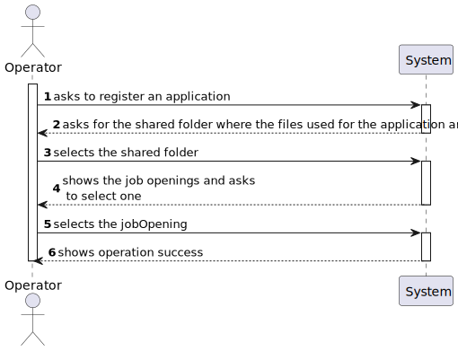
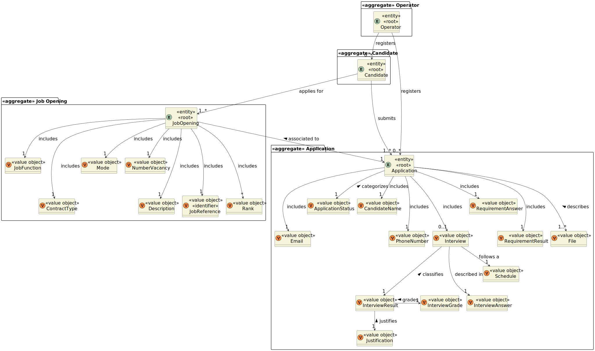
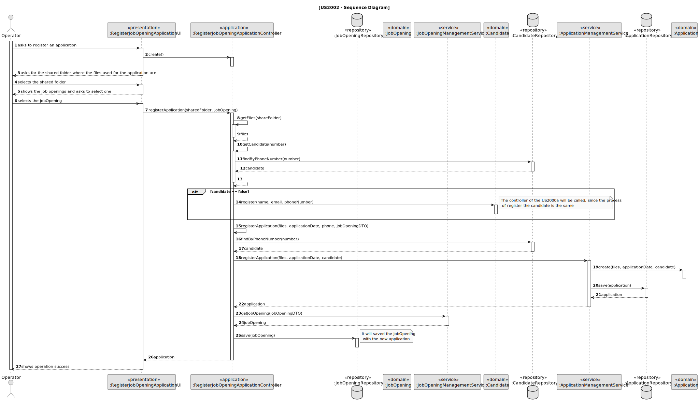
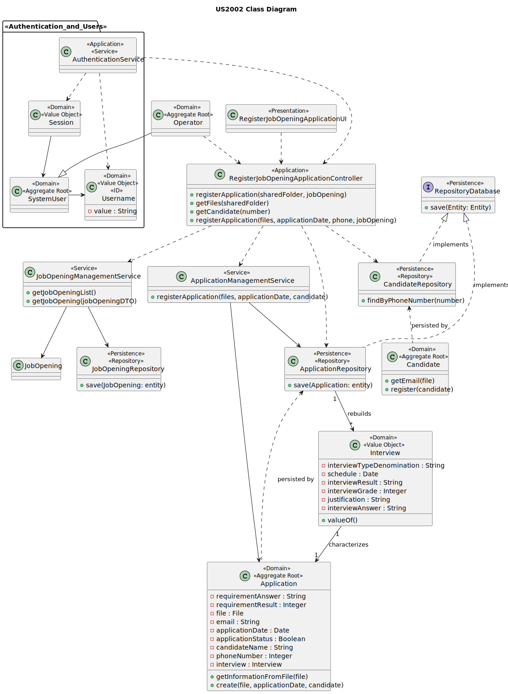

# US 2002

## 1. Context

It is the first time this task was assigned.

## 2. Requirements

**US 2002:** As Operator, I want to register an application of a candidate for a job opening and import all files 
received.


**Acceptance Criteria:**

- **2002.1.** The Operator initiates the application process.

- **2002.2.** The system should import, automatically, the data from the Application File Bot.

- **2002.3.** The files should be kept in the same shared folder.

- **2002.4.** There must be a record indicating that the candidate submitted the application.

- **2002.5.** The candidate should be created, if it does not exist.


**Dependencies/References:**

This functionality has a dependency on [_US G007_](../us_g007) that pertains to the authentication and authorization for
all users and functionalities.
Additionally, this functionality is related to [_US 2001_](../sb_us_2001) since the data to be imported is going to be processed
first by the Application File Bot.

_Reference 2002.1:_ Import the data from the file that was processed by the Application File Bot in Req 2001. 
The files should be kept in the same shared folder, but the Backoffice application needs to know the references to 
the file locations.


**Client Clarifications:**

> **Question:** Is it the Operator who registers an application, or does the system do it automatically? Also, how does 
> the application verification integrates the plugin in the process?
>
> **Answer:** In US 2002, the Operator registers the application. For this purpose, the Operator initiates the process,
> but the system should import, automatically, the resulting data from the Application File Bot (References in US2002).
> The plugin mentioned enters this process through US 2003, where the Operator generates a template file with the data
> to be entered to validate and application. In US2004, the Operator, after filling in the specific data of the
> application (based in the previous template file), submits that file in the system, which will be used for the system
> to evaluate/verify the application. If the criteria are not meet, the application is rejected.


> **Question:** US2002 - UI and UX. I'd like to know what is the expected flow of executing US2002 (application 
> registration and files import, by the operator). Can you reproduce step by step which actions should the operator 
> execute? Example: 1. The system asks the operator for the candidate's email. 2. The operator enters the candidate's 
> email. 3. The system asks for the job reference. 4. The operator enters the job reference. 5. The system creates the 
> job application, if there is data for it in the shared folder.
>
> **Answer:** There are no specific requirements for the UI/UX but I think it will be more user friendly if the 
> Operator could start the process by selecting the shared folder for the application to be imported.


> **Question:** Regarding the register of the candidates, should the data be entered manually or imported from the file
> with the candidate's date?
> 
> **Answer:** It makes sense the information to be imported from the file, **within the scope of the US2002**. Eventually,
> provide the user the possibility to make changes if necessary. **US2000a refers to a functionality for the Operator to 
> manually register candidates. (Note: Response updated on 2024/04/18, in bold)**


> **Question:** The operator can register a candidate: does he put the info manually or has to be read of the file 
> generated by the bot? This user will appear then in the backoffice...enable as default I think. Then the admin, 
> can also register manually a candidate as the operator did it? I don't understand at all the different between a 
> registration of the candidate made by the admin or made by the operator.
> 
> **Answer:** **See Q74.** US2000a is for the Operator to manually register a candidate and his/her user in the system. 
> US2002 is for import of the applications from the data in the files produced by the application file bot. 
> If the candidate does not exist, it should be created. I think there is no registration of a candidate by the admin.


> **Question:** In the description of the US, the PO mentions the importance of the files and then in reference to it,
> importing data from the file. Could you clarify what the import refers to? Are they distinct imports? Do they have
> different destinations?
> 
> **Answer:** In this US, I'm referring to the import of the files generated by the Application File Bot. When I mention
> the data, it will be the data from the text file "A text file with the data of the application and candidate"
> section 2.2.3, one of the generated files.


> **Question:** After the files in the shared folder are used by the Operator to register and application, should they
> remain in the folder or be deleted? If they are not deleted, how do we determine which ones have not yet been "used"?
> 
> **Answer:** Assuming they have already been imported into the system, I have no additional requirements regarding the
> files. The second question is a problem that should be addressed by the proposed solution. I have nothing to say about
> that aspect.


> **Question:** What needs to be registered in the system?
> 
> **Answer:** There must be a record indicating that the candidate in question submitted the application, and all the
> submitted files must be record/imported into the system.

## 3. Analysis

The main goal of this functionality is to register the candidate application's with the information given by the files
produced by the Applications File Bot.

When the candidate doesn't exist in the system, it should be created, using the information imported in the files.


### 3.1 System Sequence Diagram



### 3.2 Domain Model Related




## 4. Design

To develop this functionality, it's needed to use a four-layered approach based on DDD (Domain-Driven Design)
architecture: Presentation, Application, Domain and Persistence.

To register an application, it is important to use the information present on the files produced by the Application File
Bot and to go to the repository to gather the information related to the job opening.

To be able to promote encapsulation between layers, it will be used DTOs.

**_Classes Used_**

**Domain Layer Classes**

* JobOpening
* Application
* Interview
* Candidate
* ApplicationManagementService

**Persistence Layer Classes**

* CandidateRepository
* ApplicationRepository

**Application Layer Classes**

* RegisterJobOpeningApplicationController

**Presentation Layer Classes**

* RegisterJobOpeningApplicationUI


### 4.1. Realization

* **US2002 Sequence Diagram**



### 4.2. Class Diagram



### 4.3. Applied Patterns

In this functionality are applied two different patterns:

>**_Repository Pattern_**
> * CandidateRepository
> * ApplicationRepository
> * JobOpeningRepository
>
>* Justification
>
>  The Candidate Application, JobOpening repository have the purpose of keeping the persistence of the candidates and
>application instances created.


>**_Service Pattern_**
> * ApplicationManagementService
> * JobOpeningManagementService
>
>* Justification
>*
> The service is in charge of managing requests about applications entities.


### 4.4. Tests

Here will be the tests used to validate the functionality, and its acceptance criteria.

**Test 1:** Verifies that the data as imported

**Refers to Acceptance Criteria:** 2002.2

````
@Test
public void ensureDataWasImported() {
...
}
````

**Test 2:** Verifies that the files are in the correct folder

**Refers to Acceptance Criteria:** 2002.3

````
@Test
public void ensureFolderIsCorrect() {
...
}
````

**Test 3:** Verifies that the application was created

**Refers to Acceptance Criteria:** 2002.4

````
@Test
public void ensureApplicationWasCreated() {
...
}
````

**Test 4:** Verifies that the candidate is created

**Refers to Acceptance Criteria:** 2002.5

````
@Test
public void ensureCandidateWasCreated() {
...
}
````

## 5. Implementation

### RegisterJobOpeningApplicationController

````
 public List<JobOpeningDTO> getJobOpeningsList() {
        return jobOpeningManagementService.getJobOpeningsList();
    }

````

````
public boolean registerCandidate(String name, String email, String extension, String number){
        return controller.registerCandidate(name, email, extension, number);
    }
````


````
public Optional<Application> registerApplication(Set<ApplicationFile> files, Date applicationDate, PhoneNumber phone, JobOpeningDTO jobOpeningDTO){

        Optional<Application> application = registerApplication(files, applicationDate, phone);

        if (application.isPresent()){
            JobOpening jobOpening = jobOpeningManagementService.getJobOpening(jobOpeningDTO);

            Set<Application> orign = jobOpening.getApplications();

            Set<Application> newApplications = new HashSet<>(orign);
            newApplications.add(application.get());

            jobOpening.setApplications(newApplications);
            jobOpeningRepository.save(jobOpening);
        }

        return application;
    }
````


````
 private Optional<Application> registerApplication(Set<ApplicationFile> files, Date applicationDate, PhoneNumber phone){
        authz.ensureAuthenticatedUserHasAnyOf(BaseRoles.OPERATOR);

        Optional<Candidate> opCandidate = candidateRepository.findByPhoneNumber(phone);

        if (opCandidate.isPresent()){
            Candidate candidate = opCandidate.get();
            return Optional.of(applicationManagementService.registerApplication(files,
                    applicationDate, candidate));
        } else {
            return Optional.of(applicationManagementService.registerApplicationWithoutCandidate(files, applicationDate));
        }
    }
````

````
 public boolean getCandidate(PhoneNumber number) {
        Optional<Candidate> opCandidate = candidateRepository.findByPhoneNumber(number);

        return opCandidate.isPresent();
    }
````


### JobOpeningManagementService

````
  public JobOpening getJobOpening(JobOpeningDTO jobOpeningDTO){
        String jobReference = jobOpeningDTO.getJobReference();
        JobOpening jobOpening = null;

        for (JobOpening job : jobOpeningRepository.findAll()) {
            if (job.getJobReference().toString().equals(jobReference)){
                jobOpening = job;
            }
        }
        return jobOpening;
    }
````


### ApplicationManagementService

````
public Application registerApplication(Set<ApplicationFile> files,
                                           Date applicationDate, Candidate candidate){
        Application application = new Application(files, applicationDate, candidate);

        return application;
    }
````


## 6. Integration/Demonstration

To activate this feature, you'll need to run the script named `run-backoffice-app` and log in with Operator
permissions. Then, navigate to the "Applications" menu and select option 1 - `Register Job Opening Applications` - to access this
feature.

