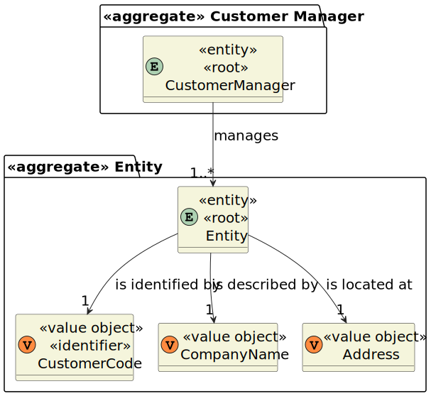

# US 1001

## 1. Context

This is the first time this user story is being requested.

## 2. Requirements

**US 1001** As {Customer Manager}, I want to register a customer and that the system automatically creates a user for
that customer

**Acceptance Criteria:**

- **1001.1.** Each customer must have associated their company name, an address and a customer code.

- **1001.2.** The customer code must be unique and have a maximum of 10 characters.

- **1001.3.** The user must have associated the following information: email, name and phone number.
- **1001.4.** The password must have a minimum of 8 characters, including both upper and lowercase letters, digits, and
  at least one non-alphanumeric character.

**Dependencies/References:**

This functionality has a dependency on [_US G007_](../us_g007) that pertains to the authentication and authorization for
all users and functionalities.
Moreover, it is linked to [_US 2000a_](../sb_us_2000a) in the sense that the information required for user registration
is identical, as clarified by the client.

_Reference 1001.1:_ Alternatively, this can be achieved by a bootstrap process.

**Client Clarifications:**

> **Question:** When creating a user in the system, it the name defined by the user or is it the person's first and last
> name?
> As for the password, is it defined by the user or generated by the system?
>
> **Answer:** It is possible to manually enter passwords, but the same
> mechanism of automatic password generation described previously can be used. Concerning the name, it won't be used
> in the authentication process since the preferred user identifier is the email.

## 3. Analysis

As the main objective is to register a customer, the required input for the Customer Manager consists of:

* Company Name
* Customer Code
* Address

After successfully submitting this information, the system should proceed with customer registration and automatically
generate a user. The necessary details for this user creation include:

* Name
* Email
* Phone Number

Considering that customer users should possess the same information as candidate users.

**Domain Model:**



## 4. Design

*In this sections, the team should present the solution design that was adopted to solve the requirement. This should
include, at least, a diagram of the realization of the functionality (e.g., sequence diagram), a class diagram (
presenting the classes that support the functionality), the identification and rational behind the applied design
patterns and the specification of the main tests used to validade the functionality.*

### 4.1. Realization

### 4.2. Class Diagram


### 4.3. Applied Patterns

### 4.4. Tests

*Include here the main tests used to validate the functionality. Focus on how they relate to the acceptance criteria.*

**Test 1:** Verifies that it is not possible to ...

**Refers to Acceptance Criteria:** G002.1

````
@Test(expected = IllegalArgumentException.class)
public void ensureXxxxYyyy() {
...
}
````

## 5. Implementation

*In this section the team should present, if necessary, some evidencies that the implementation is according to the
design. It should also describe and explain other important artifacts necessary to fully understand the implementation
like, for instance, configuration files.*

*It is also a best practice to include a listing (with a brief summary) of the major commits regarding this
requirement.*

## 6. Integration/Demonstration

In this section the team should describe the efforts realized in order to integrate this functionality with the other
parts/components of the system

It is also important to explain any scripts or instructions required to execute an demonstrate this functionality

## 7. Observations

*This section should be used to include any content that does not fit any of the previous sections.*

*The team should present here, for instance, a critical prespective on the developed work including the analysis of
alternative solutioons or related works*

*The team should include in this section statements/references regarding third party works that were used in the
development this work.*