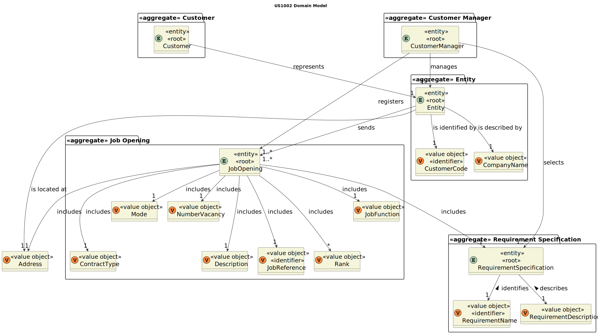
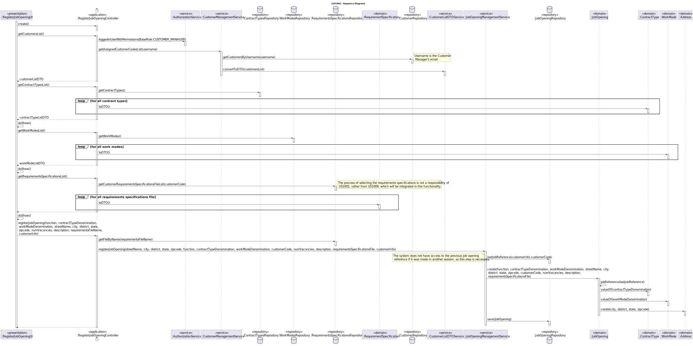
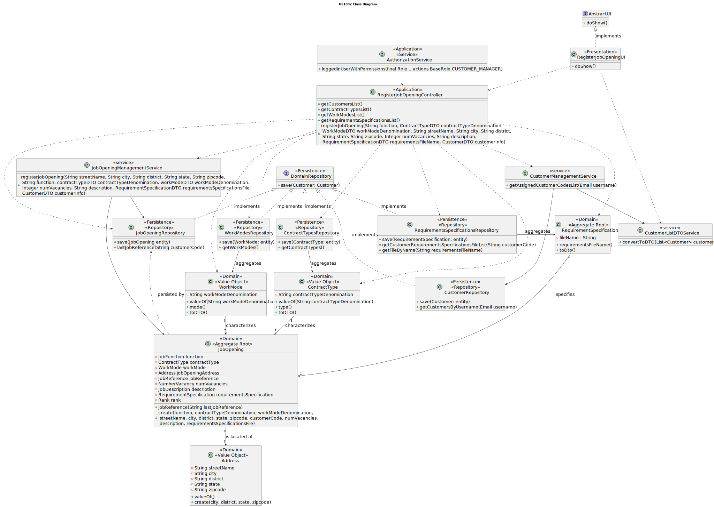

# US 1002

## 1. Context

This is the first time this user story is being requested.

## 2. Requirements

**US 1002** As {Customer Manager}, I want to register a job opening.

**Acceptance Criteria:**

- **1002.1** The "Number of Vacancies" must not be less than or equal to 0.
- **1002.2** The job reference is based on a customer code that must be unique, which is limited to 10 characters, followed
by a sequential number.
- **1002.3** Regarding the "Company" field in a job opening, it should be the company/customer's name, but when storing it within
the database, the customer code representing said company should be used.
- **1002.4** A job opening is only managed by a single Customer Manager, the one that is in charge of the company/customer
of said job opening.
- **1002.5** The job opening must have a title/function.
- **1002.6** The job opening must have a contract type
- **1002.7** The job opening must have a work mode
- **1002.8** The company's address is obligatory in a job opening.

**Dependencies/References:**

**US1008** | The Job Requirement Specification plugin configured and deployed in US1008 is essential to associate a set of
requirements to a certain job opening.

 **US2003** | This functionality has a dependency with US2003, which generates and exports a template text file to help collect the
candidates' data based on the job opening specifications/requirements. The data will be used to evaluate the candidate and
check if they are who the company/customer wishes for.

_Reference **1002.1**:_ Alternatively, this can be achieved by a bootstrap process.


**Client Clarifications:**

> **Question:** In the context where the Customer Manager registers a job opening, how are the requirements for that job offer selected/defined?
>
> **Answer:** The Customer Manager registers the job opening (US 1002) and then typically selects which requirements 
> specification is suitable for that job opening. The requirements specification will be one of those "created" by the language
> engineer and registered in the system.


> **Question:** Regarding the Job Opening (section 2.2.2), the job reference states that it should be generated
> by the system based on a customer code. What is this customer code and are there any rules for its creation?
>
> **Answer:** I would say that every customer must have a unique identifying code, which could be a sort of abbreviation 
> of their name with a limited number of characters. For example, for the customer "Instituto Superior de Engenharia do Porto",
> the customer code could be "ISEP" and no other customer could have this customer code. A reasonable limit might be 8 to 10
> characters; let's define it as 10. This code is manually entered when creating the customer in the system.


> **Question:** Are all fields in the job opening mandatory or are there optional ones?
>
> **Answer:** The fields mentioned in section 2.2.2 are mandatory to fill out. The requirements will be dynamic as they
> depend on the requirements specification selected for that job opening (which is based on a language).


> **Question:** Regarding the job specification, is it the client's responsibility to provide the requirements
> or is it the responsibility of the customer manager? What is the concept of a job specification?
>
> **Answer:** Typically, it will be the client who informs the customer manager of the minimum requirements for a job opening.
> The customer manager checks if there is already a suitable requirements specification available.
> If none exists, with the help of the Language Engineer, a new one is created.


> **Question:** In the job opening (section 2.2.2), for the "company" field, should it be the customer name 
> or the customer code, considering the customer code is unique and manually entered?
>
> **Answer:** The information related to the job opening appearing at the end of page 5 should be seen as something 
> used for job advertisement. In that context, it makes more sense to display the company name (customer name) for the "Company"
> field rather than its code. However, for database storage purposes, the unique code (customer code) may be used.


> **Question:** Does a job opening follows only one interview model?
>
> **Answer:** The Customer Manager selects the interview model to be used in interviews for a job opening. Therefore, there
> will be only one interview model used in the interviews for that job opening.


> **Question:** Does a job opening have only one customer manager?
>
> **Answer:** Yes, typically one customer manager handles all job openings for a client (customer). Consequently, there 
> is only one customer manager for each job opening.


> **Question:** "As Customer Manager, I want to register a job opening", are there any acceptance criteria not yet mentioned
> related to the attributes? Or is it left to the development team's discretion based on best practices and common sense? Some examples:
> - The "Number of Vacancies" must not be less than or equal to 0 or can it be optional;
> - The "Description" should have a character limit or can it be optional.
>
> **Answer:** Regarding whether there are acceptance criteria not mentioned, I will not comment. It's part of the process
> to discover them. I would suggest using more than just common sense.


> **Question:** Are the phases of the Job Opening and the application status separate concepts or do they refer to the same thing?
>
> **Answer:** They are related but are different concepts.


> **Question:** When the Customer Manager registers a job offer, does he create the requirement specifications and the interview
> models or is he given a list of these to select from?
>
> **Answer:** There is US1002, US1009 and US1011. I think it's clear what each one is responsible for. The creation
> of interview templates and requirements is a specific use case with a specific US to register in the system
> the respective plugins (US1008).


> **Question:** Options in Title/Function of Job Opening – I would like to ask whether the "Title of function" field in 
> the Job Opening (Section 2.2.2) can have only a limited number of options. If so, what are they (besides "front end programmer")?
>
> **Answer:** It is free text. The purpose is to allow describing the role to be performed by the candidate in this job opening.


> **Question:** In a job opening, are the contract type and work mode fixed elements, meaning the types listed in the documentation
> are static and do not change, or could there be more types of these two elements?
>
> **Answer:** The most "common" types are those listed in the documentation. However, I think it makes sense for the system
> to accept different types if the Customer Manager desires so.


> **Question:** A customer manager is responsible for creating job openings for the customers they oversee. When creating
> a job opening, how does the customer manager indicate which customer the job opening is for? Do they select a customer
> from those they are responsible for?
>
> **Answer:** Yes, it can be as you indicated.


> **Question:** Regarding a Customer (company), it was mentioned that one piece of information to collect would be the 
> address (physical, not email) related to a job opening. The question is, if a company has multiple branches in different
> locations, would it then have multiple addresses, or would it be better to consider each of these branches as an individual
> Customer? However, if each branch were to be considered an individual Customer, would the email (as the identifier) have
> to be the same, or would it be possible to have a different email for each branch of the company?
>
> **Answer:** You should consider that the company (Customer) has a primary address associated with its registration. In
> the context of a job opening, the address that "appears" in that job offer is the address associated with that specific
> job, which could be in a different location of the company.


> **Question:** Regarding a Customer (company), it was mentioned that one piece of information to collect would be the
> physical address (not email) related to a job opening. The question is, if a company has multiple branches in different
> locations, would it then have multiple addresses, or would it be better to consider each of these branches as an individual
> Customer? Furthermore, if each of these branches were to be considered an individual Customer, would the email (as the
> identifier) need to be the same, or would it be possible to have a different email for each branch of the company?
>
> **Answer:** You should consider that the company (Customer) has a primary address associated with its registration. In
> the context of a job opening, the address that "appears" in that job offer is the address associated with that specific
> job, which could be at a different location within the company.


## 3. Analysis

To register a job opening, some information must be provided:

* **Job Reference** - based on a unique customer code followed by a sequential number
* **Title or Function** - indicating the position that people are applying for
* **Contract Type** - one of the defined types
* **Mode** - one of the defined types
* **Address** - address of the company
* **Company** - customer Name
* **Number of vacancies** - number of people that will be employed
* **Description** - a brief message from the company
* **Requirements** - the job opening specifications, retrieved from a plugin (Job Requirement Specification Module)

After inserting all this information, the job opening becomes valid and eligible to be part of a recruitment process.

Below there's a System Sequence Diagram (SSD) illustrating the expected behaviour of this functionality. After this diagram
is a partial domain model, with emphasis on US1002's concepts.

**US1002 System Sequence Diagram**


**US1002 Domain Model**



## 4. Design

The solution for this functionality is to have 4 layers, following DDD development architecture: Presentation, Application,
Domain and Persistence. A link in [references](#71-references) explains this topic in-depth.

To register a job opening, plenty of information must be retrieved from databases to be displayed: customers, contract types, work
modes and requirement specifications to select. These objects must be within repositories.

In order to enhance encapsulation between layers, the usage of DTO's to the previously mentioned objects should be applied.

To get the customers that are assigned only to the Customer Manager in the session, access to the AuthorizationService
is required.


**New Domain Layer Classes**
* Address
* JobOpening
* WorkMode
* ContractType
* RequirementSpecification
* CustomerListDTOService
* CustomerManagementService
* JobOpeningManagementService
* AuthorizationService

> * Address, ContractType, WorkMode and RequirementSpecification (a file) are a value object that belongs to a JobOpening.

**New Persistence Layer Classes**
* JobOpeningRepository
* WorkModesRepository
* ContractTypesRepository
* RequirementsSpecificationsRepository
* CustomerRepository

**New Application Layer Classes**
* RegisterJobOpeningController

**New Presentation Layer Classes**
* RegisterJobOpeningUI

The further topics illustrate and explain this functionality usage flow, and the correlation between its components.

### 4.1. Realization

* **US1002 Sequence Diagram**




### 4.2. Class Diagram

* **US1002 Class Diagram** 



### 4.3. States Diagram

A job opening can have many states when in certain scenarios.

The following diagram illustrates the dynamics amongst states, and what each one means.


### 4.4. Applied Patterns

This topic presents the classes with the patterns applied to them along with justifications.

>**Repository Pattern**
> * ContractTypesRepository
> * WorkModesRepository
> * RequirementsSpecificationsRepository
> * CustomerRepository
> * JobOpeningRepository
> 
> **Justifications**
>
> * According to the client, there can be more contract types and work modes in the future, so repositories are ideal to 
    store the different instances of these classes.
> 
> * As per requested, the job reference that identifies the job opening should have the customer code as a base, and be 
    sequential. If the previous job opening from the same customer was made in a different session, then the current session
    does not have access to its job reference, so it must be retrieved from the job openings' repository database.
    The newly created jobOpening instance will be saved/preserved in its repository.
> 
> * To have access to the requirements specifications file names, access to a database containing registers of them is
    necessary, therefore the existence of a repository database that is shared amongst various applications is necessary.
> 
> * The customers assigned to the Customer Manager are stored within the CustomerRepository, persisting and rebuilding them
    between sessions.


>**Service Pattern**
> * CustomerListDTOService
> * CustomerManagementService
> * JobOpeningManagementService
> * AuthorizationService
> 
> **Justifications**
> 
> * CustomerManagementService is used in more than one functionality, and its in charge of managing request regarding customers,
>   serving as encapsulation between the controller and the CustomerRepository along with the domain classes.
>
> * JobOpeningManagementService is used in more than one functionality, and its in charge of managing request regarding 
>   jobOpenings, serving as encapsulation between the controller and the JobOpeningRepository along with the domain classes.
> 
> * In order to enforce encapsulation amongst layers and adequate responsibility assigment, the CustomerListDTOService was
>   created, besides being a set of instructions that is used in other functionalities.
> 
> * To get the customers that are assigned to the current Customer Manager in-session, we must get something to identify them.
>   The AuthorizationService allows to get the username (user's email), which is essential to then filter the CustomerRepository
>   to the desired customers. This set of instructions is used in other functionalities too.


### 4.5. Tests


**Test 1:** Verifies that is not possible to have job opening with a number of vacancies

**Refers to Acceptance Criteria:** 1002.1

````
@Test
public void ensureMustHaveNumberVacancies(){
...
}
````

**Test 2:** Verifies that is not possible to have a negative number of vacancies

**Refers to Acceptance Criteria:** 1002.1

````
@Test
public void ensureNumberVacanciesNegativeIsInvalid() {
...
}
````

**Test 3:** Verifies that is not possible to have a zero has the number of vacancies

**Refers to Acceptance Criteria:** 1002.1

````
@Test
public void ensureNumberVacanciesZeroIsInvalid() {
...
}
````

**Test 4:** Verifies a job opening cannot exist without a title/function

**Refers to Acceptance Criteria:** 1002.5

````
@Test
public void ensureMustHaveTitle(){
...
}
````

**Test 5:** Verifies a job opening's contract type cannot be null

**Refers to Acceptance Criteria:** 1002.6

````
@Test
public void ensureContractTypeNullIsInvalid() {
...
}
````

**Test 6:** Verifies a job opening's contract type cannot be empty

**Refers to Acceptance Criteria:** 1002.6

````
@Test
public void ensureContractTypeEmptyIsInvalid() {
...
}
````

**Test 7:** Verifies a job opening's work mode cannot be null

**Refers to Acceptance Criteria:** 1002.7

````
@Test
public void ensureWorkModeNullIsInvalid() {
...
}
````

**Test 8:** Verifies a job opening's work mode cannot be empty

**Refers to Acceptance Criteria:** 1002.7

````
@Test
public void ensureWorkModeEmptyIsInvalid() {
...
}
````

**Test 9:** Verifies a job opening's without an address is not valid

**Refers to Acceptance Criteria:** 1002.8

````
@Test
public void ensureMustHaveAddress(){
...
}
````

## 5. Implementation

The following code belongs to the UI of this functionality. All its methods are according to the design.

The doShow() method, declared in the AbstractUI interface.

````
private final RegisterJobOpeningController controller = new RegisterJobOpeningController();

@Override
protected boolean doShow() {

    //Selectable attributes
    CustomerDTO companyInfo;
    try {
        companyInfo = showAndSelectCustomer();
    }catch (NoSuchElementException e){
        System.out.println(e.getMessage());
        return false;
    }
    ContractTypeDTO contractTypeDenomination = showAndSelectContractType();
    WorkModeDTO workModeDenomination = showAndSelectWorkMode();
    RequirementSpecificationDTO requirementsFileName = showAndSelectRequirementSpecification();

    //Writable Attributes
    String function = Console.readNonEmptyLine("What's the job's title?", "Providing a job's title is obligatory.");

    String description = Console.readNonEmptyLine("Provide a brief description for the job opening.",
            "A brief description is obligatory.");

    int numVacancies = WriteNumberVacancies();

    System.out.println("\nRegarding the job's opening address:");
    String streetName = Console.readNonEmptyLine("What's the street name?",
            "Providing a job opening address's street name is obligatory.");
    String city = Console.readNonEmptyLine("What's the city?",
            "Providing a job opening address's city is obligatory.");
    String district = Console.readNonEmptyLine("What's the district?",
            "Providing a job opening address's district is obligatory.");
    String streetNumber = Console.readNonEmptyLine("What's the street number?",
            "Providing a job opening address's state is obligatory.");

    String zipcode = WriteZipcode();

    try {
        Optional< JobOpening> jobOpening = this.controller.registerJobOpening(function, contractTypeDenomination,
                workModeDenomination, streetName, city, district, streetNumber, zipcode, numVacancies, description,
                requirementsFileName, companyInfo);
        if (jobOpening.isEmpty()){
            throw new IntegrityViolationException();
        }else{
            System.out.println("The job opening was successfully registered!\n");
        }
    } catch (final IntegrityViolationException | ConcurrencyException e) {
        System.out.println("An error occurred while registering the job opening.\n" + e.getMessage());
    }

    return false;
}
````

The only customers that are selectable are the ones belonging to the current user, a Customer Manager. To ensure layer
encapsulation, a DTO was used.

````
public List<CustomerDTO> getCustomersList() {
    authz.ensureAuthenticatedUserHasAnyOf(BaseRoles.CUSTOMER_MANAGER);
    Optional<SystemUser> user = authz.loggedinUserWithPermissions(BaseRoles.CUSTOMER_MANAGER);
    if (user.isPresent()) {
        return customerManagementService.getAssignedCustomerCodesList(user.get().identity());
    }
    throw new NoSuchElementException("It was not possible to retrieve the user's data.");
}
````

To register a job opening, the requirements must be retrieved from the database.

Implementation of the method getFileByName(filename) in JpaRequirementSpecificationRepository.

````
@Override
public Optional<RequirementSpecification> getFileByName(String filename) {
    final Map<String, Object> params = new HashMap<>();
    params.put("filename", filename);
    return matchOne("e.requirementName.name=:filename", params);
}
````

**Major Commits**

| Commit  | Brief Description                           |
|:--------|:--------------------------------------------|
| 670457b | Initial Classes Setup for the Functionality |
| 8eb4a92 | Persistence modifications                   |
| bbeb746 | Test Classes                                |


## 6. Integration/Demonstration

This functionality has incorporated US1009, regarding the selection of requirements.
The job openings created in this User Story will later be showed in US1007, to set up a recruitment process.

## 7. Observations


### 7.1 References

* [DDD architecture]( https://ddd-practitioners.com/home/glossary/layered-architecture/#:~:text=In%20Domain%2DDriven%20Design%20(DDD,layer%2C%20and%20an%20infrastructure%20layer. )