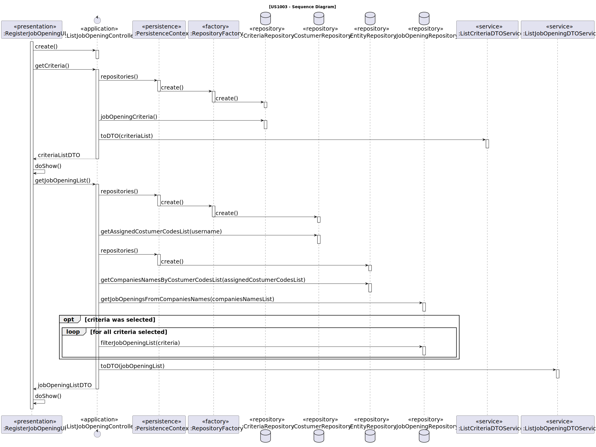
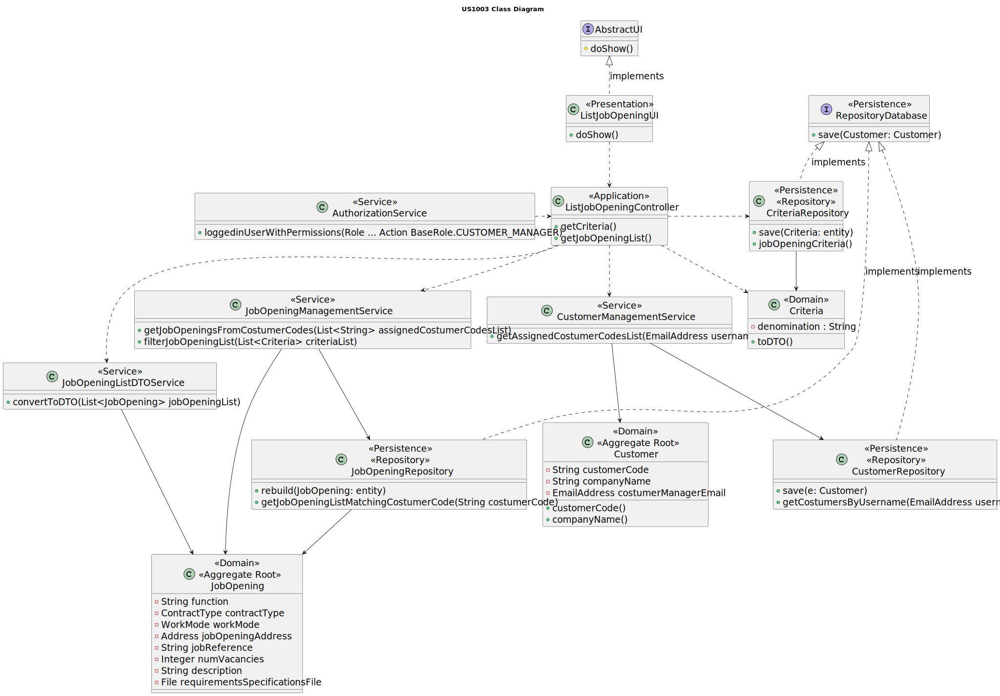

# US 1003

## 1. Context

This is the first time this user story is being requested.

## 2. Requirements

**US 1003** As {Customer Manager}, I want to list job openings.

**Acceptance Criteria:**

**1003.1** Listing by both costumer code or company name must be supported.
**1003.2** The Costumer Manager can only list the job openings of the costumers that manages.

**Dependencies/References:**

**US1002** | This functionality is dependent on US1002, regarding the creation of job openings to list.

There are no references for this user story.

**Client Clarifications:**

> **Question:** It was mentioned that "you can filter by Customer" in this US. In this case, what form will the Customer Manager
> use to filter Job Openings by Customer (name, email,...)? And when you say "you can filter by date", do you mean a specific
> date or a time interval?
>
> **Answer:** The Customer is typically a company and has a name. The existence of a customer code has also been mentioned.
> For the Customer filter, the Customer Manager will probably use the company name (or the customer code, if applicable)
> to select the Job Openings related to that specific customer. As for filtering by date, if you are in the role of a Customer
> Manager who needs to check job openings, does it make sense to filter for a single day? In other words, would the Customer
> Manager need to know on which specific day the job opening being searched for was registered?


> **Question:** Is there any criteria to define which ones to list? Or should it list all job openings in the entire system?
>
> **Answer:** I suppose it would be useful to be able to filter by Customer and date. It also seems useful to filter
> by only active job openings or to list all job openings.


> **Question:** At what point does a job opening become active? Is it when it is created and has a set of associated requirements?
> Is it when it is linked to an ongoing recruitment process?
>
> **Answer:** The reference to "active" relates to dates. A job opening that has already completed its recruitment process
> is not considered active.


> **Question:** Regarding the listing of job openings, can a customer manager list all job openings or only those assigned
> to them? In other words, are job openings assigned to a specific customer manager, and can they only access their list
> of job openings?
>
> **Answer:** I think it makes sense to list only "their" job openings.


## 3. Analysis

This functionality aims to list and, if desired, filter all the job openings. Below there's a list of the mentioned 
filtering criteria:

* Company Name
* Costumer Code
* Time Interval
* {Active} Status

If no criteria is selected, then all the job openings, regardless of their status, will be displayed. Otherwise, only the
job openings that comply with the selected criteria will be available.

Below there's a System Sequence Diagram (SSD) illustrating the expected behaviour of this functionality. After this diagram
is a partial domain model, with emphasis on US1003's concepts.

**US1003 System Sequence Diagram**


**US1003 Domain Model**


## 4. Design


The solution for this functionality is to have 4 layers, following DDD development architecture: Presentation, Application,
Domain and Persistence. A link in [references](#71-references) explains this topic in-depth.

To list a job opening, they must be first filtered, so that the only ones the Costumer Managers have access to are the ones
that have been assigned to them. For this purpose, access to the Authentication Service is required.

Both costumer code and company name are to be criteria when filtering the list, all this data is in the Entity represented
by the Costumer.

In order to enhance encapsulation between layers, the usage of DTO's is required.


**New Domain Layer Classes**
* JobOpening
* Entity
* Criteria

**New Persistence Layer Classes**
* RepositoryFactory
* JobOpeningRepository
* CostumerRepository
* CriteriaRepository
* EntityRepository

**New Application Layer Classes**
* ListJobOpeningController
* ListCriteriaDTOService
* ListJobOpeningDTOService
* JobOpeningMapper
* JobOpeningDTO
* CriteriaMapper
* CriteriaDTO

**New Presentation Layer Classes**
* ListJobOpeningUI

The further topics illustrate and explain this functionality usage flow, and the correlation between its components.

### 4.1. Realization

* **US1003 Sequence Diagram**



### 4.2. Class Diagram

* **US1003 Class Diagram**



### 4.3. Applied Patterns

This topic presents the classes with the patterns applied to them along with justifications.


>**Repository Pattern**
> * CostumerRepository
> * EntityRepository
> * JobOpeningRepository
>
> **Justifications**
>
> * The job opening repository is in charge of persisting the job opening instance created. It is also responsible for
    rebuilding the contract types and work modes that characterize a job opening, information it has kept in its database.
>
> * As per requested, the job reference that identifies the job opening should have the costumer code as a base, and be
    sequential. If the previous job opening from the same costumer was made in a different session, then the current session
    does not have access to its job reference, so it must be retrieved from the job openings' repository database.
>
> * Because the company name's is an attribute of JobOpening, we need the entities to retrieve their name, so there is a
    need to access the entities database.


>**Service Pattern**
> * ListJobOpeningController
> * ListJobOpeningUI
> * ListJobOpeningDTOService
> * ListCriteriaDTOService
> * JobOpeningMapper
> * CriteriaMapper
>
> **Justifications**
>
> * The controller acts as a bridge between the UI and the Domain and Persistence Layer, processing UI requests and asking
    the classes with assigned responsibilities to solve the issue, returning to the UI with the answer.
>
> * The UI does not correspond to any concept in the problem domain, and there is no justification for assigning certain
    responsibilities to any existing class within the Domain Model.
>
> * The responsibilities of the Mapper consist of converting domain object to a dto, encapsulation of mapping logic, Data
    format adaptation and integration with the Application Layer (Controller).


>**DTO pattern**
> * JobOpeningDTO
> * CriteriaDTO
>
> **Justifications**
>
> * A DTO's responsibility is to transfer data between layers without behavior or business logic, promoting encapsulation.


### 4.4. Tests

*Include here the main tests used to validate the functionality. Focus on how they relate to the acceptance criteria.*

**Test 1:** Verifies that it is not possible to ...

**Refers to Acceptance Criteria:** G002.1

````
@Test(expected = IllegalArgumentException.class)
public void ensureXxxxYyyy() {
...
}
````

## 5. Implementation

*In this section the team should present, if necessary, some evidencies that the implementation is according to the
design. It should also describe and explain other important artifacts necessary to fully understand the implementation
like, for instance, configuration files.*

*It is also a best practice to include a listing (with a brief summary) of the major commits regarding this requirement.*

## 6. Integration/Demonstration

In this section the team should describe the efforts realized in order to integrate this functionality with the other
parts/components of the system

It is also important to explain any scripts or instructions required to execute an demonstrate this functionality

## 7. Observations

*This section should be used to include any content that does not fit any of the previous sections.*

*The team should present here, for instance, a critical prespective on the developed work including the analysis of
alternative solutioons or related works*

*The team should include in this section statements/references regarding third party works that were used in the
development this work.*

### 7.1 References

* [DDD architecture]( https://ddd-practitioners.com/home/glossary/layered-architecture/#:~:text=In%20Domain%2DDriven%20Design%20(DDD,layer%2C%20and%20an%20infrastructure%20layer. )