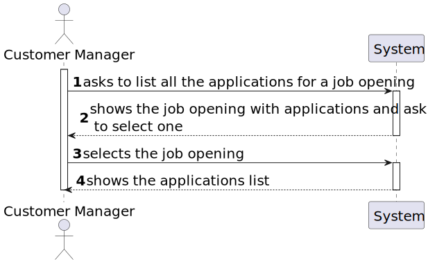
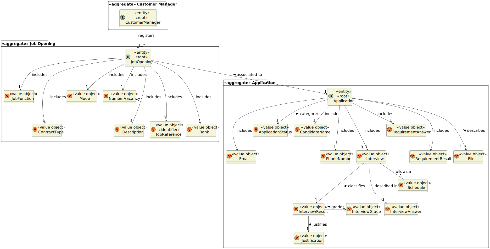
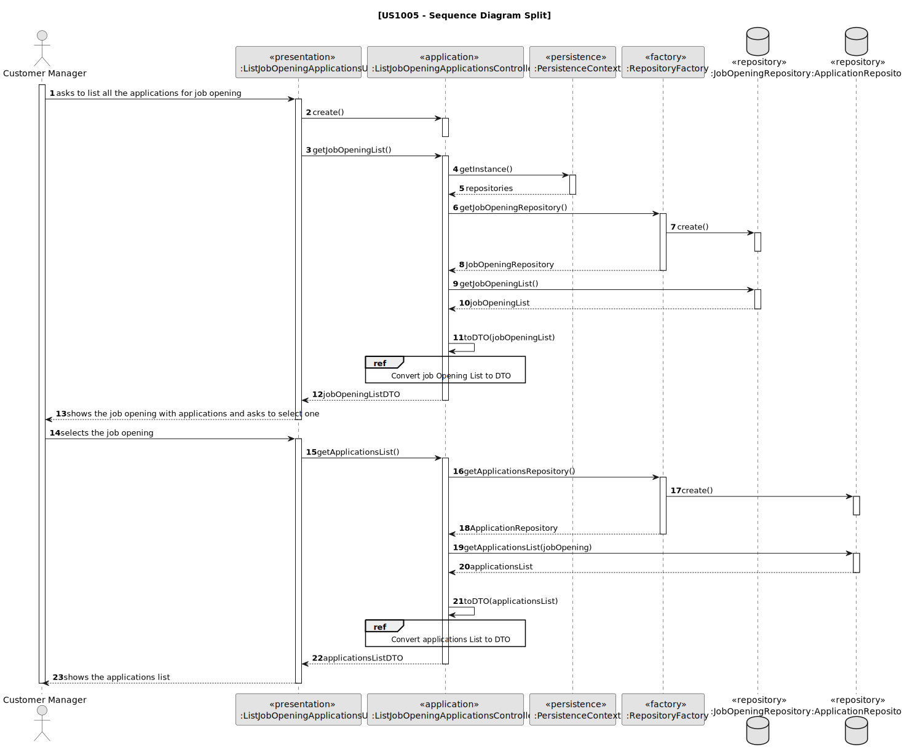
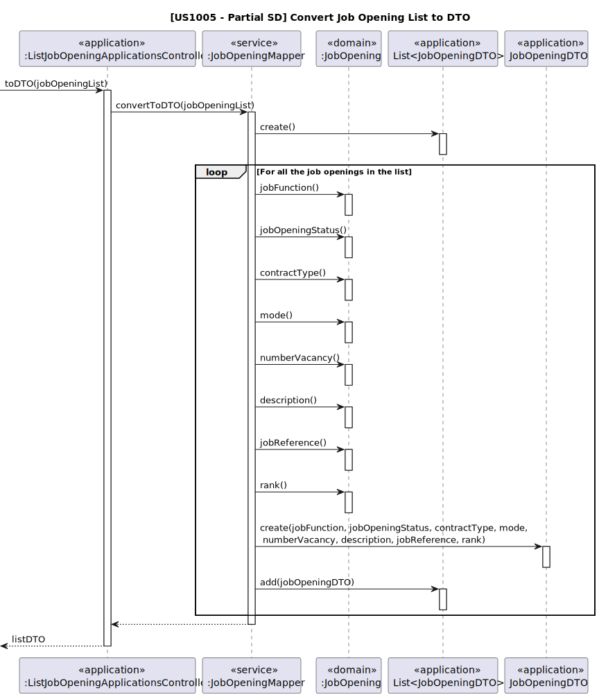
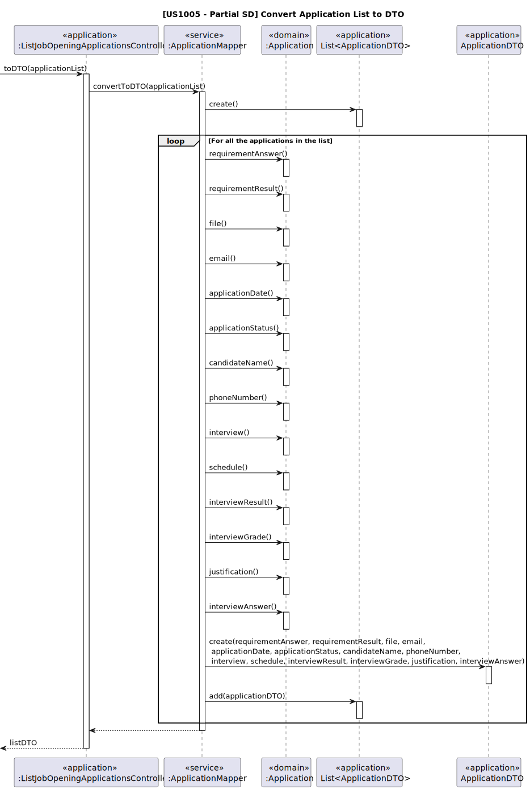

# US 1005

## 1. Context

It is necessary for the customer manager to be able to list all the existing job applications.

## 2. Requirements

**US 1005:** As Customer Manager, I want to list all applications for a job opening.


**Acceptance Criteria:**

- **1005.1.** It's necessary to exist at least one job application.

- **1005.2.** All applications should be displayed, regardless of their status.

- **1005.3.** For each application, the candidate and the status should be identified.


**Dependencies/References:**

This functionality has a dependency on [_US G007_](../us_g007) that pertains to the authentication and authorization for
all users and functionalities.
Furthermore, this functionality has a dependency on [_US 2002_](../sb_us_2002) since the data to be imported is going to be 
processed first by the Application File Bot.


**Client Clarifications:**

> **Question:** Regarding the criteria for listing applications: Should the ongoing applications appear, or the 
> applications made in the past can be included? Can any applications appear or only the ones that have been accepted? 
> What information should be displayed for each application?
>
> **Answer:** As stated in the US description, all applications for a job opening should be listed. 
> It makes sense to display all applications, regardless of their status.
> Therefore, for each application, the candidate and the status of their application should be identified.

> **Question:** The list should contain applications that haven't concluded all the selecting process defined for the
> Job Opening setup? If so, the list should contain the state/phase of each application?
> 
> **Answer:** The selecting/recruitment process ends only in the "end", so the first questions doesn't make much sense.
> For the second question, makes sense to include the application state, so the Customer Manager is able to understand
> which applications were rejected for not have the right requirements.


## 3. Analysis

This functionality is for the Customer Manager, so the user needs to be authenticated first to be able to list the
applications. 

It is necessary to choose a job opening before being able to see the list of the applications, since there may exist
more than one job opening in the system.

### 3.1 System Sequence Diagram




### 3.2 Domain Model Related




## 4. Design

To address this functionality, we are going to adopt a four-layered approach based on DDD (Domain-Driven Design)
architecture: Presentation, Application, Domain and Persistence.

To list the applications for a job opening it's necessary to search in the database the existing job openings and
the respective applications.

To be able to promote encapsulation between layers, it will be used DTOs.

**_Classes Used_**

**Domain Layer Classes**

* JobOpening
* Application

**Persistence Layer Classes**

* RepositoryFactory
* JobOpeningRepository
* ApplicationRepository


**Application Layer Classes**

* ListJobOpeningApplicationsController
* JobOpeningMapper
* JobOpeningDTO
* ApplicationMapper
* ApplicationDTO


**Presentation Layer Classes**

* ListJobOpeningApplicationsUI


### 4.1. Realization


* **US1005 Sequence Diagram (Split)**



* **[US1005 Partial SD] Convert Job Opening List to DTO**




* **[US1005 Partial SD] Convert Application List to DTO**



### 4.2. Class Diagram


### 4.3. Applied Patterns

To make the design of this user story, were used the following patterns:

>**_Factory Pattern_**
>* Classes
>  * JobOpeningFactory
>  * ApplicationFactory
>
>* Justification
>
>  The JobOpening is immutable, so the instances of this class will come from a job opening factory. The same thing
>happens with Application.


>**_Repository Pattern_**
>* Classes
>  * JobOpeningRepository
>  * ApplicationRepository
>
>* Justification
>
>  The JobOpening and Application repository have the purpose of keeping the persistence of the job opening and
>application instances created. 

  
>**_Service Pattern_**
>* Classes
>  * ListJobOpeningApplicationsUI
>  * ListJobOpeningApplicationsController
>  * JobOpeningMapper
>  * ApplicationMapper
>
>* Justification
>* 
>  The UI is considered a service, since it is not a concept in the domain, and there is no justification to assign these
>responsibilities to a domain class.
>  The controller is used as a bridge between the UI and the domain classes, processing the UI requests and assigning the
>responsibilities to the respective domain class.
>  The Mappers have the responsibility of converting a domain object in a DTO.


>**_DTO Pattern_**
>* Classes
>  * JobOpeningDTO
>  * ApplicationDTO
>
>* Justification
>
> The DTO's is used to transfer the data between layers without behavior or business logic, promoting encapsulation.


### 4.4. Tests


**Test 1:** Verifies that exist an application

**Refers to Acceptance Criteria:** 1005.1

````
@Test
public void ensureListApplication() {
...
}
````

**Test 2:** Verifies that all applications are listed, regardless of the status

**Refers to Acceptance Criteria:** 1005.2

````
@Test
public void ensureAllApplicationAreListed() {
...
}
````

**Test 3:** Verifies that the application has the candidate and the status

**Refers to Acceptance Criteria:** 1005.3

````
@Test
public void ensureListedJobOpeningsAreFromAssignedCostumers() {
...
}
````


## 5. Implementation

*In this section the team should present, if necessary, some evidencies that the implementation is according to the
design. It should also describe and explain other important artifacts necessary to fully understand the implementation
like, for instance, configuration files.*

*It is also a best practice to include a listing (with a brief summary) of the major commits regarding this requirement.*

## 6. Integration/Demonstration

In this section the team should describe the efforts realized in order to integrate this functionality with the other
parts/components of the system

It is also important to explain any scripts or instructions required to execute an demonstrate this functionality

## 7. Observations

*This section should be used to include any content that does not fit any of the previous sections.*

*The team should present here, for instance, a critical prespective on the developed work including the analysis of
alternative solutioons or related works*

*The team should include in this section statements/references regarding third party works that were used in the
development this work.*