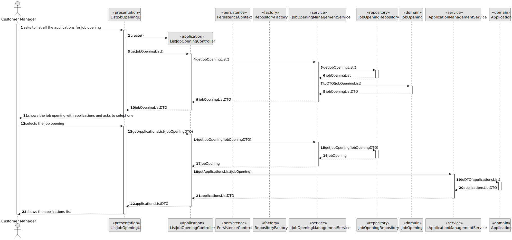

# US 1005

## 1. Context

It is necessary for the customer manager to be able to list all the existing job applications.

## 2. Requirements

**US 1005:** As Customer Manager, I want to list all applications for a job opening.


**Acceptance Criteria:**

- **1005.1.** It's necessary to exist at least one job application.

- **1005.2.** All applications should be displayed, regardless of their status.

- **1005.3.** For each application, the candidate and the status should be identified.


**Dependencies/References:**

This functionality has a dependency on [_US G007_](../us_g007) that pertains to the authentication and authorization for
all users and functionalities.
Furthermore, this functionality has a dependency on [_US 2002_](../sb_us_2002) since the data to be imported is going to be 
processed first by the Application File Bot.


**Client Clarifications:**

> **Question:** Regarding the criteria for listing applications: Should the ongoing applications appear, or the 
> applications made in the past can be included? Can any applications appear or only the ones that have been accepted? 
> What information should be displayed for each application?
>
> **Answer:** As stated in the US description, all applications for a job opening should be listed. 
> It makes sense to display all applications, regardless of their status.
> Therefore, for each application, the candidate and the status of their application should be identified.

> **Question:** The list should contain applications that haven't concluded all the selecting process defined for the
> Job Opening setup? If so, the list should contain the state/phase of each application?
> 
> **Answer:** The selecting/recruitment process ends only in the "end", so the first questions doesn't make much sense.
> For the second question, makes sense to include the application state, so the Customer Manager is able to understand
> which applications were rejected for not have the right requirements.


## 3. Analysis

This functionality is for the Customer Manager, so the user needs to be authenticated first to be able to list the
applications. 

It is necessary to choose a job opening before being able to see the list of the applications, since there may exist
more than one job opening in the system.

### 3.1 System Sequence Diagram


### 3.2 Domain Model Related


## 4. Design

To address this functionality, we are going to adopt a four-layered approach based on DDD (Domain-Driven Design)
architecture: Presentation, Application, Domain and Persistence.

To list the applications for a job opening it's necessary to search in the database the existing job openings and
the respective applications.

To be able to promote encapsulation between layers, it will be used DTOs.

**_Classes Used_**

**Domain Layer Classes**

* JobOpening
* Application
* JobOpeningManagementService
* ApplicationManagementService


**Application Layer Classes**

* ListJobOpeningApplicationsController
* JobOpeningDTO
* ApplicationDTO


**Presentation Layer Classes**

* ListJobOpeningApplicationsUI


### 4.1. Realization


* **US1005 Sequence Diagram (Split)**




### 4.2. Class Diagram


### 4.3. Applied Patterns

To make the design of this user story, were used the following patterns:


>**_Repository Pattern_**
>* Classes
>  * JobOpeningRepository
>  * ApplicationRepository
>
>* Justification
>
>  The JobOpening and Application repository have the purpose of keeping the persistence of the job opening and
>application instances created. 

  
>**_Service Pattern_**
>* Classes
>  * JobOpeningManagementService
>  * ApplicationManagementService
>
>* Justification
>
>  JobOpeningManagementService and ApplicationManagementService are in charge of managing request regarding
>jobOpenings and applications, serving as encapsulation between the controller and the JobOpeningRepository/ApplicationRepository along with the domain classes.


### 4.4. Tests


**Test 1:** Verifies that exist an application

**Refers to Acceptance Criteria:** 1005.1

````
@Test
public void ensureListApplication() {
...
}
````

**Test 2:** Verifies that all applications are listed, regardless of the status

**Refers to Acceptance Criteria:** 1005.2

````
@Test
public void ensureAllApplicationAreListed() {
...
}
````

**Test 3:** Verifies that the application has the candidate and the status

**Refers to Acceptance Criteria:** 1005.3

````
@Test
public void ensureListedJobOpeningsAreFromAssignedCostumers() {
...
}
````


## 5. Implementation

### ListJobOpeningApplicationsController

````
 public List<JobOpeningDTO> getJobOpeningsList() {
        return jobOpeningManagementService.getJobOpeningsList();
    }
````

````
public List<ApplicationDTO> getApplicationsList(JobOpeningDTO jobOpeningDTO) {
        JobOpening jobOpening = jobOpeningManagementService.getJobOpening(jobOpeningDTO);

        List<ApplicationDTO> applicationDTO = new ArrayList<>();
        if (jobOpening != null){
            applicationDTO = applicationManagementService.getApplicationsList(jobOpening);
        }

        return applicationDTO;
    }
````


### ApplicationManagementService

````
  public List<ApplicationDTO> getApplicationsList(JobOpening jobOpening){
        List<ApplicationDTO> applicationDTO = new ArrayList<>();

            for (Application application : jobOpening.getApplications()) {
                applicationDTO.add(application.toDTO());
            }

        return applicationDTO;
    }
````


### JobOpeningManagementService

````
public List<JobOpeningDTO> getJobOpeningsList(){
        List<JobOpeningDTO> jobOpenings = new ArrayList<>();
        for (JobOpening jobOpening : jobOpeningRepository.findAll()) {
            jobOpenings.add(jobOpening.toDTO());

        }
        return  jobOpenings;
    }
````

````
public JobOpening getJobOpening(JobOpeningDTO jobOpeningDTO){
        String jobReference = jobOpeningDTO.getJobReference();
        JobOpening jobOpening = null;

        for (JobOpening job : jobOpeningRepository.findAll()) {
            if (job.getJobReference().toString().equals(jobReference)){
                jobOpening = job;
            }
        }
        return jobOpening;
    }
````


## 6. Integration/Demonstration

To activate this feature, you'll need to run the script named `run-backoffice-app` and log in with Customer Manager
permissions. Then, navigate to the "Job Opening" menu and select option 5 - `List Job Opening Applications` - to access this
feature.
