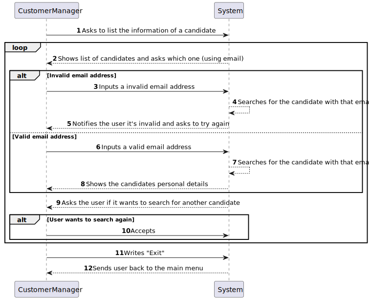

# US 1006

## 1. Context

This is the first time this US is being worked on. It is related to an action of the Customer Manager.

## 2. Requirements

**US 1006:** As Customer Manager, I want to display all the personal data of a candidate.

### Acceptance Criteria:

- **1006.1.** The system should not try to show candidate data of a candidate that does not have data. If such a situation were to happen the system should return an error and inform the user of what occurred.


- **1006.2.** The system should show the name, phone number and email address of the candidate. In case one of the parameters does not have information it should show the message **"NO DATA FOUND"**. 

### Client Clarifications:

>**(Partially Related) Question:** Does the documentation not explain the information to be collected for Customers? What information is needed? And what about company employees?
> 
>**Answer:** In fact, this is not explicit. However, they are mentioned in the name of the company and its address within the scope of a job opening. As for users (representative of the company that accesses the Customer App) I would say that it will be similar data to that of the Candidate. When it comes to company employees, I would say that it is important to ensure that email is used to identify any user of the system. I think it will be important for each user to have their full name as well as a short user name (which must be unique). **Update on 2024-03-21: The Product Owner reconsidered and decided that the short user name is unnecessary since only email and password should be used to authenticate users**.

>**Question:** Does the candidate have an identification code or is it their email that identifies them?
> 
>**Answer:** Candidate identification is via email. There will be no need for a code.

>**Question:** What information about the candidate's name should appear (full name, first and last name, etc.)?
> 
>**Answer:** At the outset I would say it would be the name, as received in the application you made.

>**Question:** What information is necessary for candidates and system users?
>
>**Answer:** Some previous information is referred to in Q11. Furthermore, section 2.2.3 states that regarding candidates we have the following information: email of the candidate, name of the candidate, phone number of the candidate.

>**Question:** Are checks made on the cell phone number and postal code only for Portuguese domains, or do we have to program according to the country in question?
>
>**Answer:** That's enough for the Portuguese case.

>**Question:** What are the business policies for registering a candidate, what are the characteristics of the password, email, cell phone?
>
>**Answer:** On the cell phone, follow Q56. Regarding email, it would be any valid email. Regarding the password, we can follow something like: have at least 8 characters, upper and lower case letters, digits and at least one non-alphanumeric character.

>**Question:** In relation to the listing of a given candidate's personal data, will a customer manager have access to all candidates in the system or only to candidates who submitted an application for a job opening for a client that is managed by that customer manager?
>
>**Answer:** In the current context, we will assume that the Customer Manager can access (consult) the personal data of any candidate.

### Dependencies/References:

In US1006 it is asked of us to display all the personal information related to a chosen candidate, in this case, we consider personal information to be all the details in the candidature that relate to only himself, not the applications.

#### Dependency with US 1006b: 
> This user story is dependent on US 1006 as it will use the same system, only show more data.

#### Dependency with US 2000a: 
> To be able to choose the preferred candidate it must exist in the system, so this user story is essential.

#### Dependency with US 2000c: 
> To be able to choose the preferred candidate it will show the user all the candidates available to be chosen.

## 3. Analysis

Since this user story's main focus is on the Customer Manager being able of showing the personal details of the candidate, we focused on 2 questions:

- **What's considered the personal data of a candidate?**


- **How can the Customer Manager choose the candidate?**

After asking those questions, the client was able to effectively answer our doubts. With that in mind we now know important information for the design and implementation of this task:

- **Personal data is considered to be ONLY the name, email address and phone number of the candidate.**


- **The Customer Manager will be able to choose the candidate in specific through it's email, that is shown when the system lists all the available candidates.**

Not only that but checking other questions related to this user story or that are dependent on this user story has revealed to us even more information:

- **The name to be displayed is the entire name, as received in the application the candidate made.**


- **The phone number and postal code are all considered to be portuguese.**


- **The Customer Manager can access and consult the information of ALL candidates.**

### System Sequence Diagram Related



## 4. Design

For this User Story, following the **DDD pattern, a 4-layer system (Presentation, Application, Domain, Infrastructure)** was chosen to best fit the envisioned designed of this functionality.

Because of the usage and display of the information of already existing objects, in this case CustomerManager and Candidate, **these must be stored in repositories and serialized for future usage of this US and others.**

**The usage of DTOs was considered, however it was deemed unnecessary** since the data needed is held in a single entity stored inside its repository.
#### New Persistence Layer Classes:
- CandidateRepository

#### New Domain Layer Classes:
- Candidate
- CandidateName
- PhoneNumber
- Email

*CandidateName, PhoneNumber and Email are value objects belonging to the Candidate entity.*

#### New Application Layer Classes:
- ListCandidateDataController

#### New Presentation Layer Classes:
- ListCandidateDataUI

### 4.1. Realization

#### Sequence Diagram Related


### 4.2. Class Diagram


### 4.3. Applied Patterns

This section is focused on the patterns used for this US:

#### Repository Pattern

For the envisioned structure and usage of this functionality, the usage of a serializable repository is essential for the Customer Manager to access the list of existing candidates and choose which one they want to view the data of.

#### Service Pattern

To create a layer of abstraction between the Domain layer and the Application layer, the usage of a specific service was deemed necessary for this user story.

### 4.4. Tests

*Include here the main tests used to validate the functionality. Focus on how they relate to the acceptance criteria.*

**Test 1:** Verifies that it is not possible to ...

**Refers to Acceptance Criteria:** G002.1

````
@Test(expected = IllegalArgumentException.class)
public void ensureXxxxYyyy() {
...
}
````

## 5. Implementation

*In this section the team should present, if necessary, some evidencies that the implementation is according to the
design. It should also describe and explain other important artifacts necessary to fully understand the implementation
like, for instance, configuration files.*

*It is also a best practice to include a listing (with a brief summary) of the major commits regarding this requirement.*

## 6. Integration/Demonstration

In this section the team should describe the efforts realized in order to integrate this functionality with the other
parts/components of the system

It is also important to explain any scripts or instructions required to execute an demonstrate this functionality

## 7. Observations

*This section should be used to include any content that does not fit any of the previous sections.*

*The team should present here, for instance, a critical prespective on the developed work including the analysis of
alternative solutioons or related works*

*The team should include in this section statements/references regarding third party works that were used in the
development this work.*