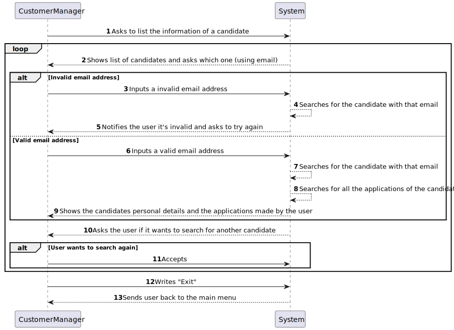

# US 1006b

## 1. Context

This is the first time this US is being worked on. It is related to an action of the Customer Manager.

## 2. Requirements

**US 1006b:** As Customer Manager, I want to display all the personal data of a candidate, including his/her applications.

### Acceptance Criteria:

- **1006b.1.** The system should use the phone number to identify a candidate.

- **1006b.2.** The system should let the user write the phone number that identifies the candidate it wants to check information on.

- **1006b.3.** The system should make sure the given phone number is valid, and if not, should let the user try again.

- **1006b.4.** In case the candidate has no applications, it should display a message informing the user of such event.

### Client Clarifications:

>**(Partially Related) Question:** Does the documentation not explain the information to be collected for Customers? What information is needed? And what about company employees?
>
>**Answer:** In fact, this is not explicit. However, they are mentioned in the name of the company and its address within the scope of a job opening. As for users (representative of the company that accesses the Customer App) I would say that it will be similar data to that of the Candidate. When it comes to company employees, I would say that it is important to ensure that email is used to identify any user of the system. I think it will be important for each user to have their full name as well as a short user name (which must be unique). **Update on 2024-03-21: The Product Owner reconsidered and decided that the short user name is unnecessary since only email and password should be used to authenticate users**.

>**Question:** Does the candidate have an identification code or is it their email that identifies them?
>
>**Answer:** Candidate identification is via email. There will be no need for a code.

>**Question:** What information about the candidate's name should appear (full name, first and last name, etc.)?
>
>**Answer:** At the outset I would say it would be the name, as received in the application you made.

>**Question:** What information is necessary for candidates and system users?
>
>**Answer:** Some previous information is referred to in Q11. Furthermore, section 2.2.3 states that regarding candidates we have the following information: email of the candidate, name of the candidate, phone number of the candidate.

>**Question:** Are checks made on the cell phone number and postal code only for Portuguese domains, or do we have to program according to the country in question?
>
>**Answer:** That's enough for the Portuguese case.

>**Question:** What are the business policies for registering a candidate, what are the characteristics of the password, email, cell phone?
>
>**Answer:** On the cell phone, follow Q56. Regarding email, it would be any valid email. Regarding the password, we can follow something like: have at least 8 characters, upper and lower case letters, digits and at least one non-alphanumeric character.

>**Question:** In relation to the listing of a given candidate's personal data, will a customer manager have access to all candidates in the system or only to candidates who submitted an application for a job opening for a client that is managed by that customer manager?
>
>**Answer:** In the current context, we will assume that the Customer Manager can access (consult) the personal data of any candidate.

### Dependencies/References:

In US1006 it is asked of us to display all the personal information related to a chosen candidate, in this case, we consider personal information to be all the details in the candidature that relate to only himself, not the applications.

#### Dependency with US 1006:
> This user story is dependent on US 1006b as it will use the same system, only the personal information of the candidate.

#### Dependency with US 2000a:
> To be able to choose the preferred candidate it must exist in the system, so this user story is essential.

#### Dependency with US 2000c:
> To be able to choose the preferred candidate it will show the user all the candidates available to be chosen.

## 3. Analysis

Since this user story is an added function to US 1006 the same conclusions were reached.

### System Sequence Diagram Related



## 4. Design

For this User Story, following the **DDD pattern, a 4-layer system (Presentation, Application, Domain, Infrastructure)** was chosen to best fit the envisioned designed of this functionality.

Because of the usage and display of the information of already existing objects, in this case CustomerManager, Candidate and Application, **these must be stored in repositories and serialized for future usage of this US and others.**

#### New Persistence Layer Classes:
- CandidateRepository
- ApplicationRepository
- CandidateDataDTO

#### New Domain Layer Classes:
- Candidate
- CandidateName
- PhoneNumber
- Email
- Application
- ApplicationStatus
- ApplicationDate
- JobOpening
- JobReference

*CandidateName, PhoneNumber and Email are value objects belonging to the Candidate entity.*
*ApplicationStatus, ApplicationDate are value objects belonging to the Application entity.*
*JobReference are value objects belonging to the JobOpening entity.*

#### New Application Layer Classes:
- ListCandidateDataController

#### New Presentation Layer Classes:
- ListCandidateDataUI

### 4.1. Realization

#### Sequence Diagram Related


### 4.2. Class Diagram


### 4.3. Applied Patterns

This section is focused on the patterns used for this US:

#### Repository Pattern

For the envisioned structure and usage of this functionality, the usage of a serializable repository is essential for the Customer Manager to access the list of existing candidates and choose which one they want to view the data of.

#### Service Pattern

To create a layer of abstraction between the Domain layer and the Application layer, the usage of a specific service was deemed necessary for this user story.

#### DTO Pattern

Due to the data needed for this functionality being divided over several entities in the Domain and Persistence layer, the usage of the DTO pattern seemed to be the ideal solution for this problem. With the help of the already established service as a mapper and the addition of a new Domain layer class that will be used to hold all the necessary data, an added abstraction level is added in between the Application and the Domain layers, making sure the controller is only responsible for delegating which class or layer does each action.

### 4.4. Tests

Due to the nature of this US all tests of this US that refer to the acceptance criteria are checks made in the UI of the US:

**Check 1:** Makes sure the system gives the user the opportunity to select a customer. If it fails to find a candidate lets the user try again.

**Refers to Acceptance Criteria:** 1006b.1, 1006b.2 and 1006b.3
````
String option = Console.readNonEmptyLine("Candidate's phone number (no extension):", "Mandatory.");

        while(!listCandidateDataController.alreadyExits(option)){
            System.out.println("That phone number does not belong to anyone, please try again.");
            option = Console.readNonEmptyLine("Candidate's phone number (no extension):", "Mandatory.");
        }
````

**Check 2:** Makes sure that if the system does not find any application of the candidate that it shows a message that tell as such.

**Refers to Acceptance Criteria:** 1006b.4
````
System.out.println("Info from candidate:");
        System.out.println("Candidate's Name : "+candidateDataDTO.getCandidateDTO().getCandidateName());
        System.out.println("Candidate's Phone Number : "+candidateDataDTO.getCandidateDTO().getCandidatePhoneNumber());
        System.out.println("Candidate's Email : "+candidateDataDTO.getCandidateDTO().getCandidateEmail());
        System.out.println();
        System.out.println("Applications Of Candidate:");
        if (candidateDataDTO.getApplicationsDTOList().isEmpty()){
            System.out.println("NO APPLICATIONS FOUND FOR THIS CANDIDATE");
        } else {
            for (ApplicationDTO applicationDTO : candidateDataDTO.getApplicationsDTOList()){
                System.out.println(applicationDTO.toString());
            }
        }
````


## 5. Implementation

### ListCandidateDataUI
````
package jobs4u.base.app.backoffice.console.presentation.candidate;

import eapli.framework.io.util.Console;
import eapli.framework.presentation.console.AbstractUI;
import jobs4u.base.applicationmanagement.dto.ApplicationDTO;
import jobs4u.base.candidatemanagement.application.ListCandidateDataController;
import jobs4u.base.candidatemanagement.domain.Candidate;
import jobs4u.base.candidatemanagement.dto.CandidateDataDTO;

import java.util.List;

public class ListCandidateDataUI extends AbstractUI {

    private final static ListCandidateDataController listCandidateDataController = new ListCandidateDataController();

    @Override
    protected boolean doShow() {

        System.out.println("Select one of the candidates to see information on:");

        List<Candidate> candidateList = listCandidateDataController.listCandidates();

        for (Candidate candidate : candidateList){
            System.out.println("Name: "+candidate.name().toString()+" | Email: "+candidate.email().toString()+" | Phone Number: "+candidate.phoneNumber().extension()+" "+candidate.phoneNumber().number());
        }
        String option = Console.readNonEmptyLine("Candidate's phone number (no extension):", "Mandatory.");

        while(!listCandidateDataController.alreadyExits(option)){
            System.out.println("That phone number does not belong to anyone, please try again.");
            option = Console.readNonEmptyLine("Candidate's phone number (no extension):", "Mandatory.");
        }

        CandidateDataDTO candidateDataDTO = listCandidateDataController.getAllRelevantInfoFromCandidate(option);

        System.out.println("Info from candidate:");
        System.out.println("Candidate's Name : "+candidateDataDTO.getCandidateDTO().getCandidateName());
        System.out.println("Candidate's Phone Number : "+candidateDataDTO.getCandidateDTO().getCandidatePhoneNumber());
        System.out.println("Candidate's Email : "+candidateDataDTO.getCandidateDTO().getCandidateEmail());
        System.out.println();
        System.out.println("Applications Of Candidate:");
        if (candidateDataDTO.getApplicationsDTOList().isEmpty()){
            System.out.println("NO APPLICATIONS FOUND FOR THIS CANDIDATE");
        } else {
            for (ApplicationDTO applicationDTO : candidateDataDTO.getApplicationsDTOList()){
                System.out.println(applicationDTO.toString());
            }
        }

        return false;
    }

    @Override
    public String headline() {
        return "Show data of a candidate";
    }
}
````

### ListCandidateDataController
````
package jobs4u.base.candidatemanagement.application;

import jobs4u.base.applicationmanagement.application.ApplicationManagementService;
import jobs4u.base.applicationmanagement.dto.ApplicationDTO;
import jobs4u.base.candidatemanagement.domain.Candidate;
import jobs4u.base.candidatemanagement.domain.PhoneNumber;
import jobs4u.base.candidatemanagement.dto.CandidateDTO;
import jobs4u.base.candidatemanagement.dto.CandidateDataDTO;

import java.util.ArrayList;
import java.util.List;
import java.util.Optional;

public class ListCandidateDataController {

    private final static CandidateManagementService candidateManagementService = new CandidateManagementService();

    private final static ApplicationManagementService applicationManagementService = new ApplicationManagementService();

    public List<Candidate> listCandidates(){
        return candidateManagementService.getCandidatesList();
    }

    public boolean alreadyExits(String phoneNumber){
        return candidateManagementService.alreadyExits(phoneNumber);
    }

    public Optional<Candidate> getCandidateByPhoneNumber(String phoneNumber){
        return candidateManagementService.getCandidateByPhoneNumber(phoneNumber);
    }

    public CandidateDataDTO getAllRelevantInfoFromCandidate(String phoneNumber){

        List<ApplicationDTO> list = new ArrayList<>();

        Candidate candidate = getCandidateByPhoneNumber(phoneNumber).get();

        CandidateDataDTO candidateDataDTO = new CandidateDataDTO(getCandidateByPhoneNumber(phoneNumber).get().toDTO(), applicationManagementService.getAllApplicationsThatHaveCandidate(candidate));

        return candidateDataDTO;
    }

}
````

### CandidateManagementService
````
package jobs4u.base.candidatemanagement.application;

import eapli.framework.domain.events.DomainEvent;
import eapli.framework.infrastructure.authz.application.AuthzRegistry;
import eapli.framework.infrastructure.authz.application.UserManagementService;
import eapli.framework.infrastructure.authz.domain.model.Role;
import eapli.framework.infrastructure.authz.domain.model.SystemUser;
import eapli.framework.infrastructure.pubsub.EventPublisher;
import eapli.framework.infrastructure.pubsub.impl.inprocess.service.InProcessPubSub;
import jobs4u.base.candidatemanagement.domain.Candidate;
import jobs4u.base.candidatemanagement.domain.PhoneNumber;
import jobs4u.base.candidatemanagement.domain.events.NewCandidateUserRegisteredEvent;
import jobs4u.base.candidatemanagement.repository.CandidateRepository;
import jobs4u.base.infrastructure.persistence.PersistenceContext;
import jobs4u.base.usermanagement.application.GeneratePasswordService;
import jobs4u.base.usermanagement.domain.BaseRoles;

import java.util.*;
import java.util.stream.Collectors;
import java.util.stream.StreamSupport;

public class CandidateManagementService {
    private final GeneratePasswordService passwordService = new GeneratePasswordService();
    private final CandidateRepository candidateRepository= PersistenceContext.repositories().candidates();
    private final UserManagementService userManagementService = AuthzRegistry.userService();

    private final EventPublisher dispatcher = InProcessPubSub.publisher();

    public void registerCandidate(String name, String email, PhoneNumber phoneNumber) {
        String password = passwordService.generatePassword();

        final Set<Role> roles = new HashSet<>();
        roles.add(BaseRoles.CANDIDATE_USER);

        SystemUser sysUser = userManagementService.registerNewUser(email, password, name,"Candidate",email, roles);

        final DomainEvent event = new NewCandidateUserRegisteredEvent(sysUser,phoneNumber);
        dispatcher.publish(event);
    }

    public List<Candidate> getCandidatesList() {
        Iterable<Candidate> candidatesList = candidateRepository.findAll();
        //Transformar Iterable em List
        List<Candidate> candidatesListOrdered = StreamSupport.stream(candidatesList.spliterator(),false).collect(Collectors.toList());

        candidatesListOrdered.sort(Comparator.comparing(Candidate::email));
        return candidatesListOrdered;
    }

    public boolean alreadyExits(String phoneNumber){
        return candidateRepository.checksIfExits(new PhoneNumber("+351", phoneNumber));
    }

    public Optional<Candidate> getCandidateByPhoneNumber(String phoneNumber){
        return candidateRepository.findByPhoneNumber(new PhoneNumber("+351", phoneNumber));
    }
}
````

### CandidateDataDTO
````
package jobs4u.base.candidatemanagement.dto;

import jobs4u.base.applicationmanagement.domain.Application;
import jobs4u.base.applicationmanagement.dto.ApplicationDTO;

import java.util.List;

public class CandidateDataDTO {

    private final CandidateDTO candidateDTO;
    private final List<ApplicationDTO> applicationsDTOList;

    public CandidateDataDTO(CandidateDTO candidateDTO, List<ApplicationDTO> applicationsDTOList) {
        this.candidateDTO = candidateDTO;
        this.applicationsDTOList = applicationsDTOList;
    }

    public CandidateDTO getCandidateDTO() {
        return candidateDTO;
    }

    public List<ApplicationDTO> getApplicationsDTOList() {
        return applicationsDTOList;
    }
}
````

### CandidateDTO
````
package jobs4u.base.candidatemanagement.dto;

public class CandidateDTO {

    private final String candidateName;
    private final String candidateEmail;

    private final String candidatePhoneNumber;

    public CandidateDTO(String candidateName, String candidateEmail, String candidatePhoneNumber) {
        this.candidateName = candidateName;
        this.candidateEmail = candidateEmail;
        this.candidatePhoneNumber=candidatePhoneNumber;
    }

    public String getCandidateName(){
        return this.candidateName;
    }

    public String getCandidateEmail(){
        return this.candidateEmail;
    }
    public String getCandidatePhoneNumber(){return this.candidatePhoneNumber;}

    @Override
    public String toString() {
        return String.format("%s | %s | %s", candidateName, candidateEmail,candidatePhoneNumber);
    }
}
````

### ApplicationDTO
````
package jobs4u.base.applicationmanagement.dto;

import jobs4u.base.applicationmanagement.domain.ApplicationFile;
import jobs4u.base.candidatemanagement.domain.Candidate;

import java.io.File;
import java.util.Date;
import java.util.Set;


public class ApplicationDTO {

    private Long id;
    private String requirementAnswer;
    private Boolean requirementResult;
    private Set<ApplicationFile> files;
    private Date applicationDate;
    private String applicationStatus;
    private String candidate;

    public ApplicationDTO(Long id, String requirementAnswer, Boolean requirementResult, Set<ApplicationFile> files, Date applicationDate, String applicationStatus, String candidate) {
        this.id = id;
        this.requirementAnswer = requirementAnswer;
        this.requirementResult = requirementResult;
        this.files = files;
        this.applicationDate = applicationDate;
        this.applicationStatus = applicationStatus;
        this.candidate = candidate;
    }


    @Override
    public String toString() {
        return String.format("\n=====================================================================\n" +
                "#Application: %d\n" +
                        "#Requirement Answer: %s\n" +
                        "#Requirement Result: %s\n" +
                        "#File: %s\n" +
                        "#Application Date: %s\n" +
                        "#Application Status: %s\n" +
                        "#Candidate username: %s\n" +
                        "=====================================================================\n",
                id, requirementAnswer, requirementResult, files, applicationDate,
                applicationStatus, candidate);
    }

    public String getRequirementAnswer() {
        return requirementAnswer;
    }

    public Boolean getRequirementResult() {
        return requirementResult;
    }

    public Set<ApplicationFile> getApplicationFiles() {
        return files;
    }

    public Date getApplicationDate() {
        return applicationDate;
    }

    public String getApplicationStatus() {
        return applicationStatus;
    }

    public String getCandidate(){
        return candidate;
    }

    public Long getId() {
        return id;
    }
}
````
## 6. Integration/Demonstration

This US is an added part of the US 1006, because of that, we made it one functionality to save time and additional classes that would just be copies of other classes.

