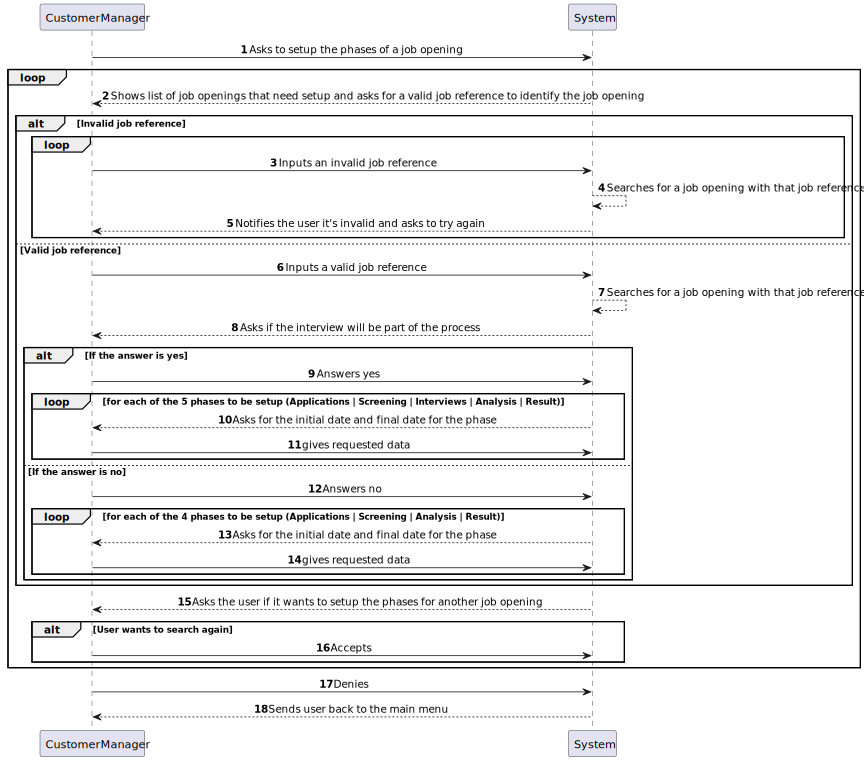

# US 1007

## 1. Context

This is the first time this US is being worked on.

## 2. Requirements

**US 1007:** As Customer Manager, I want to setup the phases of the process for a job opening.

### Acceptance Criteria:

- **1007.1.** To identify the job openings, the Customer Manager must use the job reference of the job opening it wants to setup the phases of.

- **1007.2.** The system must let the user know if the reference provided does not match a job opening and let it try again until the user gives a valid job reference.

- **1007.3.** The system must not accept a non-existent job reference.

- **1007.4.** The system must not accept the job reference from a closed job reference.

- **1007.5.** The system must only accept a job reference that is within the business rules for a valid job reference.

### Client Clarifications:

>**(Partially Related) Question:** Regarding section 2.2.1 and the phases of the recruitment process, in order to move to the next phase, does the previous one have to close or can we move forward without having the previous one closed?
> 
>**Answer:** The short answer is that the phases must be sequential and not overlapping. When one phase closes, the next one opens. US 1007 provides for the definition of phases. US 1010 provides for the opening and closing phases of the process. The Customer Manager's decision to close a phase must assume that the process advances to the next phase automatically (regardless of the dates defined for the phases).

>**Question:** Is the recruitment process as defined or could there be changes in the future?
> 
>**Answer:** The process is what is described in section 2.2.1. At this moment the only optional phase is the interviews.

>**Question:** US1007, can the identification of the recruitment process be an automatic number or be more specific?
>
>**Answer:** The opening job has an identifier. The recruitment process for a job opening is a “tribute” to that job opening. From the outset, I do not see the need to have a “special” identifier for the recruitment process (i.e., phases of the recruitment process for this job opening).

>**(Partially Related) Question:** Does a job opening only have one customer manager?
>
>**Answer:** Yes, a customer manager in principle manages all job offers for a customer. And, consequently, there is only one customer manager for each job opening.

>**Question:** Can the recruitment process be identified by the job reference?
>
>**Answer:** US 1007 states that when the Customer Manager will define the recruitment phases for each job opening. I think there will be no need to have an explicit identifier for the recruitment process, since there is only one for each job reference and it is specific to each job reference. In technical terms, if there is a need for an ID for the recruitment process, I have nothing against it being the same as the job reference.

>**(Partially Related) Question:** Following point "2.2.1 Recruitment Process", The customer manager is responsible for setting up the process, defining the phases and indicating whether it includes the interview. We hereby request that you tell us if it is expected that the phases of the recruitment process will always be the same fixed\watertight "application; screening; interviews; analysis; result;" (interview is not mandatory), or whether the phases can be dynamic (more, less, in a different order). If there is an interview, will there only be one for a JobOpening? We await clarification, to adapt the domain model if necessary.
> 
>**Answer:** Regarding the first question, refer to question Q39, already answered. Regarding interviews, 1011 indicates that the customer manager selects the “interview model” to be used for the “job opening” interviews. Therefore, we are admitting that it will always be the same interview model for all interviews, that is, all interviews will have the same questions. In other words, it is appropriate to admit that there will only be one interview for a “job opening”.

>**(Partially Related) Question:** US1007/US1010. According to these US's and Q16, each Job Opening must have defined phases. In questions Q23, Q32 and Q45 the status of the application is mentioned. Are the Job Opening phase and application status separate concepts or do they refer to the same thing?
> 
>**Answer:** As previously mentioned, they are related but different concepts.

>**Question:** In terms of user interface, in this case for the customer manager how the recruitment process setup should be carried out?
>
>**Answer:** I don't have specific requirements for the user interface. You must use good practice principles for designing user interfaces, taking into account “The customer manager is responsible for setting up the process, defining the dates for the phases and if the process includes interviews” (section 2.2.1)

>**Question:** After defining the recruitment states for a JobOpening, will the Customer Manager be able to select the Job Requirement Specification for that same Job Opening? If yes, until what recruitment phase can the action be carried out?
>
>**Answer:** The Customer Manager defines the phases of the recruitment process, not the states. Requirements assessment is done in the Screening phase. So, I don't quite understand the question being asked.

>**Question:** Our main question would be: when is a job opening considered valid? Taking into account functionalities 1002, 1007, 1009, we had a doubt regarding job openings and their constitution. In US1002, it is supposed to register a job opening and only then, in US1009, we must select the requirements specifications for the given job opening. That being said, when registering the job opening, it would not have all the mandatory information as required. Therefore, should there be a direct link between these user stories so that, upon registration, we automatically select the requirements, thus obtaining a valid job opening? Additionally, we want to clarify whether the recruitment process is mandatory for the validity of a job opening.
> 
>**Answer:** The product owner is not an expert in the solution domain (they just have knowledge of the problem) but, regarding the first question, he suggests that perhaps user stories are not (may not be) “distinct” menu options. As for the second question (recruitment process), I think it is also more linked to the solution than the problem, so I will not suggest anything that could complicate more than clarify.

>**Question:** Taking into account US1007, the setup of the different phases of the recruitment process, we would like you to clarify whether, if an Interview phase is selected, there needs to be a direct connection with US1011, selection of an interview model, or will they be separate functionalities? In the event that they are separated, does a recruitment process become valid only after the selection of an interview model?
>
>**Answer:** I suppose my answer is similar to the previous question (Q91). I can say that we can consider that the company currently intends to always use an “automatic” interview evaluation process, so this must be defined in order to “execute/process” the interviews.

>**Question:** For a recruitment process we will have several phases. What is intended for “Setup”?
> 
>**Answer:** See Q73. The recruitment process, explained in section 2.2.1, defines a sequence of phases in which only the interview phase is indicated as optional. Setup essentially consists of defining the dates for each phase and whether or not we have the interview phase.


### Dependencies/References:

In US1007 it is asked of us to setup the phases for the recruitment process, in this case, we consider setup the following 2 tasks:

- Defining which phases the recruitment process will have (Always the same but with the optionally added 'interview' phase)

- Defining the dates for each of the phases

#### Dependency with US 1002:
> For the Customer Manager to setup the phases of a job opening it is required that a job opening exists. US 1002 creates the job openings for US 1007 to setup phases for.

#### Dependency with US 1003:
> For the Customer Manager to setup the phases of a job opening it needs to choose of a list of created job openings. US 1003 lists the job openings for US 1007 to setup phases for.

#### Dependency with US 1011:
>  For US 1011 to setup the interview model to be chosen for the job opening, the Customer Manager needs to setup the phases with US 1007 to include the interview phase.

## 3. Analysis

After a discussion with the team, this user story was envisioned to be done in the way the system sequence diagram below describes:

### System Sequence Diagram Related




## 4. Design

*In this sections, the team should present the solution design that was adopted to solve the requirement. This should
include, at least, a diagram of the realization of the functionality (e.g., sequence diagram), a class diagram (
presenting the classes that support the functionality), the identification and rational behind the applied design
patterns and the specification of the main tests used to validade the functionality.*

### 4.1. Realization

### 4.2. Class Diagram


### 4.3. Applied Patterns

### 4.4. Tests

*Include here the main tests used to validate the functionality. Focus on how they relate to the acceptance criteria.*

**Test 1:** Verifies that it is not possible to ...

**Refers to Acceptance Criteria:** G002.1

````
@Test(expected = IllegalArgumentException.class)
public void ensureXxxxYyyy() {
...
}
````

## 5. Implementation

*In this section the team should present, if necessary, some evidencies that the implementation is according to the
design. It should also describe and explain other important artifacts necessary to fully understand the implementation
like, for instance, configuration files.*

*It is also a best practice to include a listing (with a brief summary) of the major commits regarding this requirement.*

## 6. Integration/Demonstration

In this section the team should describe the efforts realized in order to integrate this functionality with the other
parts/components of the system

It is also important to explain any scripts or instructions required to execute an demonstrate this functionality

## 7. Observations

*This section should be used to include any content that does not fit any of the previous sections.*

*The team should present here, for instance, a critical prespective on the developed work including the analysis of
alternative solutioons or related works*

*The team should include in this section statements/references regarding third party works that were used in the
development this work.*