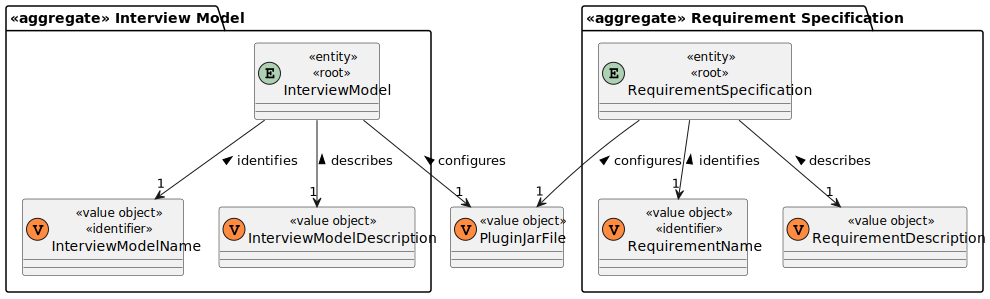

# US 1008

## 1. Context

It is the first time in this project that this US is worked on.

## 2. Requirements

**US 1008:** As Language Engineer, I want to deploy and configure a plugin (i.e., Job Requirement Specification or Interview Model) to be used by the system.

### Acceptance Criteria:

- **1008.1.** Requirement Specifications and Interview Models The support for this functionality must follow specific technical requirements, specified in LPROG. The ANTLR tool should be used (https://www.antlr.org/).

### Client Clarifications:

>**(Partially Related) Question:** Who informs the Customer manager of the type of interview/questions?
>
>**Answer:** This can be obtained by the Customer manager in dialogue with the Customer. After that, with the help of the Language engineer, support for the interview is created.

>**Question:** How does Language Engineer create the interview model and job requirements? Is it text? Or does he select questions for the interview and requirements for the job opening? And this is when you are creating an interview or a job opening or do you stop in the middle of doing that and then continue?
>
>**Answer:** The language engineer, with information provided by the customer manager (which he obtained from the customer), will develop a jar in Java corresponding to the module/plugin. For this development you will have to use grammar/language development techniques such as antlr. This code will be in a jar that the language engineer then “installs/registers” in the application (US1008, for example, associating a name to the jar in a configuration file – “5 anos experiencia java”, “req-model-5-years-java .jar”). The application with this information dynamically loads this jar. The grammar used in the jar will reflect the structure of the questions to be used in this model and their evaluation. These activities must be done before US1008 can be done. This work is done “outside” the system, simply by registering the model (when ready) in US1008. US 1009 and US1011 allow you to select models to use (from those that have been duly registered in the system).

### Dependencies/References:

#### Dependency with US 1009:
> This user story is dependent on US 1008 as it will use the Requirements Specification created by this US.

#### Dependency with US 1011:
> This user story is dependent on US 1008 as it will use the Interview Model created by this US.

## 3. Analysis

### Domain Model Excerpt Related



## 4. Design

*In this sections, the team should present the solution design that was adopted to solve the requirement. This should
include, at least, a diagram of the realization of the functionality (e.g., sequence diagram), a class diagram (
presenting the classes that support the functionality), the identification and rational behind the applied design
patterns and the specification of the main tests used to validade the functionality.*

### 4.1. Realization

### 4.2. Class Diagram


### 4.3. Applied Patterns

### 4.4. Tests

*Include here the main tests used to validate the functionality. Focus on how they relate to the acceptance criteria.*

**Test 1:** Verifies that it is not possible to ...

**Refers to Acceptance Criteria:** G002.1

````
@Test(expected = IllegalArgumentException.class)
public void ensureXxxxYyyy() {
...
}
````

## 5. Implementation

*In this section the team should present, if necessary, some evidencies that the implementation is according to the
design. It should also describe and explain other important artifacts necessary to fully understand the implementation
like, for instance, configuration files.*

*It is also a best practice to include a listing (with a brief summary) of the major commits regarding this requirement.*

## 6. Integration/Demonstration

In this section the team should describe the efforts realized in order to integrate this functionality with the other
parts/components of the system

It is also important to explain any scripts or instructions required to execute an demonstrate this functionality

## 7. Observations

*This section should be used to include any content that does not fit any of the previous sections.*

*The team should present here, for instance, a critical prespective on the developed work including the analysis of
alternative solutioons or related works*

*The team should include in this section statements/references regarding third party works that were used in the
development this work.*