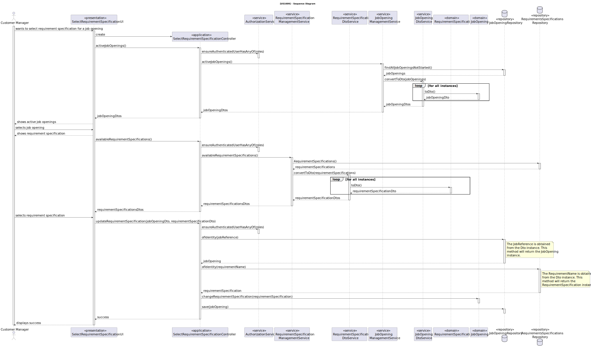
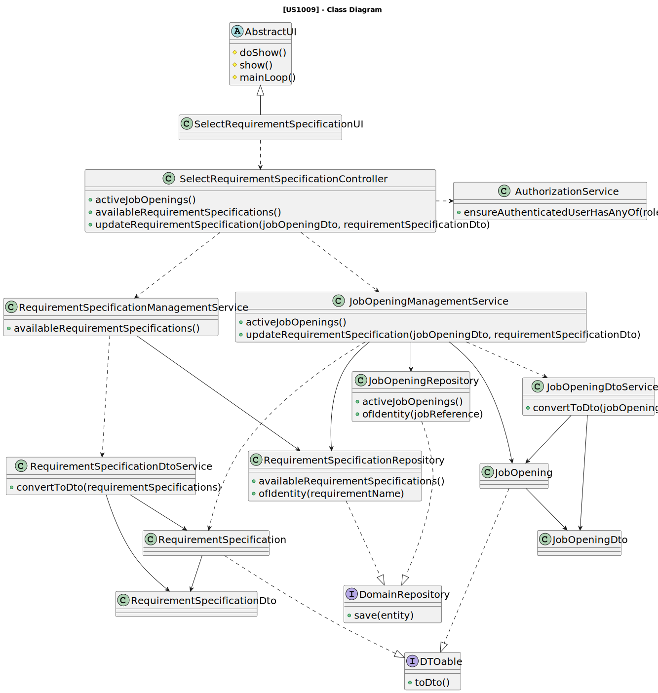

# US 1009

## 1. Context

This is the first time this user story is being requested.

## 2. Requirements

**US 1009** As {Customer Manager}, I want to select the requirement specification to be used for a job opening.

**Acceptance Criteria:**

- **1009.1.** The system must maintain consistency at all times.
- **1009.2.** Requirement specificatios should only be selected for job openings where the recruitment process has not yet started or hasn't been set up.

**Dependencies/References:**

This user story is directly dependent on [US_1008](../sb_us_1008/readme.md) because the requirements specification
plugin must already be uploaded into the system for the selection process to begin, as it requires data to make
selections from. Additionally, it's also related to [US_1002](../sb_us_1002).

The support for this functionality must follow specific technical requirements, specified in LPROG (until 17/04/2024 no
additional requirements were presented).
The ANTLR tool should be used (https://www.antlr.org/).

**Client Clarifications:**

> **Question:** When it comes to choosing the Job Requirement Specification for a Job Opening, is it permissible for a
> Customer
> Manager to opt for a Specification that has already been assigned?
>
> **Answer:** This scenario may arise, even for similar functionalities, though
> it's essential to ensure the system remains consistently maintained.

## 3. Analysis

The primary goal of this functionality is to choose a requirement specification from among those uploaded for a Job
Opening.

The Customer Manager will choose the requirement specification for the Job Opening they're registering
from [US_1002](../sb_us_1002). This approach is deemed the most reliable as every Job Opening must have a respective
Requirement Specification.

Given that the name of the requirement specification acts as its identifier, this information should be displayed along
with a description to offer clarity for each. Subsequently, the Customer Manager should select the most appropriate
requirement specification based on the provided information by the customer.

**Domain Model:**


## 4. Design

### 4.1. Realization



### 4.2. Class Diagram



### 4.3. Applied Patterns

* **DTO**
* **Repository**
* **Service**

> **Repository Pattern**
> * JobOpeningRepository
> * RequirementSpecificationRepository
>
> **Justifications**
>
> The repositories were employed to retrieve the job openings and requirement specifications persisted.

> **DTO**
> * JobOpeningDto
> * RequirementSpecificationDto
>
> We opted for DTOs due to the significant amount of domain information required for this functionality. Recognizing the
> benefits of encapsulation and layer decoupling offered by DTOs, we concluded that applying this pattern was advantageous
> in this context.

> **Service Pattern**
> * JobOpeningManagementService
> * JobOpeningDtoService
> * RequirementSpecificationManagementService
> * RequirementSpecificationDtoService
>
> **Justifications**
>
> The services were used to gather job openings and their specifications to display them to the user, essentially
> listing them. Recognizing the potential for this functionality to be used in various use cases, we opted to
> develop a service with the primary responsibility of: obtaining the persisted instances using their repository and using
> the DtoService to transform these instances into DTOs.

### 4.4. Tests

#### JobOpeningTests

**Test 1:** Verifies that it is not possible to select a requirement specification for a job opening that is already in the recruitment process.

**Refers to Acceptance Criteria:** 1009.2

````
@Test
public void ensureSelectReqSpecificationBeforeRecruitmentProccess() {
...
}
````

## 5. Implementation

*In this section the team should present, if necessary, some evidencies that the implementation is according to the
design. It should also describe and explain other important artifacts necessary to fully understand the implementation
like, for instance, configuration files.*

*It is also a best practice to include a listing (with a brief summary) of the major commits regarding this
requirement.*

## 6. Integration/Demonstration

In this section the team should describe the efforts realized in order to integrate this functionality with the other
parts/components of the system

It is also important to explain any scripts or instructions required to execute an demonstrate this functionality

## 7. Observations

*This section should be used to include any content that does not fit any of the previous sections.*

*The team should present here, for instance, a critical prespective on the developed work including the analysis of
alternative solutioons or related works*

*The team should include in this section statements/references regarding third party works that were used in the
development this work.*