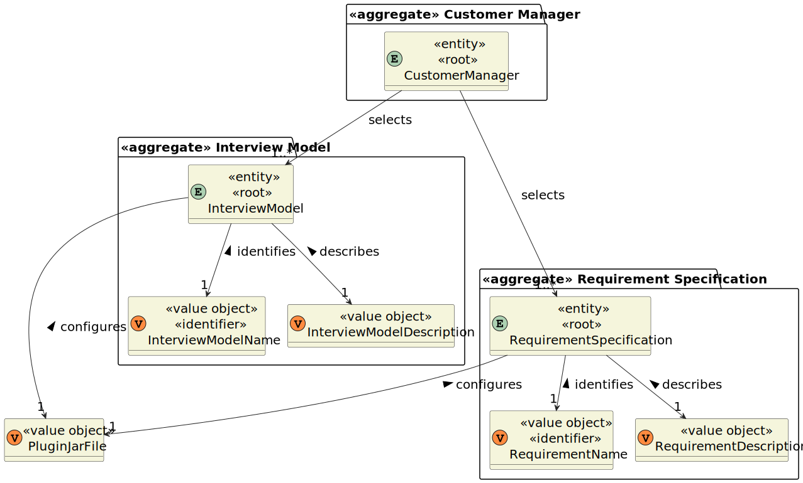

# US 1009

## 1. Context

This is the first time this user story is being requested.

## 2. Requirements

**US 1009** As {Customer Manager}, I want to select the requirement specification to be used for a job opening.

**Acceptance Criteria:**

- 1009.1. The system must maintain consistency at all times.

**Dependencies/References:**

This user story is directly dependent on [US_1008](../sb_us_1008/readme.md) because the requirements specification
plugin must already be uploaded into the system for the selection process to begin, as it requires data to make
selections from.

The support for this functionality must follow specific technical requirements, specified in LPROG (until 17/04/2024 no
additional requirements were presented).
The ANTLR tool should be used (https://www.antlr.org/).

**Client Clarifications:**

> **Question:** When it comes to choosing the Job Requirement Specification for a Job Opening, is it permissible for a
> Customer
> Manager to opt for a Specification that has already been assigned?
>
> **Answer:** This scenario may arise, even for similar functionalities, though
> it's essential to ensure the system remains consistently maintained.

## 3. Analysis

The primary goal of this functionality is to choose a requirement specification from among those uploaded for a Job
Opening.

Concerning the Job Opening, clarification is required regarding the client's preferred approach. Currently, our
understanding is that upon request, the Customer Manager will input the Job Reference of the Job Opening to proceed with
the selection of the requirement specification.

Given that the name of the requirement specification acts as its identifier, this information should be displayed along
with a description to offer clarity for each.

Subsequently, the Customer Manager should select the most appropriate requirement specification based on the provided
information.

**Domain Model:**



## 4. Design

*In this sections, the team should present the solution design that was adopted to solve the requirement. This should
include, at least, a diagram of the realization of the functionality (e.g., sequence diagram), a class diagram (
presenting the classes that support the functionality), the identification and rational behind the applied design
patterns and the specification of the main tests used to validade the functionality.*

### 4.1. Realization

### 4.2. Class Diagram


### 4.3. Applied Patterns

### 4.4. Tests

*Include here the main tests used to validate the functionality. Focus on how they relate to the acceptance criteria.*

**Test 1:** Verifies that it is not possible to ...

**Refers to Acceptance Criteria:** G002.1

````
@Test(expected = IllegalArgumentException.class)
public void ensureXxxxYyyy() {
...
}
````

## 5. Implementation

*In this section the team should present, if necessary, some evidencies that the implementation is according to the
design. It should also describe and explain other important artifacts necessary to fully understand the implementation
like, for instance, configuration files.*

*It is also a best practice to include a listing (with a brief summary) of the major commits regarding this
requirement.*

## 6. Integration/Demonstration

In this section the team should describe the efforts realized in order to integrate this functionality with the other
parts/components of the system

It is also important to explain any scripts or instructions required to execute an demonstrate this functionality

## 7. Observations

*This section should be used to include any content that does not fit any of the previous sections.*

*The team should present here, for instance, a critical prespective on the developed work including the analysis of
alternative solutioons or related works*

*The team should include in this section statements/references regarding third party works that were used in the
development this work.*