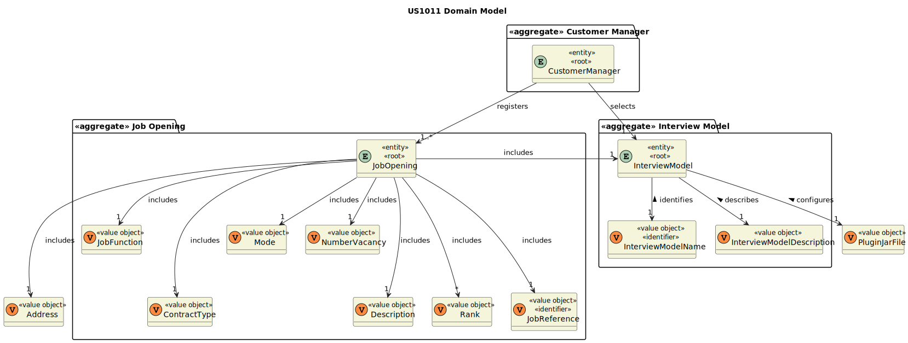
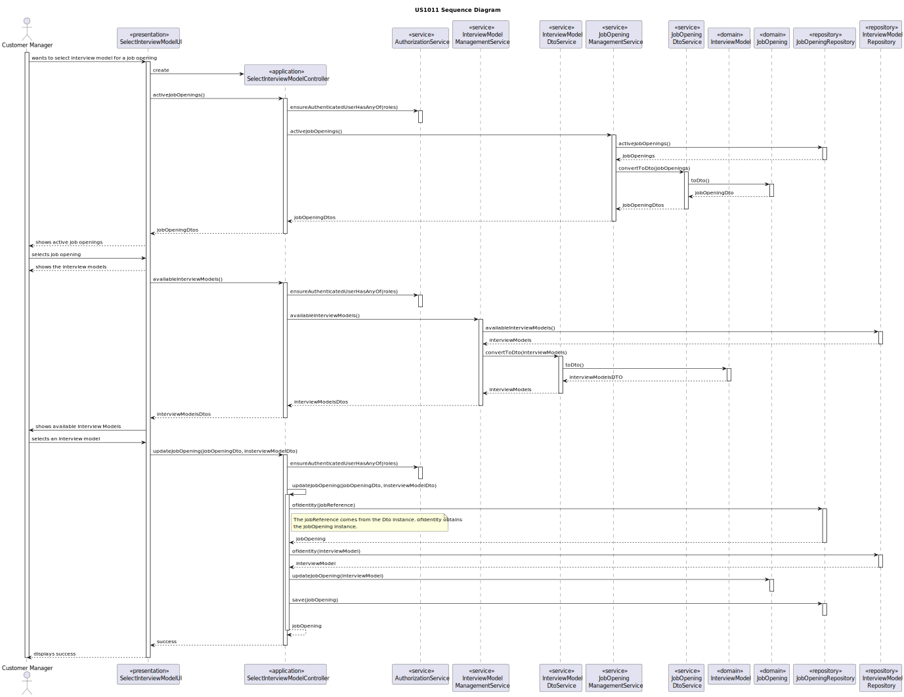
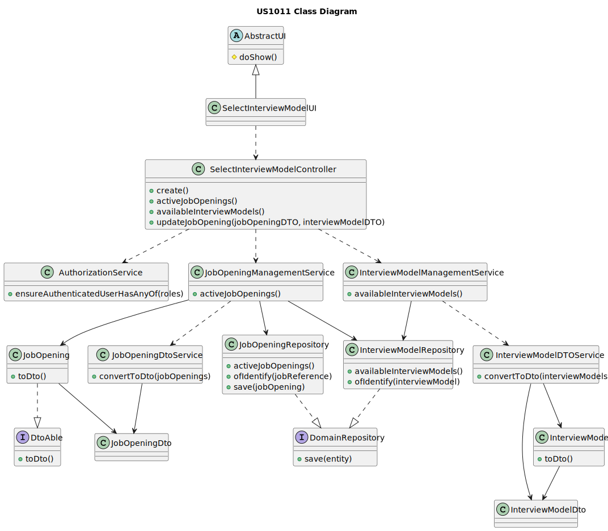

# US 1011

## 1. Context
*This is the first time this user story is being requested.*

## 2. Requirements

**US 1011:** As Customer Manager, I want to select the interview model to use for the interviews of a job opening (for their evaluation/grading)

**Acceptance Criteria:**

- **1011.1.** The system should have at least one interview model created.
- **1011.2.** Just include interview models to recruitment processes that include interviews

**Dependencies/References:**

*This functionality has a dependency on [_US 1008_](../sb_us_1008) that consists
in deploying and configure a plugin (Job Requirement Specification or Interview Model)
to be used in the system.*

## 3. Analysis
*When a job opening is created, we need to select the requirements, the recruitment process and the interview model. 
With this functionality, the Customer Manager will select the interview model to be used.*

**Domain Model:**



## 4. Design

*The main functionallity of this us is to select an interview model to a specific job opening. 
To do that, first the customer manager selects the job opening that he wants to choose the interview model, then the system shows all the interview models availables.
After that, the customer manager chooses an interview model and do the update on the job opening.*

### 4.1. Realization


### 4.2. Class Diagram



### 4.3. Applied Patterns
* **Repository**
* **DTO**
* **Service**

> **Repository Pattern**
> * JobOpeningRepository
> * InterviewModelRepository
>
> **Justifications**
>
> The repositories were employed to retrieve the job openings and inteview models persistence.

> **DTO**
> * JobOpeningDto
> * InterviewModelDto
>
> We choose DTOs because we have a big amount of domain data required for this functionality. Recognizing the
> benefits of encapsulation and layer decoupling offered by DTOs, we decided applying this pattern to our project.

> **Service Pattern**
> * JobOpeningManagementService
> * JobOpeningDtoService
> * InterviewModelManagementService
> * IntervewModelDtoService
>
> **Justifications**
>
> The services were designed to collect job openings and their details for presentation to users, essentially 
> compiling a list of available positions. Acknowledging the versatility of this feature for different purposes,
> we decided to create a service primarily responsible for retrieving saved instances through their repository
> and utilizing the DtoService.

### 4.4. Tests

*Include here the main tests used to validate the functionality. Focus on how they relate to the acceptance criteria.*

**Test 1:** Verifies that it is not possible to ...

**Refers to Acceptance Criteria:** G002.1

````
@Test(expected = IllegalArgumentException.class)
public void ensureXxxxYyyy() {
...
}
````

## 5. Implementation

*In this section the team should present, if necessary, some evidencies that the implementation is according to the
design. It should also describe and explain other important artifacts necessary to fully understand the implementation
like, for instance, configuration files.*

*It is also a best practice to include a listing (with a brief summary) of the major commits regarding this requirement.*

## 6. Integration/Demonstration

In this section the team should describe the efforts realized in order to integrate this functionality with the other
parts/components of the system

It is also important to explain any scripts or instructions required to execute an demonstrate this functionality

## 7. Observations

*This section should be used to include any content that does not fit any of the previous sections.*

*The team should present here, for instance, a critical prespective on the developed work including the analysis of
alternative solutioons or related works*

*The team should include in this section statements/references regarding third party works that were used in the
development this work.*