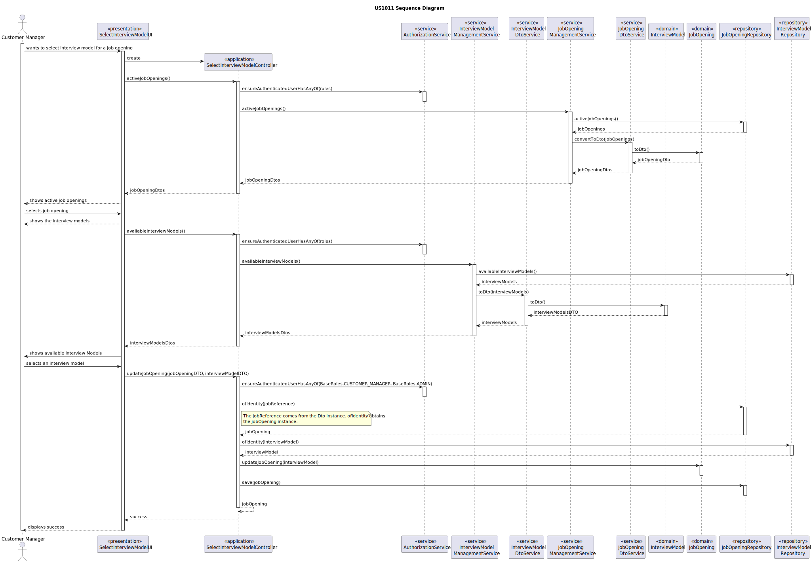

# US 1011

## 1. Context
*This is the first time this user story is being requested.*

## 2. Requirements

**US 1011:** As Customer Manager, I want to select the interview model to use for the interviews of a job opening (for their evaluation/grading)

**Acceptance Criteria:**

- **1011.1.** The system should have at least one interview model created.
- **1011.2.** Just include interview models to recruitment processes that include interviews

**Dependencies/References:**

*This functionality has a dependency on [_US 1008_](../sb_us_1008) that consists
in deploying and configure a plugin (Job Requirement Specification or Interview Model)
to be used in the system.*

## 3. Analysis
*When a job opening is created, we need to select the requirements, the recruitment process and the interview model. 
With this functionality, the Customer Manager will select the interview model to be used.*

**Domain Model:**


## 4. Design

*The main functionallity of this us is to select an interview model to a specific job opening. 
To do that, first the customer manager selects the job opening that he wants to choose the interview model, then the system shows all the interview models availables.
After that, the customer manager chooses an interview model and do the update on the job opening.*

### 4.1. Realization


### 4.2. Class Diagram


### 4.3. Applied Patterns
* **Repository**
* **DTO**
* **Service**

> **Repository Pattern**
> * JobOpeningRepository
> * InterviewModelRepository
>
> **Justifications**
>
> The repositories were employed to retrieve the job openings and inteview models persistence.

> **DTO**
> * JobOpeningDto
> * InterviewModelDto
>
> We choose DTOs because we have a big amount of domain data required for this functionality. Recognizing the
> benefits of encapsulation and layer decoupling offered by DTOs, we decided applying this pattern to our project.

> **Service Pattern**
> * JobOpeningManagementService
> * JobOpeningDtoService
> * InterviewModelManagementService
> * IntervewModelDtoService
>
> **Justifications**
>
> The services were designed to collect job openings and their details for presentation to users, essentially 
> compiling a list of available positions. Acknowledging the versatility of this feature for different purposes,
> we decided to create a service primarily responsible for retrieving saved instances through their repository
> and utilizing the DtoService.

### 4.4. Tests

*Include here the main tests used to validate the functionality. Focus on how they relate to the acceptance criteria.*

**Test 1:** Verifies if recruitment process has an interview model available

**Refers to Acceptance Criteria:** 1011.2

@Test
public void ensureRecruitmentProccessHasInterviewModel() {
...
}

## 5. Implementation

### SelectInterviewModelController

```
 public Iterable<JobOpeningDTO> activeJobOpenings() {
        authz.ensureAuthenticatedUserHasAnyOf(BaseRoles.CUSTOMER_MANAGER, BaseRoles.ADMIN);

        return jobOpeningManagementService.acticeJobOpenings();
    }

    public Iterable<InterviewModelDTO> availableInterviewModels() {
        authz.ensureAuthenticatedUserHasAnyOf(BaseRoles.CUSTOMER_MANAGER, BaseRoles.ADMIN);

        return interviewModelManagementService.availableInterviewModels();
    }

    public boolean updateJobOpening(JobOpeningDTO jobOpeningDTO, InterviewModelDTO interviewModelDTO) {
        authz.ensureAuthenticatedUserHasAnyOf(BaseRoles.CUSTOMER_MANAGER, BaseRoles.ADMIN);
        Optional<JobOpening> jo = jobOpeningRepository.ofIdentity(new JobReference(jobOpeningDTO.getJobReference()));

        if (jo.isPresent()) {

            Optional<InterviewModel> im = interviewModelRepository.ofIdentity(new InterviewModelName(interviewModelDTO.filename()));

            if (im.isPresent()) {
                jo.get().updateJobOpening(im.get());
                jobOpeningRepository.save(jo.get());
                return true;
            }
        }
        return false;
    }
```
### InterviewModelManagementService

```
 public Iterable<InterviewModelDTO> availableInterviewModels() {
        Iterable<InterviewModel> interviewModels = repository.findAll();

        return dtoService.toDto(interviewModels);
    }
```
### InterviewModelDtoService

```
  public Iterable<InterviewModelDTO> toDto(Iterable<InterviewModel> interviewModels) {
        Preconditions.noneNull(interviewModels);

        List<InterviewModelDTO> interviewModelDTOS = new ArrayList<>();

        for (InterviewModel im : interviewModels) {

            interviewModelDTOS.add(im.toDto());
        }

        return interviewModelDTOS;
    }
```
## 6. Integration/Demonstration

To execute this fucntionality it is necessary to run the script named `run-backoffice-app` and log in with Customer
Manager permissions. After it, must select the menu `Job Opening` followed by `Select an Interview Model`.

