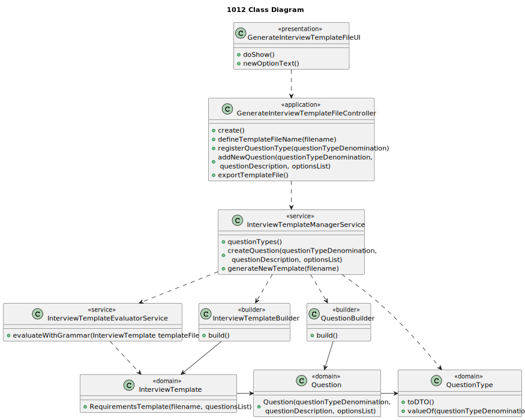

# US 1012

## 1. Context

It is the first time this task was assigned.

## 2. Requirements

**US 1012:** As Customer Manager, I want to generate and export a template text file to help collect the candidate 
answers during thew interviews.


**Acceptance Criteria:**

- **1012.1.** The file should have the questions to be asked in the interview and the possible answers for each question.

- **1012.2.** The exported file should be in .txt format.

- **1012.3.** It is necessary the use of ANTLR.


**Dependencies/References:**

This functionality has a dependency on [_US G007_](../us_g007) that pertains to the authentication and authorization for
all users and functionalities.
In addition, this functionality has a dependency on [_US G003_](../us_g003) that consists in initial configuration of 
the project structure, where was made the setup for the ANTLR.

_Reference 1012.1:_ Requirement Specifications and Interview Models The support for this functionality must follow 
specific technical requirements, specified in LPROG. The ANTLR tool should be used (https://www.antlr.org/).


**Client Clarifications:**

> **Question:** Is it possible to clarify whether the questions to be asked for the Interview Models and the Requirement
> Specifications are the ones provided in the documentation example or if there is any group of questions that you would 
> like us to use?
> 
> 
> **Answer:** The specification document provides, as mentioned, examples. They are just indicative examples. You can use
> the examples as test cases and as a start point to define others. However, the solution should support more than just
> the examples provided in the document. In any of the plugins, the type of questions that should be supported is what is
> presented on the page 8 of the document. As the product owner, I would like a functional demonstration of the system
> to include at least 2 plugins of each type, so that we can demonstrate, at least minimally, support for more than one 
> plugin used (of each type) simultaneously.


## 3. Analysis

The objective of this user story is to create a template file, that will be used as a model for the job interviews done 
in the future. 

To be able to reach that objective, the file should contain the questions and examples of answers for
them.

There are some type of questions that should be supported, such as:
* True/False
* Short Text Answer
* Choice, with Single-Answer
* Choice, with Multiple-Answer
* Integer Number
* Decimal Number
* Date
* Time
* Numeric Scale

For each question chosen, the Operator will define the possible answers, to be used as comparison with the answers
given by the candidates.


### 3.1 System Sequence Diagram


### 3.2 Domain Model Related


## 4. Design
To address this functionality, we are going to adopt a four-layered approach based on DDD (Domain-Driven Design)
architecture: Presentation, Application, Domain and Persistence.

The main goal of this functionality is for generate a interview model template and to generate is needed a file name,
the questions and the correspondent answers.

The question types are defined in the documentation, but also can be added more if wanted.

To be able to promote encapsulation between layers, it will be used DTOs.

### 4.1. Realization

**US1012 Sequence diagram**


### 4.2. Class Diagram



### 4.3. Applied Patterns

This topic presents the classes with the patterns applied to them along with justifications.

>**Builder Pattern**
> * InterviewTemplateBuilder
> * QuestionBuilder
>
> **Justifications**
>
>  The template structure can have multiple formats, so it is necessary a builder
>
>  A builder will be used to do the necessary work in creating the questions.


>**Service Pattern**
> * InterviewTemplateEvaluatorService
> * InterviewTemplateManagerService
>
> **Justifications**
>
>  The evaluator service is necessary because it has a set of responsibilities that don't belong to any other class.
>  It will check if the template generated by the system is well formatted, according to a certain grammar defined.
> 
>  The manager service will manage a set of responsibilities that don't belong to any class.
>  It will manage the creation of the interview template file.


### 4.4. Tests


**Test 1:** Verifies that the file is not empty

**Refers to Acceptance Criteria:** 1012.1

````
@Test
public void ensureFileNotEmpty() {
...
}
````

**Test 2:** Verifies file format

**Refers to Acceptance Criteria:** 1012.2

````
@Test
public void ensureFileFormat() {
...
}
````

**Test 3:** Verifies grammar is valid.

**Refers to Acceptance Criteria:** 1012.3

````
@Test
public void ensureCorrectFormatIsValid() {
...
}
````

**Test 4:** Verifies grammar is invalid.

**Refers to Acceptance Criteria:** 1012.3

````
@Test
public void ensureIncorrectFormatIsInvalid() {
...
}
````


## 5. Implementation

*In this section the team should present, if necessary, some evidencies that the implementation is according to the
design. It should also describe and explain other important artifacts necessary to fully understand the implementation
like, for instance, configuration files.*

*It is also a best practice to include a listing (with a brief summary) of the major commits regarding this requirement.*

## 6. Integration/Demonstration

In this section the team should describe the efforts realized in order to integrate this functionality with the other
parts/components of the system

It is also important to explain any scripts or instructions required to execute an demonstrate this functionality

## 7. Observations

*This section should be used to include any content that does not fit any of the previous sections.*

*The team should present here, for instance, a critical prespective on the developed work including the analysis of
alternative solutioons or related works*

*The team should include in this section statements/references regarding third party works that were used in the
development this work.*