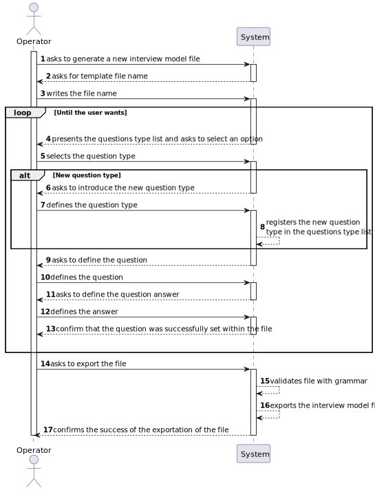
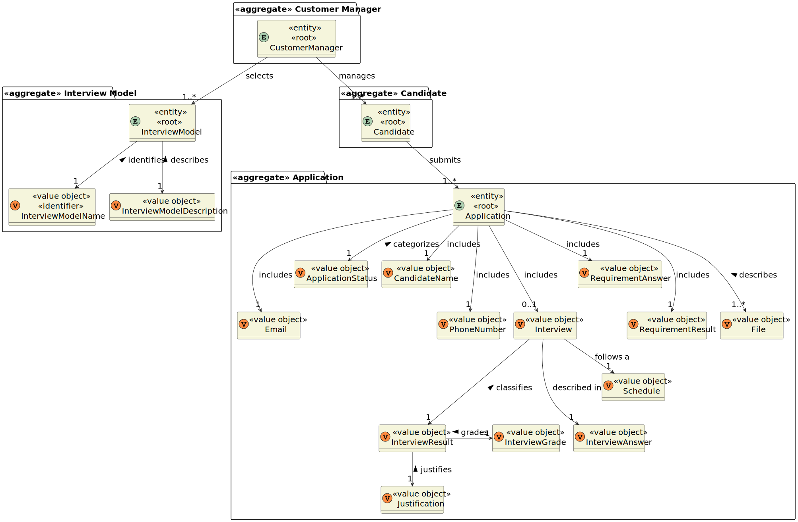

# US 1012

## 1. Context

It is the first time this task was assigned.

## 2. Requirements

**US 1012:** As Customer Manager, I want to generate and export a template text file to help collect the candidate 
answers during thew interviews.


**Acceptance Criteria:**

- **1012.1.** The file should have the questions to be asked in the interview and the possible answers for each question.

- **1012.2.** The exported file should be in .txt format.

- **1012.3.** It is necessary the use of ANTLR.


**Dependencies/References:**

This functionality has a dependency on [_US G007_](../us_g007) that pertains to the authentication and authorization for
all users and functionalities.
In addition, this functionality has a dependency on [_US G003_](../us_g003) that consists in initial configuration of 
the project structure, where was made the setup for the ANTLR.

_Reference 1012.1:_ Requirement Specifications and Interview Models The support for this functionality must follow 
specific technical requirements, specified in LPROG. The ANTLR tool should be used (https://www.antlr.org/).


## 3. Analysis

The objective of this user story is to create a template file, that will be used as a model for the job interviews done 
in the future. 

To be able to reach that objective, the file should contain the questions and examples of answers for
them.

There are some type of questions that should be supported, such as:
* True/False
* Short Text Answer
* Choice, with Single-Answer
* Choice, with Multiple-Answer
* Integer Number
* Decimal Number
* Date
* Time
* Numeric Scale

For each question chosen, the Operator will define the possible answers, to be used as comparison with the answers
given by the candidates.


### 3.1 System Sequence Diagram



### 3.2 Domain Model Related



## 4. Design

*In this sections, the team should present the solution design that was adopted to solve the requirement. This should
include, at least, a diagram of the realization of the functionality (e.g., sequence diagram), a class diagram (
presenting the classes that support the functionality), the identification and rational behind the applied design
patterns and the specification of the main tests used to validade the functionality.*

### 4.1. Realization

### 4.2. Class Diagram


### 4.3. Applied Patterns

### 4.4. Tests

*Include here the main tests used to validate the functionality. Focus on how they relate to the acceptance criteria.*

**Test 1:** Verifies that it is not possible to ...

**Refers to Acceptance Criteria:** G002.1

````
@Test(expected = IllegalArgumentException.class)
public void ensureXxxxYyyy() {
...
}
````

## 5. Implementation

*In this section the team should present, if necessary, some evidencies that the implementation is according to the
design. It should also describe and explain other important artifacts necessary to fully understand the implementation
like, for instance, configuration files.*

*It is also a best practice to include a listing (with a brief summary) of the major commits regarding this requirement.*

## 6. Integration/Demonstration

In this section the team should describe the efforts realized in order to integrate this functionality with the other
parts/components of the system

It is also important to explain any scripts or instructions required to execute an demonstrate this functionality

## 7. Observations

*This section should be used to include any content that does not fit any of the previous sections.*

*The team should present here, for instance, a critical prespective on the developed work including the analysis of
alternative solutioons or related works*

*The team should include in this section statements/references regarding third party works that were used in the
development this work.*