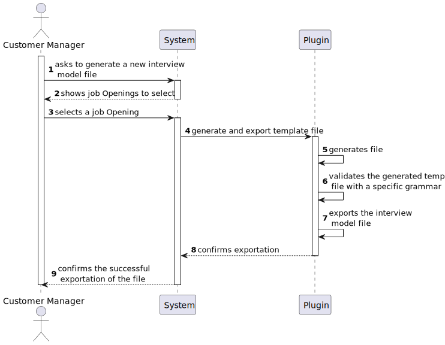
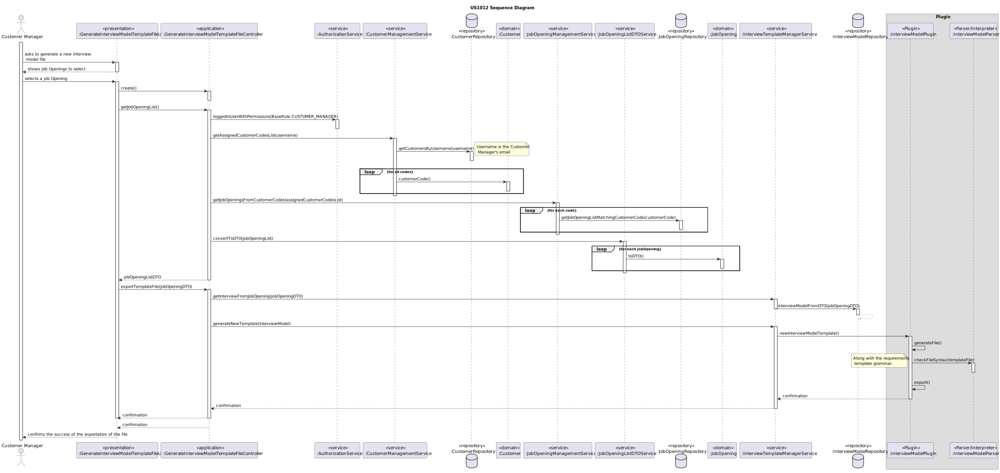
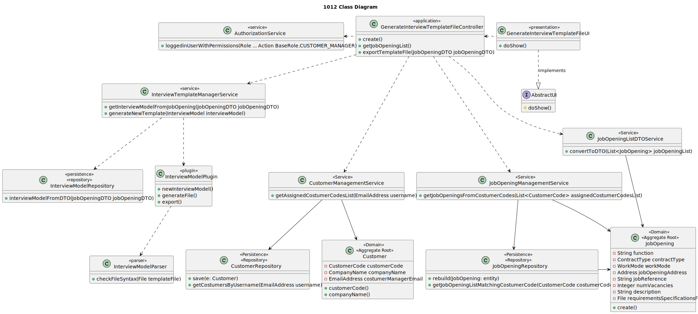

# US 1012

## 1. Context

It is the first time this task was assigned.

## 2. Requirements

**US 1012:** As Customer Manager, I want to generate and export a template text file to help collect the candidate 
answers during thew interviews.


**Acceptance Criteria:**

- **1012.1.** The file should have the questions to be asked in the interview and the possible answers for each question.

- **1012.2.** The exported file should be in .txt format.

- **1012.3.** It is necessary the use of ANTLR.


**Dependencies/References:**

This functionality has a dependency on [_US G007_](../us_g007) that pertains to the authentication and authorization for
all users and functionalities.
In addition, this functionality has a dependency on [_US G003_](../us_g003) that consists in initial configuration of 
the project structure, where was made the setup for the ANTLR.

_Reference 1012.1:_ Requirement Specifications and Interview Models The support for this functionality must follow 
specific technical requirements, specified in LPROG. The ANTLR tool should be used (https://www.antlr.org/).


**Client Clarifications:**

> **Question:** Is it possible to clarify whether the questions to be asked for the Interview Models and the Requirement
> Specifications are the ones provided in the documentation example or if there is any group of questions that you would 
> like us to use?
> 
> 
> **Answer:** The specification document provides, as mentioned, examples. They are just indicative examples. You can use
> the examples as test cases and as a start point to define others. However, the solution should support more than just
> the examples provided in the document. In any of the plugins, the type of questions that should be supported is what is
> presented on the page 8 of the document. As the product owner, I would like a functional demonstration of the system
> to include at least 2 plugins of each type, so that we can demonstrate, at least minimally, support for more than one 
> plugin used (of each type) simultaneously.


## 3. Analysis

The objective of this user story is to create a template file, that will be used as a model for the job interviews done 
in the future. 

To be able to reach that objective, the file should contain the questions and examples of answers for
them.

There are some type of questions that should be supported, such as:
* True/False
* Short Text Answer
* Choice, with Single-Answer
* Choice, with Multiple-Answer
* Integer Number
* Decimal Number
* Date
* Time
* Numeric Scale

For each question chosen, the Operator will define the possible answers, to be used as comparison with the answers
given by the candidates.


### 3.1 System Sequence Diagram



### 3.2 Domain Model Related


### 3.3 Grammar

```
grammar InterviewTemplate;

//Parser rules
start: template;

//Costitution of the template
template: interview+;

//Costitution of a interview
interview : INTERVIEW_NUMBER NEWLINE question+;

//Types of questions
question: true_false_question
| short_answer_question
| single_choice_question
| multiple_choice_question
| integer_question
| decimal_question
| date_question
| time_question
| numeric_scale_question
;


//Questions Format
true_false_question: QUESTION_TYPE SPACE TRUE_FALSE NEWLINE DESCRIPTION NEWLINE* solution+;
short_answer_question: QUESTION_TYPE SPACE SHORT_ANSWER NEWLINE DESCRIPTION NEWLINE* solution+;
single_choice_question: QUESTION_TYPE SPACE SINGLE_CHOICE NEWLINE DESCRIPTION NEWLINE option+ solution+;
multiple_choice_question: QUESTION_TYPE SPACE  MULTIPLE_CHOICE NEWLINE DESCRIPTION NEWLINE option+ solution+;
integer_question: QUESTION_TYPE SPACE INTEGER NEWLINE DESCRIPTION NEWLINE* solution+;
decimal_question: QUESTION_TYPE SPACE DECIMAL NEWLINE DESCRIPTION NEWLINE* solution+;
date_question: QUESTION_TYPE SPACE DATE NEWLINE DESCRIPTION SPACE DATE_FORMAT NEWLINE* solution+;
time_question: QUESTION_TYPE SPACE TIME NEWLINE DESCRIPTION SPACE TIME_FORMAT NEWLINE* solution+;
numeric_scale_question: QUESTION_TYPE SPACE NUMERIC_SCALE NEWLINE DESCRIPTION SPACE SCALE_FORMAT NEWLINE* solution+;


// Option format
option : ID_OPTION SPACE DESCRIPTION NEWLINE+;


//Solution format
solution : ID_SOLUTION SPACE SOLUTION_DESCRIPTION* NEWLINE+;


//Formatters
ID_OPTION : NUMBER')';
ID_SOLUTION : 'SOLUTION 'NUMBER ':';
INTERVIEW_NUMBER : 'QUESTION 'NUMBER;
QUESTION_TYPE : 'Type of Question:';
TRUE_FALSE_FORMAT : '"True" or "False"';
SCALE_FORMAT : '['NUMBER'-'NUMBER']';
DATE_FORMAT : 'DD/MM/YYYY';
TIME_FORMAT : 'HH:MM';


//Lexer rules
//Types of questions identifiers
TRUE_FALSE : 'TRUE/FALSE';
SHORT_ANSWER : 'SHORT ANSWER';
SINGLE_CHOICE : 'SINGLE CHOICE';
MULTIPLE_CHOICE : 'MULTIPLE CHOICE';
INTEGER : 'NUMBER';
DECIMAL : 'DECIMAL NUMBER';
DATE : 'DATE';
TIME : 'TIME';
NUMERIC_SCALE : 'NUMERIC SCALE';


//Solution
SOLUTION_DESCRIPTION : DESCRIPTION NEWLINE 'VALUE:' SPACE DECIMAL_NUMBER;


//Other identifiers
SPACE: ' ';
DESCRIPTION: '"' (~["\r\n])* '"';
NUMBER: [0-9]+;
DECIMAL_NUMBER: [1-9]*[0-9]+ '.' [0-9][0-9];
NEWLINE: '\r'?'\n';
```

## 4. Design
To address this functionality, we are going to adopt a four-layered approach based on DDD (Domain-Driven Design)
architecture: Presentation, Application, Domain and Persistence.

The main goal of this functionality is for generate a interview model template and to generate is needed a file name,
the questions and the correspondent answers.

The question types are defined in the documentation, but also can be added more if wanted.

To be able to promote encapsulation between layers, it will be used DTOs.

### 4.1. Realization

**US1012 Sequence diagram**



### 4.2. Class Diagram



### 4.3. Applied Patterns

This topic presents the classes with the patterns applied to them along with justifications.


>**Service Pattern**
> * InterviewTemplateManagerService
> * JobOpeningManagementService
>
> **Justifications**
> 
>  The manager service will manage a set of responsibilities that don't belong to any class.
>  It will manage the creation of the interview template file.
>
>   JobOpeningManagementService is used in more than one functionality, and its in charge of managing request regarding
>   jobOpenings.
>

>**Repository Pattern**
> * InterviewModelRepository
> * JobOpeningRepository
>
> **Justifications**
>
> Many plugins can exist, so they must be stored and persisted in a repository. It is from here that the plugins available
> to generate an interview model template file are.
>
> The JobOpeningRepository has stored all the jobOpening instances created in all sessions in its database, it's where
> the instances can be rebuilt.


### 4.4. Tests


**Test 1:** Verifies that the file is not empty

**Refers to Acceptance Criteria:** 1012.1

````
@Test
public void ensureFileNotEmpty() {
...
}
````

**Test 2:** Verifies file format

**Refers to Acceptance Criteria:** 1012.2

````
@Test
public void ensureFileFormat() {
...
}
````

**Test 3:** Verifies grammar is valid.

**Refers to Acceptance Criteria:** 1012.3

````
@Test
public void ensureCorrectFormatIsValid() {
...
}
````

**Test 4:** Verifies grammar is invalid.

**Refers to Acceptance Criteria:** 1012.3

````
@Test
public void ensureIncorrectFormatIsInvalid() {
...
}
````


## 5. Implementation


### GenerateInterviewModelTemplateFileController

````
public List<JobOpeningDTO> getJobOpeningList() {
        authz.ensureAuthenticatedUserHasAnyOf(BaseRoles.CUSTOMER_MANAGER);
        List<JobOpening> jobOpenings = new ArrayList<>();
        for (JobOpening job : jobOpeningManagementService.getUNFINISHEDJobOpenings()){
            jobOpenings.add(job);
        }
        return jobOpeningListDTOService.convertToDTO(jobOpenings);
    }
    
````
````
 public boolean exportTemplateFile(JobOpeningDTO jobOpeningDTO, String directoryPath) {
        return interviewTemplateManagerService.generateNewTemplate(interviewTemplateManagerService.getInterviewFromJobOpening(jobOpeningDTO), directoryPath);
    }
````


### JobOpeningManagementService

````
public Iterable<JobOpening> getUNFINISHEDJobOpenings(){
        return jobOpeningRepository.getUNFINISHEDJobOpeningList();
    }
````

### JobOpeningListDTOService

````
    public List<JobOpeningDTO> convertToDTO(List<JobOpening> listToDisplay){
        Preconditions.noneNull(listToDisplay);
        Preconditions.nonEmpty(listToDisplay);

        List<JobOpeningDTO> dtoList = new ArrayList<>();
        for (JobOpening jobOpening : listToDisplay){
            dtoList.add(jobOpening.toDTO());
        }
        return dtoList;
    }
````

### InterviewTemplateManagerService

````
public boolean generateNewTemplate(InterviewModel interviewModel, String outputDirectory) {
        try {
            String[] command = {"java", "-jar", interviewModel.pluginJarFile().pluginName(), "-template", (outputDirectory + "\\")};

            ProcessBuilder processBuilder = new ProcessBuilder(command);
            Process process = processBuilder.start();

            int exitCode = process.waitFor();
            System.out.println("Template command executed. Process exited with code: " + exitCode);
            if (exitCode == 0){
                return true;
            }
        } catch (IOException | InterruptedException e) {
            e.printStackTrace();
        }
        return false;
    }
````


## 6. Integration/Demonstration

To activate this feature, you'll need to run the script named `run-backoffice-app` and log in with Customer Manager
permissions. Then, navigate to the "Plugins" menu and select option 1 - `Generate and export Interview Model Template` - to access this
feature.


