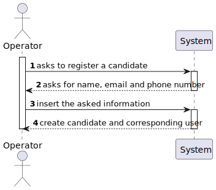

# US 2000c

## 1. Context

*This is the first time this user story is being requested.*

## 2. Requirements

**US 2000a:** As Operator, I want to register a candidate and create a corresponding user.

**Acceptance Criteria:**

- 2000a.1. The system should generate a unique password each user

- 2000a.2. The Operator should input the information manually

**Client Clarifications**

> **Question:** Regarding the US2000a requirement which states "As an Operator, I want to register a candidate and create a corresponding user," I would like to know how a candidate will be registered in the system, i.e., understand the processes for registering a candidate. Since the candidate has their name, email, and phone number, how should their username be formatted to avoid conflicts with other candidates' names? Additionally, how should the candidate be notified of their username and password?
>
> **Answer:** There is no need for a user name. Regarding the password, I think the system can generate a unique password. You may assume the candidate will be informed of his/her password by means that are outside of the scope of what is to be developed for this version of the system.

> **Question:** Regarding the registration of candidates, should the data be entered manually or imported from the file with the candidate’s data?
> 
> **Answer:** It makes sense for them to be imported from the file within US2002. Possibly give the user the possibility to make changes, if necessary.

> **Question:** The operator can register a candidate: does he put the info manually or has to be read of the file generated by the bot? This user will appear then in the backoffice...enable as default I think. Then the admin, can also register manually a candidate as the operator did it? I don't understand at all the different between a registration of the candidate made by the admin or made by the operator.
> 
>  **Answer:** US2000a is for the Operator to manually register a candidate and his/her user in the system. US2002 is for import of the applications from the data iin the files produced by the application file bot. If the candidate does not exist, it should be created. I think there is no registration of a candidate by the admin.

## 3. Analysis

*This functionality is for the Operator, so the user needs to be authenticated first to be able to register a candidate and a corresponding user.*

**System Sequence Diagram:**




## 4. Design

*In this sections, the team should present the solution design that was adopted to solve the requirement. This should
include, at least, a diagram of the realization of the functionality (e.g., sequence diagram), a class diagram (
presenting the classes that support the functionality), the identification and rational behind the applied design
patterns and the specification of the main tests used to validade the functionality.*

### 4.1. Realization

### 4.2. Class Diagram


### 4.3. Applied Patterns

### 4.4. Tests

*Include here the main tests used to validate the functionality. Focus on how they relate to the acceptance criteria.*

**Test 1:** Verifies that it is not possible to ...

**Refers to Acceptance Criteria:** G002.1

````
@Test(expected = IllegalArgumentException.class)
public void ensureXxxxYyyy() {
...
}
````

## 5. Implementation

*In this section the team should present, if necessary, some evidencies that the implementation is according to the
design. It should also describe and explain other important artifacts necessary to fully understand the implementation
like, for instance, configuration files.*

*It is also a best practice to include a listing (with a brief summary) of the major commits regarding this requirement.*

## 6. Integration/Demonstration

In this section the team should describe the efforts realized in order to integrate this functionality with the other
parts/components of the system

It is also important to explain any scripts or instructions required to execute an demonstrate this functionality

## 7. Observations

*This section should be used to include any content that does not fit any of the previous sections.*

*The team should present here, for instance, a critical prespective on the developed work including the analysis of
alternative solutioons or related works*

*The team should include in this section statements/references regarding third party works that were used in the
development this work.*