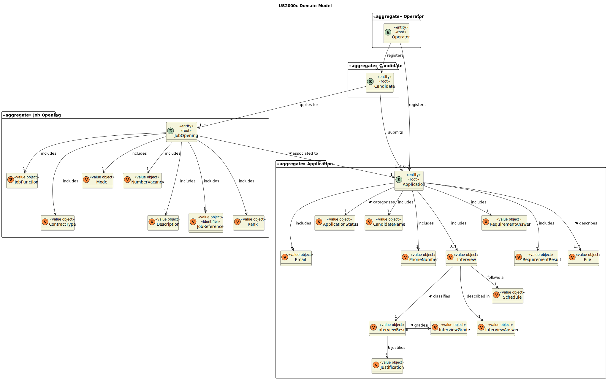

# US 2000c

## 1. Context

*This is the first time this user story is being requested.*

## 2. Requirements

**US 2000c:** As Operator, I want to list all candidates.


**Acceptance Criteria:**
- 2000c.1. The system should have at least one candidate
- 2000c.2. The candidates list should be listed in alphabetical order of name


**Client Clarifications**

> **Question:** At US 2000c we are asked to implement the function of listing all candidates. Is it necessary to sort candidates (for example in alphabetical order of name)? If so, what criteria should we follow?
>
> **Answer:** Yes the listing can be in alphabetical order of name.


**Dependencies/References:**

*This functionality has a dependency on [_US 2000a_](../sb_us_2000a) and on [_US_2002_](../sb_us_2002) that consists
in creating a candidate manually or imported from an external file.*

## 3. Analysis

*This functionality is for the Operator, so the user needs to be authenticated first to be able to see all the candidates list oredered by name.*

**System Sequence Diagram:**


## 4. Design

*This functionality is to list all the candidates in the system ordered by name.*

### 4.1. Realization


### 4.2. Class Diagram


### 4.2. Domain Model



### 4.3. Applied Patterns
>**Repository Pattern**
> * CandidateRepository
>
> **Justifications**
>
> * The CandidateRepository has stored all the Candidates instances created in all sessions in its database, it's where
>  the instances can be rebuilt.


>**Service Pattern**
> * AuthorizationService
> * CandidateManagementService
> * ListCandidatesDTOService
>
> **Justifications**
>
> * CandidateManagementService is used in more than one functionality, and its in charge of managing 
> candidates, serving as encapsulation between the controller and the CandidateRepository along with 
> the domain classes.
>
> * The AuthorizationService, pre-existing services within the Eapli.
> Framework were used here to retrieve the logged-in user with Operator roles.
> 
> * In order to enforce encapsulation amongst layers and adequate responsibility assigment, the
> ListCandidatesDTOService was created, besides being a set of instructions that is used in other functionalities.

### 4.4. Tests

*Include here the main tests used to validate the functionality. Focus on how they relate to the acceptance criteria.*

**Test 1:** Verifies that it is not possible to ...

**Refers to Acceptance Criteria:** G002.1

````
@Test(expected = IllegalArgumentException.class)
public void ensureXxxxYyyy() {
...
}
````

## 5. Implementation

*In this section the team should present, if necessary, some evidencies that the implementation is according to the
design. It should also describe and explain other important artifacts necessary to fully understand the implementation
like, for instance, configuration files.*

*It is also a best practice to include a listing (with a brief summary) of the major commits regarding this requirement.*

## 6. Integration/Demonstration

In this section the team should describe the efforts realized in order to integrate this functionality with the other
parts/components of the system

It is also important to explain any scripts or instructions required to execute an demonstrate this functionality

## 7. Observations

*This section should be used to include any content that does not fit any of the previous sections.*

*The team should present here, for instance, a critical prespective on the developed work including the analysis of
alternative solutioons or related works*

*The team should include in this section statements/references regarding third party works that were used in the
development this work.*