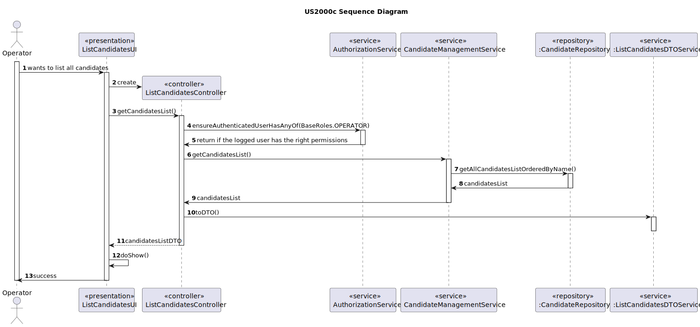

# US 2000c

## 1. Context

*This is the first time this user story is being requested.*

## 2. Requirements

**US 2000c:** As Operator, I want to list all candidates.


**Acceptance Criteria:**
- 2000c.1. The system should have at least one candidate
- 2000c.2. The candidates list should be listed in alphabetical order of name


**Client Clarifications**

> **Question:** At US 2000c we are asked to implement the function of listing all candidates. Is it necessary to sort candidates (for example in alphabetical order of name)? If so, what criteria should we follow?
>
> **Answer:** Yes the listing can be in alphabetical order of name.


**Dependencies/References:**

*This functionality has a dependency on [_US 2000a_](../sb_us_2000a) and on [_US_2002_](../sb_us_2002) that consists
in creating a candidate manually or imported from an external file.*

## 3. Analysis

*This functionality is for the Operator, so the user needs to be authenticated first to be able to see all the candidates list oredered by name.*

**System Sequence Diagram:**


## 4. Design

*This functionality is to list all the candidates in the system ordered by name.*

### 4.1. Realization



### 4.2. Class Diagram


### 4.2. Domain Model


### 4.3. Applied Patterns
>**Repository Pattern**
> * CandidateRepository
>
> **Justifications**
>
> * The CandidateRepository has stored all the Candidates instances created in all sessions in its database, it's where
>  the instances can be rebuilt.


>**Service Pattern**
> * AuthorizationService
> * CandidateManagementService
> * ListCandidatesDTOService
>
> **Justifications**
>
> * CandidateManagementService is used in more than one functionality, and its in charge of managing 
> candidates, serving as encapsulation between the controller and the CandidateRepository along with 
> the domain classes.
>
> * The AuthorizationService, pre-existing services within the Eapli.
> Framework were used here to retrieve the logged-in user with Operator roles.
> 
> * In order to enforce encapsulation amongst layers and adequate responsibility assigment, the
> ListCandidatesDTOService was created, besides being a set of instructions that is used in other functionalities.

### 4.4. Tests

*The implemented testes are the same that in US2000a*

## 5. Implementation

### ListCandidatesController

```
 public List<CandidateDTO> getCandidatesList(){
        authz.ensureAuthenticatedUserHasAnyOf(BaseRoles.OPERATOR);

        List<Candidate> candidatesList =candidateManagementService.getCandidatesList();

        return dtoService.toDTO(candidatesList);
    }
```
### CandidateManagementService

```
 public List<Candidate> getCandidatesList() {
        Iterable<Candidate> candidatesList = candidateRepository.findAll();
        //Transformar Iterable em List
        List<Candidate> candidatesListOrdered = StreamSupport.stream(candidatesList.spliterator(),false).collect(Collectors.toList());

        candidatesListOrdered.sort(Comparator.comparing(Candidate::email));
        return candidatesListOrdered;
    }
```

### ListCandidatewDTOService

```
 public List<CandidateDTO> toDTO(List<Candidate> listToDisplay){
        Preconditions.noneNull(listToDisplay);
        Preconditions.nonEmpty(listToDisplay);

        authz.ensureAuthenticatedUserHasAnyOf(BaseRoles.OPERATOR);

        List<CandidateDTO> dtoList = new ArrayList<>();
        for (Candidate candidate : listToDisplay){
            dtoList.add(candidate.toDTO());
        }
        return dtoList;
    }
```
## 6. Integration/Demonstration

To execute this functionality it is necessary to run the script named `run-backoffice-app` and log in with Operator permissions
after it, must select the menu `Operator` followed by `List All Candidates`.

