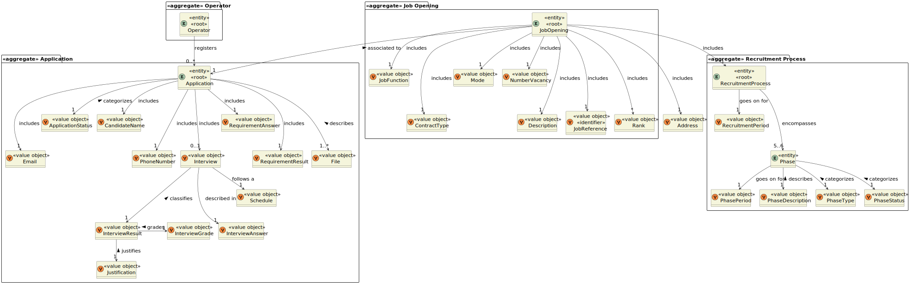
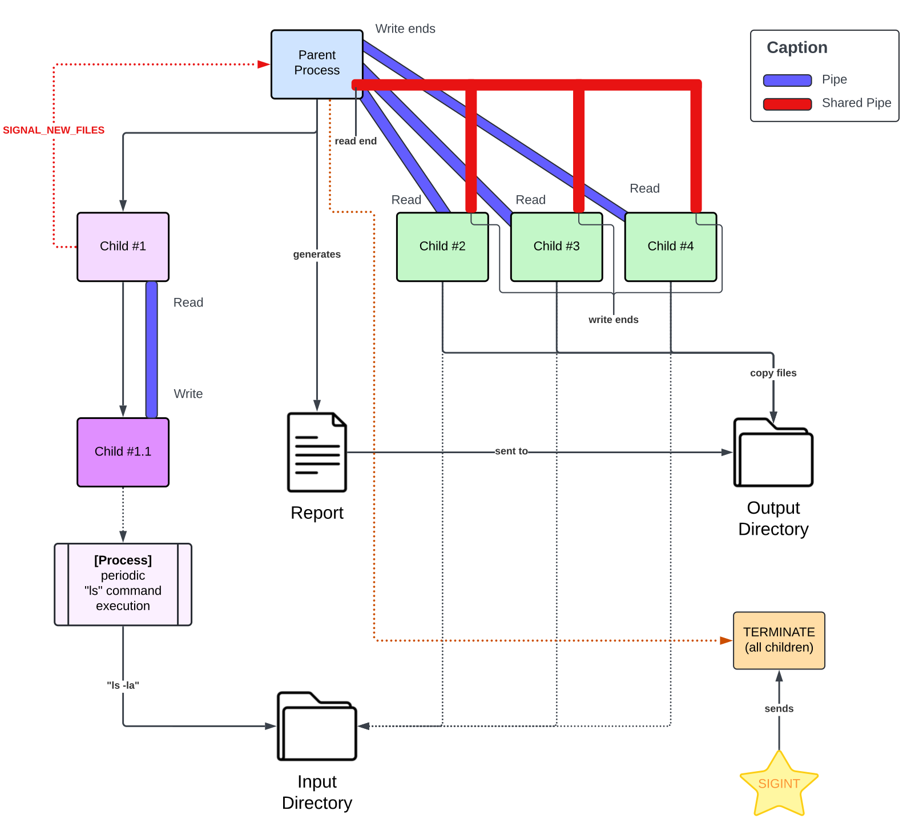
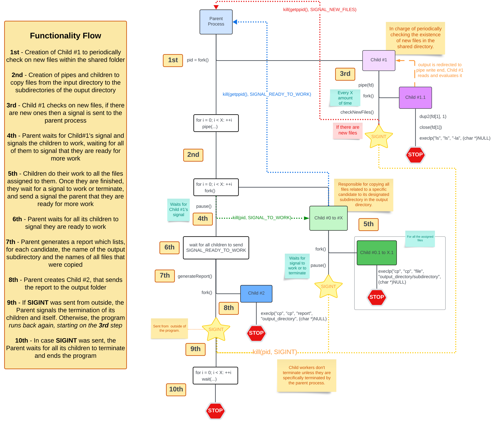

# US 2001

## 1. Context

This is the first time this user story is being requested.

## 2. Requirements

**US 2001** As {Product Owner}, I want the system to, continuously, process the files produced by the {Applications Email Bot},
so that they can be imported into the system by initiative of the {Operator}.

**Acceptance Criteria:**

- **2001.1** The programing language to be used is C.
- **2001.2** The usage of processes, signals and pipes is required.
- **2001.3** To terminate the application, the parent process must handle the **SIGINT** signal.
- **2001.4** Upon the reception of **SIGINT** by the parent process, it should terminate all children and wait for their
termination.
- **2001.5** Child workers do not terminate unless they are specifically terminated by the parent process.
- **2001.6** The number of children processes must be configurable.
- **2001.7** The time interval for periodic checking of new files must be configurable.
- **2001.8** The names of the input and output directories must be configurable.
- **2001.9** The configuration of the configurable parameters is to be achieved through reading a configuration file 
or the inputted parameters when running the application.
- **2001.10** The shared folder accessed by the Application File Bot must be organized by job reference (top folders) 
and then by application (sub folder inside the job reference folder).
- **2001.11** The text report generated must include all the processed applications (including applications for job 
references and files available).

**Dependencies/References:**

This functionality is not dependent on any other user story, however, an application must be sent by email so then the 
Applications Email Bot processes it, along with its files, and the Applications File Bot (this functionality) processes
them after a certain time interval.

_Reference **2001.1**:_ **NFR12(SCOMP)** - The base solution for the upload of files must be implemented following 
specific technical requirements such as the use of the C programming language with processes, signals and pipes. 
Specific requirements will be provided in SCOMP.

**Client Clarifications:**

> **Question:** I would like to know what is the expected behaviour when the Application File Bot is restarted. Since the
> requirements state that files should be copied and not moved, the bot must know which files may have been already copied
> during previous runs of the program. Should the bot, on startup, check if the existing files were already copied to the
> shared folder, should the files be moved instead of copied or any other solution? If you have no specific requirements
> for this case, only that the system is kept in a consistent state, I'd like to know what is the expected behaviour when
> the bot finds duplicate files. I'd also like to know if the file prefix generated by the Application Email Bot is 
> guaranteed to be numeric and unique throughout the whole software solution lifecycle. One more question, regarding how 
> the report system works. Should the bot create a report each time new files are found and moved to the shared folder, 
> meaning that there are multiple reports simultaneously (for instance, identified via date and time in the file name), 
> or should it be a single file to which new data is appended?
>
> **Answer:** As stated in your question, the system should be kept in a consistent state. Regarding duplicate files, 
> there should not be any duplicate files (why would duplicate files exist?). Regarding the report, there can be multiple
> report files, each one uniquely identified by some sort of timestamp.

> **Question:** Regarding the EmailFileBot, you previously mentioned that "All other files with the same prefix should be
> considered attachments." Is there a maximum/valid number of files allowed as attachments? Or do we not control the number
> of files submitted per application? For example: CV, Email, Candidate-data, and x optional files?
>
> **Answer:** There is no defined maximum number, but you can establish a configurable limit, for example, in a configuration
> file containing a limit on file size (in MB) or on the number of attachments.

> **Question:** What type of information will be included in the report generated by the Application File Bot? Considering
> that this report will be about multiple applications, how often should it be created?
>
> **Answer:** I am not a technical person, but I would suggest that the report should contain information sufficient for
> diagnosing issues in the import process. Configurable levels of detail for reporting would be useful, similar to what 
> is typically available for log files, with a default setting for maximum detail.

> **Question:** From the perspective of the Application File Bot, should it represent a service in the system?
>
> **Answer:** I would say yes, as it is a necessary process in the system to transform received data into a format that 
> is "recognized" by the recruitment process.

## 3. Analysis

This functionality has the main objective of process the files and then import them into the system.

Initially, we will have a parent process that will create a child process to monitor the new directory for the new files
from the Application Process. When the files are detected, a signal should be sent to the parent process.

When the parent process receives the signal, the files should be divided among a fixed number of child processes, and 
each child will copy all the files related to a candidate to its subdirectory in the output directory.

After the files for a candidate where copied, the child should inform the parent process, so it performs the other steps.
The child processes will remain until terminated by the parent process.

Once all files have been copied, the parent will generate te report file to the output directory. This report should list,
for each candidate, the name of the output subdirectory and of all the files that were copied.

To conclude, the parent process needs to handle a SIGINT signal and when received, it should terminate all children and
wait for their termination.

It's necessary to configure several aspects, including:
* names of input and output directories
* number of work children
* time interval for periodic checking new files

These configurations can be adjusted either during application runtime or by reading from a configuration file.

**Domain Model:**

## 4. Design

### 4.1. Realization

Below there is a simple diagram illustrating the flow of the functionality.

**US2001 Simple Flow Diagram**

The next diagram follows a more technical approach to the flow of the functionality, along with its description in steps
and their location within the diagram.

**US2001 Technical Flow Diagram**

### 4.2. Tests

> Test will be done after the implementation is done, to ensure the functionality proper behaviour.

## 5. Implementation

*In this section the team should present, if necessary, some evidencies that the implementation is according to the
design. It should also describe and explain other important artifacts necessary to fully understand the implementation
like, for instance, configuration files.*

*It is also a best practice to include a listing (with a brief summary) of the major commits regarding this requirement.*

## 6. Integration/Demonstration

In this section the team should describe the efforts realized in order to integrate this functionality with the other
parts/components of the system

It is also important to explain any scripts or instructions required to execute an demonstrate this functionality

## 7. Observations

*This section should be used to include any content that does not fit any of the previous sections.*

*The team should present here, for instance, a critical prespective on the developed work including the analysis of
alternative solutioons or related works*

*The team should include in this section statements/references regarding third party works that were used in the
development this work.*