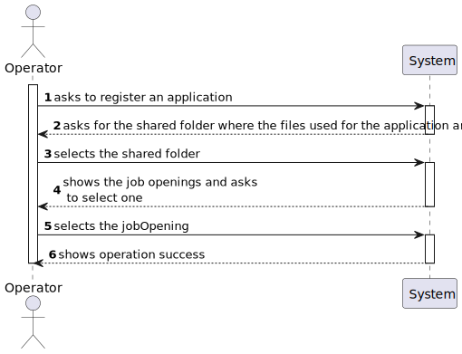

# US 2002

## 1. Context

It is the first time this task was assigned.

## 2. Requirements

**US 2002:** As Operator, I want to register an application of a candidate for a job opening and import all files 
received.


**Acceptance Criteria:**

- **2002.1.** The Operator initiates the application process.

- **2002.2.** The system should import, automatically, the data from the Application File Bot.

- **2002.3.** The files should be kept in the same shared folder.


**Dependencies/References:**

This functionality has a dependency on [_US 2001_](../sb_us_2001) since the data to be imported is going to be processed
first by the Application File Bot.

_Reference 2002.1:_ Import the data from the file that was processed by the Application File Bot in Req 2001. 
The files should be kept in the same shared folder, but the Backoffice application needs to know the references to 
the file locations.


**Client Clarifications:**

> **Question:** Is it the Operator who registers an application, or does the system do it automatically? Also, how does 
> the application verification integrates the plugin in the process?
>
> **Answer:** In US 2002, the Operator registers the application. For this purpose, the Operator initiates the process,
> but the system should import, automatically, the resulting data from the Application File Bot (References in US2002).
> The plugin mentioned enters this process through US 2003, where the Operator generates a template file with the data
> to be entered to validate and application. In US2004, the Operator, after filling in the specific data of the
> application (based in the previous template file), submits that file in the system, which will be used for the system
> to evaluate/verify the application. If the criteria are not meet, the application is rejected.


> **Question:** US2002 - UI and UX. I'd like to know what is the expected flow of executing US2002 (application 
> registration and files import, by the operator). Can you reproduce step by step which actions should the operator 
> execute? Example: 1. The system asks the operator for the candidate's email. 2. The operator enters the candidate's 
> email. 3. The system asks for the job reference. 4. The operator enters the job reference. 5. The system creates the 
> job application, if there is data for it in the shared folder.
>
> **Answer:** There are no specific requirements for the UI/UX but I think it will be more user friendly if the 
> Operator could start the process by selecting the shared folder for the application to be imported.


## 3. Analysis

### 3.1 System Sequence Diagram




## 4. Design

*In this sections, the team should present the solution design that was adopted to solve the requirement. This should
include, at least, a diagram of the realization of the functionality (e.g., sequence diagram), a class diagram (
presenting the classes that support the functionality), the identification and rational behind the applied design
patterns and the specification of the main tests used to validade the functionality.*

### 4.1. Realization

### 4.2. Class Diagram


### 4.3. Applied Patterns

### 4.4. Tests

*Include here the main tests used to validate the functionality. Focus on how they relate to the acceptance criteria.*

**Test 1:** Verifies that it is not possible to ...

**Refers to Acceptance Criteria:** G002.1

````
@Test(expected = IllegalArgumentException.class)
public void ensureXxxxYyyy() {
...
}
````

## 5. Implementation

*In this section the team should present, if necessary, some evidencies that the implementation is according to the
design. It should also describe and explain other important artifacts necessary to fully understand the implementation
like, for instance, configuration files.*

*It is also a best practice to include a listing (with a brief summary) of the major commits regarding this requirement.*

## 6. Integration/Demonstration

In this section the team should describe the efforts realized in order to integrate this functionality with the other
parts/components of the system

It is also important to explain any scripts or instructions required to execute an demonstrate this functionality

## 7. Observations

*This section should be used to include any content that does not fit any of the previous sections.*

*The team should present here, for instance, a critical prespective on the developed work including the analysis of
alternative solutioons or related works*

*The team should include in this section statements/references regarding third party works that were used in the
development this work.*