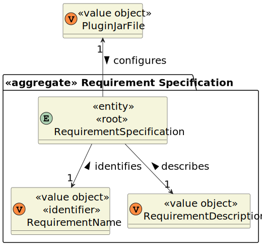

# US 2003

## 1. Context

This is the first time this user story is being requested.

## 2. Requirements

**US 2003** As {Operator}, I want to generate and export a template text file to help collect data fields for candidates
of a job opening (so the data is used to verify the requirements of the job opening).

**Acceptance Criteria:**

- **2003.1** The usage of **_ANTLR_** tool is required.

**Dependencies/References:**

This functionality has no direct dependencies, although it is a file generated from this user story that will be used in
the registration of a job opening, regarding its requirements specifications.

_Reference **2003.1**:_ **NFR09(LPROG)** - Requirement Specifications and Interview Models: The support for this functionality
must follow specific technical requirements, specified in LPROG. The _**ANTLR**_ tool should be used (https://www.antlr.org/).


**Client Clarifications:**

> **Question:** What fields/information need to be extracted from the candidate to verify the requirements of a job opening?
>
> **Answer:** It will depend on what is designed/specified in the Requirements Specification model used for that job opening.


> **Question:** Who will fill in the answers in the template file?
>
> **Answer:** The Operator will fill in the answers, and as part of US2004, they will submit the completed file in the system.


## 3. Analysis

This functionality aims generate and export a template text file with the requirements to be evaluated and the possible
answers for each requirement, regarding a job opening.

A few basic requirements and their answers can be defined:
* Number of years of experience
  * Natural number (years >= 0)
* Degree

Further requirements can be delineated as needed, such as:
* Candidate personal qualities
* Programming languages proficiency
* Specific software proficiency
* Specific knowledge
* Work methodology proficiency

To all of these, an input must be defined, either by a condition (number inputted above a certain limit), or a set of pre-defined
answers, such as in Degree = {None; Bachelor; Master; PhD}.

The Operator fills the desired answers, reflecting what the costumer desires. These answers will later, in US2004, be submitted,
so that there is a comparison to the candidates answers, and it's possible to see if they are eligible to the job opening.

Below there's a System Sequence Diagram (SSD) illustrating the expected behaviour of this functionality. After this diagram
is a partial domain model, with emphasis on US2003's concepts.

**US2003 System Sequence Diagram**


**US2003 Domain Model**



## 4. Design

*In this sections, the team should present the solution design that was adopted to solve the requirement. This should
include, at least, a diagram of the realization of the functionality (e.g., sequence diagram), a class diagram (
presenting the classes that support the functionality), the identification and rational behind the applied design
patterns and the specification of the main tests used to validade the functionality.*

### 4.1. Realization

### 4.2. Class Diagram


### 4.3. Applied Patterns

### 4.4. Tests

*Include here the main tests used to validate the functionality. Focus on how they relate to the acceptance criteria.*

**Test 1:** Verifies that it is not possible to ...

**Refers to Acceptance Criteria:** G002.1

````
@Test(expected = IllegalArgumentException.class)
public void ensureXxxxYyyy() {
...
}
````

## 5. Implementation

*In this section the team should present, if necessary, some evidencies that the implementation is according to the
design. It should also describe and explain other important artifacts necessary to fully understand the implementation
like, for instance, configuration files.*

*It is also a best practice to include a listing (with a brief summary) of the major commits regarding this requirement.*

## 6. Integration/Demonstration

In this section the team should describe the efforts realized in order to integrate this functionality with the other
parts/components of the system

It is also important to explain any scripts or instructions required to execute an demonstrate this functionality

## 7. Observations

*This section should be used to include any content that does not fit any of the previous sections.*

*The team should present here, for instance, a critical prespective on the developed work including the analysis of
alternative solutioons or related works*

*The team should include in this section statements/references regarding third party works that were used in the
development this work.*