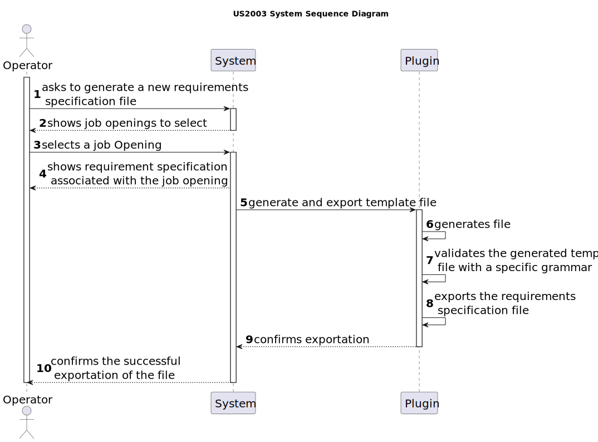

# US 2003

## 1. Context

This is the first time this user story is being requested.

## 2. Requirements

**US 2003** As {Operator}, I want to generate and export a template text file to help collect data fields for candidates
of a job opening (so the data is used to verify the requirements of the job opening).

**Acceptance Criteria:**

- **2003.1** The usage of **_ANTLR_** tool is required.
- **2003.2** The question types have established types: True/False, Short Text Answer, Choice with Single-Answer,
  Choice with Multiple-Answer, Integer Number, Decimal Number, Date, Time and Numeric Scale.
- **2003.3** A requirement template must have at least one requirement entry.

**Dependencies/References:**

This functionality has no direct dependencies, although it is a file generated from this user story that will be used in
the registration of a job opening, regarding its requirements specifications.

_Reference **2003.1**:_ **NFR09(LPROG)** - Requirement Specifications and Interview Models: The support for this functionality
must follow specific technical requirements, specified in LPROG. The _**ANTLR**_ tool should be used (https://www.antlr.org/).


**Client Clarifications:**

> **Question:** What fields/information need to be extracted from the candidate to verify the requirements of a job opening?
>
> **Answer:** It will depend on what is designed/specified in the Requirements Specification model used for that job opening.


> **Question:** Who will fill in the answers in the template file?
>
> **Answer:** The Operator will fill in the answers, and as part of US2004, they will submit the completed file in the system.


> **Question:** After the applications are filtered during the screening process, I'm unsure about who manages the results
> and oversees this phase. Could you please clarify if the responsibility for managing the screening results falls under
> the customer manager, the operators, or both?
>
> **Answer:** In US2003 and US2004, it is the Operator who downloads a template file to register the requirements,
> records the answers for the requirements in the file, and then uploads the file. Subsequently, the Customer Manager
> executes the verification process (US1015) and performs the notification of the results (US1016).


> **Question:** Can you clarify the usage of ANTLR within user story 2003? You've stated that US2003 simply generates the
> file, while in US2004 the Operator defines the answers and uploads the file. Where is this file uploaded to? Given this,
> where is the usage of ANTLR in US2003 directed to?
>
> **Answer:** Regarding the first question, it is possible to generate the template text file using ANTLR, although this
> might be challenging. This would be where the usage of ANTLR comes into play. However, unless there is a specific requirement
> from LPROG for evaluation purposes, it is acceptable to have the template file hardcoded in the plugin without the need for
> any complex generation process or function. Regarding the second question, the file is uploaded to the system. The response
> to the last question was provided earlier.


> **Question:** Could you clarify whether the questions to be used for Interview Models and Requirement Specifications are
> those shown in the documentation examples, or is there a specific set of questions you would like us to use?
>
> **Answer:** The specification document provides examples, as mentioned. These are only indicative examples. You can use
> these examples as test cases and as a starting point to define others. However, the solution is expected to support more
> than just the examples in the document. In either plugin, the types of questions to be supported are those presented on
> page 8 of the document. As the product owner, I would like a functional demonstration of the system to include at least
> 2 plugins of each type, to demonstrate minimal support for more than one plugin used simultaneously (of each type). It
> should also demonstrate the use of all types of questions presented on page 8 (updated on 2024-04-27).


## 3. Analysis

This functionality aims generate and export a template text file with the requirements to be evaluated and the possible
answers for each requirement, regarding a job opening.

Further requirements can be delineated as needed, such as:
* Number of years of experience
* Degree
* Candidate personal qualities
* Programming languages proficiency
* Specific software proficiency
* Specific knowledge
* Work methodology proficiency
* Others...

Requirements can have different natures:

* **True/False** - A question with only a true or false answer.
* **Short Text Answer** - A question with a short text answer. The limit of the answer should the specified by a regular expression.
* **Choice, with Single-Answer** - A question with a set of choices where only one can be selected
* **Choice, with Multiple-Answer** - A question with a set of choices where many can be selected
* **Integer Number** - A question which answer is an integer number
* **Decimal Number** - A question which answer is a decimal number
* **Date** - A question which answer is a date
* **Time** - A question which answer is a time
* **Numeric Scale** - A question which answer is one option in a range of integers (ex: 1-5)

Below there's a System Sequence Diagram (SSD) illustrating the expected behaviour of this functionality. After this diagram
is a partial domain model, with emphasis on US2003's concepts.

**US2003 System Sequence Diagram**




**US2003 Domain Model**


## 4. Design

The solution for this functionality is to have 4 layers, following DDD development architecture: Presentation, Application,
Domain and Persistence. A link in [references](#71-references) explains this topic in-depth.

To generate a requirements specification template that defines who is eligible for the job we need to get the plugins from
the database, show them to the user, which will select one. Upon this choice, a service will be in charge of serving as a
bridge between the system and the plugin.

To display the requirement specification plugins available, DTO's must be used to enhance encapsulation between layers.

**New Domain Layer Classes**
* RequirementsTemplateManagerService
* RequirementSpecification

**New Persistence Layer Classes**
* RequirementSpecificationRepository

**New Application Layer Classes**
* GenerateRequirementsTemplateFileController

**New Presentation Layer Classes**
* GenerateRequirementsTemplateFileUI

**Plugin Classes**
* RequirementsTemplatePlugin
* RequirementsTemplateParser

The further topics illustrate and explain this functionality usage flow, and the correlation between its components.

### 4.1. Realization

**US2003 Sequence diagram**


### 4.2. Class Diagram


### 4.3 Grammar

The following text represents the grammar that defines the format of the requirement template for front end developers.

```
grammar Requirements_Front_End_Dev;

start: (group NEWLINE)+ group NEWLINE?;

group : requirement_header NEWLINE s_choice_q START_ANSWER s_choice_a
      | requirement_header NEWLINE m_choice_q START_ANSWER m_choice_a
      | requirement_header NEWLINE whole_n_q START_ANSWER whole_n_a
      | requirement_header NEWLINE true_false_q START_ANSWER true_false_a
      | requirement_header NEWLINE scale_q START_ANSWER scale_a
      | requirement_header NEWLINE decimal_q START_ANSWER decimal_a
      | requirement_header NEWLINE short_q START_ANSWER short_a
      | requirement_header NEWLINE date_q START_ANSWER date_a
      | requirement_header NEWLINE time_q START_ANSWER time_a
      ;

requirement_header : 'REQUIREMENT #'intNumber;

// Questions for Front End Developer
s_choice_q : '[Single Choice] "Do you prefer using React or Angular for front-end development?" Answer Model: "[Choice]"'NEWLINE'1) "React"'NEWLINE'2) "Angular"'NEWLINE;
m_choice_q : '[Multiple Choice] "Which of the following are front-end technologies?" Answer Model: "[CHOICE] and [CHOICE]"'NEWLINE'1) "HTML"'NEWLINE'2) "Python"'NEWLINE'3) "CSS"'NEWLINE;
whole_n_q : '[Whole Number] "How many years have you been working with JavaScript?"'NEWLINE;
true_false_q : '[True/False] "Are you familiar with responsive web design?"'NEWLINE;
scale_q : '[Numeric Scale] "Rate your proficiency in CSS with the given scale." Answer Model: [1-5]'NEWLINE;
decimal_q : '[Decimal Number] "What is the pixel width of a standard Bootstrap container?"'NEWLINE;
short_q : '[Short Answer] "Name a popular CSS preprocessor."'NEWLINE;
date_q : '[Date] "When did you start learning web development?" [DD/MM/YYYY]'NEWLINE;
time_q : '[Time] "At what time do you usually start coding?" [HH:MM]'NEWLINE;

//Answers for the questions
s_choice_a : ACTUALANSWER NEWLINE;
m_choice_a :  m_choice NEWLINE;
whole_n_a :  intNumber NEWLINE;
scale_a :  intNumber NEWLINE;
true_false_a : BOOLEAN NEWLINE;
decimal_a : decimal NEWLINE;
short_a : short_answer NEWLINE;
date_a : date NEWLINE;
time_a : time NEWLINE;

decimal : NUM+ '.' NUM+;
short_answer : ACTUAL_ANSWER+;
date : NUM NUM'/'NUM NUM'/'NUM NUM NUM NUM;
time : NUM NUM ':' NUM NUM;
m_choice : ACTUAL_ANSWER ' and ' ACTUAL_ANSWER;
intNumber : NUM+ ;

BOOLEAN : ('True'|'False');
START_ANSWER : 'R:. ';
ACTUAL_ANSWER : [a-zA-Z]+;
NEWLINE : '\r'? '\n';
NUM : [0-9];
WS : [ \t\r]+ -> skip ;
```

Table of some tokens used with concrete lexemes in the template file grammar:

| Tokens       | Lexemes           |
|:-------------|:------------------|
| BOOLEAN      | 'True' or 'False' |
| START_ANSWER | 'R:. '            |
| NEWLINE      | '\r'? '\n'        |
| NUM          | [0-9]             |


### 4.4. Applied Patterns

This topic presents the classes with the patterns applied to them along with justifications.

>**Service Pattern**
> * RequirementsTemplateManagerService
> * JobOpeningManagementService
> * AuthorizationService
> * CustomerManagementService
> * JobOpeningListDTOService
>
> **Justifications**
>
> * RequirementsTemplateManagerService is necessary because it manages a set of operations and responsibilities that don't
    belong to any class. It's in charge of managing the process of getting the plugins available from their repository,
    overseeing the conversion of the data into DTOs and bridging the system to the chosen plugin.
> 
> * To get the customers that are assigned to the current Customer Manager in-session, we must get something to identify them.
    The AuthorizationService allows to get the username (user's email), which is essential to then filter the CustomerRepository
    to the desired customers, which will allow us to get desired job openings. This set of instructions is used in other
    functionalities too.
>
> * CustomerManagementService is used in more than one functionality, and its in charge of managing request regarding entities,
    serving as encapsulation between the controller and the CustomerRepository along with the domain classes.
>
> * JobOpeningManagementService is used in more than one functionality, and its in charge of managing request regarding
    jobOpenings, serving as encapsulation between the controller and the JobOpeningRepository along with the domain classes.
>
> * In order to enforce encapsulation amongst layers and adequate responsibility assigment, the JobOpeningListDTOService was
    created, besides being a set of instructions that is used in other functionalities.

>**Repository Pattern**
> * RequirementsSpecificationsRepository
> * CustomerRepository
> * JobOpeningRepository
>
> **Justifications**
>
> * Many plugins can exist, so they must be stored and persisted in a repository. It is from here that the plugins available
>   to generate a requirements specifications template file are.
> 
> * The JobOpeningRepository has stored all the jobOpening instances created in all sessions in its database, it's where
   the instances can be rebuilt.
> 
> * Customers have their Customer Manager email as an attribute, so by using the email we can track which customers are assigned 
    to said user and retrieve their costumer codes. This is all stored in the database represented by the repository.


### 4.5. Tests

**Test 1:** Grammar verifies correctly formatted requirement is valid.

**Refers to Acceptance Criteria:** 2003.1

````
@Test
public void ensureCorrectFormatIsValid() {
...
}
````

**Test 2:** Grammar verifies incorrect formatted requirement is invalid.

**Refers to Acceptance Criteria:** 2003.1

````
@Test
public void ensureIncorrectFormatIsInvalid() {
...
}
````

**Test 3:** Verifies that is not possible for a question to have a type that is not defined in the system

**Refers to Acceptance Criteria:** 2003.2

````
@Test
public void ensureValidQuestionType() {
...
}
````

**Test 4:** Verifies that is not possible for a template file to not have a requirement entry

**Refers to Acceptance Criteria:** 2003.1 and 2003.3

````
@Test
public void ensureTemplateHasAtLeastOneRequirement() {
...
}
````

## 5. Implementation

*In this section the team should present, if necessary, some evidencies that the implementation is according to the
design. It should also describe and explain other important artifacts necessary to fully understand the implementation
like, for instance, configuration files.*

*It is also a best practice to include a listing (with a brief summary) of the major commits regarding this requirement.*

## 6. Integration/Demonstration

In this section the team should describe the efforts realized in order to integrate this functionality with the other
parts/components of the system

It is also important to explain any scripts or instructions required to execute an demonstrate this functionality

## 7. Observations

*This section should be used to include any content that does not fit any of the previous sections.*

*The team should present here, for instance, a critical prespective on the developed work including the analysis of
alternative solutioons or related works*

*The team should include in this section statements/references regarding third party works that were used in the
development this work.*


### 7.1 References

* [DDD architecture]( https://ddd-practitioners.com/home/glossary/layered-architecture/#:~:text=In%20Domain%2DDriven%20Design%20(DDD,layer%2C%20and%20an%20infrastructure%20layer. )
* [Software Design Patterns](https://www.geeksforgeeks.org/software-design-patterns/?ref=lbp)