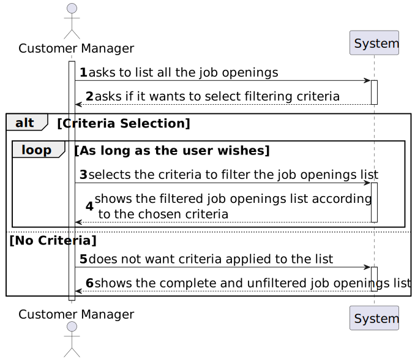
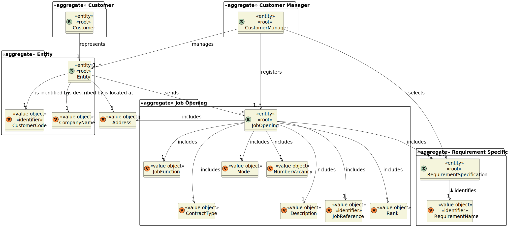
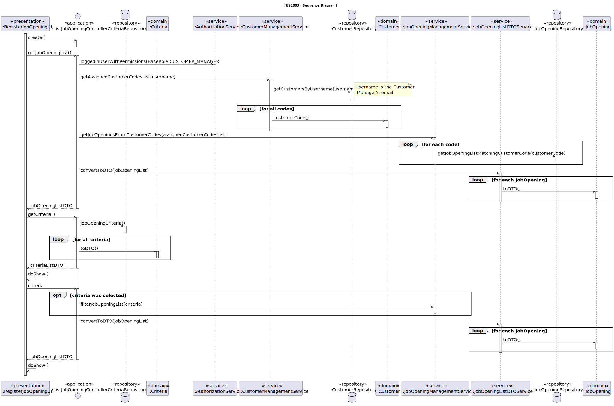
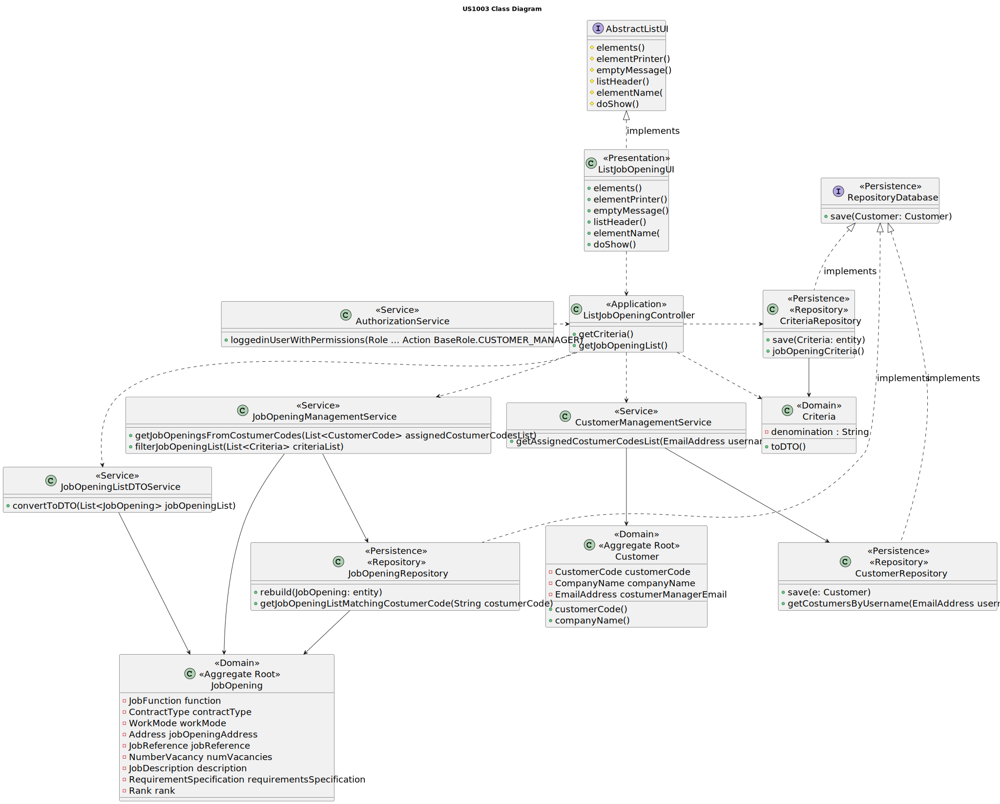

# US 1003

## 1. Context

This is the first time this user story is being requested.

## 2. Requirements

**US 1003** As {Customer Manager}, I want to list job openings.

**Acceptance Criteria:**

**1003.1** Listing by both customer code or company name must be supported.
**1003.2** The Customer Manager can only list the job openings of the customers that manages.

**Dependencies/References:**

**US1002** | This functionality is dependent on US1002, regarding the creation of job openings to list.

There are no references for this user story.

**Client Clarifications:**

> **Question:** It was mentioned that "you can filter by Customer" in this US. In this case, what form will the Customer Manager
> use to filter Job Openings by Customer (name, email,...)? And when you say "you can filter by date", do you mean a specific
> date or a time interval?
>
> **Answer:** The Customer is typically a company and has a name. The existence of a customer code has also been mentioned.
> For the Customer filter, the Customer Manager will probably use the company name (or the customer code, if applicable)
> to select the Job Openings related to that specific customer. As for filtering by date, if you are in the role of a Customer
> Manager who needs to check job openings, does it make sense to filter for a single day? In other words, would the Customer
> Manager need to know on which specific day the job opening being searched for was registered?


> **Question:** Is there any criteria to define which ones to list? Or should it list all job openings in the entire system?
>
> **Answer:** I suppose it would be useful to be able to filter by Customer and date. It also seems useful to filter
> by only active job openings or to list all job openings.


> **Question:** At what point does a job opening become active? Is it when it is created and has a set of associated requirements?
> Is it when it is linked to an ongoing recruitment process?
>
> **Answer:** The reference to "active" relates to dates. A job opening that has already completed its recruitment process
> is not considered active.


> **Question:** Regarding the listing of job openings, can a customer manager list all job openings or only those assigned
> to them? In other words, are job openings assigned to a specific customer manager, and can they only access their list
> of job openings?
>
> **Answer:** I think it makes sense to list only "their" job openings.


> **Question:** It was mentioned that a job opening becomes inactive when its recruitment process ends. However, in what
> state are job openings that have been registered but do not yet have a recruitment process associated with them?
>
> **Answer:** Regarding the state (name of the state) of job openings after being registered but not yet associated with
> a recruitment process, I am unsure how to respond. However, I can add that if they do not have a process associated with
> them, they do not have dates for the process phases, and therefore, it seems to me that they have not yet entered the 
> application phase. Therefore, no one officially knows about this job opening, and there should not be any applications
> for this opening.


## 3. Analysis

This functionality aims to list and, if desired, filter all the job openings. Below there's a list of the mentioned 
filtering criteria:

* Company Name
* Customer Code
* Time Interval
* {Active} Status

If no criteria is selected, then all the job openings, regardless of their status, will be displayed. Otherwise, only the
job openings that comply with the selected criteria will be available.

Below there's a System Sequence Diagram (SSD) illustrating the expected behaviour of this functionality. After this diagram
is a partial domain model, with emphasis on US1003's concepts.

**US1003 System Sequence Diagram**




**US1003 Domain Model**



## 4. Design


The solution for this functionality is to have 4 layers, following DDD development architecture: Presentation, Application,
Domain and Persistence. A link in [references](#71-references) explains this topic in-depth.

To list a job opening, they must be first filtered, so that the only ones the Customer Managers have access to are the ones
related to the customer that have been assigned to them. For this purpose, access to the AuthorizationService is required.

Both customers code and company name are to be criteria when filtering the list, all this data is in the Customer represented
by the Customer.

In order to enhance encapsulation between layers, the usage of DTO's is required.

**New Domain Layer Classes**
* Customer
* Criteria
* JobOpeningListDTOService
* JobOpeningManagementService
* CustomerManagementService
* AuthorizationService

**New Persistence Layer Classes**
* JobOpeningRepository
* CriteriaRepository
* CustomerRepository

**New Application Layer Classes**
* ListJobOpeningController

**New Presentation Layer Classes**
* ListJobOpeningUI

The further topics illustrate and explain this functionality usage flow, and the correlation between its components.

### 4.1. Realization

* **US1003 Sequence Diagram**



### 4.2. Class Diagram

* **US1003 Class Diagram**



### 4.3. Applied Patterns

This topic presents the classes with the patterns applied to them along with justifications.

>**Repository Pattern**
> * CriteriaRepository
> * CustomerRepository
> * JobOpeningRepository
>
> **Justifications**
>
> * The JobOpeningRepository has stored all the jobOpening instances created in all sessions in its database, it's where
>   the instances can be rebuilt.
> 
> * Due to the existence of having plenty of criterion, a repository is ideal to persist and build the different instances
>   of this class.
>
> * As per requested, the job reference that identifies the job opening should have the customer code as a base, and be
    sequential. If the previous job opening from the same customer was made in a different session, then the current session
    does not have access to its job reference, so it must be retrieved from the job openings' repository database.
>
> * Customers have their Customer Manager email as an attribute, so by using the email we can track which customers are assigned
>   to said user and retrieve their costumer codes. This is all stored in the database represented by the repository.


>**Service Pattern**
> * JobOpeningListDTOService
> * JobOpeningManagementService
> * CustomerManagementService
> * AuthorizationService
>
> **Justifications**
>
> * CustomerManagementService is used in more than one functionality, and its in charge of managing request regarding customers,
    serving as encapsulation between the controller and the CustomerRepository along with the domain classes.
>
> * JobOpeningManagementService is used in more than one functionality, and its in charge of managing request regarding
    jobOpenings, serving as encapsulation between the controller and the JobOpeningRepository along with the domain classes.
>
> * In order to enforce encapsulation amongst layers and adequate responsibility assigment, the JobOpeningListDTOService was
    created, besides being a set of instructions that is used in other functionalities.
>
> * To get the customers that are assigned to the current Customer Manager in-session, we must get something to identify them.
    The AuthorizationService allows to get the username (user's email), which is essential to then filter the CustomerRepository
    to the desired customers. This set of instructions is used in other functionalities too.


### 4.4. Tests

**Test 1:** Verifies that a criteria cannot have its denomination null

**Refers to Acceptance Criteria:** ----
````
@Test
public void ensureCriteriaDenominationNullIsInvalid() {
...
}
````

**Test 2:** Verifies that a criteria cannot have its denomination empty

**Refers to Acceptance Criteria:** ----
````
@Test
public void ensureCriteriaDenominationEmptyIsInvalid() {
...
}
````


**Test 3:** Verifies that a criteria cannot have its className null

**Refers to Acceptance Criteria:** ----
````
@Test
public void ensureCriteriaClassNameNullIsInvalid() {
...
}
````

**Test 4:** Verifies that a criteria cannot have its className empty

**Refers to Acceptance Criteria:** ----
````
@Test
public void ensureCriteriaClassNameEmptyIsInvalid() {
...
}
````

## 5. Implementation


The following code belongs to the UI of this functionality. All its methods are according to the design.

The doShow() method, declared in the AbstractListUI interface. One of the challenges was to be able to display the filtered
list, which varies according to the selected criteria, so it isn't only one permanent list, as the AbstractListUI interface
requires. To overcome this obstacle, the call to super was done, to force the program to check which scenario is the correct
one and display the adequate filtered list, instead of the default case one - all the job openings.

To list and select the customers and criteria, the SelectWidget class from **_EAPLI Framework_** was used. A printer class was
created to define the format of the jobOpening entries on the lists and print them.

````
private final ListJobOpeningsController controller = new ListJobOpeningsController();

private CriteriaDTO criteriaDTO;
private CustomerDTO customerDTO;
private DateInterval dateInterval;

@Override
public boolean show() {
    criteriaDTO = new CriteriaDTO("no criteria");
    try {
        super.show();
        String answer;
        do {
            answer = Console.readLine("Would you like to select filtering criteria? [y/n]").trim().toLowerCase();
            if (!answer.equals("y") && !answer.equals("n")) {
                throw new InputMismatchException("Invalid input. Please enter 'y' or 'n'.");
            }
            if (answer.equals("y")) {
                criteriaDTO = showAndSelectCriteria();
                switch (criteriaDTO.getDenomination()) {
                    case "Status [STARTED]":
                        super.show();
                        break;
                    case "Company Name":
                        customerDTO = showAndSelectCustomer("Company Name");
                        super.show();
                        break;
                    case "Customer Code":
                        customerDTO = showAndSelectCustomer("Customer Code");
                        super.show();
                        break;
                    case "Time Interval":
                        dateInterval = buildNewDateInterval();
                        super.show();
                        break;
                    default:
                        break;
                }
            }else {
                super.show();
            }
            answer = Console.readLine("Finish listing? [y/n]").trim().toLowerCase();
            if (!answer.equals("y") && !answer.equals("n")) {
                throw new InputMismatchException("Invalid input. Please enter 'y' or 'n'.");
            }
        } while (!answer.equals("y"));
        return false;
    } catch (NoSuchElementException | IllegalArgumentException e) {
        System.out.println(e.getMessage());
        return false;
    }
}

(...)

@Override
protected Iterable<JobOpeningDTO> elements() {
    switch (criteriaDTO.getDenomination()){
        case "Status [STARTED]":
            return controller.filterJobOpeningList("STARTED");
        case "Company Name":
            return controller.filterJobOpeningList(customerDTO);
        case "Customer Code":
            return controller.filterJobOpeningList(customerDTO.customerCode());
        case "Time Interval":
            return controller.filterJobOpeningList(dateInterval);
        case "no criteria":
            return controller.backofficeJobOpenings();
        default:
            throw new NoSuchElementException("There is no criteria with defined designation");
    }
}

@Override
protected Visitor<JobOpeningDTO> elementPrinter() {
    return new JobOpeningPrinter();
}

(...)
````

The following method is from the controller, which redirects the filtering of the Customer Manager's job openings list.
````
public List<JobOpeningDTO> filterJobOpeningList(Object object) {
    List<JobOpening> jobOpeningList = new ArrayList<>();
    switch (object.getClass().getSimpleName()) {
        case "CustomerDTO":
            Optional<Customer> customer = customerManagementService.getCustomerByDTO((CustomerDTO) object);
            if (customer.isPresent()){
                jobOpeningList = filterJobOpeningListByCompanyName((CustomerDTO) object);
            }
            break;
        case "DateInterval":
                jobOpeningList = filterJobOpeningListByDateInterval((DateInterval) object, virgemJobOpeningList());
            break;
        case "String":
            if (object.equals("STARTED")) {
                jobOpeningList = filterJobOpeningListBySTARTEDStatus(virgemJobOpeningList());
            } else {
                jobOpeningList = filterJobOpeningListByCustomerCode((String) object);
            }
            break;
        default:
            break;
    }
    return jobOpeningListDTOService.convertToDTO(jobOpeningList);
}
````

JobOpening criteria gathering from the JpaCriteriaRepository.
````
@Override
public List<Criteria> jobOpeningCriteria() {
    List<Criteria> jobOpeningCriteria = new ArrayList<>();
    Iterable<Criteria> criteria = match("e.classNameCriteria = :name", "name", JobOpening.class.getSimpleName());

    for (Criteria criterion : criteria) {
        jobOpeningCriteria.add(criterion);
    }
    return jobOpeningCriteria;
}
````


Some filtering method in the JpaJobOpeningRepository.
````
@Override
public List<JobOpening> getJobOpeningListMatchingCustomerCodesList(Set<CustomerCode> customerCodes) {
    List<JobOpening> jobOpenings = new ArrayList<>();
    for (CustomerCode code : customerCodes){
        try{
            jobOpenings.addAll(match("e.jobReference.companyCode = :code","code", code.costumerCode()));
        }catch (HibernateException ex){
            jobOpenings.addAll(match("e=(SELECT c FROM JobOpening c WHERE c.jobReference.companyCode=:code)",
                    "code", code.costumerCode()));
        }
    }
    return jobOpenings;
}

@Override
public List<JobOpening> getJobOpeningListMatchingCustomer(Customer customer) {
    try{
        return match("e.jobReference.companyCode = :code", "code", customer.customerCode().toString());
    }catch (HibernateException ex){
        return match("e=(SELECT c FROM JobOpening c WHERE c.jobReference.companyCode=:code)",
                "code", customer.customerCode().costumerCode());
    }
}

@Override
public List<JobOpening> getJobOpeningListMatchingStatus(String started) {
    try{
        return match("e.status.statusDescription = :status", "status", started);
    }catch (HibernateException ex){
        return match("e=(SELECT c FROM JobOpening c WHERE c.status.statusDescription = :status)",
                "status", started);
    }
}
````

## 6. Integration/Demonstration

This functionality analyses the job openings and its various associations within the system: see its status, the dates of
its recruitment process, and the information of its customer, mainly company name and customer code.

Of course, for this to happen, the database must have instances of all the mention customers and value objects.

The classes associated with criteria are flexible enough to have more criteria associated to different customers.


## 7. Observations

### 7.1 References

* [DDD architecture]( https://ddd-practitioners.com/home/glossary/layered-architecture/#:~:text=In%20Domain%2DDriven%20Design%20(DDD,layer%2C%20and%20an%20infrastructure%20layer. )