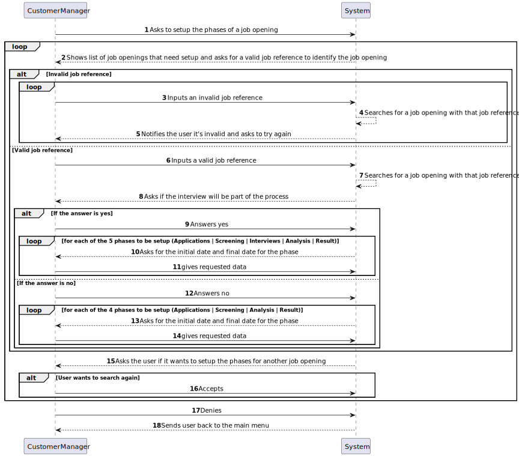

# US 1007

## 1. Context

This is the first time this US is being worked on.

## 2. Requirements

**US 1007:** As Customer Manager, I want to setup the phases of the process for a job opening.

### Acceptance Criteria:

- **1007.1.** The start and end dates of a recruitment process must not be the same.

- **1007.2.** The start and end dates of a phase must not be the same.

### Client Clarifications:

>**(Partially Related) Question:** Regarding section 2.2.1 and the phases of the recruitment process, in order to move to the next phase, does the previous one have to close or can we move forward without having the previous one closed?
> 
>**Answer:** The short answer is that the phases must be sequential and not overlapping. When one phase closes, the next one opens. US 1007 provides for the definition of phases. US 1010 provides for the opening and closing phases of the process. The Customer Manager's decision to close a phase must assume that the process advances to the next phase automatically (regardless of the dates defined for the phases).

>**Question:** Is the recruitment process as defined or could there be changes in the future?
> 
>**Answer:** The process is what is described in section 2.2.1. At this moment the only optional phase is the interviews.

>**Question:** US1007, can the identification of the recruitment process be an automatic number or be more specific?
>
>**Answer:** The opening job has an identifier. The recruitment process for a job opening is a “tribute” to that job opening. From the outset, I do not see the need to have a “special” identifier for the recruitment process (i.e., phases of the recruitment process for this job opening).

>**(Partially Related) Question:** Does a job opening only have one customer manager?
>
>**Answer:** Yes, a customer manager in principle manages all job offers for a customer. And, consequently, there is only one customer manager for each job opening.

>**Question:** Can the recruitment process be identified by the job reference?
>
>**Answer:** US 1007 states that when the Customer Manager will define the recruitment phases for each job opening. I think there will be no need to have an explicit identifier for the recruitment process, since there is only one for each job reference and it is specific to each job reference. In technical terms, if there is a need for an ID for the recruitment process, I have nothing against it being the same as the job reference.

>**(Partially Related) Question:** Following point "2.2.1 Recruitment Process", The customer manager is responsible for setting up the process, defining the phases and indicating whether it includes the interview. We hereby request that you tell us if it is expected that the phases of the recruitment process will always be the same fixed\watertight "application; screening; interviews; analysis; result;" (interview is not mandatory), or whether the phases can be dynamic (more, less, in a different order). If there is an interview, will there only be one for a JobOpening? We await clarification, to adapt the domain model if necessary.
> 
>**Answer:** Regarding the first question, refer to question Q39, already answered. Regarding interviews, 1011 indicates that the customer manager selects the “interview model” to be used for the “job opening” interviews. Therefore, we are admitting that it will always be the same interview model for all interviews, that is, all interviews will have the same questions. In other words, it is appropriate to admit that there will only be one interview for a “job opening”.

>**(Partially Related) Question:** US1007/US1010. According to these US's and Q16, each Job Opening must have defined phases. In questions Q23, Q32 and Q45 the status of the application is mentioned. Are the Job Opening phase and application status separate concepts or do they refer to the same thing?
> 
>**Answer:** As previously mentioned, they are related but different concepts.

>**Question:** In terms of user interface, in this case for the customer manager how the recruitment process setup should be carried out?
>
>**Answer:** I don't have specific requirements for the user interface. You must use good practice principles for designing user interfaces, taking into account “The customer manager is responsible for setting up the process, defining the dates for the phases and if the process includes interviews” (section 2.2.1)

>**Question:** After defining the recruitment states for a JobOpening, will the Customer Manager be able to select the Job Requirement Specification for that same Job Opening? If yes, until what recruitment phase can the action be carried out?
>
>**Answer:** The Customer Manager defines the phases of the recruitment process, not the states. Requirements assessment is done in the Screening phase. So, I don't quite understand the question being asked.

>**Question:** Our main question would be: when is a job opening considered valid? Taking into account functionalities 1002, 1007, 1009, we had a doubt regarding job openings and their constitution. In US1002, it is supposed to register a job opening and only then, in US1009, we must select the requirements specifications for the given job opening. That being said, when registering the job opening, it would not have all the mandatory information as required. Therefore, should there be a direct link between these user stories so that, upon registration, we automatically select the requirements, thus obtaining a valid job opening? Additionally, we want to clarify whether the recruitment process is mandatory for the validity of a job opening.
> 
>**Answer:** The product owner is not an expert in the solution domain (they just have knowledge of the problem) but, regarding the first question, he suggests that perhaps user stories are not (may not be) “distinct” menu options. As for the second question (recruitment process), I think it is also more linked to the solution than the problem, so I will not suggest anything that could complicate more than clarify.

>**Question:** Taking into account US1007, the setup of the different phases of the recruitment process, we would like you to clarify whether, if an Interview phase is selected, there needs to be a direct connection with US1011, selection of an interview model, or will they be separate functionalities? In the event that they are separated, does a recruitment process become valid only after the selection of an interview model?
>
>**Answer:** I suppose my answer is similar to the previous question (Q91). I can say that we can consider that the company currently intends to always use an “automatic” interview evaluation process, so this must be defined in order to “execute/process” the interviews.

>**Question:** For a recruitment process we will have several phases. What is intended for “Setup”?
> 
>**Answer:** See Q73. The recruitment process, explained in section 2.2.1, defines a sequence of phases in which only the interview phase is indicated as optional. Setup essentially consists of defining the dates for each phase and whether or not we have the interview phase.


### Dependencies/References:

In US1007 it is asked of us to setup the phases for the recruitment process, in this case, we consider setup the following 2 tasks:

- Defining which phases the recruitment process will have (Always the same but with the optionally added 'interview' phase)

- Defining the dates for each of the phases

#### Dependency with US 1002:
> For the Customer Manager to setup the phases of a job opening it is required that a job opening exists. US 1002 creates the job openings for US 1007 to setup phases for.

#### Dependency with US 1003:
> For the Customer Manager to setup the phases of a job opening it needs to choose of a list of created job openings. US 1003 lists the job openings for US 1007 to setup phases for.

#### Dependency with US 1011:
>  For US 1011 to setup the interview model to be chosen for the job opening, the Customer Manager needs to setup the phases with US 1007 to include the interview phase.

## 3. Analysis

After a discussion with the team, this user story was envisioned to be done in the way the system sequence diagram below describes:

### System Sequence Diagram Related




## 4. Design

For this User Story, following the **DDD pattern, a 4-layer system (Presentation, Application, Domain, Infrastructure)** was chosen to best fit the envisioned designed of this functionality.

Due to the need to create and serialize entities to be used later, the usage of repositories was essential for RecruitmentProcesses and JobOpenings. 

#### New Persistence Layer Classes:
- JobOpeningRepository
- RecruitmentProcessRepository

#### New Domain Layer Classes:
- RepositoryFactory
- RecruitmentProcess
- RecruitmentPeriod
- Phase
- PhaseType
- PhaseDescription
- PhasePeriod
- PhaseStatus
- JobReference

*RecruitmentPeriod and Phase are value objects belonging to the RecruitmentProcess entity.*
*PhaseType, PhaseStatus, PhaseDescription and PhasePeriod are value objects belonging to the Phase entity.*
*JobReference is a value object belonging to the JobOpening entity.*

#### New Application Layer Classes:
- SetupRecruitmentProcessController

#### New Presentation Layer Classes:
- SetupRecruitmentProcessUI
- PhaseDTO

### 4.1. Realization

#### Sequence Diagram Related


### 4.2. Class Diagram


### 4.3. Applied Patterns

This section is focused on the patterns used for this US:

#### Repository Pattern

For the envisioned structure and usage of this functionality, the usage of a serializable repository is essential for the Customer Manager to access the data needed for this functionality.

#### Service Pattern

To create a layer of abstraction between the Domain layer and the Application layer, the usage of a specific service was deemed necessary for this user story.

#### DTO Pattern

Due to the data needed for this functionality being several entities in the Domain layer and also input from the user, the usage of the DTO pattern seemed to be the ideal solution for this problem. 

### 4.4. Tests

*Include here the main tests used to validate the functionality. Focus on how they relate to the acceptance criteria.*

**Test 1 and 2:** Verifies that it is not possible to create a recruitment process with overlapping or equal start and end dates

**Refers to Acceptance Criteria:** 1007.1

````
 @Test
    void ensureItCantCreatePhaseWithSameEndAndStartDate() {

        SimpleDateFormat df = new SimpleDateFormat("dd-MM-yyyy");
        Calendar start = null;
        Calendar finish = null;
        List<Phase> phases = new ArrayList<>();
        try {
            start = Calendars.fromDate(df.parse("16-03-2024"));
            finish = Calendars.fromDate(df.parse("16-03-2024"));
        } catch (ParseException e) {
            throw new RuntimeException(e);
        }

        Calendar finalFinish = finish;
        Calendar finalStart = start;
        assertThrows(IllegalArgumentException.class, () -> new RecruitmentProcess(finalStart, finalFinish, phases));

    }

    @Test
    void ensureItCantCreatePhaseWithStartDateAfterEndDate() {

        SimpleDateFormat df = new SimpleDateFormat("dd-MM-yyyy");
        Calendar start = null;
        Calendar finish = null;
        List<Phase> phases = new ArrayList<>();
        try {
            start = Calendars.fromDate(df.parse("18-03-2024"));
            finish = Calendars.fromDate(df.parse("16-03-2024"));
        } catch (ParseException e) {
            throw new RuntimeException(e);
        }

        Calendar finalFinish = finish;
        Calendar finalStart = start;
        assertThrows(IllegalArgumentException.class, () -> new RecruitmentProcess(finalStart, finalFinish, phases));

    }
````


**Test 3 and 4:** Verifies that it is not possible to create a phase with overlapping or equal start and end dates

**Refers to Acceptance Criteria:** 1007.2

````
  @Test
    void ensureItCantCreatePhaseWithSameEndAndStartDate() {

        String phaseType = "TestPhase";
        String phaseDescription = "Testing purposes";
        String phaseStatus = "Test test and test";
        SimpleDateFormat df = new SimpleDateFormat("dd-MM-yyyy");
        Calendar start = null;
        Calendar finish = null;
        try {
            start = Calendars.fromDate(df.parse("16-03-2024"));
            finish = Calendars.fromDate(df.parse("16-03-2024"));
        } catch (ParseException e) {
            throw new RuntimeException(e);
        }

        Calendar finalFinish = finish;
        Calendar finalStart = start;
        assertThrows(IllegalArgumentException.class, () -> new Phase(phaseType, phaseDescription,phaseStatus, finalStart, finalFinish));

    }

    @Test
    void ensureItCantCreatePhaseWithStartDateAfterEndDate() {

        String phaseType = "TestPhase";
        String phaseDescription = "Testing purposes";
        String phaseStatus = "Test test and test";
        SimpleDateFormat df = new SimpleDateFormat("dd-MM-yyyy");
        Calendar start = null;
        Calendar finish = null;
        try {
            start = Calendars.fromDate(df.parse("18-03-2024"));
            finish = Calendars.fromDate(df.parse("16-03-2024"));
        } catch (ParseException e) {
            throw new RuntimeException(e);
        }

        Calendar finalFinish = finish;
        Calendar finalStart = start;
        assertThrows(IllegalArgumentException.class, () -> new Phase(phaseType, phaseDescription,phaseStatus, finalStart, finalFinish));

    }
````
**Test 5 and 6:** Verifies that it is not possible to create a recruitment process with a phase process with overlapping or non-sequential active periods

````
@Test
void ensureItCantCreateARecruitmentProcessWithOverlappingOrNonSequentialPhases(){

        SimpleDateFormat df = new SimpleDateFormat("dd-MM-yyyy");
        Calendar start1 = null;
        Calendar finish1 = null;
        Calendar start2 = null;
        Calendar finish2 = null;
        Calendar start3 = null;
        Calendar finish3 = null;
        Calendar start4 = null;
        Calendar finish4 = null;
        Calendar start5 = null;
        Calendar finish5 = null;
        List<Phase> phases = new ArrayList<>();
        try {
            start1 = Calendars.fromDate(df.parse("16-03-2024"));
            finish1 = Calendars.fromDate(df.parse("18-03-2024"));
            start2 = Calendars.fromDate(df.parse("11-03-2024"));
            finish2 = Calendars.fromDate(df.parse("13-03-2024"));
            start3 = Calendars.fromDate(df.parse("20-02-2024"));
            finish3 = Calendars.fromDate(df.parse("23-02-2024"));
            start4 = Calendars.fromDate(df.parse("20-03-2024"));
            finish4 = Calendars.fromDate(df.parse("22-03-2024"));
            start5 = Calendars.fromDate(df.parse("23-03-2024"));
            finish5 = Calendars.fromDate(df.parse("24-03-2024"));
        } catch (ParseException e) {
            throw new RuntimeException(e);
        }

        Phase phase1 = new Phase("Test", "Test", "Test", start1, finish1);
        Phase phase2 = new Phase("Test", "Test", "Test", start2, finish2);
        Phase phase3 = new Phase("Test", "Test", "Test", start3, finish3);
        Phase phase4 = new Phase("Test", "Test", "Test", start4, finish4);
        Phase phase5 = new Phase("Test", "Test", "Test", start5, finish5);

        phases.add(phase1);
        phases.add(phase2);
        phases.add(phase3);
        phases.add(phase4);
        phases.add(phase5);

        Calendar finalFinish = finish5;
        Calendar finalStart = start1;

        assertThrows(IllegalArgumentException.class, () -> new RecruitmentProcess(finalStart, finalFinish, phases));

    }

    @Test
    void ensureItCantCreateARecruitmentProcessWithOverlappingOrNonSequentialPhases2(){

        SimpleDateFormat df = new SimpleDateFormat("dd-MM-yyyy");
        Calendar start1 = null;
        Calendar finish1 = null;
        Calendar start2 = null;
        Calendar finish2 = null;
        Calendar start3 = null;
        Calendar finish3 = null;
        Calendar start4 = null;
        Calendar finish4 = null;
        Calendar start5 = null;
        Calendar finish5 = null;
        List<Phase> phases = new ArrayList<>();
        try {
            start1 = Calendars.fromDate(df.parse("16-03-2024"));
            finish1 = Calendars.fromDate(df.parse("18-03-2024"));
            start2 = Calendars.fromDate(df.parse("19-03-2024"));
            finish2 = Calendars.fromDate(df.parse("23-03-2024"));
            start3 = Calendars.fromDate(df.parse("24-03-2024"));
            finish3 = Calendars.fromDate(df.parse("29-03-2024"));
            start4 = Calendars.fromDate(df.parse("01-04-2024"));
            finish4 = Calendars.fromDate(df.parse("05-04-2024"));
            start5 = Calendars.fromDate(df.parse("09-04-2024"));
            finish5 = Calendars.fromDate(df.parse("12-04-2024"));
        } catch (ParseException e) {
            throw new RuntimeException(e);
        }

        Phase phase1 = new Phase("Test", "Test", "Test", start1, finish1);
        Phase phase2 = new Phase("Test", "Test", "Test", start2, finish2);
        Phase phase3 = new Phase("Test", "Test", "Test", start3, finish3);
        Phase phase4 = new Phase("Test", "Test", "Test", start4, finish4);
        Phase phase5 = new Phase("Test", "Test", "Test", start5, finish5);

        phases.add(phase1);
        phases.add(phase2);
        phases.add(phase3);
        phases.add(phase4);
        phases.add(phase5);

        Calendar finalFinish = finish5;
        Calendar finalStart = start1;

        assertDoesNotThrow(() -> new RecruitmentProcess(finalStart, finalFinish, phases));

    }
````

## 5. Implementation

### DTOs

**AllPhasesDTO:** 

Due to the high amount of input that was needed from the user to create a phase we found it to be best practice to use a DTO like PhaseDTO to keep each data refering to a Phase object that would be later created and the class AllPhasesDTO to very easily transport all of the data related to the Phases from the Presentation layer to the Application layer.
````
package jobs4u.base.recruitmentprocessmanagement.dto;

import java.util.List;
import java.util.Objects;

public class AllPhasesDTO {

    private List<PhaseDTO> listOfPhases;

    public AllPhasesDTO(List<PhaseDTO> listOfPhases){
        this.listOfPhases = listOfPhases;
    }

    public List<PhaseDTO> getListOfPhases() {
        return listOfPhases;
    }

    @Override
    public boolean equals(Object o) {
        if (this == o) return true;
        if (o == null || getClass() != o.getClass()) return false;
        AllPhasesDTO that = (AllPhasesDTO) o;
        return Objects.equals(listOfPhases, that.listOfPhases);
    }

    @Override
    public int hashCode() {
        return Objects.hash(listOfPhases);
    }
}

````

**PhaseDTO**
````
package jobs4u.base.recruitmentprocessmanagement.dto;

import eapli.framework.time.domain.model.DateInterval;
import eapli.framework.validations.Preconditions;

import java.util.Calendar;
import java.util.Objects;

public class PhaseDTO {

    private String phaseType;

    private String description;

    private String status;

    private DateInterval period;

    public PhaseDTO(String phaseType, String description, String status, DateInterval period){
        Preconditions.noneNull(phaseType,description,period,status);
        Preconditions.nonEmpty(phaseType);
        Preconditions.nonEmpty(description);
        Preconditions.nonEmpty(status);

        this.description = description;
        this.phaseType = phaseType;
        this.status = status;
        this.period = period;
    }

    public String getPhaseType() {
        return phaseType;
    }

    public String getDescription() {
        return description;
    }

    public String getStatus() {
        return status;
    }

    public Calendar getInitialDate() {
        return period.start();
    }

    public Calendar getFinalDate() {
        return period.end();
    }

    @Override
    public boolean equals(Object o) {
        if (this == o) return true;
        if (o == null || getClass() != o.getClass()) return false;
        PhaseDTO phaseDTO = (PhaseDTO) o;
        return Objects.equals(phaseType, phaseDTO.phaseType) && Objects.equals(description, phaseDTO.description) && Objects.equals(status, phaseDTO.status);
    }

    @Override
    public int hashCode() {
        return Objects.hash(phaseType, description, status);
    }
}
````
The usage of DTO's was already described in the design part of this documentation.

### Services

#### RecruitmentProcessManagementService
````
package jobs4u.base.recruitmentprocessmanagement.application;

import eapli.framework.time.domain.model.DateInterval;
import jobs4u.base.infrastructure.persistence.PersistenceContext;
import jobs4u.base.jobopeningmanagement.domain.JobOpening;
import jobs4u.base.recruitmentprocessmanagement.domain.Phase;
import jobs4u.base.recruitmentprocessmanagement.domain.RecruitmentProcess;
import jobs4u.base.recruitmentprocessmanagement.dto.AllPhasesDTO;
import jobs4u.base.recruitmentprocessmanagement.dto.PhaseDTO;
import jobs4u.base.recruitmentprocessmanagement.repository.PhaseRepository;
import jobs4u.base.recruitmentprocessmanagement.repository.RecruitmentProcessRepository;

import java.util.ArrayList;
import java.util.Calendar;
import java.util.List;

public class RecruitmentProcessManagementService {

    private static final RecruitmentProcessRepository recruitmentProcessRepository = PersistenceContext.repositories().recruitmentProcesses();

    private static final PhaseRepository phaseRepository = PersistenceContext.repositories().phases();

    public static RecruitmentProcess setupRecruitmentProcess(Calendar start, Calendar end, AllPhasesDTO allPhasesDTO, JobOpening jobOpening){

        List<Phase> listPhases = new ArrayList<>();

        RecruitmentProcess recruitmentProcess = new RecruitmentProcess(start, end, listPhases);

        for (PhaseDTO phaseDTO : allPhasesDTO.getListOfPhases()){
            Phase phase = new Phase(phaseDTO.getPhaseType(), phaseDTO.getDescription(), phaseDTO.getStatus(), phaseDTO.getInitialDate(), phaseDTO.getFinalDate());
            phase = phaseRepository.save(phase);
            listPhases.add(phase);
        }

        recruitmentProcess.setPhases(listPhases);

        recruitmentProcess = recruitmentProcessRepository.save(recruitmentProcess);

        return recruitmentProcess;
    }

}
````
Due to the need to manage entities as of the likes of the RecruitmentProcesses and the Phases we created a service with the sole objective to be the class storing and letting other controllers use it's services to be able to effectively manage all RecruitmentProcesses and Phases alike.
The same mentality also gave way to the usage of the:

#### JobOpeningManagementService
````
package jobs4u.base.jobopeningmanagement.application;

import eapli.framework.time.domain.model.DateInterval;
import jobs4u.base.customermanagement.application.CustomerManagementService;
import jobs4u.base.customermanagement.domain.Customer;
import jobs4u.base.customermanagement.domain.CustomerCode;
import jobs4u.base.customermanagement.dto.CustomerDTO;
import jobs4u.base.jobopeningmanagement.dto.JobOpeningDTO;
import jobs4u.base.recruitmentprocessmanagement.application.RecruitmentProcessManagementService;
import jobs4u.base.recruitmentprocessmanagement.domain.RecruitmentProcess;
import jobs4u.base.requirementsmanagement.domain.RequirementSpecification;
import jobs4u.base.infrastructure.persistence.PersistenceContext;
import jobs4u.base.jobopeningmanagement.domain.JobOpening;
import jobs4u.base.jobopeningmanagement.domain.JobReference;
import jobs4u.base.jobopeningmanagement.dto.ContractTypeDTO;
import jobs4u.base.jobopeningmanagement.dto.WorkModeDTO;
import jobs4u.base.jobopeningmanagement.repositories.JobOpeningRepository;

import java.util.*;

public class JobOpeningManagementService {

    private final JobOpeningRepository jobOpeningRepository = PersistenceContext
            .repositories().jobOpenings();

    private final JobOpeningDTOService dtoSvc = new JobOpeningDTOService();

    private final RecruitmentProcessManagementService recruitmentProcessManagementService = new RecruitmentProcessManagementService();

    private final CustomerManagementService customerManagementService = new CustomerManagementService();

    public JobOpening registerJobOpening(String function, ContractTypeDTO contractTypeDenomination,
                                         WorkModeDTO workModeDenomination, String streetName, String city,
                                         String district, String state, String zipcode, int numVacancies,
                                         String description, RequirementSpecification requirementsFile,
                                         CustomerDTO companyInfo){

        JobReference lastReference = jobOpeningRepository.lastJobReference(companyInfo.customerCode());

        JobOpening jobOpening = new JobOpening(function, contractTypeDenomination, workModeDenomination, streetName, city,
                district, state, zipcode, numVacancies, description, requirementsFile, lastReference);

        jobOpeningRepository.save(jobOpening);
        return jobOpening;
    }

    public Iterable<JobOpeningDTO> activeJobOpenings() {
        return dtoSvc.convertToDTO(jobOpeningRepository.findAllJobOpeningsNotStarted());
    }

    public boolean checkJobOpeningByJobRef(String customerCode, int sequentialCode){
        return jobOpeningRepository.containsOfIdentity(new JobReference(customerCode, sequentialCode));
    }

    public Optional<JobOpening> getJobOpeningByJobRef(String customerCode, int sequentialCode){
        return jobOpeningRepository.ofIdentity(new JobReference(customerCode, sequentialCode));
    }

    public List<JobOpening> getJobOpeningsFromCustomerCodes(List<CustomerDTO> customerDTOList) {
        Set<CustomerCode> customerCodes = new HashSet<>();
        for (CustomerDTO customerDTO : customerDTOList){
            customerCodes.add(new CustomerCode(customerDTO.customerCode()));
        }
       return jobOpeningRepository.getJobOpeningListMatchingCustomerCodesList(customerCodes);
    }

    public List<JobOpening> filterJobOpeningListByCompanyName(CustomerDTO dto) {
        Optional<Customer> customer = customerManagementService.getCustomerByDTO(dto);
        if (customer.isPresent()){
            return jobOpeningRepository.getJobOpeningListMatchingCustomer(customer.get());
        }
        throw new NoSuchElementException("Failure - filterJobOpeningListByCompanyName");
    }

    public List<JobOpening> filterJobOpeningListByCustomerCode(String customerCode) {
        Optional<Customer> customer = customerManagementService.getCustomerByCustomerCode(customerCode);
        if (customer.isPresent()){
            return jobOpeningRepository.getJobOpeningListMatchingCustomer(customer.get());
        }
        throw new NoSuchElementException("Unable to retrieve the customer with customer code " + customerCode);
    }

    public List<JobOpening> filterJobOpeningListBySTARTEDStatus(String started, List<JobOpening> virgemJobOpeningList) {
        List<JobOpening> filtered = jobOpeningRepository.getJobOpeningListMatchingStatus(started);
        virgemJobOpeningList.removeIf(jobOpening -> !filtered.contains(jobOpening));
        return virgemJobOpeningList;
    }

    public List<JobOpening> filterJobOpeningListByDateInterval(DateInterval interval, List<JobOpening> jobOpenings) {
        List<JobOpening> filtered = jobOpeningRepository.getJobOpeningListWithinDateInterval(interval);
        jobOpenings.removeIf(jobOpening -> !filtered.contains(jobOpening));
        if (jobOpenings.isEmpty()){
            throw new NoSuchElementException("There are no job openings in the defined interval.");
        }
        return jobOpenings;
    }

    public Iterable<JobOpening> getAllUnfinishedJobOpenings(){
        return jobOpeningRepository.findAllJobOpeningsWithoutRecruitmentProcess();
    }

    public boolean setupJobOpeningWithRecruitmentProcess(RecruitmentProcess recruitmentProcess, JobOpening jobOpening){
        JobOpening jobOpening1 = jobOpeningRepository.ofIdentity(jobOpening.getJobReference()).get();
        jobOpening1.updateStatusToNotStarted();
        jobOpening1.addRecruitmentProcess(recruitmentProcess);
        jobOpeningRepository.save(jobOpening1);
        return true;
    }

}
````

## 6. Integration/Demonstration

This US is fundamental to later user stories to be able to start recruitment processes.

In this sprint B this US can be used by US 1003 in part due to the filtering functionality it uses with the recruitment processes.

