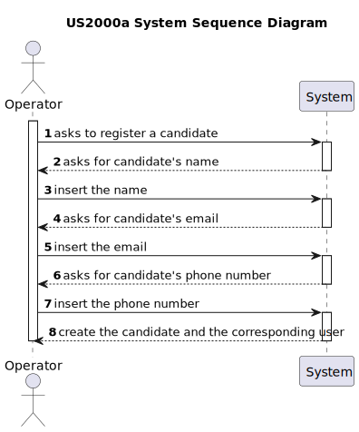
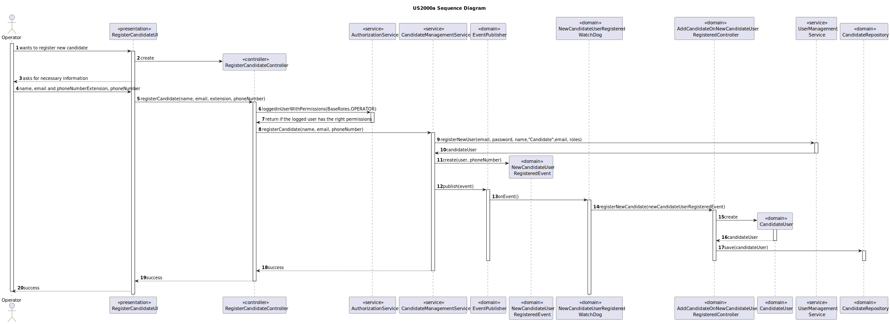
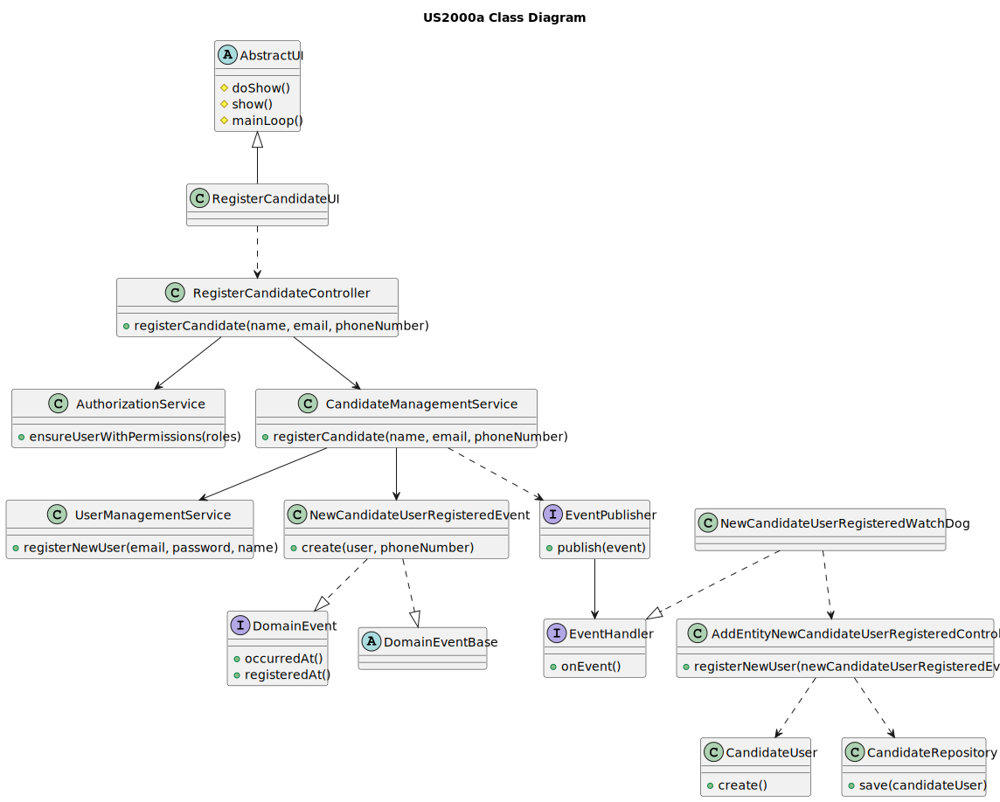

# US 2000a

## 1. Context

*This is the first time this user story is being requested.*

## 2. Requirements

**US 2000a:** As Operator, I want to register a candidate and create a corresponding user.

**Acceptance Criteria:**

- 2000a.1. The phone number must have extension and the number

- 2000a.2. The Operator should input the information manually

**Client Clarifications**

> **Question:** Regarding the US2000a requirement which states "As an Operator, I want to register a candidate and create a corresponding user," I would like to know how a candidate will be registered in the system, i.e., understand the processes for registering a candidate. Since the candidate has their name, email, and phone number, how should their username be formatted to avoid conflicts with other candidates' names? Additionally, how should the candidate be notified of their username and password?
>
> **Answer:** There is no need for a user name. Regarding the password, I think the system can generate a unique password. You may assume the candidate will be informed of his/her password by means that are outside of the scope of what is to be developed for this version of the system.

> **Question:** Regarding the registration of candidates, should the data be entered manually or imported from the file with the candidate’s data?
> 
> **Answer:** It makes sense for them to be imported from the file within US2002. Possibly give the user the possibility to make changes, if necessary.

> **Question:** The operator can register a candidate: does he put the info manually or has to be read of the file generated by the bot? This user will appear then in the backoffice...enable as default I think. Then the admin, can also register manually a candidate as the operator did it? I don't understand at all the different between a registration of the candidate made by the admin or made by the operator.
> 
>  **Answer:** US2000a is for the Operator to manually register a candidate and his/her user in the system. US2002 is for import of the applications from the data iin the files produced by the application file bot. If the candidate does not exist, it should be created. I think there is no registration of a candidate by the admin.

## 3. Analysis

*This functionality is for the Operator, so the user needs to be authenticated first to be able to register a candidate and a corresponding user.*

**System Sequence Diagram:**




## 4. Design
The principal function is to register a candidate, the input for the Operator consists of:

* Candidate Name
* Candidate Email
* Candidate Phone Number

After successfully submitting this information, the system should create a candidate and the corresponding user.

### 4.1. Realization



### 4.2. Class Diagram



### 4.3. Applied Patterns
* **Observer**
* **Repository**
* **Service**

> **Repository Pattern**
> * CandidateRepository
>
> **Justifications**
>
>The repositories were employed to persist candidates and usercandidates, as well as to reconstruct objects from the
persistence.


> **Service Pattern**
> * AuthorizationService
> * CandidateManagementService
> * UserManagementService
>
> **Justifications**
>
> The UserManagementService and AuthorizationService, pre-existing services within the Eapli.Framework were used here
> to register users and retrieve the logged-in user with Operator roles.
>
> The CandidateManagementService is employed to register candidates, tasked with the responsibility of
candidate creation.
>
> The mentioned services were developed because the functionalities they offer will be utilized across multiple use
> cases.

> **Observer**
> * EventPublisher
> * NewCandidateUserRegisteredEvent
> * NewCandidateUserRegisteredWatchDog
> * AddCandidateOnNewCandidateUserRegisteredController
>
> **Justifications**
>
> All the mentioned objects are components of the applied observer pattern. This pattern was implemented to ensure
> that when a new candidate is registered, a user is automatically registered as well. Following this procedure, upon the
> registration of a candidate, a NewCandidateUserRegisteredEvent instance is generated, and the EventPublisher is utilized
> to notify the WatchDog (Observer).
>
> Upon receiving this notification, the WatchDog triggers the registration of the
> user through the AddCandidateOnNewCandidateUserRegisteredController. 
>
> In this case, an instance of NewCandidateUserRegisteredEvent is used to inform the specific WatchDog,
> which then invokes the AddCandidateOnNewCandidateUserRegisteredController for the registration of the CandidateUser.
>
> To maintain consistency in the creation process, we used the EventPublisher within the service to
> ensure that both the candidate and its user were created, thus preserving the system's valid state.
>
### 4.4. Tests

**Test 1:** Verifies if equal users are detected

**Refers to Acceptance Criteria:** 2000a.1

````
    @Test
    public void ensureEqualsCandidateUsersPassesForSamePhoneNumber() throws Exception {

        final Candidate candidate1 = new Candidate(getNewDummyUser(),phoneNumber1);
        final Candidate candidate2 = new Candidate(getNewDummyUser(),phoneNumber1);

        final boolean expected = candidate1.equals(candidate2);

        assertTrue(expected);
    }
````
**Test 2:** Verifies if a candidate without phone number fails

**Refers to Acceptance Criteria:** 2000a.2

````
    @Test
    public void ensureCandidateUserWithoutPhoneNumberFails(){
        assertThrows(IllegalArgumentException.class, () -> new Candidate(getNewDummyUser(), null));
    }
````
**Test 3:** Verifies if a candidate without system user fails

**Refers to Acceptance Criteria:** 2000a.2

````
    @Test
    public void ensureCandidateUserWithoutSystemUserFails(){
        assertThrows(IllegalArgumentException.class, () -> new Candidate(null, phoneNumber1));
    }
````
**Test 4:** Verifies if a phone number without extension Fails

**Refers to Acceptance Criteria:** 2000a.1

````
    @Test
    public void ensurePhoneNumberWithoutExtensionFails() {
        assertThrows(NullPointerException.class, () -> new PhoneNumber(null, "910000000"));
    }
````
**Test 5:** Verifies if a phone number without number Fails

**Refers to Acceptance Criteria:** 2000a.1

````
    @Test
    public void ensurePhoneNumberWithoutNumberFails() {
        assertThrows(NullPointerException.class, () -> new PhoneNumber("+351", null));
    }
````

**Test 6:** Verifies if an extension without "+" Fails

**Refers to Acceptance Criteria:** 2000a.1

````
    @Test
    public void ensureExtensionWithoutPlusFails(){
        assertThrows(IllegalArgumentException.class, () -> new PhoneNumber("351", "12345678"));
    }
````

**Test 6 and 7:** Verifies if a number with less than 8 digits and plus than 15 digits Fails

**Refers to Acceptance Criteria:** 2000a.1

````
    @Test
    public void ensurePhoneNumberLessThan8DigitsFails() {
        assertThrows(IllegalArgumentException.class, () -> new PhoneNumber("+351", "1234567"));
    }
    
    @Test
    public void ensurePhoneNumberPlusThan15DigitsFails() {
        assertThrows(IllegalArgumentException.class, () -> new PhoneNumber("+351", "1234567890123456"));

    }
````
## 5. Implementation

### RegisterCandidateController

```
 public boolean registerCandidate(String name, String email, String extension, String number){
        Optional<SystemUser> operator = authz.loggedinUserWithPermissions(BaseRoles.OPERATOR);
        PhoneNumber phoneNumber = new PhoneNumber(extension, number);
        operator.ifPresent(systemUser -> candidateManagementService.registerCandidate(name, email, phoneNumber));

        return true;
    }
```
### CandidateManagementService

```
 public void registerCandidate(String name, String email, PhoneNumber phoneNumber) {
        String password = passwordService.generatePassword();

        final Set<Role> roles = new HashSet<>();
        roles.add(BaseRoles.CANDIDATE_USER);

        SystemUser sysUser = userManagementService.registerNewUser(email, password, name,"Candidate",email, roles);

        final DomainEvent event = new NewCandidateUserRegisteredEvent(sysUser,phoneNumber);
        dispatcher.publish(event);
    }
```
### NewCandidateUserRegisteredWatchDog

```
 @Override
    public void onEvent(final DomainEvent domainEvent) {
        assert domainEvent instanceof NewCandidateUserRegisteredEvent;

        final NewCandidateUserRegisteredEvent newCandidateUserRegisteredEvent = (NewCandidateUserRegisteredEvent) domainEvent;

        final AddCandidateOnNewCandidateUserRegisteredController controller = new AddCandidateOnNewCandidateUserRegisteredController();
        controller.registerNewCandidate(newCandidateUserRegisteredEvent);
    }
```
### AddCandidateOnNewCandidateUserRegisteredController

```
 public void registerNewCandidate(NewCandidateUserRegisteredEvent event) {
        candidateRepository.save(new Candidate(event.systemUser(), event.phoneNumber()));
    }
```
## 6. Integration/Demonstration
To execute this functionality it is necessary to run the script named `run-backoffice-app` and log in with Operator permissions
after it, must select the menu `Operator` followed by `Register a Candidate`.

