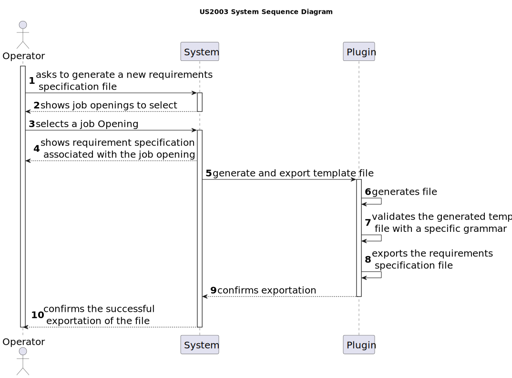
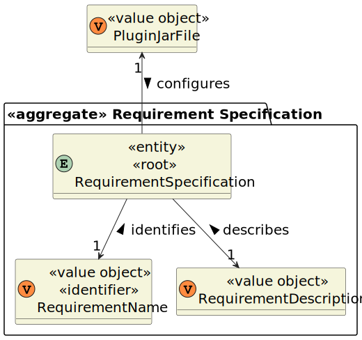
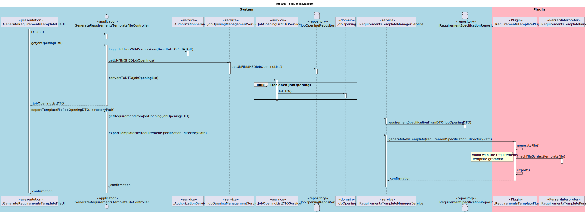
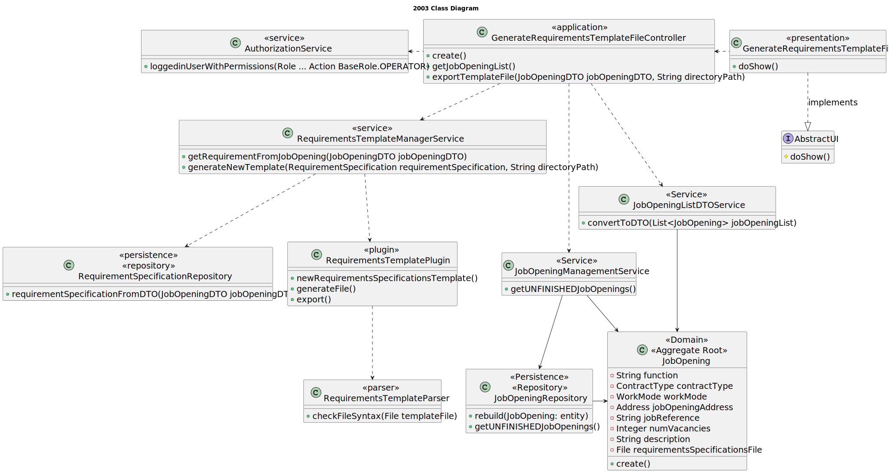

# US 2003

## 1. Context

This is the first time this user story is being requested.

## 2. Requirements

**US 2003** As {Operator}, I want to generate and export a template text file to help collect data fields for candidates
of a job opening (so the data is used to verify the requirements of the job opening).

**Acceptance Criteria:**

- **2003.1** The usage of **_ANTLR_** tool is required.
- **2003.2** The question types have established types: True/False, Short Text Answer, Choice with Single-Answer,
  Choice with Multiple-Answer, Integer Number, Decimal Number, Date, Time and Numeric Scale.
- **2003.3** A requirement template must have at least one requirement entry.

**Dependencies/References:**

This functionality has no direct dependencies, although it is a file generated from this user story that will be used in
the registration of a job opening, regarding its requirements specifications.

_Reference **2003.1**:_ **NFR09(LPROG)** - Requirement Specifications and Interview Models: The support for this functionality
must follow specific technical requirements, specified in LPROG. The _**ANTLR**_ tool should be used (https://www.antlr.org/).


**Client Clarifications:**

> **Question:** What fields/information need to be extracted from the candidate to verify the requirements of a job opening?
>
> **Answer:** It will depend on what is designed/specified in the Requirements Specification model used for that job opening.


> **Question:** Who will fill in the answers in the template file?
>
> **Answer:** The Operator will fill in the answers, and as part of US2004, they will submit the completed file in the system.


> **Question:** After the applications are filtered during the screening process, I'm unsure about who manages the results
> and oversees this phase. Could you please clarify if the responsibility for managing the screening results falls under
> the customer manager, the operators, or both?
>
> **Answer:** In US2003 and US2004, it is the Operator who downloads a template file to register the requirements,
> records the answers for the requirements in the file, and then uploads the file. Subsequently, the Customer Manager
> executes the verification process (US1015) and performs the notification of the results (US1016).


> **Question:** Can you clarify the usage of ANTLR within user story 2003? You've stated that US2003 simply generates the
> file, while in US2004 the Operator defines the answers and uploads the file. Where is this file uploaded to? Given this,
> where is the usage of ANTLR in US2003 directed to?
>
> **Answer:** Regarding the first question, it is possible to generate the template text file using ANTLR, although this
> might be challenging. This would be where the usage of ANTLR comes into play. However, unless there is a specific requirement
> from LPROG for evaluation purposes, it is acceptable to have the template file hardcoded in the plugin without the need for
> any complex generation process or function. Regarding the second question, the file is uploaded to the system. The response
> to the last question was provided earlier.


> **Question:** Could you clarify whether the questions to be used for Interview Models and Requirement Specifications are
> those shown in the documentation examples, or is there a specific set of questions you would like us to use?
>
> **Answer:** The specification document provides examples, as mentioned. These are only indicative examples. You can use
> these examples as test cases and as a starting point to define others. However, the solution is expected to support more
> than just the examples in the document. In either plugin, the types of questions to be supported are those presented on
> page 8 of the document. As the product owner, I would like a functional demonstration of the system to include at least
> 2 plugins of each type, to demonstrate minimal support for more than one plugin used simultaneously (of each type). It
> should also demonstrate the use of all types of questions presented on page 8 (updated on 2024-04-27).


## 3. Analysis

This functionality aims generate and export a template text file with the requirements to be evaluated and the possible
answers for each requirement, regarding a job opening.

Further requirements can be delineated as needed, such as:
* Number of years of experience
* Degree
* Candidate personal qualities
* Programming languages proficiency
* Specific software proficiency
* Specific knowledge
* Work methodology proficiency
* Others...

Requirements can have different natures:

* **True/False** - A question with only a true or false answer.
* **Short Text Answer** - A question with a short text answer. The limit of the answer should the specified by a regular expression.
* **Choice, with Single-Answer** - A question with a set of choices where only one can be selected
* **Choice, with Multiple-Answer** - A question with a set of choices where many can be selected
* **Integer Number** - A question which answer is an integer number
* **Decimal Number** - A question which answer is a decimal number
* **Date** - A question which answer is a date
* **Time** - A question which answer is a time
* **Numeric Scale** - A question which answer is one option in a range of integers (ex: 1-5)

Below there's a System Sequence Diagram (SSD) illustrating the expected behaviour of this functionality. After this diagram
is a partial domain model, with emphasis on US2003's concepts.

**US2003 System Sequence Diagram**




**US2003 Domain Model**



## 4. Design

The solution for this functionality is to have 4 layers, following DDD development architecture: Presentation, Application,
Domain and Persistence. A link in [references](#71-references) explains this topic in-depth.

To generate a requirements specification template that defines who is eligible for the job we need to get the plugins from
the database, show them to the user, which will select one. Upon this choice, a service will be in charge of serving as a
bridge between the system and the plugin.

To display the requirement specification plugins available, DTO's must be used to enhance encapsulation between layers.

**New Domain Layer Classes**
* RequirementsTemplateManagerService
* RequirementSpecification
* AuthorizationService
* JobOpeningManagementService
* JobOpeningListDTOService

**New Persistence Layer Classes**
* RequirementSpecificationRepository
* JobOpeningRepository

**New Application Layer Classes**
* GenerateRequirementsTemplateFileController

**New Presentation Layer Classes**
* GenerateRequirementsTemplateFileUI

The further topics illustrate and explain this functionality usage flow, and the correlation between its components.

### 4.1. Realization

**US2003 Sequence diagram**



### 4.2. Class Diagram



### 4.3 Grammar

The following text represents the grammar that defines the format of the requirement template for front end developers.

````
grammar Plugin;

start: (group)* EOF;

group: (question NEWLINE?)+;

question: type '"' PHRASE ('.' | '?') '"' choices answer;

type: TYPES '-' NUM ' ';
choices: choice*;

choice: NUM ') '  PHRASE ;

// Answers for the questions
answer: START_ANSWER answer_option ;

answer_option: true_false_a | text |  date_a | time_a | whole_n_a |  scale_a | decimal_a  ;

text:  PHRASE ;
whole_n_a:   NUM+;
true_false_a:  BOOLEAN ;
scale_a:   NUM+ '-'  NUM+;
decimal_a:  NUM+ '.' NUM+;
date_a:  NUM NUM '/' NUM NUM '/' NUM NUM NUM NUM;
time_a:  NUM NUM ':' NUM NUM;

BOOLEAN: 'True' | 'False' | 'true' | 'false';
START_ANSWER: 'A:. ';
PHRASE: (WORD ' ')* WORD;
WORD : ([a-zA-Z]|[-]|[/])+;
NEWLINE: '\r'? '\n'->skip;
NUM: [0-9];
TYPES: '[SC]'
    | '[MC]'
    | '[WN]'
    | '[TF]'
    | '[NS]'
    | '[DN]'
    | '[SA]'
    | '[D]'
    | '[T]'
    ;
```

```
grammar SymbolTable;

start : (line NEWLINE?)+;

line : type question choices? evals;

evals : answer_eval*;

answer_eval: '/' (PHRASE ';'?)* ':' numbers
           | '/' answer_numbers ':' numbers
           | '/' condition
           | '/' date ':' numbers
           | '/' BOOLEAN ':' numbers
           | '/' scale ':' numbers
           | '/' decimal ':' numbers
           | '/' time ':' numbers
           ;

date:  NUM NUM '-' NUM NUM '-' NUM NUM NUM NUM;

scale:   NUM+ '-'  NUM+;
decimal:  NUM+ '.' NUM+;
time:  NUM NUM ':' NUM NUM;

condition : SIGNALS+;

answer_numbers : numbers;

choices : choice+;

choice : '/' (PHRASE ';'?)*;

type : TYPES'-' numbers;
question: '/' PHRASE ('.' | '?');
numbers : NUM+;


BOOLEAN: 'True' | 'False' | 'true' | 'false';
START_ANSWER: 'A:. ';
PHRASE: (WORD ' ')* WORD;
WORD : ([a-zA-Z]|[-,])+;
NEWLINE: '\r'? '\n'->skip;
SIGNALS: ([<]|[=]|[>])+;
NUM: [0-9];
TYPES: '[SC]'
    | '[MC]'
    | '[WN]'
    | '[TF]'
    | '[NS]'
    | '[DN]'
    | '[SA]'
    | '[D]'
    | '[T]'
    ;
````

### 4.4. Applied Patterns

This topic presents the classes with the patterns applied to them along with justifications.

>**Service Pattern**
> * RequirementsTemplateManagerService
> * JobOpeningManagementService
> * AuthorizationService
> * JobOpeningListDTOService
>
> **Justifications**
>
> * RequirementsTemplateManagerService is necessary because it manages a set of operations and responsibilities that don't
    belong to any class. It's in charge of managing the process of getting the plugins available from their repository,
    overseeing the conversion of the data into DTOs and bridging the system to the chosen plugin.
>
> * CustomerManagementService is used in more than one functionality, and its in charge of managing request regarding entities,
    serving as encapsulation between the controller and the CustomerRepository along with the domain classes.
>
> * JobOpeningManagementService is used in more than one functionality, and its in charge of managing request regarding
    jobOpenings, serving as encapsulation between the controller and the JobOpeningRepository along with the domain classes.
>
> * In order to enforce encapsulation amongst layers and adequate responsibility assigment, the JobOpeningListDTOService was
    created, besides being a set of instructions that is used in other functionalities.

>**Repository Pattern**
> * RequirementsSpecificationsRepository
> * JobOpeningRepository
>
> **Justifications**
>
> * Many plugins can exist, so they must be stored and persisted in a repository. It is from here that the plugins available
>   to generate a requirements specifications template file are.
> 
> * The JobOpeningRepository has stored all the jobOpening instances created in all sessions in its database, it's where
   the instances can be rebuilt.

### 4.5. Tests

**Test 1:** Verifies that a requirement cannot have its name null

**Refers to Acceptance Criteria:** ----
````
@Test
void ensureItHasAnRequirementName() {
...
}
````

**Test 2:** Verifies that a requirement cannot have its description null

**Refers to Acceptance Criteria:** ----
````
@Test
void ensureItHasAnRequirementDescription() {
...
}
````

**Test 3:** Verifies that a requirement cannot have its pluginJarFile null

**Refers to Acceptance Criteria:** ----
````
@Test
void ensureItHasAPluginJarFile() {
...
}
````

## 5. Implementation


The following code belongs to the UI of this functionality. All its methods are according to the design.

The doShow() method, declared in the AbstractUI interface. First we show the jobOpenings, then, upon selecting one of the
list, the requirement associated with it, which has the indication to initiate a specific plugin. Then we ask for the output
directory, where the generated template will be exported.

To list and select the jobOpenings and the question of Yes/No, the SelectWidget class from **_EAPLI Framework_** was used.
A printer class was created to define the format of the jobOpening entries on the list and print them.

````
@Override
protected boolean doShow() {
    Path tempDirectory;
    String directory;
    JobOpeningDTO jobOpeningDTO = null;
    SelectWidget<JobOpeningDTO> jobOpeningDTOSelectWidget;
    List<String> answers = new ArrayList<>();
    answers.add("Yes");
    answers.add("No");
    SelectWidget<String> choice = new SelectWidget<String>("Confirm selection?", answers);
    String answer = answers.get(1);

    while (answer.equals(answers.get(1))){
        jobOpeningDTOSelectWidget = new SelectWidget<>("Select a job opening to generate its requirements template file",
                controller.getJobOpeningList(), new JobOpeningPrinter());
        jobOpeningDTOSelectWidget.show();
        jobOpeningDTO = jobOpeningDTOSelectWidget.selectedElement();

        System.out.println("[Requirement Specification] " + jobOpeningDTO.getRequirementName() + "\n");

        choice.show();
        answer = choice.selectedElement();
    }

    while(true){
        directory = Console.readNonEmptyLine("Provide an output directory path:", "An output directory path is obligatory.");
        File check = new File(directory);
        if (check.exists() && check.isDirectory()) {
            break;
        }
        System.out.println("Invalid directory path.");
    }

    try {
        if(this.controller.exportTemplateFile(jobOpeningDTO, directory)){
            System.out.println("Requirement Template File successfully exported.");
        }else{
            System.out.println("It was not possible to export the requirement template.");
        }
        return false;
    } catch (final IntegrityViolationException | ConcurrencyException e) {
        System.out.println("Error in exporting the selected job opening's requirement template.\n" + e.getMessage());
    }
    return false;
}
````

The method to initiate the plugin.

````
public boolean generateNewTemplate(RequirementSpecification requirementSpecification, String outputDirectory) {
    try {
        ClassLoader loader = ClassLoader.getSystemClassLoader();
        FileManagement dataImporterInstance = (FileManagement) loader.loadClass(requirementSpecification.dataImporter()).getDeclaredConstructor().newInstance();
        RequirementsSpecificationPlugin interviewModelEvaluator = (RequirementsSpecificationPlugin) loader.loadClass(requirementSpecification.className()).getDeclaredConstructor().newInstance();
        dataImporterInstance.importData(requirementSpecification.configurationFile().toString());
        interviewModelEvaluator.generateTextFile((outputDirectory + "\\" + requirementSpecification.requirementName().name() + ".txt"));
        return true;
    } catch (ClassNotFoundException | NoSuchMethodException | InstantiationException | IllegalAccessException |
             InvocationTargetException e) {
        return false;
    }
}
````

## 6. Integration/Demonstration

This jobOpening requires the jobOpenings registered in US1002, the requirements selected in US1009. The template generated
will be used later, for the candidates to answer.

The plugins are initiated with parameters with the following order : `java -jar <jar file path> -template <output directory path>`.
These parameters are retrieved automatically with the selection of the plugins.

## 7. Observations

### 7.1 References

* [DDD architecture]( https://ddd-practitioners.com/home/glossary/layered-architecture/#:~:text=In%20Domain%2DDriven%20Design%20(DDD,layer%2C%20and%20an%20infrastructure%20layer. )
* [Software Design Patterns](https://www.geeksforgeeks.org/software-design-patterns/?ref=lbp)