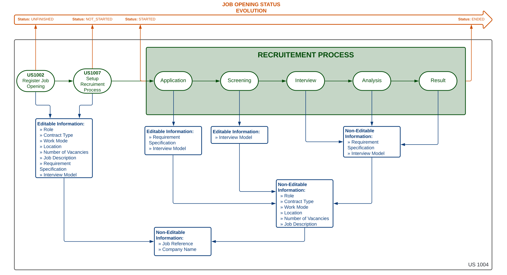

# US 1004

## 1. Context

This is the first time this user story is being requested.

## 2. Requirements

**US 1004** As Customer Manager, I want to edit a job opening.

**Acceptance Criteria:**

- 1004.1. The system should maintain a consistent state

- 1004.2. It is possible to edit every information if they are compatible with the moment.

**Dependencies/References:**

Regarding this user story, we understand that it relates to the user
story [1002](../../sprint-b/sb_us_1002), [1009](../../sprint-b/sb_us_1009) and [1011](../../sprint-b/sb_us_1011).

**Client Clarifications:**

> **Question:** We are assuming that it is allowed to change: number of vacancies; address; contract type; mode;
> description; function. Are we following the correct line of reasoning, or is it necessary to change the list to
> include
> other additional information or delete some of this list?
>
> **Answer:** From my point of view, it should be possible to change “everything” except the job reference itself.
> Consideration must be given to maintaining the system's state of consistency.

> **Question:** When the Costumer Manager wants to edit a Job Opening, are they supposed to choose which Job Opening he
> wants to edit
> based on a reference search?
>
> **Answer:** The question refers a little to good UI/UX practices. The context indicated in the question refers to a
> situation in
> which the user has to identify the entity/object they want to edit. It can be assumed that the user knows this
> identifier. But, in terms of UX/UI, it must be possible to obtain this identification through other means (especially
> because it is an identification generated by the system). I think that, for this particular case, there is already a
> US
> that allows this to be done.

> **Question:** In which or until what recruitment phases of a Job Opening can you edit their information? And what
> information can be
> edited within a Job Opening?
>
> **Answer:** The changes must be compatible with the “moment” in which we are in this job opening. For example, it
> doesn't make sense
> to change the contract type if we are already receiving applications. These applications were made according to a
> description of the job offer and it makes no sense to change it after people have applied. But, for example, it must
> be
> possible to change the job requirements specification (refers to another US) while people apply, as it is a technical
> aspect, which is not public knowledge. Therefore, they must take these types of concerns into account.

## 3. Analysis

Based on the client's responses, I understand that nearly all information within a job opening can be modified if the
timing is appropriate. Specifically, from the initial registration up until the actual start of the recruitment process,
all job opening details can be edited. Although, it is important to note that the Job Reference and the company name
cannot be edited after the job opening has been registered.

However, once the recruitment process begins, certain aspects of the job opening
description, such as the role, contract type, work mode, location, number of vacancies, and job description, can no
longer be changed.
Despite this, the requirement specifications can be adjusted until the end of the application phase,
and the interview model can be modified up until the end of the screening phase if the interview phase is set up.


The following diagram illustrates the clarification made above:




## 4. Design

*In this sections, the team should present the solution design that was adopted to solve the requirement. This should
include, at least, a diagram of the realization of the functionality (e.g., sequence diagram), a class diagram (
presenting the classes that support the functionality), the identification and rational behind the applied design
patterns and the specification of the main tests used to validade the functionality.*

### 4.1. Realization

### 4.2. Class Diagram


### 4.3. Applied Patterns

### 4.4. Tests

*Include here the main tests used to validate the functionality. Focus on how they relate to the acceptance criteria.*

**Test 1:** Verifies that it is not possible to ...

**Refers to Acceptance Criteria:** XXX.1

````
@Test(expected = IllegalArgumentException.class)
public void ensureXxxxYyyy() {
...
}
````

## 5. Implementation

*In this section the team should present, if necessary, some evidencies that the implementation is according to the
design. It should also describe and explain other important artifacts necessary to fully understand the implementation
like, for instance, configuration files.*

*It is also a best practice to include a listing (with a brief summary) of the major commits regarding this
requirement.*

## 6. Integration/Demonstration

In this section the team should describe the efforts realized in order to integrate this functionality with the other
parts/components of the system

It is also important to explain any scripts or instructions required to execute an demonstrate this functionality

## 7. Observations

*This section should be used to include any content that does not fit any of the previous sections.*

*The team should present here, for instance, a critical prespective on the developed work including the analysis of
alternative solutioons or related works*

*The team should include in this section statements/references regarding third party works that were used in the
development this work.*