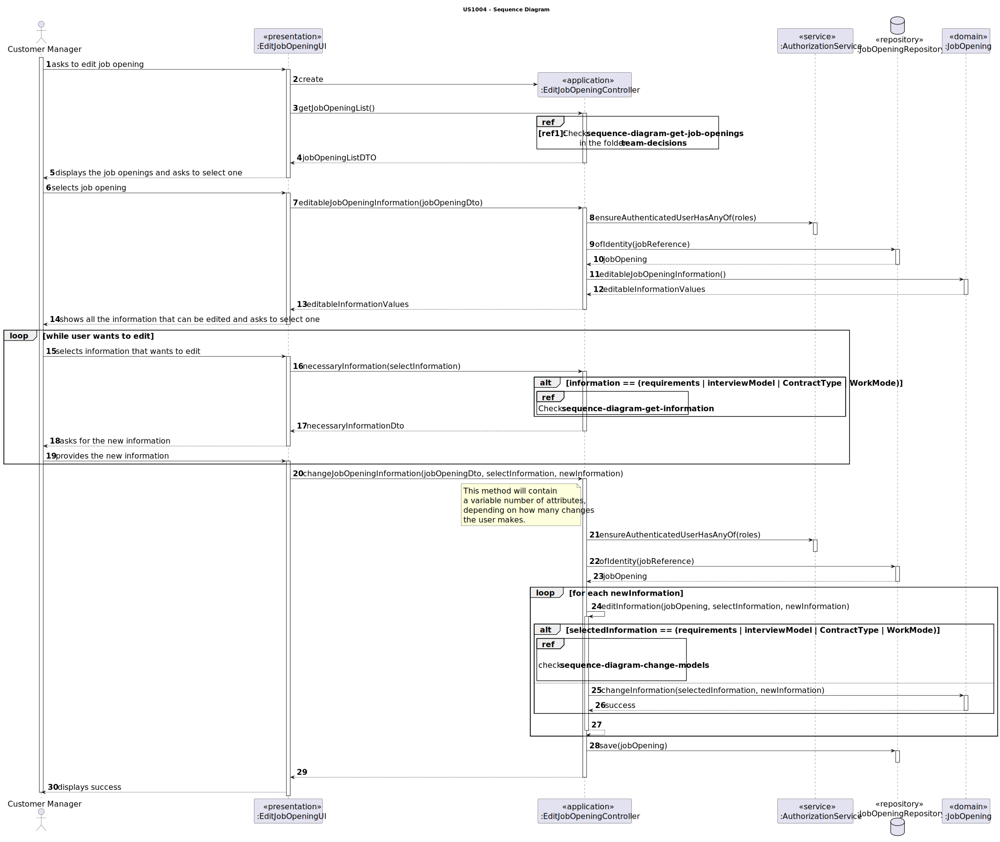
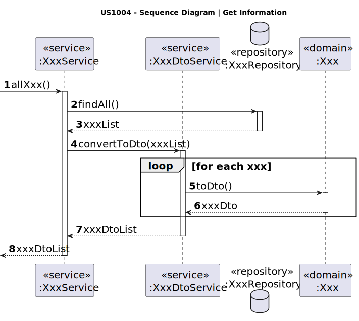
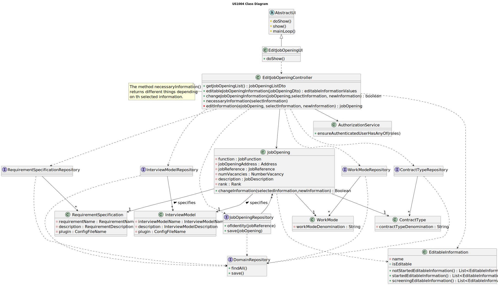

# US 1004

## 1. Context

This is the first time this user story is being requested.

## 2. Requirements

**US 1004** As Customer Manager, I want to edit a job opening.

**Acceptance Criteria:**

- 1004.1. The system should maintain a consistent state

- 1004.2. It is possible to edit information if they are compatible with the moment.

- 1004.3 The Customer code and Company name cannot be edited.

**Dependencies/References:**

Regarding this user story, we understand that it relates to the user
story [1002](../../sprint-b/sb_us_1002), [1009](../../sprint-b/sb_us_1009) and [1011](../../sprint-b/sb_us_1011).

**Client Clarifications:**

> **Question:** We are assuming that it is allowed to change: number of vacancies; address; contract type; mode;
> description; function. Are we following the correct line of reasoning, or is it necessary to change the list to
> include
> other additional information or delete some of this list?
>
> **Answer:** From my point of view, it should be possible to change “everything” except the job reference itself.
> Consideration must be given to maintaining the system's state of consistency.

> **Question:** When the Costumer Manager wants to edit a Job Opening, are they supposed to choose which Job Opening he
> wants to edit
> based on a reference search?
>
> **Answer:** The question refers a little to good UI/UX practices. The context indicated in the question refers to a
> situation in
> which the user has to identify the entity/object they want to edit. It can be assumed that the user knows this
> identifier. But, in terms of UX/UI, it must be possible to obtain this identification through other means (especially
> because it is an identification generated by the system). I think that, for this particular case, there is already a
> US
> that allows this to be done.

> **Question:** In which or until what recruitment phases of a Job Opening can you edit their information? And what
> information can be
> edited within a Job Opening?
>
> **Answer:** The changes must be compatible with the “moment” in which we are in this job opening. For example, it
> doesn't make sense
> to change the contract type if we are already receiving applications. These applications were made according to a
> description of the job offer and it makes no sense to change it after people have applied. But, for example, it must
> be
> possible to change the job requirements specification (refers to another US) while people apply, as it is a technical
> aspect, which is not public knowledge. Therefore, they must take these types of concerns into account.

## 3. Analysis

Based on the client's responses, I understand that nearly all information within a job opening can be modified if the
timing is appropriate. Specifically, from the initial registration up until the actual start of the recruitment process,
all job opening details can be edited. Although, it is important to note that the Job Reference and the company name
cannot be edited after the job opening has been registered.

However, once the recruitment process begins, certain aspects of the job opening
description, such as the role, contract type, work mode, location, number of vacancies, and job description, can no
longer be changed.
Despite this, the requirement specifications can be adjusted until the end of the application phase,
and the interview model can be modified up until the end of the screening phase if the interview phase is set up.

The following diagram illustrates the clarification made above:


To provide a better understanding of the User-System interation, the following system sequence diagram was
created:


### Domain Model


## 4. Design

### 4.1. Realization



#### Sequence Diagram - Get Information



#### Sequence Diagram - Changes Models


**Ref1:** Check the partial sequence diagram
in [team-decisions](../../team-decisions/team-decisions.md#shared-sequence-diagrams) to see the adopted behaviour.

### 4.2. Class Diagram



### 4.3. Applied Patterns

* **DTO**
* **Repository**
* **Service**
* **Information Expert**
* **MVC**

> **MVC**
>
> **Justification:**
>
> The MVC pattern was employed to divide the system into three distinct parts: model, view, and controller, each
> responsible for a specific aspect of the system’s functionality. This separation of concerns enhances maintainability
> and extensibility, as changes to one part do not require changes to the others.

> **Information Expert**
>
> **Justification:**
>
> This pattern was applied to determine which class should be responsible for editing the job opening and understanding
> which information can be edited. In this case, the JobOpening class carries both responsibilities.

> **Repository Pattern**
> * JobOpeningRepository
>
> **Justification:**
>
> The repositories were used to retrieve the persisted job openings and to save the job opening instance after the
> changes were made.

> **DTO**
> * JobOpeningDto
>
> **Justification:**
>
> We opted for DTOs due to the significant amount of domain information required for this functionality. Recognizing the
> benefits of encapsulation and layer decoupling offered by DTOs, we concluded that applying this pattern was
> helpful
> in this context.

> **Service Pattern**
> * JobOpeningManagementService
> * JobOpeningDtoService
> * AuthorizationService
>
> **Justification:**
>
> The services were used to gather job openings to display them to the user, essentially
> listing them. Recognizing the potential for this functionality to be used in various use cases, we opted to
> develop a service with the primary responsibility of: obtaining the persisted instances using their repository and
> using
> the DtoService to transform these instances into DTOs.
> The authorization service was used to verify the roles of the logged-in user.

### 4.4. Tests

#### JobOpeningTests

**Test 1:** Verifies that it is not possible to edit the job reference.

**Refers to Acceptance Criteria:** 1004.1 and 1004.3

````
@Test(expected = IllegalArgumentException.class)
public void ensureCantChangeJobReference() {
...
}
````

**Test 2:** Verifies that it is not possible to edit public information where the current job opening status isn't
compatible.

**Refers to Acceptance Criteria:** 1004.2

````
@Test(expected = IllegalArgumentException.class)
public void ensureCanEditPublicInformationOnlyIfStatusIsValid() {
...
}
````

**Test 3:** Verifies that the requirement specification cannot be edited if the recruitment process phase is not
compatible.

**Refers to Acceptance Criteria:** 1004.1 and 1004.2

````
@Test(expected = IllegalArgumentException.class)
public void ensureCanEditReqSpecificationOnlyIfPhaseIsValid() {
...
}
````

**Test 4:** Verifies that the interview model cannot be edited if the recruitment process phase is not compatible.

**Refers to Acceptance Criteria:** 1004.1 and 1004.2

````
@Test(expected = IllegalArgumentException.class)
public void ensureCanEditInterviewModelOnlyIfPhaseIsValid() {
...
}
````

## 5. Implementation

### EditJobOpeningController

```
public boolean changeJobOpeningInformation(JobOpeningDTO jobOpeningDTO, List<EditableInformation> selectedInformation, List<String> newInformation) {
    auth.ensureAuthenticatedUserHasAnyOf(BaseRoles.CUSTOMER_MANAGER);

    Optional<JobOpening> jobOpeningOptional = jobOpeningRepo.ofIdentity(new JobReference(jobOpeningDTO.getJobReference()));

    if (jobOpeningOptional.isPresent()) {
        JobOpening jobOpening = jobOpeningOptional.get();
        jobOpeningRepo.save(editInformation(jobOpening, selectedInformation, newInformation));
        return true;
    }
    return false;
}

```

```
private JobOpening editInformation(JobOpening jobOpening, List<EditableInformation> selectedInformation, List<String> newInformation) {
    for (int i = 0; i < selectedInformation.size(); i++) {
        EditableInformation info = selectedInformation.get(i);
        String newInfo = newInformation.get(i);

        if (info.equals(CONTRACT_TYPE)) {
            contractTypeRepository.ofIdentity(newInfo)
                    .ifPresentOrElse(jobOpening::changeContractType, () -> {
                        throw new IllegalArgumentException("Specified contract type is not supported");
                    });
        } else if (info.equals(WORK_MODE)) {
            workModeRepository.ofIdentity(newInfo)
                    .ifPresentOrElse(jobOpening::changeWorkMode, () -> {
                        throw new IllegalArgumentException("Specified work mode is not supported");
                    });
        } else if (info.equals(REQ_SPECI)) {
            requirementSpecificationRepository.ofIdentity(new RequirementName(newInfo))
                    .ifPresentOrElse(jobOpening::changeRequirementSpecification, () -> {
                        throw new IllegalArgumentException("Specified requirement is not supported");
                    });
        } else if (info.equals(INT_MODEL)) {
            interviewModelRepository.ofIdentity(new InterviewModelName(newInfo))
                    .ifPresentOrElse(jobOpening::changeInterviewModel, () -> {
                        throw new IllegalArgumentException("Specified interview model is not supported");
                    });
        } else {
            jobOpening.changeInformation(info, newInfo);
        }
    }
    return jobOpening;
}
```

### JobOpening

````
    public List<EditableInformation> editableJobOpeningInformation() {
        String statusDescription = this.status.getStatusDescription();
        
        if ("UNFINISHED".equals(statusDescription) || "NOT_STARTED".equals(statusDescription)) {
            return EditableInformation.notStartedEditableInformation();
        }

        if ("STARTED".equals(statusDescription)) {
            String activePhase = recruitmentProcess.currentActivePhase().toLowerCase();
            switch (activePhase) {
                case "application":
                case "none active":
                    return EditableInformation.startedEditableInformation();
                case "screening":
                    return EditableInformation.screeningEditableInformation();
                default:
                    throw new IllegalStateException("It isn't possible to alter any information in the job opening");
            }
        }
        throw new IllegalStateException("It isn't possible to alter any information in the job opening");
    }
````

````
public void changeInformation(EditableInformation selecttedInformation, String newInformation) {
    if (EditableInformation.isEditable(selecttedInformation.toString())) {
        if (selecttedInformation.equals(EditableInformation.ADDRESS)) {
            changeAddress(newInformation);
        } else if (selecttedInformation.equals(EditableInformation.DESCRIPTION)) {
            changeDescription(newInformation);
        } else if (selecttedInformation.equals(EditableInformation.FUNCTION)) {
            changeFunction(newInformation);
        } else if (selecttedInformation.equals(EditableInformation.NUM_VACANCIES)) {
            changeNumVacancies(newInformation);
        }
    }
}
````

````
public void changeRequirementSpecification(RequirementSpecification requirementSpecification) {
    Preconditions.noneNull(requirementSpecification);
    Preconditions.ensure(!status.getStatusDescription().equals(String.valueOf(JobOpeningStatusEnum.ENDED)));
    if (status.getStatusDescription().equals(String.valueOf(JobOpeningStatusEnum.STARTED))) {
        Preconditions.ensure(recruitmentProcess.currentActivePhase().equalsIgnoreCase("Application"));
    }
    this.requirementSpecification = requirementSpecification;
}

public void changeInterviewModel(InterviewModel interviewModel) {
    Preconditions.noneNull(requirementSpecification);
    Preconditions.ensure(!status.getStatusDescription().equals(String.valueOf(JobOpeningStatusEnum.ENDED)));
    if (status.getStatusDescription().equals(String.valueOf(JobOpeningStatusEnum.STARTED))) {
        String active = recruitmentProcess.currentActivePhase();
        Preconditions.ensure(active.equalsIgnoreCase("Application") || active.equalsIgnoreCase("Screening"));
    }
    this.interviewModel = interviewModel;
}
````

````
public void changeWorkMode(WorkMode newInfo) {
    if (status.getStatusDescription().equals(String.valueOf(JobOpeningStatusEnum.NOT_STARTED)) || status.getStatusDescription().equals(String.valueOf(JobOpeningStatusEnum.UNFINISHED))) {
        this.workMode = newInfo;
    } else {
        throw new IllegalArgumentException("Unable to change information.");
    }
}

private void changeNumVacancies(String newInfo) {
    if (status.getStatusDescription().equals(String.valueOf(JobOpeningStatusEnum.NOT_STARTED)) || status.getStatusDescription().equals(String.valueOf(JobOpeningStatusEnum.UNFINISHED))) {
        this.numVacancies = NumberVacancy.valueOf(Integer.parseInt(newInfo));
    } else {
        throw new IllegalArgumentException("Unable to change information.");
    }
}

private void changeFunction(String newInfo) {
    if (status.getStatusDescription().equals(String.valueOf(JobOpeningStatusEnum.NOT_STARTED)) || status.getStatusDescription().equals(String.valueOf(JobOpeningStatusEnum.UNFINISHED))) {
        this.function = JobFunction.valueOf(newInfo);
    } else {
        throw new IllegalArgumentException("Unable to change information.");
    }
}

private void changeDescription(String newInfo) {
    if (status.getStatusDescription().equals(String.valueOf(JobOpeningStatusEnum.NOT_STARTED)) || status.getStatusDescription().equals(String.valueOf(JobOpeningStatusEnum.UNFINISHED))) {
        this.description = Description.valueOf(newInfo);
    } else {
        throw new IllegalArgumentException("Unable to change information.");
    }
}

public void changeContractType(ContractType newInfo) {
    if (status.getStatusDescription().equals(String.valueOf(JobOpeningStatusEnum.NOT_STARTED)) || status.getStatusDescription().equals(String.valueOf(JobOpeningStatusEnum.UNFINISHED))) {
        this.contractType = newInfo;
    } else {
        throw new IllegalArgumentException("Unable to change information.");
    }
}

private void changeAddress(String newInfo) {
    if (status.getStatusDescription().equals(String.valueOf(JobOpeningStatusEnum.NOT_STARTED)) || status.getStatusDescription().equals(String.valueOf(JobOpeningStatusEnum.UNFINISHED))) {
        this.address = Address.valueOf(newInfo);
    } else {
        throw new IllegalArgumentException("Unable to change information.");
    }
}
````

## 6. Integration/Demonstration

To use this feature, you'll need to run the script named `run-backoffice-app` and log in with Customer Manager
permissions.

Then, navigate to the _Job Opening_ menu and select option 7 - `Edit a job opening` - to access this
feature.

```
+= Edit Job Opening ===========================================================+

Select a job opening
1.
»» Job Reference: ISEP-1
» Function: Front End Junior Developer
» Contract Type: full-time
» Work Mode: remote
» Address: 123 Main Street, USA, Flagtown, Star District, 4500-900
» Description: Night Guard.
» Number of Vacancies: 2
» Company: ISEP

2.
»» Job Reference: ISEP-2
» Function: Back End Senior Developer
» Contract Type: full-time
» Work Mode: remote
» Address: 456 Elm Street, Canada, Maple Town, Moonlight District, 4500-900
» Description: Night Guard.
» Number of Vacancies: 15
» Company: ISEP

3.
»» Job Reference: ISEP-3
» Function: Back End Senior Developer
» Contract Type: full-time
» Work Mode: remote
» Address: MM Street, MMM, MM Town, MM District, 4500-900
» Description: Night Guard.
» Number of Vacancies: 8
» Company: ISEP

0. Exit
Select an option:
2

Select the information to be edited
1. Address
2. Number Of Vacancies
3. Function
4. Description
5. Contract Type
6. Work Mode
7. Requirement Specification
8. Interview Model
0. Exit
Select an option:
5

Select the new contract type
1. full-time
2. part-time
0. Exit
Select an option:
2

Do you want to continue editing?
0 - Yes
1 - No
0

Select the information to be edited
1. Address
2. Number Of Vacancies
3. Function
4. Description
5. Contract Type
6. Work Mode
7. Requirement Specification
8. Interview Model
0. Exit
Select an option:
2

New Number Of Vacancies
5

Do you want to continue editing?
0 - Yes
1 - No
1

The job opening was successfully edited.
+==============================================================================+
```

## 7. Observations

This user story revealed to be very challenging, as there are many verifications to be done to determine what can be
edited or not. The class EditableInformation was essential in overcoming these difficulties by streamlining the
verification process. 

Additionally, the functionality became even more complex because some of the job openings'
attributes are also entities, adding another layer of intricacy to the task.