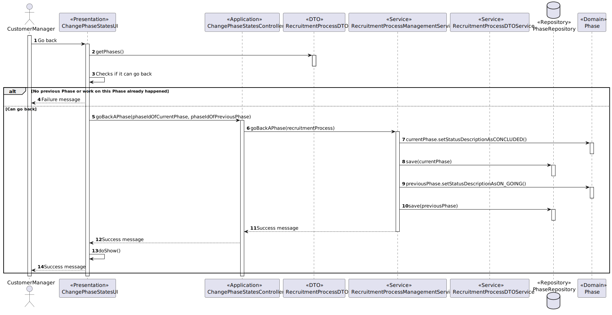

# US 1010

## 1. Context

This is the first time this US is being worked on. It is related to an action of the Customer Manager.

## 2. Requirements

**US 1010:** As Customer Manager, I want to open or close phases of the process for a job opening.

### Acceptance Criteria:

- **1010.1.** The system should only show Job Openings that have an ongoing recruitment process.
- **1010.2.** The Job Openings should be chosen through their job references.
- **1010.3.** The phases of a Job Opening are to be done in a sequential manner, so closing a phase means opening the next ( Unless it's the results phase. )
- **1010.4.** When the user closes a "Results" Phase, the system should also change the status of the related Recruitment Process to the equivalent of "CLOSED"
- **1010.5.** When the user closes a "Results" Phase, the system should also change the status of the Job Opening, related to this Recruitment Process, to the equivalent of "CLOSED".
- **1010.6.** When moving on to a "Screening" Phase, the system should only let the user start said phase if a requirement specification model has been selected.
- **1010.7.** When moving on to an "Interview" Phase, the system should only let the user start said phase if an interview model has been selected.

### Client Clarifications:

>**Question:** Regarding section 2.2.1 and the phases of the recruitment process, in order to move to the next phase, does the previous one have to close or can we move forward without having the previous one closed?
>
>**Answer:** The short answer is that the phases should be sequential and not overlapping. When one phase closes, the next one opens. US 1007 provides for the definition of phases. US 1010 provides for the opening and closing phases of the process. The Customer Manager's decision to close a phase must assume that the process advances to the next phase automatically (regardless of the dates defined for the phases).

>**Question:** US1007/US1010. According to these US's and Q16, each Job Opening must have defined phases. In questions Q23, Q32 and Q45 the status of the application is mentioned. Are the Job Opening phase and application status separate concepts or do they refer to the same thing?
>
>**Answer:** As previously mentioned, they are related but different concepts.

>**Question:** US 1010 - Open or close phases of the process for a job opening. – When the Customer Manager wants to open or close a recruitment phase, he must have the opportunity to choose which phase he wants to open or close, or he automatically advances to the next phase, that is, he closes the current phase and opens the next one.
>
>**Answer:** Already answered in Q16. But, in short, the idea of this US is to allow progress in the phases of a job opening. The phases must always be sequential. We can consider that closing a phase results in the opening of the next phase (and moving to the next phase means closing the previous one). It should not be possible to “skip” phases, unless phases that are not part of the process (for example, if there are no interviews).

>**Question:** I would like to know what it means to open or close the phases of a job opening, taking into account US1007 the dates have already been defined for each phase.
>
>**Answer:** Please see Q16 (and other questions on the same topic). This US allows the process to change phase (typically to advance the process). Phases have dates but, as mentioned in Q16, we can “activate” a phase even if we are not yet in its time range. The phase dates are “indicative”, in the sense that they suggest, in particular to the Customer Manager, how to manage the process over time. There are “operations” that must happen when the respective phase is “active”.

>**Question:** In the last sprint, the dates on which each phase of a job opening begins were defined, in which it is possible to close and open phases. My question would be the following, if you want to close a phase before the next one begins, is the start of this next phase anticipated? In the scenario that the start date of a phase y has already passed, with x (predecessor) having been closed, if you want to reopen doing x, is it possible? Or should the system prohibit this attempt as it violates the defined dates?
>
>**Answer:** See Q147 and Q16. “Switching” phases to “retreat” must be possible if the phase you wish to “abandon” is not yet, in fact, being “executed/active”. For example, if I'm in the screening phase and have already started checking candidate requirements, it doesn't make sense to be able to “return” to the application phase. But if I was in the application phase and decided to move on to the next one (screening) and after some time I want to return to the previous one (for example, because I made a mistake and I'm still receiving applications), I should be able to do so if I haven't already no “operation/processing” specific to the screening phase was carried out. When it comes to moving forward, a similar principle must be applied: it must be possible to move to the next phase if the previous one is “completed”, for example, I can move on to the interviews if the screening is completed, that is, if all candidates have been verified and notified. Typically/normally, the phases are to advance sequentially.

>**Question:** US 1010 - In US 1010, considering that when we close a phase the next one begins, when we consider the case of reaching the last phase, when we close the phase should we also change the status of the job opening?
>
>**Answer:** A153 See Q151. As for the second question, when the last phase of a process is closed, this process ends, that is, this job opening is no longer “active”.

>**Question:** US1010 - The system for Us1010 must perform validations, for example, the user cannot open the interview phase if the interview model has not yet been defined, or the user can change phase but will not be able, in this case, to execute the interview evaluation process while you do not have an interview specification assigned?
>
>**Answer:** I think you can do that. What you shouldn't do is conduct interviews without having the interview model specified.

>**Question:** US1010 – Should the user choose the phase they want to open or close?
>
>**Answer:** Without wanting to condition the UI/UX, I think that one possibility would be for the system to present the current phase of the process and indicate what is possible to do. If it is possible to move forward or backward, it must indicate that it is possible and the resulting phase. If it is not (yet) possible to move forward/backward, you must indicate the justification for this fact.

>**Question:** We consider that an "open" phase is not the same as an "active" phase. The "open" phase is a phase that is available to be executed, while the "active" phase is a phase that is being executed. Do you agree with this distinction? Because if the system automatically considers the next phase as "open" when closing a phase and if "open" is the same as "active/in progress" then it will never be possible to "go back" to the phase.
> 
>**Answer:** Yes, I think what you say is in line with what I tried to explain in the previous questions about this US. I used the terms “open” and “close” to indicate the opening and closing of the phases. I used the term “active” to indicate that some specific operation of the phase had already been executed (or was being executed) and I then considered that phase as “active”, which meant that I could not change the phase until these “operations” were finished. 

>**Question:** Open or close phases of the process for a job opening – For this User Story, considering that the "Application" phase was closed on 19/05 and we are currently in the "Screening" phase. If it is necessary to go back to the previous phase, should the dates be adjusted? As it may affect the dates of subsequent phases that have not yet started.
>
>**Answer:** The previously indicated possibility that allows “going back” in the phases must be considered exceptional, but possible if the consistency of the system is guaranteed. When that happens I don't see the need to adjust dates.

>**Question:** You have already talked about the possibility of reopening a phase when a phase is in the "open" state. My question is whether, for example, the resume_screen phase, if completed but not closed, can be put into progress. In short, when a phase is completed, should we give the possibility to close the phase and open the next one and also the possibility of returning to the "in progress" state?
>
>**Answer:** I can't give a clear answer because there are some concepts that require clarification: “resume_screen”, “in progress”, etc. What I can reinforce is that they must always ensure that the consistency of the system is maintained.

>**Question:** If I am in the first phase and if it is in the "open" state, can I move the phase back and set the recruitment process as not started?
>
>**Answer:** It seems to me a particular case of the previous answers on this topic.

>**Question:** In terms of phase states, are the completed and closed states synonymous or do they represent different concepts? He gave an example for the "screening" phase, which is completed when all candidates have been verified and notified. Can you give an explanation for the other existing phases, when can we consider them closed?
>
>**Answer:** When, in previous questions on this topic, I used the term completed, it was in the sense of indicating that the activities related to the “purpose” of the phase had been completed, concluded, therefore the conditions would be met to be able to move on to the next phase (i.e., close the current). When it comes to the conditions for each phase, I think you should think about the problem and try to identify them. As the question is posed, it seems very broad to me and I think you should be able to reach them through a detailed analysis of the problem. But if you have more specific questions I can try to answer them.

>**Question:** About phases of the recruitment process and the concept of active/deactivated and open/closed – For example, if we are in the application phase, how do I know if it will be “deactivated” and that we can move on to the next one?
>
>**Answer:** The expressions “active” and “deactivate” are ways for me to indicate that the “activity” or “objective” of a phase is taking place. In the specific case of the application phase, the system will be receiving applications. Applications will be received by email and must be processed by the deadline that was “publicized” to potential candidates as the limit for receiving applications. Let's admit that the application deadline coincides with the date defined for the end of the application phase. This meant that, in this case, we could only advance to the next phase after reaching the end date of the application phase. However, I admit that it can be done sooner, as long as the user is alerted by the system that the deadline for submitting applications has not yet been reached.

>**Question:** When can you step back?
>
>**Answer:** The general principle is, if you are not doing anything specific to the current phase, you can back off. For example, if you are in the interview phase and have not yet started evaluating any interviews, then you can go back to the screening phase. Although there is no point re-evaluating candidates' requirements if they have already been notified of the result. In a real situation, where an error occurs that invalidates a result that has already been notified to third parties (candidates or companies) we can assume that this will be resolved within the scope of an exceptional process that is outside the scope of our current system (the system does not have currently support these cases).

### Dependencies/References:

#### Dependency with US 1002:
> US 1010 is dependent on this US since it needs Job Openings to exist for it to find Job Openings with phases that can be started or/and closed.

#### Dependency with US 1007:
> US 1010 is dependent on this US since it needs the phases to be first created and prepared in stand-by to be then started by this US.

## 3. Analysis

**After questioning the client about this functionality several conclusions were reached:**

1. ***"When one phase closes, the next one opens."***
2. ***"The Customer Manager's decision to close a phase must assume that the process advances to the next phase automatically (regardless of the dates defined for the phases)."***
3. ***"The phases must always be sequential. We can consider that closing a phase results in the opening of the next phase (and moving to the next phase means closing the previous one)."***

### System Sequence Diagram Related


Go Back Scenario:


Start Phase Scenario:


## 4. Design

### 4.1. Realization

#### State Diagram


#### Sequence Diagram Related


Go Back Scenario:


Start Phase Scenario:


### 4.2. Class Diagram


### 4.3. Applied Patterns

This topic presents the classes with the patterns applied to them along with justifications.
>**DTO Pattern**
> * JobOpeningDTO
> * RecruitmentProcessDTO
> * PhaseDTO
> 
> **Justifications**
>
> * The usage of the JobOpeningDTO, RecruitmentProcessDTO and PhaseDTO comes from the fact that we wanted this class to server as one more layer of encapsulation between the UI and the domain classes,
    > and for security reasons, as to avoid someone using the UI to be able to change domain objects that should only be reached using the controller.
>
>**Repository Pattern**
> * CustomerRepository
> * JobOpeningRepository
> * RecruitmentProcessRepository
> * PhaseRepository
>
> **Justifications**
>
> * As per requested, the job reference that identifies the job opening should have the customer code as a base, and be
    sequential. If the previous job opening from the same customer was made in a different session, then the current session
    does not have access to its job reference, so it must be retrieved from the job openings' repository database.
    The newly created jobOpening instance will be saved/preserved in its repository.
>
> * The customers assigned to the Customer Manager are stored within the CustomerRepository, persisting and rebuilding them
    between sessions, same for the Recruitment Processes and Phases.

>**Service Pattern**
> * JobOpeningListDTOService
> * CustomerManagementService
> * RecruitmentProcessManagementService
> * RecruitmentProcessDTOService
> * PhaseManagementService
> * JobOpeningManagementService
> * AuthorizationService
>
> **Justifications**
>
> * CustomerManagementService is used in more than one functionality, and its in charge of managing request regarding customers,
    >   serving as encapsulation between the controller and the CustomerRepository along with the domain classes.
>
> * JobOpeningManagementService is used in more than one functionality, and its in charge of managing request regarding
    >   jobOpenings, serving as encapsulation between the controller and the JobOpeningRepository along with the domain classes.
>
> * In order to enforce encapsulation amongst layers and adequate responsibility assigment, the JobOpeningListDTOService and others were
    >   created, besides being a set of instructions that is used in other functionalities.
>
> * To get the customers that are assigned to the current Customer Manager in-session, we must get something to identify them.
    >   The AuthorizationService allows to get the username (user's email), which is essential to then filter the CustomerRepository
    >   to the desired customers. This set of instructions is used in other functionalities too.

### 4.4. Tests

No new tests were made regarding the domain entities within this functionality.

> * [US1007 - Tests](../../sprint-b/sb_us_1007/readme.md/#44-tests)

## 5. Implementation

### ChangePhaseStatusUI

```
package jobs4u.base.app.backoffice.console.presentation.recruitmentprocess;

import eapli.framework.presentation.console.AbstractUI;
import eapli.framework.presentation.console.SelectWidget;
import jobs4u.base.app.backoffice.console.presentation.requirementspecification.JobOpeningDTOPrinter;
import jobs4u.base.jobopeningmanagement.dto.JobOpeningDTO;
import jobs4u.base.recruitmentprocessmanagement.application.ChangePhaseStatesController;
import jobs4u.base.recruitmentprocessmanagement.domain.RecruitmentProcessStatusEnum;
import jobs4u.base.recruitmentprocessmanagement.dto.RecruitmentProcessDTO;

import java.util.Scanner;

public class ChangePhaseStatesUI extends AbstractUI {

    private ChangePhaseStatesController controller = new ChangePhaseStatesController();

    private Scanner read = new Scanner(System.in);

    @Override
    protected boolean doShow() {

        System.out.println();

        SelectWidget<JobOpeningDTO> selector_jo;
        final JobOpeningDTO jobOpeningDTO;

        try {
            selector_jo = new SelectWidget<>("Select A Job Opening:", controller.getJobOpeningList(), new JobOpeningDTOPrinter());
            selector_jo.show();
            jobOpeningDTO = selector_jo.selectedElement();
        } catch (ClassNotFoundException e) {
            throw new RuntimeException(e);
        }

        RecruitmentProcessDTO recruitmentProcessDTO = null;

        try {
            recruitmentProcessDTO = controller.getRecruitmentProcessDTOWithJobReference(jobOpeningDTO.getJobReference());
            System.out.println(recruitmentProcessDTO.toString());
        } catch (ClassNotFoundException e) {
            throw new RuntimeException(e);
        }

        System.out.println("Do you want to go back a phase or move on to the next? (Back | Next)");
        String answer = read.next();

        while(true) {
            if (answer.equalsIgnoreCase("back")) {
                if(checkIfItCanGoBack(recruitmentProcessDTO)){
                    controller.goBackAPhase(recruitmentProcessDTO.getJobOpening());
                }
                break;
            } else if (answer.equalsIgnoreCase("next")) {
                if(checkIfItCanGoNext(recruitmentProcessDTO)){
                    controller.goNextPhase(recruitmentProcessDTO.getJobOpening());
                }
                break;
            } else {
                System.out.println("Wrong Answer. Try Again:\n");
                answer = read.next();
            }
        }

        System.out.println("Worked!\n");

        return false;
    }

    private boolean checkIfItCanGoNext(RecruitmentProcessDTO recruitmentProcessDTO) {
        if(recruitmentProcessDTO.getRecruitmentProcessStatus().equals(String.valueOf(RecruitmentProcessStatusEnum.RESULTS))) {
            System.out.println("You'll Be Ending The Recruitment Process.\n");
            System.out.println("Are You Sure? (Yes | No)");
            String answer = read.next();

            if(answer.equalsIgnoreCase("yes") || answer.equalsIgnoreCase("y")){
                return true;
            } else {
                return false;
            }
        } else if(recruitmentProcessDTO.getRecruitmentProcessStatus().equals(String.valueOf(RecruitmentProcessStatusEnum.CONCLUDED))) {
            System.out.println("Unable To Open Next Phase.\n");
            System.out.println("REASON : Recruitment Process Has Concluded.\n");
            return false;
        } else if(recruitmentProcessDTO.getRecruitmentProcessStatus().equals(String.valueOf(RecruitmentProcessStatusEnum.PLANNED))) {
            System.out.println("You'll Be Starting The Recruitment Process.");
            System.out.println("Are You Sure? (Yes | No)");
            String answer = read.next();

            if(answer.equalsIgnoreCase("yes") || answer.equalsIgnoreCase("y")){
                return true;
            } else {
                return false;
            }
        } else {
            return true;
        }
    }

    public boolean checkIfItCanGoBack(RecruitmentProcessDTO recruitmentProcessDTO){
        if(recruitmentProcessDTO.getRecruitmentProcessStatus().equals(String.valueOf(RecruitmentProcessStatusEnum.PLANNED)) || recruitmentProcessDTO.getRecruitmentProcessStatus().equals(String.valueOf(RecruitmentProcessStatusEnum.CONCLUDED))){
            System.out.println("Unable To Go Back.");
            System.out.println("REASON : Recruitment Process Hasn't Started Or Has Concluded.");
            return false;
        } else {
            System.out.println("Has Any Progress Been Made On The Current Phase? (Yes | No)");
            String answer = read.next();

            if(answer.equalsIgnoreCase("yes") || answer.equalsIgnoreCase("y")){
                System.out.println("Unable To Go Back A Phase.");
                System.out.println("REASON : Progress Has Been Made On The Current Phase.");
                return false;
            } else {
                return true;
            }
        }
    }

    @Override
    public String headline() {
        return "=-=-=-=-=-=OPENING/CLOSING PHASES=-=-=-=-=-=\n";
    }
}

```

### ChangePhaseStatusController

```
package jobs4u.base.recruitmentprocessmanagement.application;

import eapli.framework.infrastructure.authz.application.AuthorizationService;
import eapli.framework.infrastructure.authz.application.AuthzRegistry;
import eapli.framework.infrastructure.authz.domain.model.SystemUser;
import jobs4u.base.customermanagement.application.CustomerManagementService;
import jobs4u.base.jobopeningmanagement.application.JobOpeningListDTOService;
import jobs4u.base.jobopeningmanagement.application.JobOpeningManagementService;
import jobs4u.base.jobopeningmanagement.domain.JobReference;
import jobs4u.base.jobopeningmanagement.dto.JobOpeningDTO;
import jobs4u.base.recruitmentprocessmanagement.dto.RecruitmentProcessDTO;
import jobs4u.base.usermanagement.domain.BaseRoles;
import org.hibernate.mapping.Collection;

import java.util.Collections;
import java.util.NoSuchElementException;
import java.util.Optional;

public class ChangePhaseStatesController {

    private final AuthorizationService authz;
    private final CustomerManagementService customerManagementService;
    private final JobOpeningManagementService jobOpeningManagementService;
    private final RecruitmentProcessManagementService recruitmentProcessManagementService;
    private final JobOpeningListDTOService jobOpeningListDTOService;

    public ChangePhaseStatesController() {
        this.authz = AuthzRegistry.authorizationService();
        this.customerManagementService = new CustomerManagementService();
        this.jobOpeningManagementService = new JobOpeningManagementService();
        this.jobOpeningListDTOService = new JobOpeningListDTOService();
        this.recruitmentProcessManagementService = new RecruitmentProcessManagementService();
    }
    public Iterable<JobOpeningDTO> getJobOpeningList() throws ClassNotFoundException {
        authz.ensureAuthenticatedUserHasAnyOf(BaseRoles.CUSTOMER_MANAGER);
        Optional<SystemUser> user = authz.loggedinUserWithPermissions(BaseRoles.CUSTOMER_MANAGER);
        if (user.isPresent()) {
            return jobOpeningManagementService.plannedJobOpeningsOfCustomerManager(user.get().username());
        }else {
            return Collections.emptyList();
        }

    }

    public RecruitmentProcessDTO getRecruitmentProcessDTOWithJobReference(String jobReference) throws ClassNotFoundException {
        try {
            return recruitmentProcessManagementService.getRecruitmentProcessWithJobReference(new JobReference(jobReference));
        }catch(Exception e){
            System.out.println("[ No Job Openings Found Associated To This Customer Manager ]");
            throw new ClassNotFoundException("It was not possible to retrieve the job opening's data.");
        }
    }

    public boolean goBackAPhase(String jobReference) {
        try {
            recruitmentProcessManagementService.goBackAPhase(jobReference);
        }catch (Exception e){
            return false;
        }
        return true;
    }

    public boolean goNextPhase(String jobReference) {
        try {
            recruitmentProcessManagementService.goNextPhase(jobReference);
        }catch (Exception e){
            return false;
        }
        return true;
    }
}

```

### RecuitmentProcessManagementService

```
package jobs4u.base.recruitmentprocessmanagement.application;

import jobs4u.base.infrastructure.persistence.PersistenceContext;
import jobs4u.base.jobopeningmanagement.application.JobOpeningManagementService;
import jobs4u.base.jobopeningmanagement.domain.JobOpening;
import jobs4u.base.jobopeningmanagement.domain.JobReference;
import jobs4u.base.recruitmentprocessmanagement.domain.Phase;
import jobs4u.base.recruitmentprocessmanagement.domain.RecruitmentProcess;
import jobs4u.base.recruitmentprocessmanagement.domain.RecruitmentProcessStatus;
import jobs4u.base.recruitmentprocessmanagement.domain.RecruitmentProcessStatusEnum;
import jobs4u.base.recruitmentprocessmanagement.dto.AllPhasesDTO;
import jobs4u.base.recruitmentprocessmanagement.dto.PhaseDTO;
import jobs4u.base.recruitmentprocessmanagement.dto.RecruitmentProcessDTO;
import jobs4u.base.recruitmentprocessmanagement.repository.RecruitmentProcessRepository;

import java.util.ArrayList;
import java.util.Calendar;
import java.util.List;
import java.util.Optional;

public class RecruitmentProcessManagementService {

    private static final RecruitmentProcessRepository recruitmentProcessRepository = PersistenceContext.repositories().recruitmentProcesses();

    private static final JobOpeningManagementService jobOpeningManagementService = new JobOpeningManagementService();

    public static RecruitmentProcess setupRecruitmentProcess(Calendar start, Calendar end, AllPhasesDTO allPhasesDTO, JobOpening jobOpening){

        List<Phase> listPhases = new ArrayList<>();

        RecruitmentProcess recruitmentProcess = new RecruitmentProcess(start, end, listPhases, new RecruitmentProcessStatus(String.valueOf(RecruitmentProcessStatusEnum.PLANNED)));

        for (PhaseDTO phaseDTO : allPhasesDTO.getListOfPhases()){
            Phase phase = new Phase(phaseDTO.getPhaseType(), phaseDTO.getDescription(), phaseDTO.getInitialDate(), phaseDTO.getFinalDate());
            listPhases.add(phase);
        }

        recruitmentProcess.addPhases(listPhases);

        recruitmentProcess = recruitmentProcessRepository.save(recruitmentProcess);

        return recruitmentProcess;
    }

    public boolean saveToRepository(RecruitmentProcess recruitmentProcess){
        try{
            recruitmentProcessRepository.save(recruitmentProcess);
        }catch (Exception e){
            return false;
        }
        return true;
    }

    public RecruitmentProcessDTO getRecruitmentProcessWithJobReference(JobReference jobReference){
        return recruitmentProcessRepository.getRecruitmentProcessByJobReference(jobReference).get().toDTO();
    }

    public boolean goBackAPhase(String jobReference) {
        List<RecruitmentProcessStatusEnum> recruitmentProcessStatusEnum = new ArrayList<>();
        for (RecruitmentProcessStatusEnum recruitmentProcessStatusEnum1 : RecruitmentProcessStatusEnum.values()){
            recruitmentProcessStatusEnum.add(recruitmentProcessStatusEnum1);
        }
        int i = 0;
        Optional<RecruitmentProcess> recruitmentProcess = recruitmentProcessRepository.getRecruitmentProcessByJobReference(new JobReference(jobReference));
        RecruitmentProcess recruitmentProcess1 = recruitmentProcess.get();
        try {
            while(!(String.valueOf(recruitmentProcessStatusEnum.get(i)).equals(recruitmentProcess1.recruitmentProcessStatus().currentStatus().toString()))){
                i++;
            }

            recruitmentProcess1.changeStatus(String.valueOf(recruitmentProcessStatusEnum.get(i-1)));
            recruitmentProcessRepository.save(recruitmentProcess1);

            if(String.valueOf(RecruitmentProcessStatusEnum.CONCLUDED).equals(recruitmentProcess1.recruitmentProcessStatus().toString())){
                JobOpening jobOpening = jobOpeningManagementService.getJobOpeningByJobRef(jobReference).get();
                jobOpening.updateStatusToEnded();
                jobOpeningManagementService.saveToRepository(jobOpening);
            }

        }catch (Exception e){
            return false;
        }
        return true;
    }

    public boolean goNextPhase(String jobReference) {
        List<RecruitmentProcessStatusEnum> recruitmentProcessStatusEnum = new ArrayList<>();
        for (RecruitmentProcessStatusEnum recruitmentProcessStatusEnum1 : RecruitmentProcessStatusEnum.values()){
            recruitmentProcessStatusEnum.add(recruitmentProcessStatusEnum1);
        }
        int i = 0;
        Optional<RecruitmentProcess> recruitmentProcess = recruitmentProcessRepository.getRecruitmentProcessByJobReference(new JobReference(jobReference));
        RecruitmentProcess recruitmentProcess1 = recruitmentProcess.get();
        try {
            while(!(String.valueOf(recruitmentProcessStatusEnum.get(i)).equals(recruitmentProcess1.recruitmentProcessStatus().currentStatus().toString()))){
                i++;
            }

            recruitmentProcess1.changeStatus(String.valueOf(recruitmentProcessStatusEnum.get(i+1)));
            recruitmentProcessRepository.save(recruitmentProcess1);

            if(String.valueOf(RecruitmentProcessStatusEnum.CONCLUDED).equals(recruitmentProcess1.recruitmentProcessStatus().toString())){
                JobOpening jobOpening = jobOpeningManagementService.getJobOpeningByJobRef(jobReference).get();
                jobOpening.updateStatusToEnded();
                jobOpeningManagementService.saveToRepository(jobOpening);
            }

        }catch (Exception e){
            return false;
        }
        return true;
    }
}

```


## 6. Integration/Demonstration

To activate this feature, you'll need to run the script named `run-backoffice-app` and log in with Customer Manager
permissions. Then, navigate to the "Job Openings" menu and select option 8 - `Opening / Closing phases` - to access this
feature.