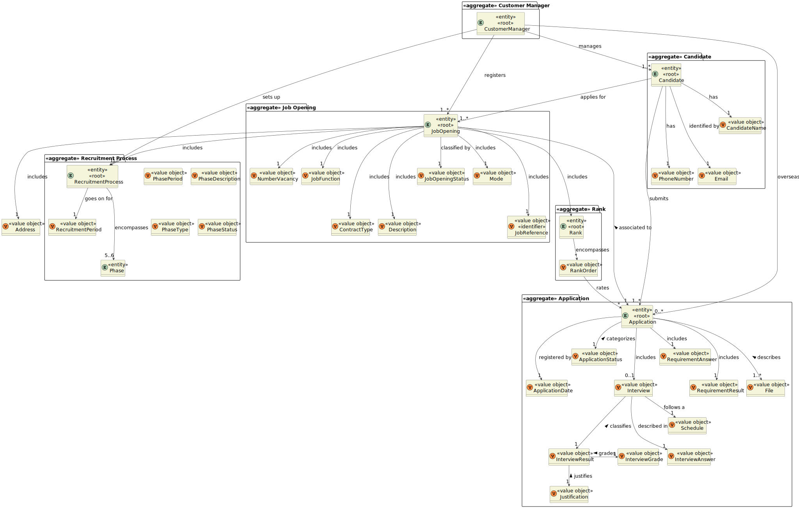
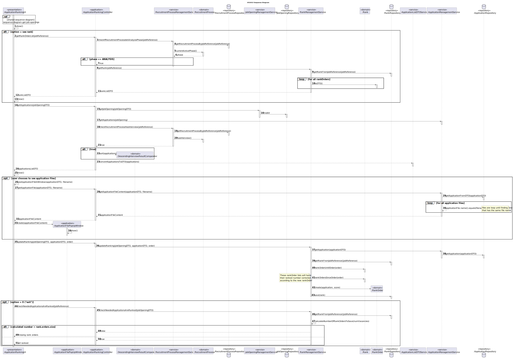
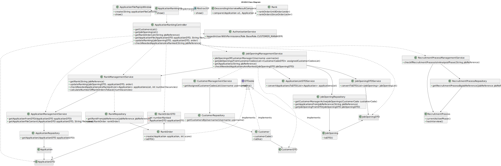

# US 1013

## 1. Context

This is the first time this user story is being requested.

## 2. Requirements

**US 1013** As {Customer Manager}, I want to rank the candidates for a job opening.

**Acceptance Criteria:**

- **1013.1** The Customer Manager must have access to the candidates' application files data.
- **1013.2** The Customer Manager must have access to the candidates' interview score, when applicable.
- **1013.3** The ranking is flexible, meaning that interview scores do not define automatically the candidate's rank.
- **1013.4** The ranking is done by manual sorting.
- **1013.5** No attributed ranking order values are duplicated.
- **1013.6** The system must have global ranking configurations: 1 - exactly the number of vacancies; 2 - double of the
number of vacancies; 0.5 - half the number of the vacancies.
- **1013.7** Candidates that are not ranked must be tagged with something signaling that they do not have a ranking for a
certain recruitment process
- **1013.8** A rank can be edited if none of the interested parties were yet notified of the results.
- **1013.9** All the candidates should be ranked before moving to the result phase.
- **1013.10** It should be possible to have 2 or more instances of the application running to check for the data within
the candidates files.

**Dependencies/References:**

**US1002 and US1007** | A job opening associated with a recruitment process is required so that the candidates can apply.

**US2002** | The candidates must be registered in the system and their application files must be imported, so that the 
Customer Manager can evaluate them and rank the candidates.

**Client Clarifications:**

> **Question:** Regarding section 2.2.1, is it during the Analysis phase that interviews are evaluated, and is this result
> what defines the ranking of candidates? Additionally, what is the role of the CV in this phase? Since interviews are not
> mandatory, what happens if they are not conducted?
>
> **Answer:** The scoring of interviews occurs during the interview phase. The CV and other data (like interview results)
> are used by the Customer Manager in the analysis phase to rank candidates. However, the ordering is the responsibility
> of the Customer Manager (for example, it does not necessarily follow the order of interview scores). US 1013 corresponds
> to manual sorting of candidates by the Customer Manager. The absence of interviews does not impact candidate ranking since
> it does not explicitly depend on interviews.


> **Question:** Mr Client mentioned a manual ranking. If the score of an interview is not essential for the candidate's 
> rank, what criteria is to be used when ranking?
>
> **Answer:** The ranking is a decision of the Customer Manager based on all the data that he/she may have during the process
> (including CV and other attached documents and the interviews as well as other data/information that may not be part of
> the system).


> **Question:** Does the customer manager assign a score to each application, and does the system then order them in ascending
> order, thus assigning the ranking to each application? If so, does the score need to be on a scale? If it is done this way,
> can the manager only assign a score when they have knowledge of all applications? Or can they assign scores gradually,
> and the ranking is only assigned once all applications have been evaluated?
>
> **Answer:** The ordering of candidates (ranking) is the responsibility of the customer manager. They may base it on 
> interview results and other information, but the ranking is not automatic. There is no specific score or scale used.
> The applications are simply ordered.


> **Question:** Is there a limit on rank entries? Let's say that 100 candidates apply for a job opening. Does the Customer
> Manager have to sort all 100 candidates?
>
> **Answer:** The order of candidates should include at least all the first candidates within the vacancy number and some
> following candidates. At the moment, I do not know exactly the number of the following candidates to be ordered. Therefore,
> I would like for it to be a global configuration property in the system. It could be a number representing a magnitude
> from the vacancy number. For instance, 1 could mean exactly the same number of vacancies, 2 the double, 0,5 half the
> number of vacancies. The remainder of the candidates could be just tagged as not ranked.


> **Question:** When a customer manager starts the ranking process, he can stop and continue later? Or the ranking process
> must be done in one go?
>
> **Answer:** I guess it may depend on how you implement the solution. But, in the case it may work as a “long operation” 
> be aware of when and how to conclude the “operation”.


> **Question:** The customer manager can change the rank of a candidate after assigning it?
>
> **Answer:** That should be possible if none of the interested parties were yet notified of the results.


> **Question:** When the customer manager is ranking the candidates, in terms of UI, should we display information from
> the application such as interview score, etc... or just the candidate's name and email?
>
> **Answer:** As stated before, I do not have specific requirements for the UI/UX. Use best practices. However, I would 
> like it to be possible for the Customer Manager to have 2 or more instances of the application running, so that he/she
> could, for instance, see the interviews grades and, at the same time, register the order/ranking of the candidates.


> **Question:** When the analysis phase ends, the ranking need to have all the candidates? or can the customer manager
> rank only some of the candidates?
>
> **Answer:** All the candidates should be ranked before moving to the result phase.


> **Question:** Mr. Client mentioned in Q155 that the system should have ranking configurations so that the Customer Manager
> doesn't have to rank all the candidates for a job opening, and that the ones that haven't been manually ranked are to be
> tagged with "not ranked". However, in Q162, you've said that all the candidates must be ranked before the result phase
> starts. Can you clarify this situation?
>
> **Answer:** The customer manager must evaluate all the candidates. It is the only way he/she can produce a ranking/order
> for the candidates and select the “best” candidates to be included in the vacancies for the job opening. In Q155 I was
> only proposing a way to avoid recording in the system a lot of details that will not have any impact on the next activities.
> The term “not ranked” maybe is not the best. Maybe “rank not recorded” or something similar could be more appropriated.


> **Question:** I'm struggling to understand the global configurations defined for US1013. All candidates must be ranked,
> so that all of them can be notified. Are the global configurations only for persistence purposes? Example: all candidates
> are ranked and notified, so if 0.5 is in the global definition, then only half of the number of vacancies must be persisted
> in the system. Is this the scenario that Mr. Client has in mind?
>
> **Answer:** I am assuming you refer to Q155. Suppose you have 2 vacancies. You have 80 candidates. If you configure the
> property as 1 you need to rank (record in the system) the 2 first candidates plus 2 other candidates. If the property
> is 0,5 you should rank the 2 first candidates plus 1 third candidate. If the property is 2, you should rank the 2 first
> candidates plus 4 extra candidates. This is a way to assure that you do not have to record in the system the rank of 
> all the possible candidates, but only a number that includes the ones required to fulfill the vacancies plus some extra
> (according to the property) for possible exceptions (such as someone leaving the application). But my suggestion was only
> to help in the UI/UX. You may use any other option.


> **Question:** About the Us1013 which states: "As Customer Manager, I want to rank the candidates for a job opening.".
> I want to know if two candidates can be tied, which would mean having the same rank for the same job opening. 
>
> **Answer:** No, ties should not be allowed. It must be clear what candidates are selected to the vacancies.


> **Question:** In US1013, it is supposed to classify the candidates, but a question arose: after the conclusion of this
> US, should it advance to the job opening phase, that is, move from the analysis phase to the result phase?
>
> **Answer:**  A241. In principle, the phase change should be done only within the scope of the respective US.


## 3. Analysis

As clarified by the client, there is no criteria to rank the candidates. The ranking is done manually by the Customer
Manager by looking at each candidate application files and, when applicable, interview score to make a decision.

After all the interested parts are notified of the results, then the system will update the job opening's rank, keeping
only the number of rank orders defined in the system configurations.

Below there's a System Sequence Diagram (SSD) illustrating the expected behaviour of this functionality. After this diagram
is a partial domain model, with emphasis on US1013's concepts.

**US1013 System Sequence Diagram**


**US1013 Partial Domain Model**



## 4. Design

To order a rank, the active job openings associated with the user must be displayed. Upon selecting one, the system must
check if the current job opening's recruitment process phase is the analysis phase. If interviews occurred, then for each
application evaluated, a rank order instance will be associated with the evaluation's score.

If not, then a rank order will be associated for each application whenever a customer manager decided to attribute an
order or edit it.

Another aspect of this functionality is the capacity of displaying the selected files of an application on a popUp window,
with the made out of Javax.Swing components.

In order to enhance encapsulation between layers, the usage of DTO's is present in this functionality.

**New Domain Layer Classes**
* RankManagementService
* Rank
* RankOrder

**New Persistence Layer Classes**
* RankRepository

* **New Application Layer Classes**
* ApplicationRankingController

**New Presentation Layer Classes**
* ApplicationRankingUI
* ApplicationFilePopUpWindow

The further topics illustrate and explain this functionality usage flow, and the correlation between its components.

### 4.1. Realization



### 4.2. Class Diagram



### 4.3. Applied Patterns

This topic presents the classes with the patterns applied to them along with justifications.

>**Repository Pattern**
> * CustomerRepository
> * JobOpeningRepository
> * RecruitmentProcessRepository
> * ApplicationRepository
> * RankRepository
>
> **Justifications**
>
> * The JobOpeningRepository has stored all the jobOpening instances created in all sessions in its database, it's where
>   the instances can be rebuilt.
>
> * Customers have their Customer Manager email as an attribute, so by using the email we can track which customers are assigned
>  to said user and retrieve their costumer codes. This is all stored in the database represented by the repository.
> 
> * The recruitment processes are stored within the database, and must be rebuilt, so that the system can evaluate if the
>   instance associated with the chosen jobOpening is in the right phase.
> 
> * Ranks and their entries are stored in the database. The repository allows the access of entries in specific conditions
>   validations, etc...
> 
> * The repository stores applications and their respective files, which must be accessed for their content to be displayed
>   to the current user.


>**Service Pattern**
> * CustomerManagementService
> * JobOpeningManagementService
> * AuthorizationService
> * RecruitmentProcessManagementService
> * RankManagementService
> * ApplicationListDTOService
> * ApplicationManagementService
>
> **Justifications**
>
> * CustomerManagementService is used in more than one functionality, and its in charge of managing request regarding customers,
>   serving as encapsulation between the controller and the CustomerRepository along with the domain classes.
>
> * JobOpeningManagementService is used in more than one functionality, and its in charge of managing request regarding
>   jobOpenings, serving as encapsulation between the controller and the JobOpeningRepository along with the domain classes.
>
> * To get the customers that are assigned to the current Customer Manager in-session, we must get something to identify them.
>   The AuthorizationService allows to get the username (user's email), which is essential to then filter the CustomerRepository
>   to the desired customers. This set of instructions is used in other functionalities too.
> 
> * RecruitmentProcessManagementService is used to check if the recruitment process associated with the chosen job opening
>   is in the right phase.
> 
> * RankManagementService updates the rank whenever a rank order score is changed.
> 
> * ApplicationManagementService allowed the retrieval of specific applications and their files.
> 
> * ApplicationListDTOService promotes layer encapsulation by converting application instances in DTOs.


### 4.4. Tests

**Test 1:** Verifies that a rankOrder cannot have its order value null

**Refers to Acceptance Criteria:** ----
````
@Test
public void ensureRankOrderOrderValueNullIsInvalid() {
...
}
````

**Test 2:** Verifies that a rankOrder cannot have its order value at Zero

**Refers to Acceptance Criteria:** ----
````
@Test
public void ensureRankOrderOrderValueZeroIsInvalid() {
...
}
````

**Test 3:** Verifies that a rankOrder cannot have its order value as a negative number

**Refers to Acceptance Criteria:** ----
````
@Test
public void ensureRankOrderOrderValueNegativeIsInvalid() {
...
}
````

**Test 4:** Verifies that a rankOrder cannot have its application null

**Refers to Acceptance Criteria:** ----
````
@Test
public void ensureRankOrderApplicationNullIsInvalid() {
...
}
````


## 5. Implementation

*In this section the team should present, if necessary, some evidencies that the implementation is according to the
design. It should also describe and explain other important artifacts necessary to fully understand the implementation
like, for instance, configuration files.*

*It is also a best practice to include a listing (with a brief summary) of the major commits regarding this requirement.*

## 6. Integration/Demonstration

In this section the team should describe the efforts realized in order to integrate this functionality with the other
parts/components of the system

It is also important to explain any scripts or instructions required to execute an demonstrate this functionality

## 7. Observations

*This section should be used to include any content that does not fit any of the previous sections.*

*The team should present here, for instance, a critical prespective on the developed work including the analysis of
alternative solutioons or related works*

*The team should include in this section statements/references regarding third party works that were used in the
development this work.*