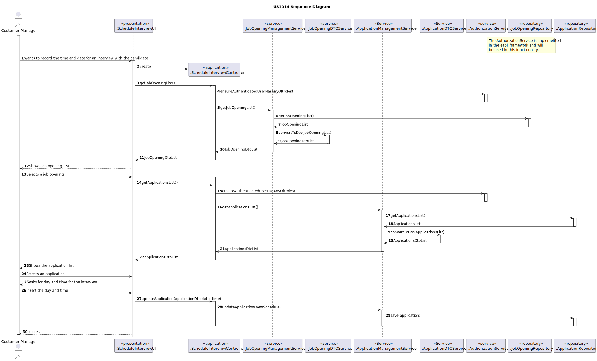
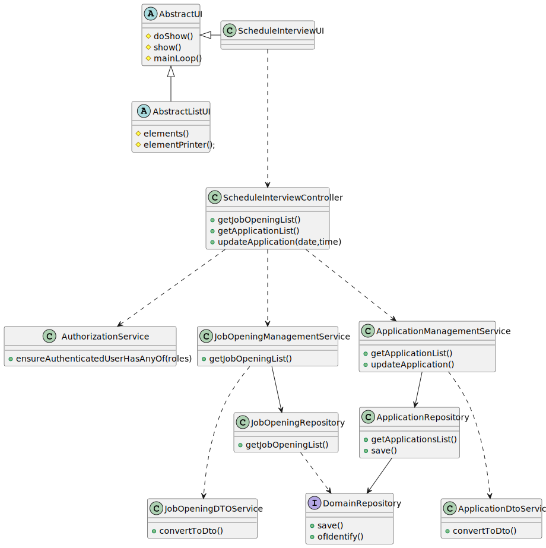

# US 1014

## 1. Context

*This is the first time this user story is being requested.*

## 2. Requirements

**US 1014:** As Customer Manager, I want to record the time and date for an interview with a
candidate.

**Acceptance Criteria:**

- 1014.1. The user should be registered as a customer manager;
- 1014.2. The system should confirm the operation
- 1014.3. The system should show to the customer manager the job opening list and job application list

**Client Clarifications**

> **Question:** When should it be possible to set this date? Will it be possible to schedule the interview only when the recruitment phase is at the intervenist stage? Or is it possible to score in other previous phases?
>
>  **Answer:** For me it may be possible to schedule interviews before but one should pay attention to whether the candidate "passed" the screening. It makes no sense to schedule an interview for a candidate who has not been accepted. Keep this type of aspect in mind.

> **Question:** Is it possible to schedule interviews for any day and time or we must take into account weekends, working hours and holidays, for example?
>
>  **Answer:** The system should display the day of the week for the selected date. But the system should accept any valid date.

> **Question:** When scheduling an interview with a candidate, should it be possible to schedule more than one interview per application?
>
> **Answer:** The system at this stage is thought to only support one interview per job Opening so it doesn’t make much sense to schedule more than one interview for a candidate other than to reschedule the same interview (for example, the applicant was justifiably absent from a previous interview). In this context, I would say that it makes more sense to be able to change the appointment of an interview than to schedule more than one interview for the same candidate.

> **Question:** You enter a date and the system should guess the day of the week of this date and show it in the screen? I couldn't understand well.
>
> **Answer:** For the data entered by the user the system should display the day of the week: Monday, Tuesday, Wednesday, etc. It should not be a guess, but the true/real day of the week.


## 3. Analysis

*This main functionality is for the Customer Manager, so the user needs to be authenticated first to be able to record the time and date for an interview with a candidate.*

**System Sequence Diagram:**


## 4. Design
The principal function is register a day and time for an interview, the input for the Customer Manager consists on:

* Select a Job Opening
* Select an application
* Insert the day
* Insert the time

After successfully submitting this information, the system should update the application and record the day and time for the interview.

### 4.1.1. Domain Model


### 4.1. Realization


### 4.2. Class Diagram



### 4.3. Applied Patterns
* **DTO**
* **Repository**
* **Service**

> **Repository Pattern**
> * ApplicationRepository
> * JobOpeningRepository
>
> **Justifications**
>
>The repositories were employed to persist applications and reconstruct objects from the
persistence (applications and job openings).


> **Service Pattern**
> * AuthorizationService
> * ApplicationManagementService
> * JobOpeningManagementService
>
> **Justifications**
>
> The AuthorizationService, is a pre-existing service within the Eapli.Framework were used here
> to retrieve the logged-in user with Customer Manager roles.
>
> The JobOpeningManagementService is employed to register Job Openings, tasked with the responsibility of
give us the list of all job openings.
>
> The ApplicationManagementService is employed to register Application, tasked with the responsibilities of
give us the list of all application and update the chosen one.
> 
> The mentioned services were developed because the functionalities they offer will be utilized across multiple use
> cases.

> **DTO**
> * ApplicationDTO
> * JobOpeningDTO
>
> **Justifications**
>
> In order to enforce encapsulation amongst layers and adequate responsibility assigment, the ApplicationDTO and JobOpeningDTO
> were created, besides being a set of instructions that is used in other functionalities.
>
### 4.4. Tests

**Domain Tests were already implemented in other user stories**

## 5. Implementation

### ScheduleInterviewController

```
 public Iterable<JobOpeningDTO> getJobOpeningsList() {
        authorizationService.ensureAuthenticatedUserHasAnyOf(BaseRoles.CUSTOMER_MANAGER, BaseRoles.ADMIN);

        return jobOpeningManagementService.activeJobOpenings();
    }

    public Iterable<ApplicationDTO> getApplicationList(JobOpeningDTO jobOpeningDto) {
        authorizationService.ensureAuthenticatedUserHasAnyOf(BaseRoles.CUSTOMER_MANAGER, BaseRoles.ADMIN);
        JobOpening jobOpening= jobOpeningManagementService.getJobOpening(jobOpeningDto);
        return applicationManagementService.getApplicationsList(jobOpening);
    }

    public boolean updateApplication(ApplicationDTO applicationDto, String date, String time) throws ParseException {
        Application application = applicationManagementService.getApplication(applicationDto);
        Date newSchedule = parseData(date,time);
        if (application!=null){
            application.updateApplicationSchedule(newSchedule);
            applicationRepository.save(application);
            return true;
        }
        return false;
    }

    public static Date parseData(String date, String hour) throws ParseException {
        // Split date in day, month and year
        String[] partesData = date.split("[/-]");
        int year = Integer.parseInt(partesData[0]);
        int month = Integer.parseInt(partesData[1]);
        int day = Integer.parseInt(partesData[2]);

        // Split hour
        String[] partesHora = hour.split(":");
        int hour1 = Integer.parseInt(partesHora[0]);
        int minute = Integer.parseInt(partesHora[1]);

        SimpleDateFormat sdf = new SimpleDateFormat("yyyy-MM-dd HH:mm:ss");

        return sdf.parse(year + "-" + month + "-" + day + " " + hour1 + ":" + minute + ":00");
    }
```
### JobOpeningManagementService

```
 public Iterable<JobOpeningDTO> activeJobOpenings() {
        return dtoSvc.convertToDTO(jobOpeningRepository.findAllJobOpeningsNotStarted());
    }
```
### ApplicationManagementService

```
 public List<ApplicationDTO> getApplicationsList(JobOpening jobOpening){
        Set<Application> applicationList = jobOpening.getApplications();

        return (List<ApplicationDTO>) applicationDTOService.convertToDTO(applicationList);
    }
```

## 6. Integration/Demonstration
To execute this functionality it is necessary to run the script named `run-backoffice-app` and log in with CustomerManager permissions
after it, must select the menu `Applications` followed by `Schedule Interview`.

