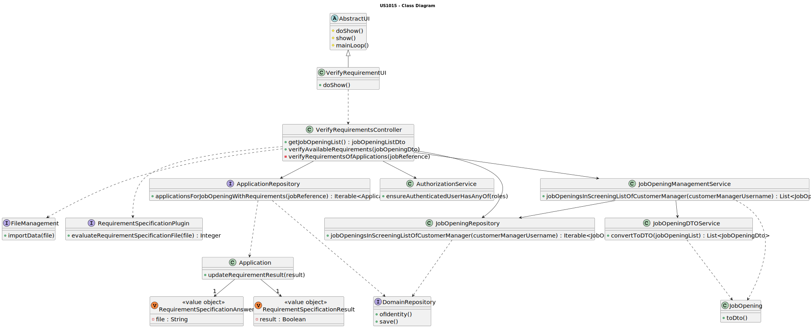

# US 1015

## 1. Context

This is the first time this user story is being requested.

## 2. Requirements

**US 1015** As {Customer Manager}, I want to execute the process of verification of requirements of applications for a
job opening.

**Acceptance Criteria:**

- 1015.1. The verification must only be done to candidates which requirements file has already been submitted.
- 1015.2. The Job Opening must be in the Screening Phase.

**Dependencies/References:**

Regarding this requirement, we acknowledge the reference NFR09 of LPROG, which states that support for this
functionality must adhere to specific technical requirements outlined in LPROG. As of 17/04/2024, no additional
requirements have been presented. The ANTLR tool should be used (https://www.antlr.org/).

It is also important to note that this functionality relies on [US 2004](../us_2004/readme.md), as this is the user
story where the completed
requirement specifications are submitted into the system for evaluation using this functionality.

**Client Clarifications:**

> **Question:** Should the process be carried out for all candidates or just for some (according to some criteria)?
>
> **Answer:** Files with responses to requirements are gradually entered into the system. Perhaps it would be “simpler”
> for the
> process to run (i.e., check the requirements) for candidates for whom the requirements file has already been
> submitted.
> At some point the process will run with all candidates already having submitted requirements files.

## 3. Analysis

Since the customer manager is responsible for executing this functionality, it must be possible for them to select one
of the job openings associated with them to evaluate the candidates who have applied for that position. Additionally, as
clarified in the acceptance criteria, only the requirements of candidates whose requirements file has already been
submitted should be assessed.

The plugins will evaluate the requirement specifications to determine if the candidate's curriculum meets the
requisites established by the customer/company for the job opening currently under evaluation. If the evaluation
results in the rejection of a candidate, a justification must be provided, explaining the reason for the rejection.

### Domain Model


## 4. Design

### 4.1. Realization


**Ref1:** Check the partial sequence diagram
in [team-decisions](../../team-decisions/team-decisions.md#shared-sequence-diagrams) to see the adopted behaviour.

### 4.2. Class Diagram



### 4.3. Applied Patterns

* **DTO**
* **Repository**
* **Service**
* **MVC**

> **MVC**
>
> **Justification:**
>
> The MVC pattern was employed to divide the system into three distinct parts: model, view, and controller, each
> responsible for a specific aspect of the system’s functionality. This separation of concerns enhances maintainability
> and extensibility, as changes to one part do not require changes to the others.

> **Repository Pattern**
> * JobOpeningRepository
> * ApplicationRepository
>
> **Justification:**
>
> The repositories were used to retrieve the persisted job openings and to save the job opening instance after the
> changes were made.

> **DTO**
>
> **Justification:**
>
> We opted for DTOs due to the significant amount of domain information required for this functionality. Recognizing the
> benefits of encapsulation and layer decoupling offered by DTOs, we concluded that applying this pattern was
> helpful in this context.

> **Service Pattern**
> * AuthorizationService
>
> **Justification:**
>
> The authorization service was employed to verify the roles of the logged-in user. Different services were used to
> get job openings. As for verifying the requirements, no services were used since this is a unique function not
> intended for other use cases.

### 4.4. Tests

#### ApplicationTests

**Test 1:** Verifies that it is not possible to do verification for applications without a requirement file.

**Refers to Acceptance Criteria:** 1015.1

````
@Test(expected = IllegalArgumentException.class)
public void ensureMustHaveRequirementsToVerify() {
...
}
````

## 5. Implementation

### VerifyRequirementController

````
private Boolean verifyRequirementsOfApplications(String jobReference, String requirement) {
    ClassLoader loader = ClassLoader.getSystemClassLoader();

    Iterable<Application> applications = repo.applicationsForJobOpeningWithRequirements(jobReference);
    if (!applications.iterator().hasNext()) {
        throw new IllegalArgumentException("No applications have associated requirement specification answers.");
    }
    Optional<RequirementSpecification> rs = repoRS.requirementSpecificationByRequirementName(requirement);

    try {
        if (rs.isPresent()) {
            RequirementSpecification requirementSpec = rs.get();
            FileManagement dataImporterInstance = (FileManagement) loader.loadClass(requirementSpec.dataImporter()).getDeclaredConstructor().newInstance();
            RequirementsSpecificationPlugin reqSpecEvaluator = (RequirementsSpecificationPlugin) loader.loadClass(requirementSpec.className()).getDeclaredConstructor().newInstance();
            dataImporterInstance.importData(requirementSpec.configurationFile().toString());
            for (Application a : applications) {
                try {
                    Pair<Boolean, String> result = reqSpecEvaluator.evaluateRequirementSpecificationFile(a.requirementAnswerFilePath());
                    a.updateRequirementResult(result);
                    repo.save(a);
                } catch (Exception e) {
                    LOGGER.error("Couldn't evaluate application.");
                    return false;
                }
            }
        } else {
            LOGGER.error("Requirement specification not found for: {}", requirement);
            return false;
        }
    } catch (ClassNotFoundException | NoSuchMethodException | InstantiationException | IllegalAccessException |
             InvocationTargetException e) {
        LOGGER.error("Unable to access plugin.");
        return false;
    }
    return true;
}
````

### Application

````
public void updateRequirementResult(Pair<Boolean, String> result) {
    Preconditions.nonEmpty(requirementAnswerFilePath());
    File requirementFile = new File(requirementAnswerFilePath());
    try {
        if (!requirementFile.isAbsolute()) {
            requirementFile = requirementFile.getCanonicalFile();
        }
    } catch (IOException e) {
        throw new RuntimeException("Failed to get the absolute path of the requirement answer file.", e);
    }

    if (requirementFile.exists() && requirementFile.isFile()) {
        if (!result.second.isEmpty()) {
            this.requirementResult = RequirementResult.valueOf(result.first, result.second);
        } else {
            this.requirementResult = RequirementResult.valueOf(result.first);
        }
    } else {
        throw new IllegalArgumentException("No valid requirement answer file.");
    }
}
````

## 6. Integration/Demonstration

To use this feature, you'll need to run the script named `run-backoffice-app` and log in with Customer Manager
permissions.

Then, navigate to the _Job Opening_ menu and select option 9 - `Verify Requirement Specifitions of applications` - to
access this
feature.

````
+= Verification of Requirements Specification =================================+

Select the job opening to verify the requeriments of the applications.
1. 
»» Job Reference: ISEP-2
 » Function: Back End Senior Developer
 » Contract Type: part-time
 » Work Mode: remote
 » Address: 456 Elm Street, Canada, Maple Town, Moonlight District, 4500-900
 » Description: Night Guard.
 » Number of Vacancies: 5
 » Company: ISEP

0. Exit
Select an option: 
1
Requirements verified sucessfully
+==============================================================================+
````

## 7. Observations

To evaluate the requirement specifications of the applications, our team developed and used a plugin. We incorporated it
as a dependency of the **jobs4u.core**:

````
<dependencies>
    <dependency>
        <groupId>plugin</groupId>
        <artifactId>lprog-plugin</artifactId>
        <version>1.0-SNAPSHOT</version>
        <scope>system</scope>
        <systemPath>${project.basedir}/libs/plugin/lprog-plugin.jar</systemPath>
    </dependency>
</dependencies>

<repositories>
    <repository>
        <id>in-project</id>
        <name>In Project Repo</name>
        <url>file://${project.basedir}/libs/plugin</url>
    </repository>
</repositories>
````