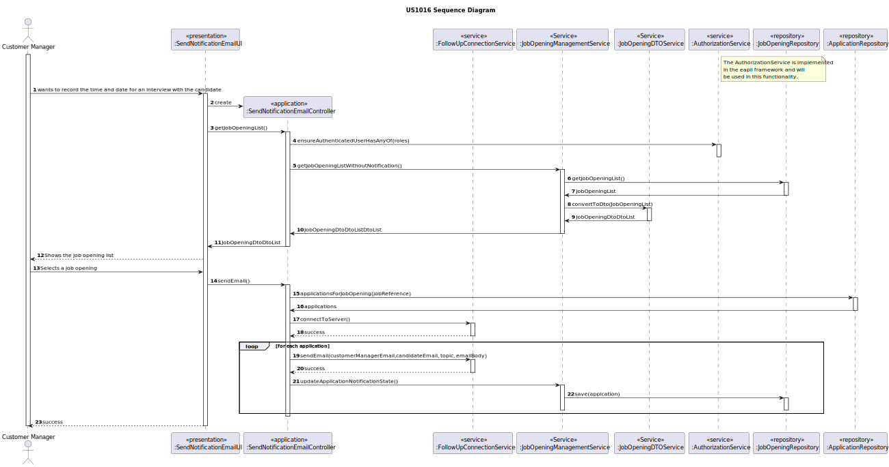

# US 1016

## 1. Context

*This is the first time this user story is being requested.*

## 2. Requirements

**US 1016:** As Customer Manager, I want the system to notify candidates, by email, of the result of the verification process.

**Acceptance Criteria:**

- 1016.1. The user must be logged with customer manager role;

- 1016.2. If an error happens in the notification, doesn't invalidate the result of the verification process 

**Client Clarifications**

> **Question:** I would like to know the format of the following Message to Send to the client, could be Algo do Genero: "Dear [Candidate’s Name], hope this email finds you well. As a Customer Manager, I wanted to inform you about the outcome of the verification process for the position you applied for. After careful consideration of your application and qualifications, I am pleased to inform you that you have successfully passed the verification process. Congratulations! Your application met our initial criteria and we are impressed with your qualifications and experience. We will proceed to the next phase of the selection process, which may include additional interviews or evaluations. We will contact you shortly with more details about the next steps. Thank you for your interest in our company and for taking the time to apply for the position. We appreciate your patience throughout the process. If you have any questions or need further assistance, please feel free to contact us. [Your Name] Customer Manager [Your Company Name]" I would like to know the most important information when Notify the candidate, should appear the name of the Customer manager, the job Reference, the name of the candidate. And whether the email should be in English or Portuguese.
>
> **Answer:** It can be as it presents. It can be in Portuguese or English.

> **Question:** I want to know when the client says "verification process" is the same about the screening phase.
>
> **Answer:** Yes.

> **Question:** This user story has a functional dependency with 1015. I would like to know if an error occurs, do I need to delete what happened in US 1015, as if it were a transaction?
>
> **Answer:** The process of notification (US1016) must be done after the verification (US1015) but an error in the notification does not invalidate the “results” of the verification process.

> **Question:** what is the process through which this notification is generated? After evaluation of the Requirement Specification module, it generates an "Approved" or "Rejected" result. This result automatically triggers a notification to the candidate or it is the Customer Manager who has the responsibility to inform the candidate through the system of the verification result (e.g. after a negative result is generated, the Customer Manager will in the system reject the candidate to be sent the email)?
> 
> **Answer:** This is the second option that presents. The US1015 allows the Customer Manager to invoke the requirements verification process. After that all applications must be accepted or refused. It is then possible for the Customer Manager to invoke the notification through US1016.

## 3. Analysis

*This functionality is for the Customer Manager, so the user needs to be authenticated first to be able to send an email to the candidate.*
The system should send the email, once the verification is completed.

**System Sequence Diagram:**


## 4. Design
The principal function is to send a notification to candidates who doesn't have been notified, the input for the Customer Manager consists of:
* Select send the email

After successfully submitting this information, the system should send the notification and update the state of application notification.
### 4.1.1 Domain Model


### 4.1. Realization



### 4.2. Class Diagram


### 4.3. Applied Patterns
* **DTO**
* **Repository**
* **Service**

> **Repository Pattern**
> * ApplicationRepository
>
> **Justifications**
>
>The repositories were employed to persist applications, as well as to reconstruct objects from the
persistence.
> **Service Pattern**
> * AuthorizationService
> * ApplicationManagementService
> * ApplicationDTOService
> * FollowUpConnectionService
>
> **Justifications**
>
> The AuthorizationService, pre-existing service within the Eapli.Framework were used here
> to retrieve the logged-in user with Customer Manager roles.
>
> The ApplicationManagementService is employed to register applications and get all the applications.
>
> The FollowUpConnectionService is employed to establish the connection with the email server and send the email
> 
> The mentioned services were developed because the functionalities they offer will be utilized across multiple use
> cases.

> **DTO**
> * ApplicationDTO
>
> **Justifications**
>
> We choose DTOs because we have a big amount of domain data required for this functionality. 
> Recognizing the benefits of encapsulation and layer decoupling offered by DTOs, we decided 
> applying this pattern to our project.
### 4.4. Tests

**Test 1:** Verifies if equal users are detected

**Refers to Acceptance Criteria:** 2000a.1

````
    @Test
    public void ensureEqualsCandidateUsersPassesForSamePhoneNumber() throws Exception {

        final Candidate candidate1 = new Candidate(getNewDummyUser(),phoneNumber1);
        final Candidate candidate2 = new Candidate(getNewDummyUser(),phoneNumber1);

        final boolean expected = candidate1.equals(candidate2);

        assertTrue(expected);
    }
````
**Test 2:** Verifies if a candidate without phone number fails

**Refers to Acceptance Criteria:** 2000a.2

````
    @Test
    public void ensureCandidateUserWithoutPhoneNumberFails(){
        assertThrows(IllegalArgumentException.class, () -> new Candidate(getNewDummyUser(), null));
    }
````
**Test 3:** Verifies if a candidate without system user fails

**Refers to Acceptance Criteria:** 2000a.2

````
    @Test
    public void ensureCandidateUserWithoutSystemUserFails(){
        assertThrows(IllegalArgumentException.class, () -> new Candidate(null, phoneNumber1));
    }
````
**Test 4:** Verifies if a phone number without extension Fails

**Refers to Acceptance Criteria:** 2000a.1

````
    @Test
    public void ensurePhoneNumberWithoutExtensionFails() {
        assertThrows(NullPointerException.class, () -> new PhoneNumber(null, "910000000"));
    }
````
**Test 5:** Verifies if a phone number without number Fails

**Refers to Acceptance Criteria:** 2000a.1

````
    @Test
    public void ensurePhoneNumberWithoutNumberFails() {
        assertThrows(NullPointerException.class, () -> new PhoneNumber("+351", null));
    }
````

**Test 6:** Verifies if an extension without "+" Fails

**Refers to Acceptance Criteria:** 2000a.1

````
    @Test
    public void ensureExtensionWithoutPlusFails(){
        assertThrows(IllegalArgumentException.class, () -> new PhoneNumber("351", "12345678"));
    }
````

**Test 6 and 7:** Verifies if a number with less than 8 digits and plus than 15 digits Fails

**Refers to Acceptance Criteria:** 2000a.1

````
    @Test
    public void ensurePhoneNumberLessThan8DigitsFails() {
        assertThrows(IllegalArgumentException.class, () -> new PhoneNumber("+351", "1234567"));
    }
    
    @Test
    public void ensurePhoneNumberPlusThan15DigitsFails() {
        assertThrows(IllegalArgumentException.class, () -> new PhoneNumber("+351", "1234567890123456"));

    }
````
## 5. Implementation

### RegisterCandidateController

```
 public boolean registerCandidate(String name, String email, String extension, String number){
        Optional<SystemUser> operator = authz.loggedinUserWithPermissions(BaseRoles.OPERATOR);
        PhoneNumber phoneNumber = new PhoneNumber(extension, number);
        operator.ifPresent(systemUser -> candidateManagementService.registerCandidate(name, email, phoneNumber));

        return true;
    }
```
### CandidateManagementService

```
 public void registerCandidate(String name, String email, PhoneNumber phoneNumber) {
        String password = passwordService.generatePassword();

        final Set<Role> roles = new HashSet<>();
        roles.add(BaseRoles.CANDIDATE_USER);

        SystemUser sysUser = userManagementService.registerNewUser(email, password, name,"Candidate",email, roles);

        final DomainEvent event = new NewCandidateUserRegisteredEvent(sysUser,phoneNumber);
        dispatcher.publish(event);
    }
```
### NewCandidateUserRegisteredWatchDog

```
 @Override
    public void onEvent(final DomainEvent domainEvent) {
        assert domainEvent instanceof NewCandidateUserRegisteredEvent;

        final NewCandidateUserRegisteredEvent newCandidateUserRegisteredEvent = (NewCandidateUserRegisteredEvent) domainEvent;

        final AddCandidateOnNewCandidateUserRegisteredController controller = new AddCandidateOnNewCandidateUserRegisteredController();
        controller.registerNewCandidate(newCandidateUserRegisteredEvent);
    }
```
### AddCandidateOnNewCandidateUserRegisteredController

```
 public void registerNewCandidate(NewCandidateUserRegisteredEvent event) {
        candidateRepository.save(new Candidate(event.systemUser(), event.phoneNumber()));
    }
```
## 6. Integration/Demonstration
To execute this functionality it is necessary to run the script named `run-backoffice-app` and log in with Operator permissions
after it, must select the menu `Operator` followed by `Register a Candidate`.

