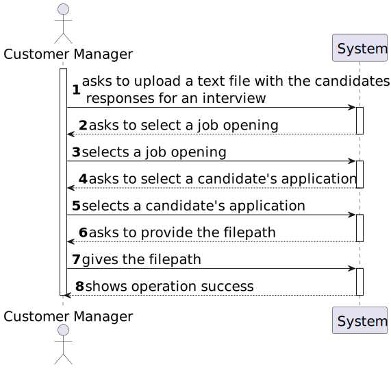
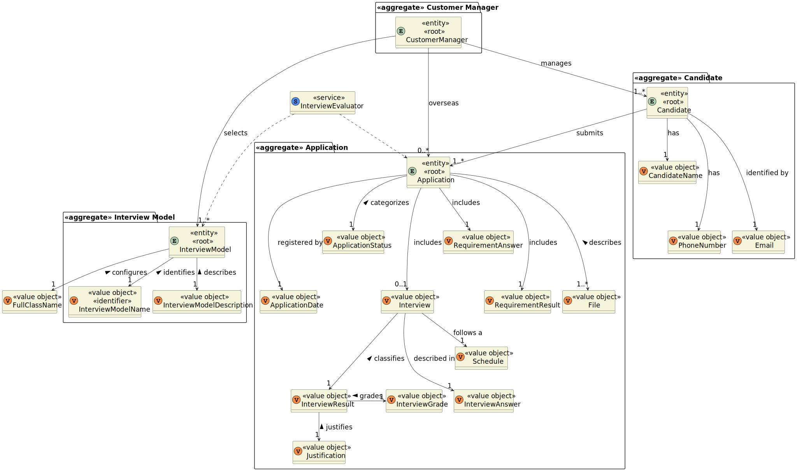

# US 1017

## 1. Context

It is the first time the task is assigned.

## 2. Requirements

**US 1017:** As Customer Manager, I want to upload a text file with the candidates responses for an interview.

**Acceptance Criteria:**

- **1017.1.** The system should allow the user to provide the file path to the text file.

- **1017.2.** The system should ask the which interview is related to the responses.

- **1017.3.** It is necessary the use of ANTLR.

- **1017.4.** The system must have at least one interview.

- **1017.5.** The exported file should be in .txt format.


**Dependencies/References:**

- **US G007** - This functionality has a dependency on _US G007_ that pertains to the authentication and authorization 
for all users and functionalities.

- **US G003** - This functionality has a dependency on _US G003_ that consists in initial configuration of the project 
structure, where was made the setup for the ANTLR.

- **US 1012** - this functionality has a dependency on _US 1012_ which generate the template file to collect the answers
of the candidates during the interviews.


_Reference 1017.1:_  **NFR09(LPROG) - Requirement Specifications and Interview Models** The support for this functionality
must follow specific technical requirements, specified in LPROG. The ANTLR tool should be used (https://www.antlr.org/).


**Client Clarifications:**

> **Question:** US1017/1018 - Our group has a question regarding the processing of the candidates' response files for
> the interview. In the case of uploading a file, if a question that requires a numerical answer is filled with an
> invalid format, for example, a letter, should we consider this as an invalid format in US1017 (and ask the user to
> upload a valid file again) or should we, in US1018, consider it incorrect and automatically assign 0 points fot that
> invalid response? That is, in US1017, should we only check the file format or should we also check if the responses 
> are filled with the correct data type?
>
>
> **Answer:** The mentioned case should be considered a file validation error (the submitted file does not comply with
> the defined grammar).


## 3. Analysis

The main goal of this user story is to import the file with the candidate answers for the interview. 

To achieve this, it's necessary to ask the user:

* filepath for the text file with the answers
* select the interview


### 3.1 System Sequence Diagram



### 3.2 Domain Model Related



## 4. Design

*In this sections, the team should present the solution design that was adopted to solve the requirement. This should
include, at least, a diagram of the realization of the functionality (e.g., sequence diagram), a class diagram (
presenting the classes that support the functionality), the identification and rational behind the applied design
patterns and the specification of the main tests used to validade the functionality.*

### 4.1. Realization

### 4.2. Class Diagram


### 4.3. Applied Patterns

### 4.4. Tests

*Include here the main tests used to validate the functionality. Focus on how they relate to the acceptance criteria.*

**Test 1:** Verifies that it is not possible to ...

**Refers to Acceptance Criteria:** G002.1

````
@Test(expected = IllegalArgumentException.class)
public void ensureXxxxYyyy() {
...
}
````

## 5. Implementation

*In this section the team should present, if necessary, some evidencies that the implementation is according to the
design. It should also describe and explain other important artifacts necessary to fully understand the implementation
like, for instance, configuration files.*

*It is also a best practice to include a listing (with a brief summary) of the major commits regarding this requirement.*

## 6. Integration/Demonstration

In this section the team should describe the efforts realized in order to integrate this functionality with the other
parts/components of the system

It is also important to explain any scripts or instructions required to execute an demonstrate this functionality

## 7. Observations

*This section should be used to include any content that does not fit any of the previous sections.*

*The team should present here, for instance, a critical prespective on the developed work including the analysis of
alternative solutioons or related works*

*The team should include in this section statements/references regarding third party works that were used in the
development this work.*