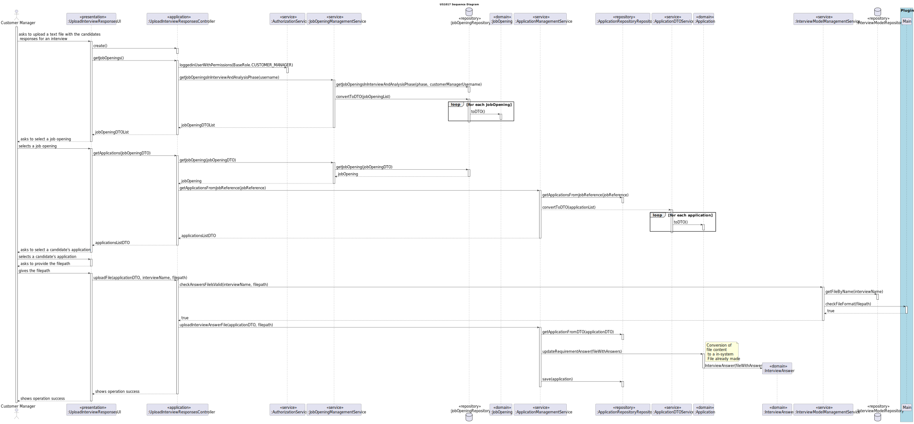
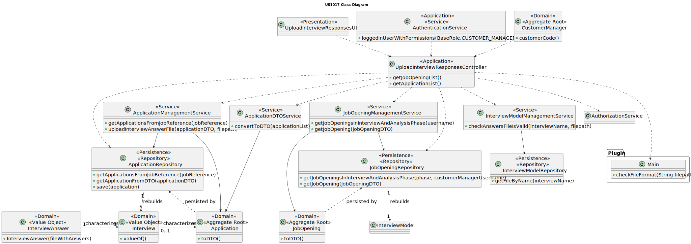

# US 1017

## 1. Context

It is the first time the task is assigned.

## 2. Requirements

**US 1017:** As Customer Manager, I want to upload a text file with the candidates responses for an interview.

**Acceptance Criteria:**

- **1017.1.** The system should allow the user to provide the file path to the text file.

- **1017.2.** The system should ask the customer manager which interview is related to the responses.

- **1017.3.** It is necessary the use of ANTLR.

- **1017.4.** The system must have at least one interview.

- **1017.5.** The uploaded file should be in .txt format.


**Dependencies/References:**

- **US G007** - This functionality has a dependency on _US G007_ that pertains to the authentication and authorization
  for all users and functionalities.

- **US G003** - This functionality has a dependency on _US G003_ that consists in initial configuration of the project
  structure, where was made the setup for the ANTLR.

- **US 1012** - this functionality has a dependency on _US 1012_ which generate the template file to collect the answers
  of the candidates during the interviews.


_Reference 1017.1:_  **NFR09(LPROG) - Requirement Specifications and Interview Models** The support for this functionality
must follow specific technical requirements, specified in LPROG. The ANTLR tool should be used (https://www.antlr.org/).


**Client Clarifications:**

> **Question:** US1017/1018 - Our group has a question regarding the processing of the candidates' response files for
> the interview. In the case of uploading a file, if a question that requires a numerical answer is filled with an
> invalid format, for example, a letter, should we consider this as an invalid format in US1017 (and ask the user to
> upload a valid file again) or should we, in US1018, consider it incorrect and automatically assign 0 points fot that
> invalid response? That is, in US1017, should we only check the file format or should we also check if the responses
> are filled with the correct data type?
>
>
> **Answer:** The mentioned case should be considered a file validation error (the submitted file does not comply with
> the defined grammar).


> **Question:** US1017 - In terms of "upload", it definitely goes through grammar checking, and upon success, the interview
> response file should be placed in the folder with the "Application" files, correct?
>
>
> **Answer:** Yes, the syntax should be checked, and if everything is correct, the file should be "imported" into the
> system so that it can be used later, for example, within the scope of US1018. What solution for "importing" is part of
> your solution. Ideally, I think it would make sense for it to be integrated into the database. If that's not possible,
> I think it is acceptable for it to be in a folder/directory on a server.

## 3. Analysis

The main goal of this user story is to import the file with the candidate answers for the interview.

To achieve this, it's necessary to ask the user:

* filepath for the text file with the answers
* select the interview


### 3.1 System Sequence Diagram


### 3.2 Domain Model Related


## 4. Design

To address this functionality, we are going to adopt a four-layered approach based on DDD (Domain-Driven Design)
architecture: Presentation, Application, Domain and Persistence.

To upload the file with the interview answers, the customer needs to have access to the existing interview models, job
openings and applications. After selecting the interview model, the job opening and the application, the user will give
the correct file path.

To be able to promote encapsulation between layers, it will be used DTOs.

**_Classes Used_**

**Domain Layer Classes**

* JobOpening
* Application
* Interview
* JobOpeningManagementService
* ApplicationManagementService
* ApplicationDTOService
* InterviewModelManagementService


**Application Layer Classes**

* UploadInterviewResponsesController


**Presentation Layer Classes**

* UploadInterviewResponsesUI


### 4.1. Realization

* **US1017 Sequence Diagram**




### 4.2. Class Diagram



### 4.3. Applied Patterns

To make the design of this user story, were used the following patterns:

>**_Repository Pattern_**
>* Classes
> * JobOpeningRepository
> * ApplicationRepository
> * InterviewModelRepository
>
>* Justification
   >
   >  The JobOpening, Application and Interview Model repository have the purpose of keeping the persistence of the 
   > job opening, application and interview model existing instances.
>   The recruitment processes are stored within the database, and must be rebuilt, so that the system can evaluate if the 
> instance associated with the chosen jobOpening is in the right phase.


>**_Service Pattern_**
>* Classes
>  * JobOpeningManagementService
>  * ApplicationManagementService
>  * ApplicationDTOService
>  * InterviewModelManagementService
>
>* Justification
   >
   >  The services are in charge of managing request regarding jobOpenings, applications and interview model,
   >serving as encapsulation between the controller and the JobOpeningRepository, ApplicationRepository and
   >InterviewModelRepository along with the domain classes.
   >  The DtoServices to transform the instances into DTOs.


### 4.4. Tests

No new tests were made regarding the domain entities within this functionality.

> * [US1002 - JobOpening Tests](../../sprint-b/sb_us_1002/readme.md/#45-tests)
>
> * [US2002 - Application Tests](../../sprint-b/sb_us_2002/readme.md/#44-tests)


## 5. Implementation


### UploadInterviewResponsesController

```
    public List<JobOpeningDTO> getJobOpenings() {
        List <JobOpeningDTO> jobOpeningDTOList = auth.loggedinUserWithPermissions(BaseRoles.CUSTOMER_MANAGER)
                .map(user -> jobOpeningManagementService.getJobOpeningsInInterviewAndAnalysisPhase(user.identity())).orElse(new ArrayList<>());
        if (!jobOpeningDTOList.isEmpty()){
            return jobOpeningDTOList;
        }
        throw new RuntimeException("\n[WARNING] Don't exist applications for the selected job opening.");
    }

    public List<ApplicationDTO> getApplications(String jobReference) {
        List<ApplicationDTO> applicationDTOList = applicationManagementService.getApplicationsFromJobReference(jobReference);
        if (!applicationDTOList.isEmpty()){
            return applicationDTOList;
        }
        throw new RuntimeException("\n[WARNING] Don't exist applications for the selected job opening.");
    }

    public boolean uploadFile(ApplicationDTO applicationDTO, String interviewName, String filepath) {
        if(interviewModelManagementService.checkAnswersFileIsValid(interviewName, filepath)){
            applicationManagementService.uploadInterviewAnswerFile(applicationDTO, filepath);
            return true;
        }
        return false;
    }
```

### JobOpeningManagementService

```
    public List<JobOpeningDTO> getJobOpeningsInInterviewAndAnalysisPhase(Username customerManagerUsername){
        Iterable<JobOpening> jobOpenings = jobOpeningRepository.getJobOpeningListMatchingStatusFromCustomerManager(String.valueOf(JobOpeningStatusEnum.STARTED), customerManagerUsername);
        List<JobOpeningDTO> jobOpeningInInterviewAndAnalysisPhase = new ArrayList<>();
        for (JobOpening jobOpening : jobOpenings) {
            jobOpeningInInterviewAndAnalysisPhase.add(jobOpening.toDTO());
        }
        return jobOpeningInInterviewAndAnalysisPhase;
    }
```


### ApplicationManagementService

```
    public List<ApplicationDTO> getApplicationsFromJobReference(String jobReference) {
        Iterable<Application> applications = applicationRepository.applicationsForJobOpeningWithRequirements(jobReference);
        return applicationListDTOService.convertApplicationsToDTO(applications);
    }
```

### ApplicationDTOService

```
    public List<ApplicationDTO> convertApplicationsToDTO(Iterable<Application> applicationsList){
        List<ApplicationDTO> applicationDTOList = new ArrayList<>();
        for(Application application : applicationsList){
            applicationDTOList.add(application.toDTO());
        }
        return applicationDTOList;
    }
```

### InterviewModelManagementService

```
    public boolean checkAnswersFileIsValid(String interviewName, String filepath) {
        ClassLoader loader = ClassLoader.getSystemClassLoader();
        try {
            Optional<InterviewModel> im = repository.getFileByName(interviewName);
            if (im.isPresent()) {
                InterviewModel interviewSpec = im.get();
                FileManagement dataImporterInstance = (FileManagement) loader.loadClass(interviewSpec.dataImporter()).getDeclaredConstructor().newInstance();
                dataImporterInstance.importData(interviewSpec.configurationFile().toString());
                return dataImporterInstance.checkFileFormat(filepath);
            }
        } catch (ClassNotFoundException | NoSuchMethodException | InstantiationException | IllegalAccessException |
                 InvocationTargetException e) {
            LOGGER.error("Unable to access plugin.");
            return false;
        }
        return false;
    }
```

## 6. Integration/Demonstration

To execute this functionality it is necessary to run the script named `run-backoffice-app` and log in with Customer Manager permissions.
Then navigate to the menu `Plugin` followed by option  2 - `Import Interview Answer Files`.

````
+= Import interview answers file ==============================================+

Select Job Opening
1. »» Job Reference: ISEP-1
 » Function: Front End Junior Developer
 » Contract Type: full-time
 » Work Mode: remote
 » Address: 123 Main Street, USA, Flagtown, Star District, 4500-900
 » Description: Night Guard.
 » Number of Vacancies: 2
 » Company: ISEP


2. »» Job Reference: ISEP-5
 » Function: Front End Senior Developer
 » Contract Type: full-time
 » Work Mode: remote
 » Address: Test Street, Portugal, Test Town, Test District, 4500-900
 » Description: Night Guard.
 » Number of Vacancies: 4
 » Company: ISEP


3. »» Job Reference: ISEP-7
 » Function: Front End Senior Developer
 » Contract Type: full-time
 » Work Mode: remote
 » Address: Third Street, New Dream, New Town, New District, 4520-920
 » Description: Night Guard.
 » Number of Vacancies: 3
 » Company: ISEP


4. »» Job Reference: ISEP-8
 » Function: Back End Junior Developer
 » Contract Type: full-time
 » Work Mode: remote
 » Address: Flower Street, Fever Sun, Sun Town, Sea District, 4560-910
 » Description: Night Guard.
 » Number of Vacancies: 5
 » Company: ISEP


0. Exit
Select an option: 
3
Select Application
1. 
=====================================================================
#Application: 12
#File: [output\candidate4\example4.txt]
#Application Date: 2024-01-10 00:00:00.0
#Application Status: NOT_CHECKED
#Candidate name: Matilde
#Candidate username: 1220683@isep.ipp.pt
=====================================================================


2. 
=====================================================================
#Application: 13
#File: [output\candidate2\2-letter.txt, output\candidate2\2-cv.txt, output\candidate2\2-candidate-data.txt, output\candidate2\2-email.txt]
#Application Date: 2024-01-06 00:00:00.0
#Application Status: NOT_CHECKED
#Candidate name: Joana
#Candidate username: candidate@email.com
=====================================================================


0. Exit
Select an option: 
1
Please enter the filepath of the interview answers file: 
plugins-config-file/interview/i-answer-1.txt
File uploaded successfully.
+==============================================================================+
````
