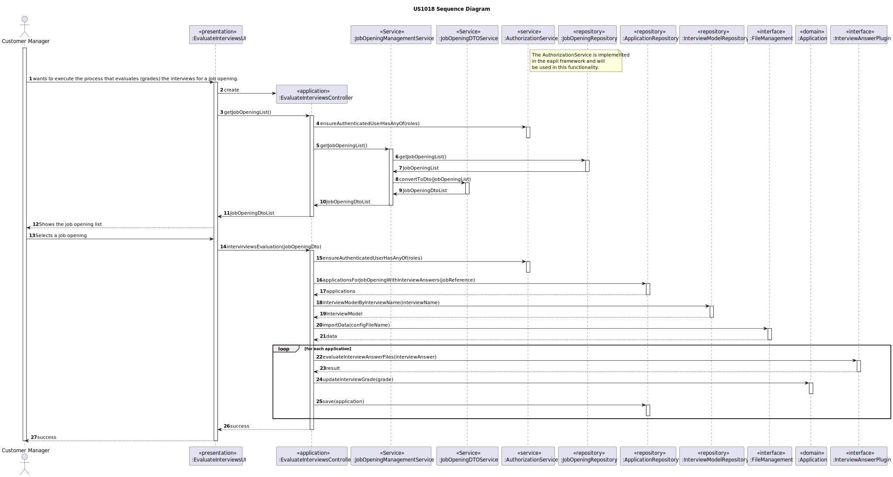

# US 1018

## 1. Context

*This is the first time this user story is being requested.*

## 2. Requirements

**US 1018:** As Customer Manager, I want to execute the process that evaluates (grades) the
interviews for a job opening.

**Acceptance Criteria:**

- 1018.1. Logged as a Customer Manager;

- 1018.2. Must have at least one job opening;

**Client Clarifications**

> **Question:** Our group has a question regarding the processing of candidate response files for the interview. In the case of uploading a file, if the question requiring a number as an answer is filled with an invalid format, for example a letter, we should consider this as an invalid format in US 1017 (and ask the user to upload a valid file again) or should we, in US1018, consider that it is incorrect and assign 0 points automatically for this invalid response? That is, in US 1017, we should just check the file format or should we also check if the answers are filled with the correct data type?
>
> **Answer:** The case mentioned should be considered a file validation error (that is, the submitted file does not match the defined grammar)

> **Question:** Regarding US1018, after the execution of the evaluation process of all job Opening interviews, should the stage where it is be automatically changed to "Result" or should it be kept in "Analysis" and can only be changed by the execution of US1010?
> 
> **Answer:** The US1018 should not change the current phase. The US1010 allows you to change phases of the recruitment process.

## 3. Analysis

*This functionality is for the Customer Manager, so the user needs to be authenticated first to be able to execute the process that evaluates the interviews.*

**System Sequence Diagram:**


## 4. Design
The principal function is to evaluate interview answers, the input for the Customer Manager consists of:

* Select the job opening

After successfully submitting this information, the system should evaluate all the interviews associated at that job opening.

### 4.1.1. Domain Model


### 4.1. Realization



### 4.2. Class Diagram


### 4.3. Applied Patterns
* **Dto**
* **Repository**
* **Service**

> **Repository Pattern**
> * JobOpeningRepository
> * ApplicationRepository
>
> **Justification:**
>
> The repositories were used to retrieve the persisted job openings and to save the job opening instance after the
> changes were made.

> **DTO**
>
> **Justification:**
>
> We opted for DTOs due to the significant amount of domain information required for this functionality. Recognizing the
> benefits of encapsulation and layer decoupling offered by DTOs, we concluded that applying this pattern was
> helpful in this context.

> **Service Pattern**
> * AuthorizationService
>
> **Justification:**
>
> The authorization service was employed to verify the roles of the logged-in user. Different services were used to
> get job openings. As for verifying the requirements, no services were used since this is a unique function not
> intended for other use cases.

### 4.4. Tests
**Domain Tests were implemented in other user stories**

## 5. Implementation

### EvaluateInterviewsController

```
    public Iterable<JobOpeningDTO> getJobOpeningsList() {
        authorizationService.ensureAuthenticatedUserHasAnyOf(BaseRoles.CUSTOMER_MANAGER, BaseRoles.ADMIN);
        Optional<SystemUser> customerManager = authorizationService.loggedinUserWithPermissions(BaseRoles.CUSTOMER_MANAGER);

        return jobOpeningManagementService.jobOpeningsOfCustomerManager(customerManager.get().username());
    }


    public boolean interviewsEvaluation(JobOpeningDTO jobOpening) {
        authorizationService.ensureAuthenticatedUserHasAnyOf(BaseRoles.CUSTOMER_MANAGER, BaseRoles.ADMIN);

        ClassLoader loader = ClassLoader.getSystemClassLoader();

        Iterable<Application> applications = applicationRepository.applicationsForJobOpeningWithInterviewAnswers(jobOpening.getJobReference());
        long size = StreamSupport.stream(applications.spliterator(),false).count();
        if (!applications.iterator().hasNext()) {
            throw new IllegalArgumentException("No applications have associated interview answers.");
        }

        Optional<InterviewModel> im = interviewModelRepository.interviewModelByInterviewName(jobOpening.getInterviewModelName());

        try {
            if (im.isPresent()) {
                InterviewModel interviewModel = im.get();

                FileManagement dataImporterInstance = (FileManagement) loader.loadClass(interviewModel.dataImporter()).getDeclaredConstructor().newInstance();

                InterviewModelPlugin interviewModelEvaluator = (InterviewModelPlugin) loader.loadClass(interviewModel.className()).getDeclaredConstructor().newInstance();

                dataImporterInstance.importData(interviewModel.configurationFile().toString());

                for (Application application : applications) {
                    try {

                        Pair<Integer, String> result = interviewModelEvaluator.evaluateInterviewModelFile(application.interviewAnswerFilePath());
                        application.updateInterviewGrade(result);
                        applicationRepository.save(application);

                    } catch (Exception e) {
                        LOGGER.error("Couldn't evaluate application.");
                        return false;
                    }
                }
            } else {
                LOGGER.error("Requirement specification not found for: {}", jobOpening.getInterviewModelName());
                return false;
            }
        } catch (ClassNotFoundException | NoSuchMethodException | InstantiationException | IllegalAccessException |
                 InvocationTargetException e) {
            LOGGER.error("Unable to access plugin.");
            return false;
        }
        return true;
    }
```
## 6. Integration/Demonstration
To execute this functionality it is necessary to run the script named `run-backoffice-app` and log in with Customer Manager permissions
after it, must select the menu `Job Opening` followed by `Evaluate interviews for a job opening`.

