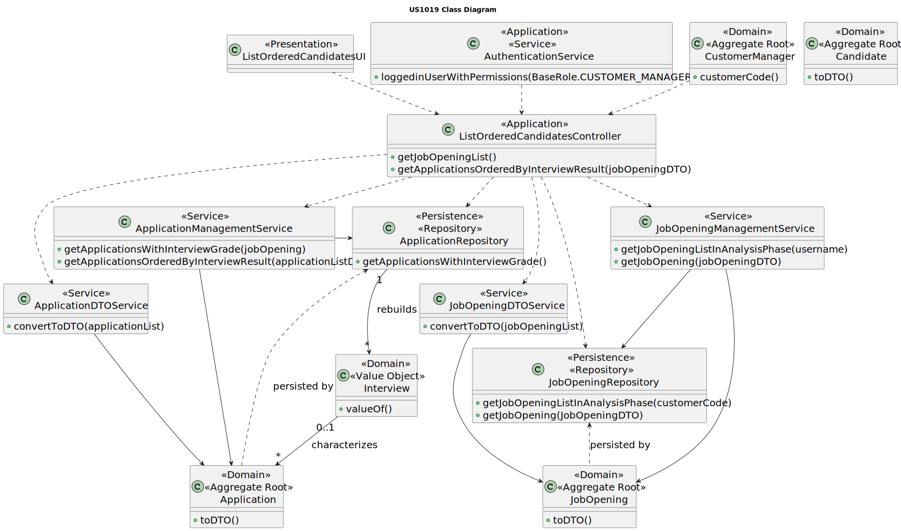

# US 1019

## 1. Context

It is the first time this task is assigned.

## 2. Requirements

**US 1019** As Customer Manager, I want to get an ordered list of candidates, using the job interview points (grades),
to help me analyze the candidates.

**Acceptance Criteria:**

- **1019.1.** The system should display the candidates based in the interview points.

- **1019.2.** The list should be in descending order, from the highest score to the lowest score.

- **1019.3.** The system should only display the candidates for job openings if they have interviews.


**Dependencies/References:**

- **US G007** - This functionality has a dependency on _US G007_ that pertains to the authentication and authorization
  for all users and functionalities.

- **US 2002** - This functionality has a dependency on _US 2002_ that consists in the creation of applications, since
  needs to exist an application in order to display its information.

- **US 1018** - This functionality has a dependency on _US 1018_ since in this user story the interviews will be evaluated,
  to obtain the grades that will be used.

- **US 1017** - This functionality has a dependency on _US 1017_ that consists in the upload of the text files with the
  candidate responses for an interview.


**Client Clarifications:**

> **Question:** US1019 - Regarding the user story, "US1019 - As Customer Manager, I want to get and ordered list of
> candidates, using the job interview points (grades), to help me analyze the candidates", the list you want is related
> to a job opening, correct? Should the sorting be ascending, or do you want an option to include both ascending and
> descending?
>
>
> **Answer:** Yes, the sorting is related to applications for a job opening. The sorting should be descending, from the
> highest score to the lowest score.


> **Question:** US1019 Clarification - In US1019: As a Customer Manager, I want to get an ordered list of candidates,
> using the job interview points (grades), to help me analyze the candidates. You want me to return an ordered list of
> candidates and their interview grades for a specific job opening of one of my clients. I plan to implement this
> functionality as follows:
>
> Job Opening: XXX
>
> Nome | Email | Grade
>
> Jane Doe| jane@doe.pt | 85
>
> John Doe| john@doe.pt | 70
>
> In other words, with descending order.
> As mentioned in Q153, you can see this list in one instance, and in another instance, you can create the ranking you
> find pertinent.
> Does this sound good?
>
> **Answer:** I think you want to refer to Q163. Regarding the example you provided, it seems to meet my requirements.


> **Question:** US1019 - In question Q169 is mentioned that the list should be ordered descending by the interview score
> (as also mentioned in the US itself), however, the question is, how do you envision the ordering if the job opening
> does not include an interview?
>
>
> **Answer:** This User Story does not make sense for processes that do not have an interview.


> **Question:** US1019 - According to the response A197, should we then only allow the listing of job openings that
> have an interview?
>
>
> **Answer:** I think I didn't quite understand the reference to the listing of job openings. This US doesn't make sense
> for job openings that don't have an interview, as it is based on listing the candidates and their interview scores.


> **Question:** US1019 - In the user story description: "As a Customer Manager, I want to get and ordered list of
> candidates, using the job interview points (grades), to help me analyze the candidates." Does the intention "analyze
> the candidates" impose any change/removal of candidates in the system?
>
>
> **Answer:** The reference to "analyze the candidates" is only to convey the idea that in this user story (US), the
> system should provide a way for the Customer Manager to view the interview results to help decide the ranking of
> candidates. Nothing more. The ranking of candidates is recorded in the system through US1013.


> **Question:** US1019 - Justification of Interview Grades - In this user story, the interview grades should have the
> necessary justification?
>
>
> **Answer:** In the section 2.3.4: "The system should provide a justification, such as "A minimum Bachelor degree is
> required for the job position". A similar approach is used for job interviews, but in this case, the goal is not
> approve or reject a candidate but to evaluate the answers and calculate a grade for the interview in the range 1-100."
> Yes, it would be important to present an ordered list by the grades. It should also be possible, for each interview,
> to know the justification for the grade. As a justification, it could be considered to know, for each question, the grade
> obtained and the response given by the candidate (for example).


> **Question:** US1019 Question Phase Analysis - In this user story, does the expression "to help me analyze candidates"
> in the description of the user story imply that the job opening must be in the analysis phase?
>
>
> **Answer:** I don't see this as an obligation, but I think it makes more sense in this phase, assuming that only in
> this phase is guaranteed that all interviews have been conducted and all candidates have been "evaluated" through the
> interviews.


## 3. Analysis

In this functionality, the customer manager needs to select a job opening and then the order list of the candidates will
be displayed. The list should be in descending order, from the candidate with the better interview grade to the worst.


### 3.1 System Sequence Diagram


### 3.2 Domain Model Related


## 4. Design

To address this functionality, we are going to adopt a four-layered approach based on DDD (Domain-Driven Design)
architecture: Presentation, Application, Domain and Persistence.

To list an ordered list of the candidates, the customer will have access to the job openings related to him, so it is
possible to go for the selected job opening and get the list, using the interview grades.

To be able to promote encapsulation between layers, it will be used DTOs.

**_Classes Used_**

**Domain Layer Classes**

* JobOpening
* Application
* Candidate
* JobOpeningManagementService
* JobOpeningDTODTOService
* ApplicationManagementService
* ApplicationDTOService


**Application Layer Classes**

* ListOrderedCandidatesController


**Presentation Layer Classes**

* ListOrderedCandidatesUI


### 4.1. Realization

* **US1019 Sequence Diagram**


### 4.2. Class Diagram



### 4.3. Applied Patterns

To make the design of this user story, were used the following patterns:

>**_Repository Pattern_**
>* Classes
>  * JobOpeningRepository
>  * ApplicationRepository
>
>* Justification
   >
   >  The JobOpening, Application and Candidate repository have the purpose of keeping the persistence of the job opening,
   >and application existing instances.


>**_Service Pattern_**
>* Classes
>   * JobOpeningManagementService
>  * JobOpeningDTOService
>  * ApplicationManagementService
>  * ApplicationDTOService
>  * AuthorizationService
>
>* Justification
   >
   >  The services are in charge of managing request regarding jobOpenings, applications and candidates,
   >serving as encapsulation between the controller and the JobOpeningRepository and ApplicationRepository
   >along with the domain classes.
   >  The DtoServices to transform these instances into DTOs.
   >  The authorization service is used to verify the roles of the user.


### 4.4. Tests

**Test 1:** Verifies that the job opening has interviews

**Refers to Acceptance Criteria:** 1019.3

````
@Test
public void ensureJobOpeningHasInterview() {
...
}
````

## 5. Implementation

### ListOrderedCandidatesController

```
    public Iterable<JobOpeningDTO> getJobOpeningList() {
        Optional<SystemUser> customerManager = authz.loggedinUserWithPermissions(BaseRoles.CUSTOMER_MANAGER);
        return customerManager.map(systemUser -> jobOpeningManagementService.getJobOpeningListInAnalysisPhase(systemUser.username())).orElse(null);
    }

    public List <ApplicationDTO> getApplicationsOrderedByInterviewResult(JobOpeningDTO jobOpeningDTO){
        JobOpening job = jobOpeningManagementService.getJobOpening(jobOpeningDTO);

        List<ApplicationDTO> applicationListDTO = applicationManagementService.getApplicationsWithInterviewGrade(job);

        List<ApplicationDTO> orderApplicationDTOList = applicationManagementService.getApplicationsOrderedByInterviewResult(applicationListDTO);

        return orderApplicationDTOList;
    }
```
### JobOpeningManagementService

```
    public Iterable<JobOpeningDTO> getJobOpeningListInAnalysisPhase(Username customerManagerUsername){
        Iterable<JobOpening> jobs = jobOpeningRepository.getJobOpeningListInAnalysisPhase(customerManagerUsername);
        return dtoSvc.convertToDTO(jobs);
    }
    
    public JobOpening getJobOpening(JobOpeningDTO jobOpeningDTO) {
        String jobReference = jobOpeningDTO.getJobReference();
        JobOpening jobOpening = null;

        for (JobOpening job : jobOpeningRepository.findAll()) {
            if (job.jobReference().toString().equals(jobReference)) {
                jobOpening = job;
            }
        }
        return jobOpening;
    }
```

### JobOpeningDTOService

```
public Iterable<JobOpeningDTO> convertToDTO(Iterable<JobOpening> jobOpenings) {
        Preconditions.noneNull(jobOpenings);

        List<JobOpeningDTO> dtos = new ArrayList<>();
        for (JobOpening j : jobOpenings) {
            dtos.add(j.toDTO());
        }

        return dtos;
    }
```

### ApplicationManagementService

```
    public List<ApplicationDTO> getApplicationsWithInterviewGrade(JobOpening jobOpening){
        Iterable<Application> applicationList = applicationRepository.getApplicationsWithInterviewGrade(jobOpening.jobReference().toString());

        return (List<ApplicationDTO>) applicationDTOService.convertToDTO(applicationList);
    }
    
    public List<ApplicationDTO> getApplicationsOrderedByInterviewResult(List<ApplicationDTO> applicationListDTO) {
        List<ApplicationDTO> orderList = applicationListDTO;

        Collections.sort(orderList, new Comparator<ApplicationDTO>() {
            @Override
            public int compare(ApplicationDTO app1, ApplicationDTO app2) {
                Integer grade1 = app1.getInterview().interviewResult().interviewGrade();
                Integer grade2 = app2.getInterview().interviewResult().interviewGrade();


                return grade2.compareTo(grade1);
            }
        });

        return orderList;
    }
```

### ApplicationDTOService

```
public Iterable<ApplicationDTO> convertToDTO(Iterable<Application> applications) {
        Preconditions.noneNull(applications);

        List<ApplicationDTO> dtos = new ArrayList<>();
        for (Application j : applications) {
            dtos.add(j.toDTO());
        }

        return dtos;
    }
```

## 6. Integration/Demonstration

To execute this functionality it is necessary to run the script named `run-backoffice-app` and log in with Customer Manager permissions.
Then navigate to the menu `Candidates` followed by option  2 - `Get an ordered list of candidates`.

````

+= List Ordered Candidates ====================================================+

INDEX: 0==================================================================
[Job Reference] ISEP-1
[Status] STARTED
[Function] Front End Junior Developer
[Description] Night Guard.
[Contract Type] full-time
[Work Mode] remote
[Address] 123 Main Street, USA, Flagtown, Star District, 4500-900
[Customer Code] ISEP
[Number of Vacancies] 2
[Requirement Specification] Requirements_Back_End_Dev
=====================================================================
INDEX: 1==================================================================
[Job Reference] ISEP-7
[Status] STARTED
[Function] Front End Senior Developer
[Description] Night Guard.
[Contract Type] full-time
[Work Mode] remote
[Address] Third Street, New Dream, New Town, New District, 4520-920
[Customer Code] ISEP
[Number of Vacancies] 3
[Requirement Specification] Requirements_Front_End_Dev
=====================================================================
Select the job opening index:
1

Job Opening:ISEP-7
Name            | Email                  | Grade | Justification
-----------------------------------------------------------------------------------
Joana           | candidate@email.com    | 60   | errors in questions 5 and 7.            
Matilde         | 1220683@isep.ipp.pt    | 22   | errors in questions 1, 2, 4 and 6.      
+==============================================================================+
````
