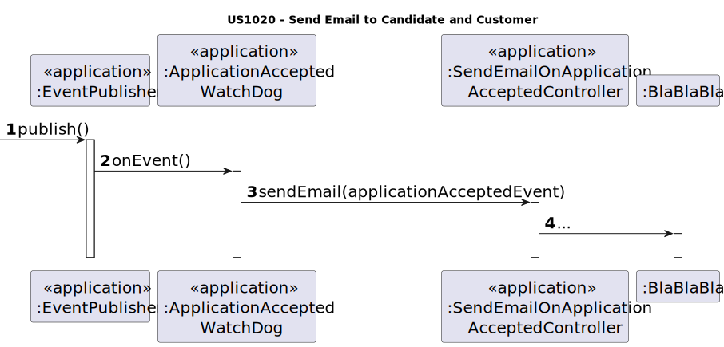
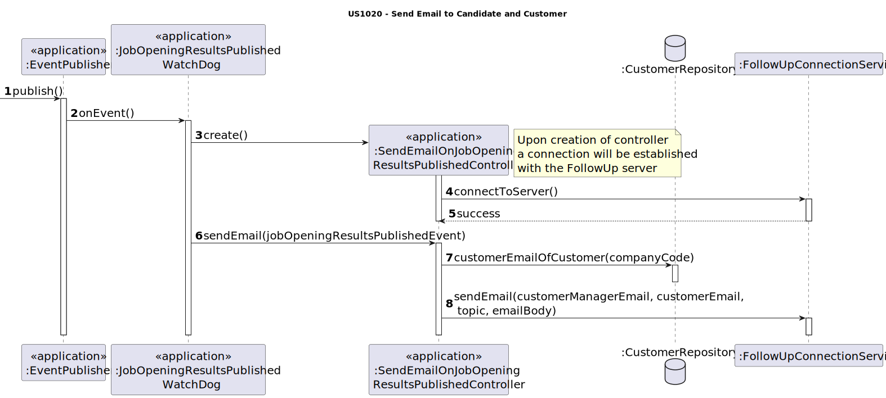

# US 1020

## 1. Context

This is the first time this user story is being requested.

## 2. Requirements

**US 1020** As {Customer Manager}, I want to publish the results of the selection of candidates for a job opening, so
that candidates and customer are notified by email of the result.

**Acceptance Criteria:**

- 1020.1. The number of selected applications/candidates should not surpass the number of vacancies for the job opening.

- 1020.2. The system is required to notify both the customer linked to the job opening and the candidate about the
  selected application.

- 1020.3. The first N applications, where N is the number of vacancies, are the one to be selected.

- 1020.4. The application status of all the job openings in the rank must be updated.

**Dependencies/References:**

We understand that this requirement pertains to reference NFR11, which specifies that the solution should be deployed
across multiple network nodes. Specifically, it is expected that the relational database server and the Follow Up Server
be deployed on nodes separate from localhost, preferably in the cloud. Additionally, the Follow Up Server must handle
e-mail notification tasks in the background.

**Client Clarifications:**

> **Question:** Regarding the sending of email notifications, is it necessary to keep a record of this?
>
>
> **Answer:** The document does not specifically address this matter. However, from Jobs4u's perspective, it seems
> appropriate to have this information recorded.

> **Question:** What is the format for this publication?
>
>
> **Answer:** The publication refers to informing candidates and the client, via email. Candidates who are selected must
> receive an email indicating that they have been selected for their application for the job opening and will be
> contacted
> by the company. As far as the company is concerned, it must receive an email with the list of selected candidates,
> which
> must include the candidate's name and contact details.


> **Question:** Should the email be in English or Portuguese?
>
>
> **Answer:** It can be in Portuguese or English.

> **Question:** Should we assume that the first N candidates in the ranking (where N is the number of job vacancies) are
> chosen, or should we allow the customer manager to select the N candidates?
>
>
> **Answer:** The first option (using the results from US1013).

## 3. Analysis

It is understood that for this functionality, the customer manager must select a job opening to publish the results.
Additionally, the first N candidates, where N is the number of job vacancies, are chosen to fill the positions for
that
job opening.

Furthermore, candidates can only be selected for job openings whose recruitment process is in the
Result phase.

System-wise, after selection, emails will be sent to both the chosen candidates and the customer. The email to the
candidate will inform them that their application was selected and that they will be contacted by the company. For the
company/customer, the email must contain the list of selected candidates, including their names and contact details.

### Domain Model


## 4. Design

*In this sections, the team should present the solution design that was adopted to solve the requirement. This should
include, at least, a diagram of the realization of the functionality (e.g., sequence diagram), a class diagram (
presenting the classes that support the functionality), the identification and rational behind the applied design
patterns and the specification of the main tests used to validade the functionality.*

### 4.1. Realization


#### 4.1.1. Getting job opening in the result phase


#### 4.1.2. Sending email to candidate upon application acceptance



#### 4.1.3. Notifying candidates of the application status change


#### 4.1.4. Sending an email to the customer upon the publication of results



### 4.2. Class Diagram


### 4.3. Applied Patterns

* **DTO**
* **Repository**
* **Service**
* **MVC**
* **Observer**

> **MVC**
>
> **Justification:**
>
> The MVC pattern was employed to divide the system into three distinct parts: model, view, and controller, each
> responsible for a specific aspect of the system’s functionality. This separation of concerns enhances maintainability
> and extensibility, as changes to one part do not require changes to the others.

> **Repository Pattern**
> * JobOpeningRepository
> * ApplicationRepository
> * CustomerRepository
> * NotificationRepository
>
> **Justification:**
>
> The repositories were utilized to retrieve persisted instances based on specific criteria and to save new instances
> after modifications were made.

> **DTO**
> * JobOpeningDto
>
> **Justification:**
>
> We opted for DTOs due to the significant amount of domain information required for this functionality. Recognizing the
> benefits of encapsulation and layer decoupling offered by DTOs, we concluded that applying this pattern was
> helpful
> in this context.

> **Service Pattern**
> * JobOpeningManagementService
> * JobOpeningDtoService
> * AuthorizationService
> * NotificationManagementService
>
> **Justification:**
>
> The services were used to gather job openings to display them to the user, essentially
> listing them. Recognizing the potential for this functionality to be used in various use cases, we opted to
> develop a service with the primary responsibility of: obtaining the persisted instances using their repository and
> using
> the DtoService to transform these instances into DTOs.
> The authorization service was used to verify the roles of the logged-in user.

> **Observer**
> * ApplicationAcceptedEvent
> * ApplicationAcceptedWatchDog
> * SendEmailOnApplicationAcceptedController
> * JobOpeningResultsPublishedEvent
> * JobOpeningResultsPublishedWatchDog
> * SendEmailOnJobOpeningResultsPublishedController
> * ApplicationStatusChangedEvent
> * ApplicationStatusChangedWatchDog
> * NotifyCandidateOnApplicationStatusChangedController
>
> **Justification:**
>
>
> All the mentioned objects are components of the implemented observer pattern. This pattern was employed to ensure that
> when results are published, emails are sent to candidates and customers, and notifications are created for changes in
> application status, allowing candidates to stay informed about new updates.

### 4.4. Tests

#### RankTests

**Test 1:** Verifies that it is not possible to select more applications/candidates than the number of vacancies.

**Refers to Acceptance Criteria:** 1020.1

````
@Test(expected = IllegalArgumentException.class)
public void ensureCantSelectApplicationMoreThanNumberOfVacancies() {
...
}
````

**Test 2:** Verifies that it selects the first N applications/candidates, where N is the number of vacancies.

**Refers to Acceptance Criteria:** 1020.3

````
@Test(expected = IllegalArgumentException.class)
public void ensureMustSelectFirstNApplicationInTheRank() {
...
}
````

**Test 3:** Verifies that it updates the status of all ranked applications/candidates.

**Refers to Acceptance Criteria:** 1020.4

````
@Test(expected = IllegalArgumentException.class)
public void ensureMustUpdateStatusOfAllRankedApplications() {
...
}
````

## 5. Implementation

*In this section the team should present, if necessary, some evidencies that the implementation is according to the
design. It should also describe and explain other important artifacts necessary to fully understand the implementation
like, for instance, configuration files.*

*It is also a best practice to include a listing (with a brief summary) of the major commits regarding this
requirement.*

## 6. Integration/Demonstration

In this section the team should describe the efforts realized in order to integrate this functionality with the other
parts/components of the system

It is also important to explain any scripts or instructions required to execute an demonstrate this functionality

## 7. Observations

*This section should be used to include any content that does not fit any of the previous sections.*

*The team should present here, for instance, a critical prespective on the developed work including the analysis of
alternative solutioons or related works*

*The team should include in this section statements/references regarding third party works that were used in the
development this work.*