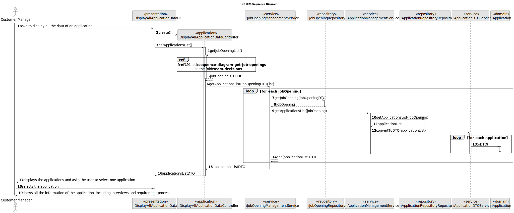
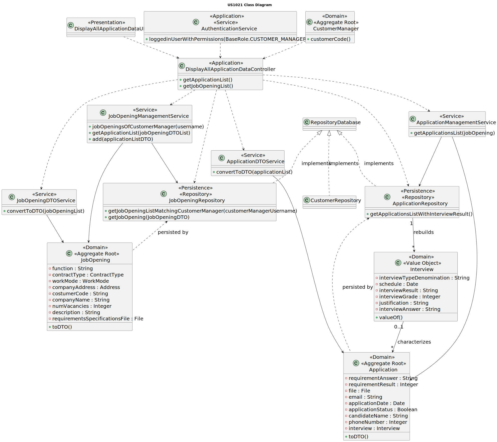

# US 1021

## 1. Context

This is the first time this task is assigned.

## 2. Requirements

**US 1021** As Customer Manager, I want to display all the data of an application.

**Acceptance Criteria:**

- **1021.1.** The system should display the application files.

- **1021.2.** The system should display the data collected or generated during the process, such as interviews and
requirement process.


**Dependencies/References:**

- **US G007** - This functionality has a dependency on _US G007_ that pertains to the authentication and authorization
  for all users and functionalities.

- **US 2002** - This functionality has a dependency on _US 2002_ that consists in the creation of applications, since
  needs to exist an application in order to display its information.


**Client Clarifications:**

> **Question:** US1021 - What is 'all data of an application'? What is a job application?
>
>
> **Answer:** A job application is a candidate's application for a job opening. As for "all data of an application",
> it refers to all the data associated with an application, including the files submitted by the candidate as well as
> the data collected or generated during the process (such as interviews and requirement processing).

> **Question:** US1021 - Regarding US1021, how is chosen the Application to be displayed? Can the user start by choosing
> the Job Reference and then the email of one candidate? Or do you recommend another approach?
>
>
> **Answer:** They should apply the best UX/UI practices. There have been previous questions on similar topics (e.g. Q150).
> Note that there is a user story (US) for listing all applications to a job opening, for example.


> **Question:** US1021 - Regarding the listing data for particular job application, will a customer manager have access
> to all job application in the system, or only to the job applications made for a job opening of a client managed by
> that customer manager?
>
>
> **Answer:** Only to those they are managing.


> **Question:** US1021 - Application Listing - I would like to address a specific point related to UI/UX User Story 1021.
> I know the client has been emphasizing that we should apply the best UX/UI practices and would prefer not to constrain
> the way we design the UI/UX. However, our concern is that in this User Story, if there is a larger number of
> applications, displaying all this information at once could become confusing for the user. Therefore, I just wanted to
> ask if we could adopt a more practical solution, such as asking the user to select a job opening first and then listing
> the applications associated with that job opening and their details, or if, in your view, this approach might excessively
> restrict the options offered by this functionality.
>
>
> **Answer:** See Q36. This US is to display the data of a single application. There should be a way for the Customer
> Manager to indicate (including, potentially, a way to select/know/search) which application they are referring to, and
> the system will display the data for that application.


> **Question:** US1021 - When it says to display all the data of an application, does this include, for example, all the
> data of the candidate, all the data of the job opening related to that application, etc? Or just the job opening ID,
> the candidate's email, etc.? In addition to the resume, of course.
>
>
> **Answer:** See Q36.


## 3. Analysis

In this functionality, the customer manager should be able to select an application and display all the information
related to it. Initially, all applications will be displayed, and the customer manager can choose one to view.
Once an application is selected, all information associated with it will be shown, including files submitted by the
candidate and the data collected or generated during the application process, such as interviews and requirements.

This process should be repeated as many times as the user wishes to continue.


### 3.1 System Sequence Diagram


### 3.2 Domain Model Related


## 4. Design

To address this functionality, we are going to adopt a four-layered approach based on DDD (Domain-Driven Design)
architecture: Presentation, Application, Domain and Persistence.

To display all the data of an application, the customer manager will have access to all the applications related to him.
Then, one should be selected and all the data related to that application will be shown.

To be able to promote encapsulation between layers, it will be used DTOs.

**_Classes Used_**

**Domain Layer Classes**

* JobOpening
* Application
* JobOpeningManagementService
* JobOpeningDTOService
* ApplicationManagementService
* ApplicationDTOService


**Application Layer Classes**

* DisplayAllApplicationDataController


**Presentation Layer Classes**

* DisplayAllApplicationDataUI


### 4.1. Realization

* **US1021 Sequence Diagram**



**Ref1:** Check the partial sequence diagram in [team-decisions](../../team-decisions/team-decisions.md#shared-sequence-diagrams) to see the adopted behaviour.


### 4.2. Class Diagram



### 4.3. Applied Patterns

To make the design of this user story, were used the following patterns:

>**_Repository Pattern_**
>* Classes
   >  * JobOpeningRepository
>  * ApplicationRepository
>
>* Justification
   >
   >  The JobOpening and Application repository have the purpose of keeping the persistence of the job opening and
   >application existing instances.


>**_Service Pattern_**
>* Classes
   >   * JobOpeningManagementService
>  * JobOpeningDTOService
>  * ApplicationManagementService
>  * ApplicationDTOService
>  * AuthorizationService
>
>* Justification
   >
   >  The services are in charge of managing request regarding jobOpenings and applications,
   >serving as encapsulation between the controller and the JobOpeningRepository and ApplicationRepository
   >along with the domain classes.
   >  The DtoServices to transform these instances into DTOs.
   >  The authorization service is used to verify the roles of the user.


### 4.4. Tests

**Test 1:** Verifies that exist interview

**Refers to Acceptance Criteria:** 1021.2

````
@Test
public void ensureExistInterview() {
...
}
````

**Test 2:** Verifies that exist requirement answer

**Refers to Acceptance Criteria:** 1021.2

````
@Test
public void ensureMustHaveRequirementAnswer() {
...
}
````

**Test 3:** Verifies that exist requirement result

**Refers to Acceptance Criteria:** 1021.2

````
@Test
public void ensureMustHaveRequirementResult() {
...
}
````

## 5. Implementation

### DisplayAllApplicationDataController

```

    public List <ApplicationDTO> getApplicationsList(){
        Iterable<JobOpeningDTO> jobOpeningDTOList = getJobOpeningList();

        return jobOpeningManagementService.getApplicationsList(jobOpeningDTOList);
    }


    public Iterable<JobOpeningDTO> getJobOpeningList() {
        Optional<SystemUser> customerManager = authz.loggedinUserWithPermissions(BaseRoles.CUSTOMER_MANAGER);
        return customerManager.map(systemUser -> jobOpeningManagementService.jobOpeningsListOfCustomerManager(systemUser.username())).orElse(null);

    }
} 
```
### JobOpeningManagementService

```
public Iterable<JobOpeningDTO> jobOpeningsListOfCustomerManager(Username customerManagerUsername) {
        return dtoSvc.convertToDTO(jobOpeningRepository.jobOpeningsListOfCustomerManager(customerManagerUsername));
    }
    
    public List<ApplicationDTO> getApplicationsList(Iterable<JobOpeningDTO> jobOpeningDTOList) {
        List<ApplicationDTO> applicationDTOList = new ArrayList<>();
        for (JobOpeningDTO dto :jobOpeningDTOList) {
            JobOpening jobOpening = getJobOpening(dto);
            List<ApplicationDTO> applicationDTOFromJobOpening = applicationManagementService.getApplicationsList(jobOpening);
            applicationDTOList.addAll(applicationDTOFromJobOpening);
        }
        return applicationDTOList;
    }
```

### JobOpeningDTOService

```
public Iterable<JobOpeningDTO> convertToDTO(Iterable<JobOpening> jobOpenings) {
        Preconditions.noneNull(jobOpenings);

        List<JobOpeningDTO> dtos = new ArrayList<>();
        for (JobOpening j : jobOpenings) {
            dtos.add(j.toDTO());
        }

        return dtos;
    }
```

### ApplicationManagementService

```
public List<ApplicationDTO> getApplicationsList(JobOpening jobOpening){
        Set<Application> applicationList = jobOpening.getApplications();

        return (List<ApplicationDTO>) applicationDTOService.convertToDTO(applicationList);
    }
```

### ApplicationDTOService

```
public Iterable<ApplicationDTO> convertToDTO(Iterable<Application> applications) {
        Preconditions.noneNull(applications);

        List<ApplicationDTO> dtos = new ArrayList<>();
        for (Application j : applications) {
            dtos.add(j.toDTO());
        }

        return dtos;
    }
```


## 6. Integration/Demonstration

To execute this functionality it is necessary to run the script named `run-backoffice-app` and log in with Customer Manager permissions.
Then navigate to the menu `Applications` followed by option  3 - `Display all data of an application`.

````
+= Display All Data of Application ============================================+

Please select an application
1. 

=====================================================================
#Application: 1
#File: [output\candidate1\1-report-1.txt, output\candidate1\1-candidate-data.txt, output\candidate1\1-big-file-1.txt, output\candidate1\1-email.txt, output\candidate1\1-cv.txt]
#Application Date: 2024-01-05 00:00:00.0
#Application Status: ACCEPTED
#Candidate name: José
#Candidate username: 1220738@isep.ipp.pt
=====================================================================

2. 

=====================================================================
#Application: 2
#File: [output\candidate2\2-letter.txt, output\candidate2\2-cv.txt, output\candidate2\2-candidate-data.txt, output\candidate2\2-email.txt]
#Application Date: 2024-01-06 00:00:00.0
#Application Status: NOT_CHECKED
#Candidate name: Matilde
#Candidate username: 1220683@isep.ipp.pt
=====================================================================

3. 

=====================================================================
#Application: 3
#File: [output\candidate3\example3.txt]
#Application Date: 2024-01-08 00:00:00.0
#Application Status: NOT_CHECKED
#Candidate name: Joana
#Candidate username: candidate@email.com
=====================================================================

4. 

=====================================================================
#Application: 4
#File: [output\candidate5\example5.txt]
#Application Date: 2024-01-12 00:00:00.0
#Application Status: NOT_CHECKED
#Candidate name: Matilde
#Candidate username: 1220683@isep.ipp.pt
=====================================================================

5. 

=====================================================================
#Application: 5
#File: [output\candidate4\example4.txt]
#Application Date: 2024-01-10 00:00:00.0
#Application Status: ACCEPTED
#Candidate name: Matilde
#Candidate username: 1220683@isep.ipp.pt
=====================================================================

6. 

=====================================================================
#Application: 6
#File: [output\candidate5\example5.txt]
#Application Date: 2024-01-12 00:00:00.0
#Application Status: NOT_CHECKED
#Candidate name: José
#Candidate username: 1220738@isep.ipp.pt
=====================================================================

7. 

=====================================================================
#Application: 7
#File: [output\candidate4\example4.txt]
#Application Date: 2024-01-10 00:00:00.0
#Application Status: NOT_CHECKED
#Candidate name: Matilde
#Candidate username: 1220683@isep.ipp.pt
=====================================================================

8. 

=====================================================================
#Application: 8
#File: [output\candidate1\1-report-1.txt, output\candidate1\1-candidate-data.txt, output\candidate1\1-big-file-1.txt, output\candidate1\1-email.txt, output\candidate1\1-cv.txt]
#Application Date: 2024-01-05 00:00:00.0
#Application Status: NOT_CHECKED
#Candidate name: Joana
#Candidate username: candidate@email.com
=====================================================================

9. 

=====================================================================
#Application: 9
#File: [output\candidate3\example3.txt]
#Application Date: 2024-01-08 00:00:00.0
#Application Status: NOT_CHECKED
#Candidate name: José
#Candidate username: 1220738@isep.ipp.pt
=====================================================================

10. 

=====================================================================
#Application: 12
#File: [output\candidate4\example4.txt]
#Application Date: 2024-01-10 00:00:00.0
#Application Status: NOT_CHECKED
#Candidate name: Matilde
#Candidate username: 1220683@isep.ipp.pt
=====================================================================

11. 

=====================================================================
#Application: 13
#File: [output\candidate2\2-letter.txt, output\candidate2\2-cv.txt, output\candidate2\2-candidate-data.txt, output\candidate2\2-email.txt]
#Application Date: 2024-01-06 00:00:00.0
#Application Status: NOT_CHECKED
#Candidate name: Joana
#Candidate username: candidate@email.com
=====================================================================

0. Exit
Select an option: 
11
==================================================================
[Application Number] 13
[Files] [output\candidate2\2-letter.txt, output\candidate2\2-cv.txt, output\candidate2\2-candidate-data.txt, output\candidate2\2-email.txt]
[Application Date] 2024-01-06 00:00:00.0
[Application Status] NOT_CHECKED
[Candidate Name] Joana
[Candidate Username] candidate@email.com
[Interview Result] 60
[Interview Answer] i-answer-1.txt
[Requirement Result] false
[Requirement Answer] r-answer-1.txt
=====================================================================
+==============================================================================+
````