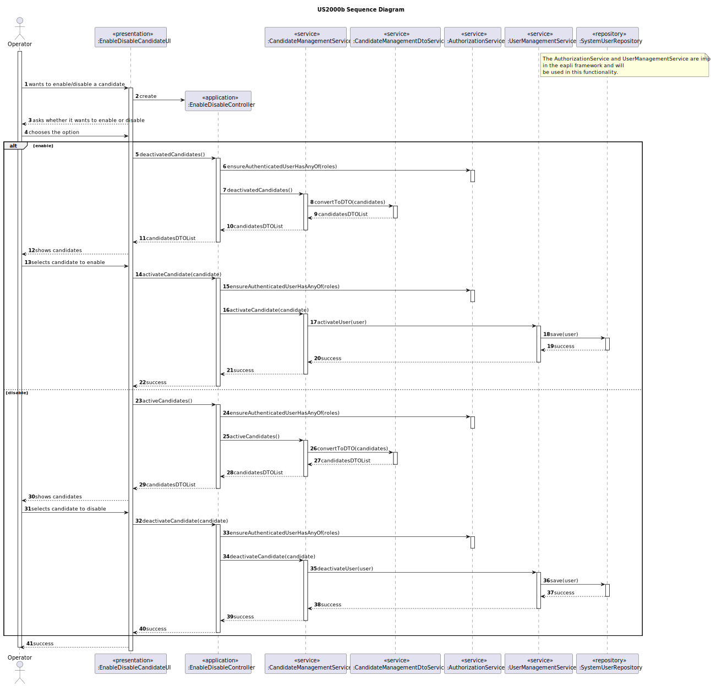
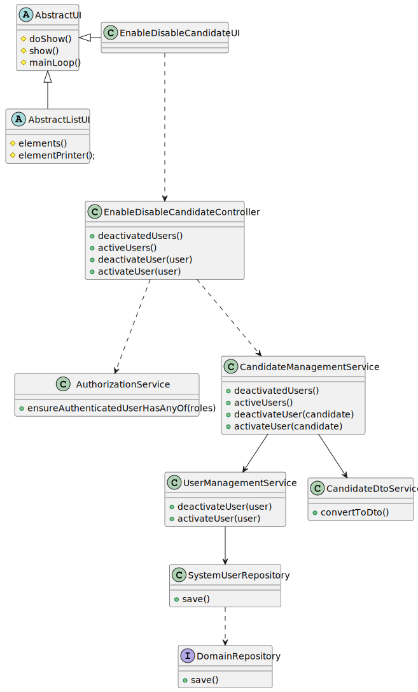

# US 2000b

## 1. Context

*This is the first time this user story is being requested.*

## 2. Requirements

**US 2000b:** As Operator, I want to enable/disable a candidate.

**Acceptance Criteria:**

- 2000b.1. The user should be registered as a operator or admin to be able to enable/disable candidates

- 2000b.2. It should ask the user to confirm the operation

- 2000b.3. The candidate data should be showed to the operator


**Client Clarifications**

> **Question:** I would like to know if the client would like two different menus to be created, with each menu responsible for either activating or deactivating candidates.
>
> **Answer:** I have no specific requirements for the UX/UI but I want you to follow best practices

## 3. Analysis

*This functionality is for the Operator, so the user needs to be authenticated first to be able to activate or deactivate a candidate.*

The enable and disable status of the candidate determines their access to the application. If they are disabled, the login process will fail, even if they are a valid candidate.

**System Sequence Diagram:**


## 4. Design
As recommended, we used the base project and eapli framework as an initial support. Taking this into account, basic
functionalities, like registering, listing, disabling, etc users, were already available. Despite this, some
modifications will
need to be done, such as:

* Enabling candidate users, we will need to develop a way to enable users that were disabled
### 4.1.1. Domain Model


### 4.1. Realization



### 4.2. Class Diagram



### 4.3. Applied Patterns
While many functionalities were pre-existing in the base project and EAPLI framework, our investigation of the code
uncovered several patterns, including:

* **Repository**
* **Service**
* **DTO**


> **Repository Pattern**
> * SystemUserRepository
>
> **Justifications**
> 
>The SystemUserRepository has stored all the SystemUser instances created in all sessions in its database, it's where the instances can be rebuilt.

> **Service Pattern**
> * CandidateManagementService
> * AuthorizationService
> * UserManagementService
>
> **Justifications**
>
> The UserManagementService and AuthorizationService are implemented in Eapli Framework, We used them to activate and deactivate users and to check if the user has the right permissions.
> The CandidateManagementService is used to get the active or deactive candidates and to active or deactive them. This service was created because can be used in more than one user story.
 
> **DTO**
> * CandidateDto
>
> **Justifications**
>
> We choose DTOs because we have a big amount of domain data required for this functionality. Recognizing the
> benefits of encapsulation and layer decoupling offered by DTOs, we decided applying this pattern to our project.

### 4.4. Tests

**All the domain tests for this user storie were done in other US.**

## 5. Implementation

### EnableDisableCandidateController

```
 public class EnableDisableCandidateController {
    private final AuthorizationService authz = AuthzRegistry.authorizationService();
    private final static CandidateManagementService candidateService = new CandidateManagementService();
    private final UserManagementService userService = AuthzRegistry.userService();

    public Iterable<CandidateDTO> activeCandidates() {
        authz.ensureAuthenticatedUserHasAnyOf(BaseRoles.OPERATOR);

        return candidateService.activeCandidates();
    }
    public Iterable<CandidateDTO> deactivatedCandidates() {
        authz.ensureAuthenticatedUserHasAnyOf(BaseRoles.OPERATOR);

        return candidateService.deactivatedCandidates();
    }

    public void deactivateCandidate(final CandidateDTO candidateDTO) {
        authz.ensureAuthenticatedUserHasAnyOf(BaseRoles.OPERATOR);

        Candidate candidate= candidateService.getCandidateByPhoneNumber(candidateDTO.getCandidatePhoneNumber()).get();
        userService.deactivateUser(candidate.user());
    }
    public void activateCandidate(final CandidateDTO candidateDTO) {
        authz.ensureAuthenticatedUserHasAnyOf(BaseRoles.OPERATOR);

        Candidate candidate= candidateService.getCandidateByPhoneNumber(candidateDTO.getCandidatePhoneNumber()).get();
        userService.activateUser(candidate.user());
    }
}
```
### CandidateManagementService

```
    public Optional<Candidate> getCandidateByPhoneNumber(String phoneNumber){
        return candidateRepository.findByPhoneNumber(new PhoneNumber("+351", phoneNumber));
    }
    
    public Iterable<CandidateDTO> activeCandidates() {
        Iterable<Candidate> candidates = this.candidateRepository.findByActive(true);
        return candidateDTOService.convertToDTO(candidates);
    }

    public Iterable<CandidateDTO> deactivatedCandidates() {
        Iterable<Candidate> candidates = this.candidateRepository.findByActive(false);
        return candidateDTOService.convertToDTO(candidates);
    }
```
### UserManagementService

```
    public Iterable<SystemUser> activeUsers() {
        return this.userRepository.findByActive(true);
    }

    public Iterable<SystemUser> deactivatedUsers() {
        return this.userRepository.findByActive(false);
    }
    
    @Transactional
    public SystemUser deactivateUser(final SystemUser user) {
        user.deactivate(CurrentTimeCalendars.now());
        return (SystemUser)this.userRepository.save(user);
    }

    @Transactional
    public SystemUser activateUser(final SystemUser user) {
        user.activate();
        return (SystemUser)this.userRepository.save(user);
    }
```

## 6. Integration/Demonstration
To execute this functionality it is necessary to run the script named `run-backoffice-app` and log in with Operator permissions
after it, must select the menu `Operator` followed by `Active/deactive a candidate`.


