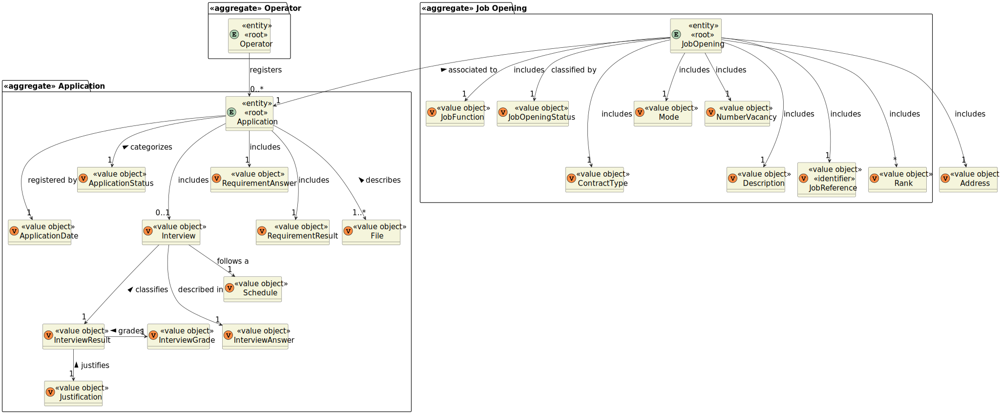
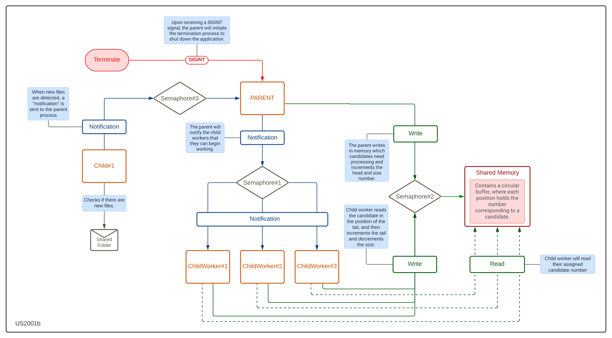

# US 2001b

## 1. Context

This is the first time this user story is being requested, even though it is similar to US2001.

## 2. Requirements

**US 2001b** As Product Owner, I want the system to, continuously, process the files produced by the Applications Email Bot,
so that they can be imported into the system by initiative of the Operator.


**Acceptance Criteria:**

- **2001b.1** The programing language to be used is C.
- **2001b.2** The usage of processes, shared memory and semaphore is required.
- **2001b.3** Child workers do not terminate.
- **2001b.4** The number of children processes must be configurable.
- **2001b.5** The time interval for periodic checking of new files must be configurable.
- **2001b.6** The names of the input and output directories must be configurable.
- **2001b.7** The configuration of the configurable parameters is to be achieved through reading a configuration file
  or the inputted parameters when running the application.
- **2001b.8** The shared folder accessed by the Application File Bot must be organized by job reference (top folders)
  and then by application (sub folder inside the job reference folder).
- **2001b.9** The text report generated must include all the processed applications (including applications for job
  references and files available).


**Dependencies/References:**

This functionality is not dependent on any other user story. However, applications need to be submitted via email to be 
processed by the Applications Email Bot. Subsequently, the Applications File Bot, which handles this functionality, 
processes the applications and their files after a specified time interval.

_Reference **2001b.1**:_ **NFR13(SCOMP)** - An alternative solution for the upload of less must be implemented 
following specific technical requirements such as the use of the C programming language with shared memory and semaphores.
Specific requirements will be provided in SCOMP.


**Client Clarifications:**

> **Question:** I would like to know what is the expected behaviour when the Application File Bot is restarted. Since the
> requirements state that files should be copied and not moved, the bot must know which files may have been already copied
> during previous runs of the program. Should the bot, on startup, check if the existing files were already copied to the
> shared folder, should the files be moved instead of copied or any other solution? If you have no specific requirements
> for this case, only that the system is kept in a consistent state, I'd like to know what is the expected behaviour when
> the bot finds duplicate files. I'd also like to know if the file prefix generated by the Application Email Bot is
> guaranteed to be numeric and unique throughout the whole software solution lifecycle. One more question, regarding how
> the report system works. Should the bot create a report each time new files are found and moved to the shared folder,
> meaning that there are multiple reports simultaneously (for instance, identified via date and time in the file name),
> or should it be a single file to which new data is appended?
>
> **Answer:** As stated in your question, the system should be kept in a consistent state. Regarding duplicate files,
> there should not be any duplicate files (why would duplicate files exist?). Regarding the report, there can be multiple
> report files, each one uniquely identified by some sort of timestamp.


> **Question:** Regarding the EmailFileBot, you previously mentioned that "All other files with the same prefix should be
> considered attachments." Is there a maximum/valid number of files allowed as attachments? Or do we not control the number
> of files submitted per application? For example: CV, Email, Candidate-data, and x optional files?
>
> **Answer:** There is no defined maximum number, but you can establish a configurable limit, for example, in a configuration
> file containing a limit on file size (in MB) or on the number of attachments.


> **Question:** What type of information will be included in the report generated by the Application File Bot? Considering
> that this report will be about multiple applications, how often should it be created?
>
> **Answer:** I am not a technical person, but I would suggest that the report should contain information sufficient for
> diagnosing issues in the import process. Configurable levels of detail for reporting would be useful, similar to what
> is typically available for log files, with a default setting for maximum detail.


> **Question:** From the perspective of the Application File Bot, should it represent a service in the system?
>
> **Answer:** I would say yes, as it is a necessary process in the system to transform received data into a format that
> is "recognized" by the recruitment process.


## 3. Analysis

As in the **US2001**, this functionality has the objective of process the files and to be imported later.

Initially, we will have a parent process that will create a child process to monitor the new directory for the new files
from the Application Process. When the files are detected, a notification should be sent to the parent process, using 
semaphores.

When the parent process receives the notification, the files should be divided among a fixed number of child processes, 
and each child will copy all the files related to a candidate to its subdirectory in the output directory. To divide the
work among the children, we will use shared memory, with an array with the length as the number of child workers.

After the files for a candidate where copied, the child will inform the parent process, using private semaphores, so 
it performs the other steps. The child processes will not terminate.

Once all files have been copied, the parent will generate te report file to the output directory. This report should list,
for each candidate, the name of the output subdirectory and of all the files that were copied.

It's necessary to configure several aspects, including:
* names of input and output directories
* number of work children
* time interval for periodic checking new files

These configurations can be adjusted either during application runtime or by reading from a configuration file.

**Domain Model:**



## 4. Design

### 4.1. Realization

Below there is a simple diagram illustrating the flow of the functionality.



### 4.4. Tests

**Test 1:** Count the number of files

````
int count_files(const char *directory)
{
    DIR *dir;
    struct dirent *entry;
    int file_count = 0;

    // Open the directory
    dir = opendir(directory);
    if (!dir)
    {
        perror("opendir");
        exit(EXIT_FAILURE);
    }
    // Iterate over the directory entries
    while ((entry = readdir(dir)) != NULL)
    {
        // Check if the entry is a regular file
        if (entry->d_type == DT_REG)
        {
            file_count++;
        }
    }

    // Close the directory
    closedir(dir);

    return file_count;
}
````

**Test 2:** Find Report File

````
char *find_report_file(const char *output_directory) {
    DIR *outputDir = opendir(output_directory);
    if (outputDir == NULL) {
        printf("Failed to open output directory\n");
        return NULL;
    }

    // Static buffer to store the full path of the report file
    static char reportPath[512]; // Adjust the buffer size as needed

    // Initialize the buffer to an empty string
    reportPath[0] = '\0';

    // Scan the directory for the report file
    struct dirent *entry;
    while ((entry = readdir(outputDir)) != NULL) {
        if (entry->d_type == DT_REG) { // Check if it's a regular file
            // Create the full path of the report file
            snprintf(reportPath, sizeof(reportPath), "%s/%s", output_directory, entry->d_name);
            break; // Exit the loop after finding the first file
        }
    }

    closedir(outputDir); // Close the output directory

    return reportPath;
}
````


**Test 3:** Get new candidates

````
void test_get_new_candidates(void)
{
    int current_number = 0;
    int max_diff = 0;

    call_func(get_new_candidates, "test_input", &current_number, &max_diff);

    TEST_ASSERT_EQUAL_INT(2, current_number);
    TEST_ASSERT_EQUAL_INT(2, max_diff);
}
````


**Test 4:** Copy files

````
void test_copy_files()
{
    char *output_directory;
    int actual_count;
    call_func_copy_files(copy_files, 1, "test_input", "test_output");
    call_func_copy_files(copy_files, 2, "test_input", "test_output");
    sleep(1); // so that it has time to copy files to verify after

    output_directory = "test_output/candidate1";
    actual_count = count_files(output_directory); // Call the function to count files
    TEST_ASSERT_EQUAL_INT(2, actual_count);

    output_directory = "test_output/candidate2";
    actual_count = count_files(output_directory); // Call the function to count files
    TEST_ASSERT_EQUAL_INT(1, actual_count);
}
````


**Test 5:** Generate report

````
void test_generate_report()
{
    // Call the function to generate the report
    call_func_generate_report(generate_report, 0, "test_output");

    char *reportFilename = find_report_file("test_output");
    if (reportFilename == NULL) {
        printf("Failed to find report file\n");
        TEST_FAIL();
        return;
    }
    
    // Open the generated report file for reading
    FILE *reportFile = fopen(reportFilename, "r");
    if (reportFile == NULL)
    {
        printf("Failed to open report file for reading\n");
        TEST_FAIL();
        return;
    }

    // Buffer to read each line of the report file
    char line[500]; // Assuming maximum line length is 500 characters
    fgets(line, sizeof(line), reportFile);
    TEST_ASSERT_EQUAL_STRING("»»» Candidate - 1 «««\n", line);

    fgets(line, sizeof(line), reportFile);
    TEST_ASSERT_EQUAL_STRING("»» Folder - test_output/candidate1\n", line);

    fgets(line, sizeof(line), reportFile);
    TEST_ASSERT_EQUAL_STRING("»» Files\n", line);

    fgets(line, sizeof(line), reportFile);
    TEST_ASSERT_EQUAL_STRING("[> 1-candidate-data.txt\n", line);

    fgets(line, sizeof(line), reportFile);
    TEST_ASSERT_EQUAL_STRING("[> 1-cv.txt\n", line);
    fgets(line, sizeof(line), reportFile);
    // Read each line from the report file and verify its content
    fgets(line, sizeof(line), reportFile);
    TEST_ASSERT_EQUAL_STRING("»»» Candidate - 2 «««\n", line);

    fgets(line, sizeof(line), reportFile);
    TEST_ASSERT_EQUAL_STRING("»» Folder - test_output/candidate2\n", line);

    fgets(line, sizeof(line), reportFile);
    TEST_ASSERT_EQUAL_STRING("»» Files\n", line);

    fgets(line, sizeof(line), reportFile);
    TEST_ASSERT_EQUAL_STRING("[> 2-cv.txt\n", line);

    fclose(reportFile); // Close the report file
    remove(reportFilename);
}
````


## 5. Implementation

### Father process delegating the work to the N works
```
    while (!time_to_terminate)
    {
        if ((sem_wait(sem3) == -1) && !time_to_terminate)
        {
            perror("sem_wait 333");
            exit(6);
        }
        get_new_candidates(config.input_directory, &lastCandidate, &copiedCandDiff);
        diff = copiedCandDiff;
        while (diff > 0)
        {

            for (int i = 0; i < copiedCandDiff; i++)
            {
                if (shared_memory->size != LENGTH_BUFFER)
                {
                    cand = (lastCandidate - (diff - 1));
                    shared_memory->array[shared_memory->head] = cand;
                    shared_memory->head = (shared_memory->head + 1) % LENGTH_BUFFER;
                    printf("»» New candidate delegated: %d\n", cand);

                    if ((sem_wait(sem2) == -1) && !time_to_terminate)
                    {
                        perror("sem_wait 2222");
                        exit(6);
                    }
                    shared_memory->size++;
                    if ((sem_post(sem2) == -1) && !time_to_terminate)
                    {
                        perror("sem_wait 22222");
                        exit(5);
                    }
                    delegated_cand++;
                    diff--;
                }
                else
                {
                    diff = copiedCandDiff - delegated_cand;
                    break;
                }
            }
            for (int i = 0; i < delegated_cand; i++)
            {
                if ((sem_post(sem1) == -1) && !time_to_terminate)
                {
                    perror("sem_post");
                    exit(5);
                }
            }
            delegated_cand = 0;
            copiedCandDiff = diff;
        }
    }
```


### How each worker received, process and tells that finished the work
```
for (int i = 1; i <= config.num_worker_children; i++)
    {
        child_p[i] = fork();
        if (child_p[i] == 0)
        {
            while (!time_to_terminate)
            {
                if ((sem_wait(sem1) == -1) && !time_to_terminate)
                {
                    perror("sem_wait 11");
                    exit(6);
                }
                if ((sem_wait(sem2) == -1) && !time_to_terminate)
                {
                    perror("sem_wait 22");
                    exit(6);
                }
                    if (!time_to_terminate)
                    {
                        copy_files(shared_memory->array[shared_memory->tail], config.input_directory, config.output_directory); // Copies the files from the input directoty to the ouput directory
                        printf("»»» New candidate processed: %d\n", shared_memory->array[shared_memory->tail]);
                        shared_memory->tail = (shared_memory->tail + 1) % LENGTH_BUFFER;
                        shared_memory->size--;
                    }   
                if ((sem_post(sem2) == -1) && !time_to_terminate)
                {
                    perror("sem_post");
                    exit(5);
                }
            }
            if (munmap(shared_memory, size) == -1)
            {
                perror("munmap");
                exit(7);
            }
            if (close(fd) == -1)
            {
                perror("close");
                exit(8);
            }
            exit(10 + i);
        }
    }
```

## 6. Integration/Demonstration

To execute the program, it is necessary to compile and run it. Using `make run` allows for execution with predefined
configurations. If you wish to modify these configurations, you can adjust the `run` command in the makefile or execute
the program directly via `./prog <<input_dir> <output_dir> <num__child_workers> <time_interval>`.

To run the implemented tests, they must be located outside the directory containing the program but within the same
folder. Additionally, an environmental variable named REPO must be created, specifying the folder containing the
program (in this case `export REPO=sprintc`). Once set up, you can compile and run the tests using `make run`.

The files generated in this functionality will be used by the operator to register applications.

```
./prog files output 2 5
» New file found «
»» New candidate delegated: 1
»» New candidate delegated: 2
»» New candidate delegated: 3
»»» New candidate processed: 1
»» New candidate delegated: 4
»»» New candidate processed: 2
»»» New candidate processed: 3
»»» New candidate processed: 4
» New file not found «
» New file not found «
» New file not found «
» New file not found «
» New file not found «
» New file not found «
^C
[Child 3365] - Exit Status:10 
[Child 3366] - Exit Status:11 
[Child 3367] - Exit Status:12 
```
