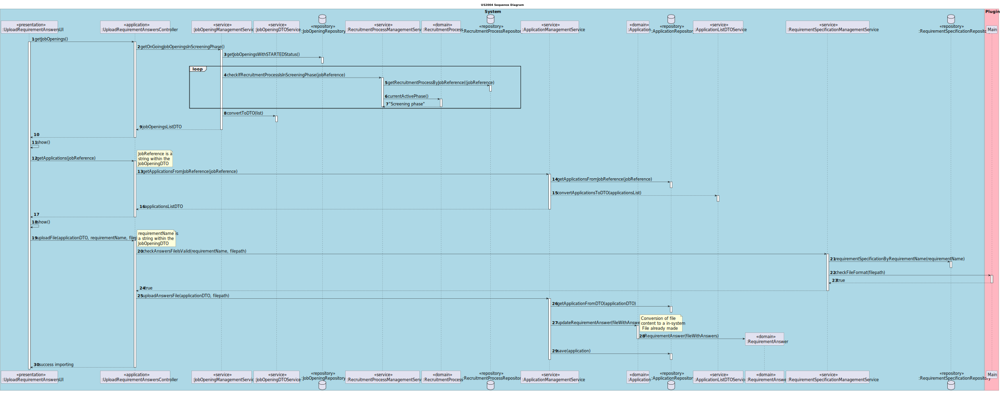
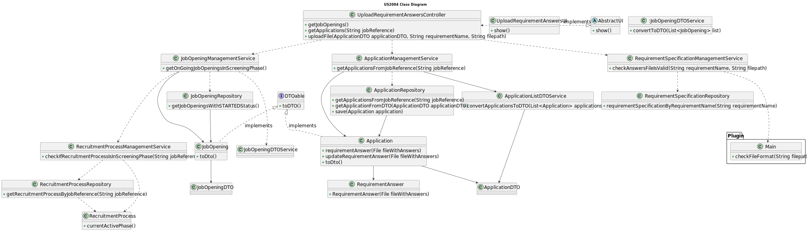

# US 2004

## 1. Context

This is the first time this user story is being requested.

## 2. Requirements

**US 2004** As {Operator}, I want to upload a text file with the data fields (requirements) of a candidate for its
verification.

**Acceptance Criteria:**

- **2004.1** The Operator must have access to the candidates' application files data.
- **2004.2** The Operator must be able to download the template generated by the defined requirements' plugin to then fill
it with the candidate's answers.

**Dependencies/References:**

**US1002 and US1007** | A job opening associated with a recruitment process is required so that the candidates can apply.

**US1008, US1009 ans US2003** | A requirement set must be associated with a job opening, and the template for them must be
accessible.

**US2002** | The candidates must be registered in the system and their application files must be imported.

**US2003** | The operator must be able to download the generated requirement template to insert the candidate's answers.

_Reference **2004.1**:_ **NFR09(LPROG)** - RequirementSpecifications and Interview Models. The support for this functionality
must follow specific technical requirements, specified in LPROG. The ANTLR tool should be used (https://www.antlr.org/).


**Client Clarifications:**

> **Question:** Who will fill in the responses in the template file?
>
> **Answer:** It will be the Operator, and as part of US2004, they will submit the filled-in file into the system.


> **Question:** We have a question about the management of the screen phase of the recruitment process. Specifically, 
> after the applications are filtered during the screening process, I'm unsure about who manages the results and oversees
> this phase. Could you please clarify if the responsibility for managing the screening results falls under the customer
> manager, the operators, or both?
>
> **Answer:** In US2003 and US2004 it is the Operator that “downloads” a template file to register the requirements, 
> registers the answers for the requirements in the file,  and then uploads the file. It is then the Costumer manager
> that executes the verification process (US1015) and executes the notification of the results (US1016).


> **Question:** Where are the requirements answers obtained from the candidates, so that the operator can then register 
> their answers in the template previously generated and submit them to the system? Are these answers already within the 
> files processed by the application file bot?
>
> **Answer:** We can assume that the operator has access to all the files submitted by the candidates (since he/she is the
> one that imports the files into the system – US2002). He/she can than consult these files in order to answer the questions
> in the requirements template file. She/he then submits the file with the answers (US2004).


> **Question:** Does US2004 only deals with the upload of the file to the system or also the registration of the candidate's
> answer by the Operator? I've seen many mentions about the file's answers but I want to understand if that aspect is also
> part of US2004.
>
> **Answer:** In US2003 the Operator downloads a template file that he/she uses to register the candidate requirements. 
> In US 2004, the Operator uploads a file with the requirements and the system should validate the file (verify of the 
> syntax is correct). US 1015 is the one that executes the verification of requirements for the candidates (based on the
> previously uploaded files).


> **Question:** Submission of a file for verification – My group has a question regarding US2004, specifically about the
> file submission process. We would like to know if "submit the file for verification" in US2004 only involves storing 
> the file path in the system and performing its syntactic analysis (as mentioned in Q180), or if it also involves extracting
> and storing the information contained in the file in specific structures for later verification. We have this doubt because
> there are User Stories where it is explicit that the information from the files is supposed to be imported, such as in
> US2002: "As Operator, I want to register an application of a candidate for a job opening and import all files received."
> However, in US2004 it is not explicit what "submit the file" means.
>
> **Answer:** Submitting the file means "importing" the file into the system, verifying its syntactic correctness. The 
> file becomes part of the system, allowing for subsequent operations on that file/data, such as in US1015. I do not want
> to dictate how this should be done in terms of the solution.


> **Question:** About the Us2004, you previously stated that "the Operator uploads a file with the requirements and the 
> system should validate the file (verify of the syntax is correct). US 1015 is the one that executes the verification...".
> What should happen if the file fails this verification? Is the application instantly refused or do you have something
> else in mind?
>
> **Answer:** A file that fails the verification means that that file has an error (syntactic error) it does not mean that
> the application does not meet the requirements. The user should fix the error and submit again. Only US 1015 results 
> in approving or rejecting an application.


> **Question:** - About the Us2004, when the Operator uploads the text file, in which phase is this US going to be?
>
> **Answer:** All the files of the candidate must have been imported before. These files will be necessary for the operator
> to be able to answer the questions in the requirements specification template. Only then can the operator upload the file
> with the answers. This is the normal sequence. Regarding the phase of the process, I think it will depend on the proposed
> solution. I am open to solutions that do not invalidate the data consistency of the system


## 3. Analysis

After inserting the candidate's answers on to the generated template, the Operator submits them into the system. This file
will be analysed in US1015.

Below there's a System Sequence Diagram (SSD) illustrating the expected behaviour of this functionality. After this diagram
is a partial domain model, with emphasis on US2004's concepts.

**US2004 System Sequence Diagram**


**US2004 Partial Domain Model**


## 4. Design

Before uploading the file into the system, the plugin ensures that its syntax is correct.

* **New Application Layer Classes**
* UploadRequirementAnswersController

**New Presentation Layer Classes**
* UploadRequirementAnswersUI

No new domain or persistence classes are to be added. 

The further topics illustrate and explain this functionality usage flow, and the correlation between its components.

### 4.1. Realization



### 4.2. Class Diagram



### 4.3. Applied Patterns

This topic presents the classes with the patterns applied to them along with justifications.

>**Repository Pattern**
> * JobOpeningRepository
> * ApplicationRepository
> * RequirementSpecificationRepository
> * RecruitmentProcessRepository
>
> **Justifications**
>
> * The JobOpeningRepository has stored all the jobOpening instances created in all sessions in its database, it's where
>   the instances can be rebuilt.
>
> * The recruitment processes are stored within the database, and must be rebuilt, so that the system can evaluate if the
>   instance associated with the chosen jobOpening is in the right phase.
>
> * The repository stores applications and their respective files, including the requirements answer file.
> 
> * The requirement specification repository knows what plugins are associated with which requirement.


>**Service Pattern**
> * JobOpeningManagementService
> * RequirementSpecificationManagementService
> * RecruitmentProcessManagementService
> * ApplicationListDTOService
> * ApplicationManagementService
>
> **Justifications**
>
> * JobOpeningManagementService is used in more than one functionality, and its in charge of managing request regarding
>   jobOpenings, serving as encapsulation between the controller and the JobOpeningRepository along with the domain classes.
>
> * RecruitmentProcessManagementService is used to check if the recruitment process associated with the chosen job opening
>   is in the right phase.
>
> * ApplicationManagementService allows to update an application regarding its requirement answers.
>
> * ApplicationListDTOService promotes layer encapsulation by converting application instances in DTOs.
> 
> * RequirementSpecificationManagementService is used in more than one functionality, and its in charge of managing request
>   regarding requirements, serving as encapsulation between the controller and the RequirementSpecificationRepository
>   along with the domain classes.


### 4.4. Tests


No new tests were made regarding the domain entities within this functionality.

> * [US1002 - JobOpening Tests](../../sprint-b/sb_us_1002/readme.md/#45-tests)
>
> * [US2002 - Application Tests](../../sprint-b/sb_us_2002/readme.md/#44-tests)


## 5. Implementation

This functionality UI class.
````
protected boolean doShow() {
    SelectWidget<JobOpeningDTO> jobOpeningDTOSelectWidget;

    try{
        jobOpeningDTOSelectWidget = new SelectWidget<>("Select Job Opening:",
                controller.getJobOpenings());
    }catch (NoSuchElementException e){
        return false;
    }

    jobOpeningDTOSelectWidget.show();
    JobOpeningDTO jobOpeningDTO = jobOpeningDTOSelectWidget.selectedElement();

    ApplicationDTO applicationDTO;
    try {
        SelectWidget<ApplicationDTO> applicationDTOSelectWidget = new SelectWidget<>("Select Application:",
                controller.getApplications(jobOpeningDTO.getJobReference()));
        applicationDTOSelectWidget.show();
        applicationDTO = applicationDTOSelectWidget.selectedElement();
    } catch (RuntimeException e) {
        System.out.println(e.getMessage());
        return false;
    }

    assert applicationDTO != null;
    String filepath = Console.readLine("Please enter the filepath of the requirement answers file: ");

    assert false;
    if (controller.uploadFile(applicationDTO, jobOpeningDTO.getRequirementName(), filepath)) {
        System.out.println("File uploaded successfully.");
    } else {
        System.out.println("File not uploaded.\nPlease check the syntax or format of the file.");
    }

    return false;
}
````

Method to get the job Openings of which its recruitment process is in the Screening phase.
````
public Iterable<JobOpeningDTO> getOnGoingJobOpeningsInScreeningPhase() {
    List<JobOpening> jobOpeningList = new ArrayList<>();
    List<JobOpening> jobOpenings = jobOpeningRepository.getJobOpeningListMatchingStatus(String.valueOf(JobOpeningStatusEnum.STARTED));
    for (JobOpening jobOpening : jobOpenings) {
        if (recruitmentProcessManagementService.checkIfRecruitmentProcessIsInScreeningPhase(jobOpening.jobReference().toString())){
            jobOpeningList.add(jobOpening);
        }
    }
    return dtoSvc.convertToDTO(jobOpeningList);
}
````

Method to check the file syntax.
````
public boolean checkAnswersFileIsValid(String requirementName, String filepath) {
    ClassLoader loader = ClassLoader.getSystemClassLoader();
    try {
            Optional<RequirementSpecification> rs = requirementSpecificationRepository.requirementSpecificationByRequirementName(requirementName);
            if (rs.isPresent()) {
                RequirementSpecification requirementSpec = rs.get();
                FileManagement dataImporterInstance = (FileManagement) loader.loadClass(requirementSpec.dataImporter()).getDeclaredConstructor().newInstance();
                dataImporterInstance.importData(requirementSpec.configurationFile().toString());
                return dataImporterInstance.checkFileFormat(filepath);
            }
    } catch (ClassNotFoundException | NoSuchMethodException | InstantiationException | IllegalAccessException |
             InvocationTargetException e) {
        LOGGER.error("Unable to access plugin.");
        return false;
    }
    return false;
}
````

Method to upload it to the system.
````
public void uploadAnswersFile(ApplicationDTO applicationDTO, String filepath) {
    Application application = applicationRepository.getApplicationFromDTO(applicationDTO);
    application.updateRequirementAnswer(filepath);
    applicationRepository.save(application);
}
````

## 6. Integration/Demonstration

To use this feature, you'll need to run the script named `run-backoffice-app` and log in with Operator
permissions.

Then, navigate to the _Plugins_ menu and select option 2 - `Import Requirement Answer Files` - to access this
feature.

````
+= Jobs4U [ @operator@email.com ] =============================================+

1. My account >
--------------
2. Plugins >
3. Candidates >
4. Applications >
--------------
0. Exit

Please choose an option
2

>> Plugins >
1. Generate and export Requirement Specification Template
2. Import Requirement Answer Files
0. Return 

Please choose an option
2

+= Import Requirement Answers =================================================+

Select Job Opening:
1. »» Job Reference: ISEP-2
 » Function: Back End Senior Developer
 » Contract Type: full-time
 » Work Mode: remote
 » Address: 456 Elm Street, Canada, Maple Town, Moonlight District, 4500-900
 » Description: Night Guard.
 » Number of Vacancies: 15
 » Company: ISEP


0. Exit
Select an option: 
1
Select Application:
1. 
=====================================================================
#Application: 7
#File: [output\candidate4\example4.txt]
#Application Date: 2024-01-10 00:00:00.0
#Application Status: NOT_CHECKED
#Candidate name: Matilde
#Candidate username: 1220683@isep.ipp.pt
=====================================================================


2. 
=====================================================================
#Application: 8
#File: [output\candidate1\1-report-1.txt, output\candidate1\1-candidate-data.txt, output\candidate1\1-big-file-1.txt, output\candidate1\1-email.txt, output\candidate1\1-cv.txt]
#Application Date: 2024-01-05 00:00:00.0
#Application Status: NOT_CHECKED
#Candidate name: Joana
#Candidate username: candidate@email.com
=====================================================================


3. 
=====================================================================
#Application: 9
#File: [output\candidate5\example5.txt]
#Application Date: 2024-01-12 00:00:00.0
#Application Status: NOT_CHECKED
#Candidate name: Matilde
#Candidate username: 1220683@isep.ipp.pt
=====================================================================


0. Exit
Select an option: 
1
Please enter the filepath of the requirement answers file: 
C:\Users\hp15d\Downloads\i-answer-5.txt
File uploaded successfully.
+==============================================================================+


+= Jobs4U [ @operator@email.com ] =============================================+
````


## 7. Observations

This functionality makes use of an external system, the plugin, which has many functionalities, among them, to check the 
format and syntax of a requirement answer file.

Each requirement specification know which instance of the plugin to be used to check syntax and evaluate files.