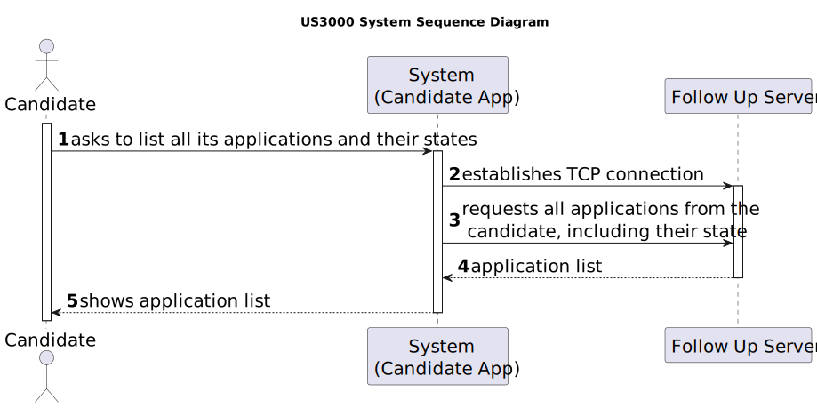

# US 3000

## 1. Context

It is the first time the task is assigned.

## 2. Requirements

**US 3000** As Candidate, I want to list all my applications and their state (including the number of applicants).

**Acceptance Criteria:**

- **3000.1.** The system should display all the applications.

- **3000.2.** The applications should have displayed their status.

- **3000.3.** The number of applications for the job opening should be displayed.

- **3000.4** The implementation of this functionality must follow a client-server architecture.

- **3000.5** The system should not allow direct interaction between the client applications (Candidate App and Costumer 
  App) and the database server.

- **3000.6** The protocol to be used is a TCP (Transmission Control Protocol) based client-server protocol.

- **3000.7** The client application is required to know (IP address or DNS name) the node where the server application is
  running and the TCP port number where the server application is accepting TCP connections.

- **3000.8** The messages exchange between applications must follow a very restrict client-server pattern: the client application
  sends one request message, and the server application sends back one response message.


**Dependencies/References:**

- **US G007** - This functionality has a dependency on _US G007_ that pertains to the authentication and authorization
  for all users and functionalities.

- **US 2002** - This functionality has a dependency on _US 2002_ that consists in the creation of applications, since
  needs to exist an application in order to display its information.

_Reference 3000.1:_ **NFR10(RCOMP)** - Functionalities related to the Candidate and Customer Apps and to the Follow Up Server
part of the system have very specific technical requirements. It must follow a client-server architecture, where a client 
application is used to access a server. Communications between these two components must follow specific protocol 
described in a document from RCOMP ("Application Protocol"). Also, the client applications can not access the relational
database, they can only access the server application.

_Reference 3000.2:_ **NFR11(RCOMP)** - The solution should be deployed using several network nodes. It is expected that, at
least, the relational database server and the Follow Up Server be deployed in nodes different from localhost, preferably
in the cloud. The e-mail notification tasks must be executed in background by the Follow Up Server. 


**Client Clarifications:**

> **Question:** US3000 - In US3000 asks to list the applications and their status for a candidate, as well as the number
> of candidates. Is this number of candidates a sum of the quantity of candidates who applied for the same job openings
> as this first candidate (who is executing the use case)?
>
>
> **Answer:** All the applications of the candidate should be listed, along with their status, as well as the number of 
> applications each job opening received (so the candidate has an idea of the "competition" for each of their
> applications).


## 3. Analysis

For the candidate to list all his applications and their state, including the number of applicants, a TCP connection must 
be established for the Candidate App to the Follow Up Server.

Then the Candidate App will send the request to obtain the candidate applications and their state to the server and
receive the answer. The answers will have a specified format.


### 3.1 System Sequence Diagram



### 3.2 Domain Model Related


## 4. Design

*In this sections, the team should present the solution design that was adopted to solve the requirement. This should
include, at least, a diagram of the realization of the functionality (e.g., sequence diagram), a class diagram (
presenting the classes that support the functionality), the identification and rational behind the applied design
patterns and the specification of the main tests used to validade the functionality.*

### 4.1. Realization

### 4.2. Class Diagram


### 4.3. Applied Patterns

### 4.4. Tests

*Include here the main tests used to validate the functionality. Focus on how they relate to the acceptance criteria.*

**Test 1:** Verifies that it is not possible to ...

**Refers to Acceptance Criteria:** G002.1

````
@Test(expected = IllegalArgumentException.class)
public void ensureXxxxYyyy() {
...
}
````

## 5. Implementation

*In this section the team should present, if necessary, some evidencies that the implementation is according to the
design. It should also describe and explain other important artifacts necessary to fully understand the implementation
like, for instance, configuration files.*

*It is also a best practice to include a listing (with a brief summary) of the major commits regarding this requirement.*

## 6. Integration/Demonstration

In this section the team should describe the efforts realized in order to integrate this functionality with the other
parts/components of the system

It is also important to explain any scripts or instructions required to execute an demonstrate this functionality

## 7. Observations

*This section should be used to include any content that does not fit any of the previous sections.*

*The team should present here, for instance, a critical prespective on the developed work including the analysis of
alternative solutioons or related works*

*The team should include in this section statements/references regarding third party works that were used in the
development this work.*