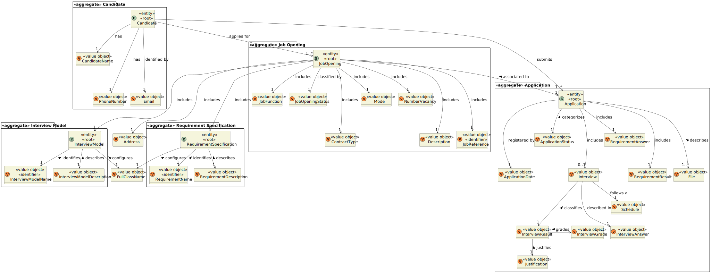
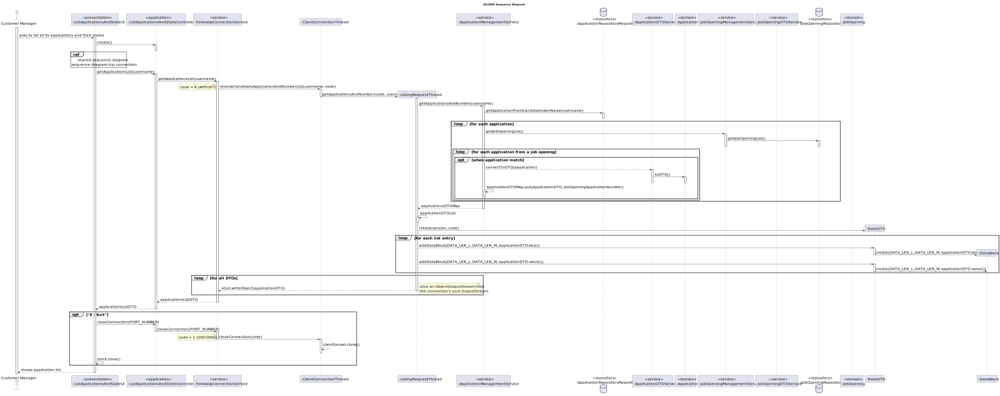
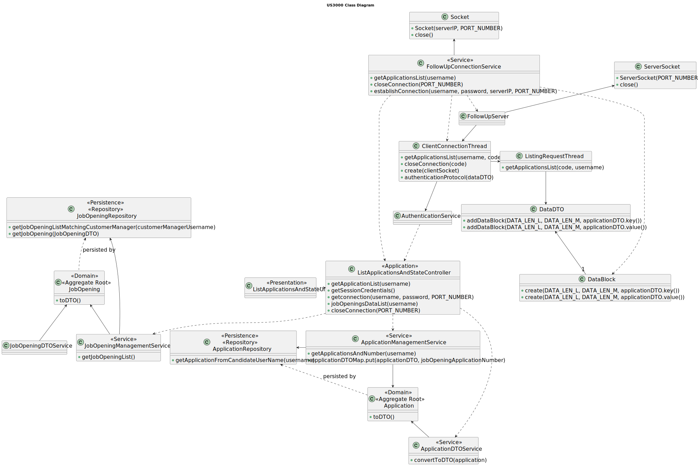

# US 3000

## 1. Context

It is the first time the task is assigned.

## 2. Requirements

**US 3000** As Candidate, I want to list all my applications and their state (including the number of applicants).

**Acceptance Criteria:**

- **3000.1.** The system should display all the applications.

- **3000.2.** The applications should have displayed their status.

- **3000.3.** The number of applications for the job opening should be displayed.

- **3000.4** The implementation of this functionality must follow a client-server architecture.

- **3000.5** The system should not allow direct interaction between the client applications (Candidate App and Costumer 
  App) and the database server.

- **3000.6** The protocol to be used is a TCP (Transmission Control Protocol) based client-server protocol.

- **3000.7** The client application is required to know (IP address or DNS name) the node where the server application is
  running and the TCP port number where the server application is accepting TCP connections.

- **3000.8** The messages exchange between applications must follow a very restrict client-server pattern: the client application
  sends one request message, and the server application sends back one response message.


**Dependencies/References:**

- **US G007** - This functionality has a dependency on _US G007_ that pertains to the authentication and authorization
  for all users and functionalities.

- **US 2002** - This functionality has a dependency on _US 2002_ that consists in the creation of applications, since
  needs to exist an application in order to display its information.

_Reference 3000.1:_ **NFR10(RCOMP)** - Functionalities related to the Candidate and Customer Apps and to the Follow Up Server
part of the system have very specific technical requirements. It must follow a client-server architecture, where a client 
application is used to access a server. Communications between these two components must follow specific protocol 
described in a document from RCOMP ("Application Protocol"). Also, the client applications can not access the relational
database, they can only access the server application.

_Reference 3000.2:_ **NFR11(RCOMP)** - The solution should be deployed using several network nodes. It is expected that, at
least, the relational database server and the Follow Up Server be deployed in nodes different from localhost, preferably
in the cloud. The e-mail notification tasks must be executed in background by the Follow Up Server. 


**Client Clarifications:**

> **Question:** US3000 - In US3000 asks to list the applications and their status for a candidate, as well as the number
> of candidates. Is this number of candidates a sum of the quantity of candidates who applied for the same job openings
> as this first candidate (who is executing the use case)?
>
>
> **Answer:** All the applications of the candidate should be listed, along with their status, as well as the number of 
> applications each job opening received (so the candidate has an idea of the "competition" for each of their
> applications).


## 3. Analysis

For the candidate to list all his applications and their state, including the number of applicants, a TCP connection must 
be established for the Candidate App to the Follow Up Server.

Then the Candidate App will send the request to obtain the candidate applications and their state to the server and
receive the answer. The answers will have a specified format.


### 3.1 System Sequence Diagram


### 3.2 Domain Model Related




## 4. Design

To address this functionality, we are going to adopt a four-layered approach based on DDD (Domain-Driven Design)
architecture: Presentation, Application, Domain and Persistence.

To list all the applications and their state, the customer needs to have access to 

To be able to promote encapsulation between layers, it will be used DTOs.

**_Classes Used_**

**Domain Layer Classes**

* JobOpening
* Application
* JobOpeningManagementService
* JobOpeningDTODTOService
* ApplicationManagementService
* ApplicationDTOService
* FollowUpConnectionService


**Application Layer Classes**

* ListApplicationsAndStateController


**Presentation Layer Classes**

* ListApplicationsAndStateUI


**Other Classes**

* FollowUpServer
* ListingRequestThread
* ClientConnectionThread


### 4.1. Realization

* **US3000 Sequence Diagram**




### 4.2. Class Diagram



### 4.3. Applied Patterns

To make the design of this user story, were used the following patterns:

>**_Repository Pattern_**
>* Classes
> * JobOpeningRepository
> * ApplicationRepository
>
>* Justification
   >
   >  The JobOpening, Application and Interview Model repository have the purpose of keeping the persistence of the
   > job opening and application existing instances.


>**_Service Pattern_**
>* Classes
   >  * JobOpeningManagementService
>  * ApplicationManagementService
>  * ApplicationDTOService
>  * AuthorizationService
>
>* Justification
   >
   >  The services are in charge of managing request regarding jobOpenings and applications,
   >serving as encapsulation between the controller and the JobOpeningRepository and ApplicationRepository
   > along with the domain classes.
   >  The DtoServices to transform these instances into DTOs.
   >  The authorization service is used to verify the roles of the user.


>**DTO Pattern**
> * DataDTO
> * class JobOpeningDataDTO
>
> **Justifications**
>
> * To enforce encapsulation amongst layers and adequate responsibility assigment, also facilitating the data
    >   transfer within the TCP connection, the usage of DTO's is required.


### 4.4. Tests

**Test 1:** Verifies that the application has status

**Refers to Acceptance Criteria:** 3000.2

````
@Test
public void ensureApplicationHasStatus() {
...
}
````

## 5. Implementation


### ListApplicationsAndStateController

```
 public Username getSessionCredentials() {
        Optional<UserSession> session = authorizationService.session();
        if (session.isPresent()) {
            SystemUser user = session.get().authenticatedUser();
            return user.identity();
        }
        throw new NoSuchElementException("No session found");
    }
    public Pair<Boolean, String> establishConnection(Username username, String password) {
        return connectionService.establishConnection(username, password);
    }

    public List<Map.Entry<ApplicationDTO, Integer>> applicationDTOList(Username username){
        return connectionService.receiveCandidateApplicationAndNumberList(username);
    }

    public Pair<Boolean, String> closeConnection() {
        return FollowUpConnectionService.closeConnection();
    }
```

### FollowUpConnectionService
```
public Pair<Boolean, String> establishConnection(Username username, String password) {
        try {
            if (!defineServerIpAddress()) {
                return Pair.of(false, "Server IP Address not válid (" + serverIp + ").");
            }
            clientSocket = new Socket(serverIp, PORT_NUMBER);
            sOut = new DataOutputStream(clientSocket.getOutputStream());
            sIn = new DataInputStream(clientSocket.getInputStream());

        } catch (IOException ex) {
            return Pair.of(false, "Socket unable to connect to server.");
        }

        sendAuthenticationRequest(username, password);

        if (receiveEmptyResponse()) {
            return Pair.of(true, "Connection successfully established.");
        } else {
            return Pair.of(false, "Unable to establish connection, wrong credentials.");
        }
    }
    
    
public List<Map.Entry<ApplicationDTO, Integer>> receiveCandidateApplicationAndNumberList(Username username) {
        try {
            DataDTO dataDTO = new DataDTO(FollowUpRequestCodes.APPLIST.getCode());
            byte[] serialized = SerializationUtil.serialize(username);
            dataDTO.addDataBlock(serialized.length, serialized);
            byte[] message = dataDTO.toByteArray();
            sOut.writeInt(message.length);
            sOut.write(message);
            sOut.flush();
            return processListResponse(new ApplicationListResponseProcessor());

        } catch (IOException e) {
            throw new RuntimeException(e + "\n Unable to send applications list request.\n");
        }
    }
```

### ApplicationListResponseProcessor

```
public List<Map.Entry<ApplicationDTO, Integer>> process(DataDTO dataDTO) {
        List<Map.Entry<ApplicationDTO, Integer>> applicationDTOList = new ArrayList<>();
        List<DataBlock> dataBlocks = dataDTO.dataBlockList();

        int counter = 1;
        ApplicationDTO key = null;
        Integer value = 0;
        for (DataBlock dataBlock : dataBlocks) {
            if (counter == 1) {
                key = (ApplicationDTO) SerializationUtil.deserialize(dataBlock.data());
                counter--;
            } else {
                value = (Integer) SerializationUtil.deserialize(dataBlock.data());
                counter++;
                Map.Entry<ApplicationDTO, Integer> entry = Map.entry(key, value);
                applicationDTOList.add(entry);
            }
        }
        return applicationDTOList;
    }
```


### ApplicationManagementService

```
public Map<ApplicationDTO, Integer> getApplicationsAndNumber(Username username) {
        Iterable<Application> list = applicationRepository.getApplicationFromCandidateUserName(username);
        Map<ApplicationDTO, Integer> applicationDTOMap = new LinkedHashMap<>();
        for (Application application : list) {
                for (JobOpening jobOpening : jobOpeningRepository.findAll()) {
                    for (Application app : jobOpening.getApplications()) {
                        if (application.equals(app)){
                            applicationDTOMap.put(application.toDTO(), jobOpening.getApplications().size());
                        }
                    }
                }
        }

        return applicationDTOMap;
    }
```

### ApplicationDTOService

```
public Iterable<ApplicationDTO> convertToDTO(Iterable<Application> applications) {
        Preconditions.noneNull(applications);

        List<ApplicationDTO> dtos = new ArrayList<>();
        for (Application j : applications) {
            dtos.add(j.toDTO());
        }

        return dtos;
    }
```

## 6. Integration/Demonstration

To execute this functionality it is necessary to run the script named `run-candidate-app` and log in with Customer Manager permissions.
Then navigate to the menu `Applications` followed by option  1 - `List applications and state`.

````
+= The list of candidate applications and their state =========================+

Please provide your password again:
UecqgyyY0dq<

Connection successfully established.

==================================================================
[Application] 3
[Files] [output\candidate3\example3.txt]
[Application Date] 2024-01-08 00:00:00.0
[Application Status] NOT_CHECKED
[Candidate Name] Joana
[Candidate Username] candidate@email.com

[Applications to the same job opening] 3
=====================================================================

==================================================================
[Application] 8
[Files] [output\candidate1\1-report-1.txt, output\candidate1\1-candidate-data.txt, output\candidate1\1-cv.txt, output\candidate1\1-big-file-1.txt, output\candidate1\1-email.txt]
[Application Date] 2024-01-05 00:00:00.0
[Application Status] NOT_CHECKED
[Candidate Name] Joana
[Candidate Username] candidate@email.com

[Applications to the same job opening] 3
=====================================================================

==================================================================
[Application] 13
[Files] [output\candidate2\2-letter.txt, output\candidate2\2-candidate-data.txt, output\candidate2\2-cv.txt, output\candidate2\2-email.txt]
[Application Date] 2024-01-06 00:00:00.0
[Application Status] NOT_CHECKED
[Candidate Name] Joana
[Candidate Username] candidate@email.com

[Applications to the same job opening] 2
=====================================================================


Connection successfully closed.

+==============================================================================+
````